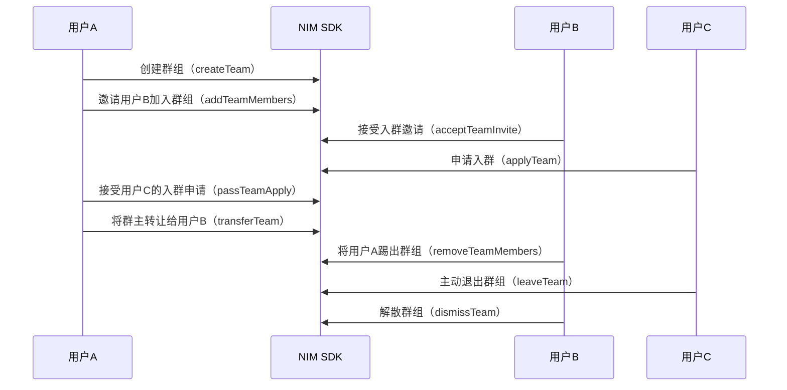

<!-- keywords: IM群组,高级群,群组管理,创建,解散,转让,更新,退出 -->


网易云信 IM 提供了高级群形式的群组功能，支持用户创建、加入、退出、转让、更新、查询、解散群组，拥有完善的管理功能。


## 技术原理

网易云信 NIM SDK 的 [`TeamInterface`](https://doc.yunxin.163.com/docs/interface/messaging/web/typedoc/Latest/zh/NIM/interfaces/nim_TeamInterface.TeamInterface.html) 提供管理群组的相关方法，帮助您快速实现和使用群组的管理功能。 


## 群组相关事件监听

在初始化时，您可以调用[`getInstance`](https://doc.yunxin.163.com/docs/interface/messaging/web/typedoc/Latest/zh/NIM/classes/nim.NIM.html#getInstance)提前注册监听群相关事件。监听后，在进行群组管理相关操作时，会收到对应的通知。

初始化参数（[`NIMGetInstanceOptions`](https://doc.yunxin.163.com/docs/interface/messaging/web/typedoc/Latest/zh/NIM/interfaces/nim_types.NIMGetInstanceOptions.html)）涉及群组事件监听的参数如下：
- `onteams`：初始化时同步群列表的回调
- `onMyTeamMembers`：初始化时同步自己在所有群组中的成员信息的回调；在线或多端修改自己在群组中的用户信息时，也会触发此回调
- `onsynccreateteam`：多端同步时，接收“当前登录账号在其他端创建群的通知”的回调
- `onupdateteammember`：在线或多端同步时，接收“群成员的信息变更”的回调（此时的信息不完整的，只包括被更新的字段）
- `onCreateTeam`：在线或多端同步时，接收“创建群的通知”的回调（包含群信息和群主信息）
- `onUpdateTeam`：在线或多端同步时，接收“群资料更新的通知”的回调
- `onAddTeamMembers`：在线或多端同步时，接收“添加群成员的通知”的回调（包含群信息和群成员信息）
- `onRemoveTeamMembers`：在线或多端同步时，接收“删除群成员的通知”的回调（包含群信息和群成员账号）
- `onUpdateTeamManagers`：在线或多端同步时，接收“群管理员变更的通知”的回调（包含群信息和管理员信息）
- `onDismissTeam`：在线或多端同步时，接收“解散群的通知”的回调（包含被解散的群 ID）
- `onTransferTeam`：在线或多端同步时，接收“转让群的通知”的回调（包含群信息和新老群主信息）
- `onUpdateTeamMembersMute`：在线或多端同步时，接收“群成员被禁言的通知”的回调（包含群信息和禁言状态信息）
- `shouldCountNotifyUnread`：群消息通知是否加入未读数开关，若返回 true，则计入未读数，否则不计入
- `onTeamMsgReceipt`：在线接收群消息已读回执通知的回调

**示例代码：**

```
var nim = NIM.getInstance({
  ...
  onteams: onTeams,
  onsynccreateteam: onCreateTeam,
  onupdateteammember: onUpdateTeamMember,
  shouldCountNotifyUnread: function (msg) {
    // 根据msg的属性自己添加过滤器
    if (msg.something === someting) {
    return true
    }
  }
});
function onTeams(teams) {
  console.log('收到群列表', teams);
}
}
function onCreateTeam(team) {
  console.log('你创建了一个群', team);
}
function refreshTeamsUI() {
  // 刷新界面
}

function onUpdateTeamMember(teamMember) {
  console.log('群成员信息更新了', teamMember);
}
function refreshTeamMembersUI() {
  // 刷新界面
}
```


## 实现流程

本节通过群主、管理员、普通成员之间的交互为例，介绍群组管理的实现流程。




## 创建群组

通过调用 [`createTeam`](https://doc.yunxin.163.com/docs/interface/messaging/web/typedoc/Latest/zh/NIM/interfaces/nim_TeamInterface.TeamInterface.html#createTeam) 方法创建群组，创建者即为该群群主。

**参数说明：**

|参数|类型| 说明|
|:------ |:------ |:--------- |
|name | String | 群组名称 |
|type|String| 群组类型 <note type=important>请选择 `advanced` 创建高级群，高级群拥有完善的成员权限体系及管理功能。<br>为避免产生问题，不建议使用其他取值。</note>|
|accounts| Array | 群成员账号|
|announcement | String | 群公告|
|avatar| String  | 群头像 |
|intro | String | 群简介 |
|joinMode |String| 群加入方式</br>noVerify：不需要验证</br>needVerify：加此群需要群主或管理员的验证</br>rejectAll：拒绝其他人加入<br/>默认为`needVerify` |
| beInviteMode | String | 被邀请模式</br>noVerify：不需要验证</br>needVerify：此群邀请某人，需要被邀请人验证通过才能加入<br/>默认为`needVerify` |
| inviteMode |String| 群邀请模式</br> manager：仅限群主和管理员可以邀请人进群</br>all：群组内的所有人都可以邀请人进群<br/>默认为`manager`|
| updateTeamMode | String| 群信息修改权限<br/>manager：仅限群主和管理员可以修改群信息 <br/>all：所有人都可以修改<br/>默认为`manager` |
| updateCustomMode |  String| 群信息自定义字段修改权限<br/>manager：仅限群主和管理员可以修改群自定义信息<br/>all：所有人都可以修改<br/>默认为`manager`|
|custom|String|第三方扩展字段，开发者可以自行扩展，建议封装成 JSON 格式字符串|
|antiSpamBusinessId|String|需要进行内容审核的业务ID|
|ps|String|附言，长度不得大于 5000，开发者可以使用 JSON 格式字符串填充|
|done|done|结果回调函数，成功会收到群组信息

:::note notice
- 创建群组时设置的群成员会收到类型为 `teamInvite` 的系统通知（`SystemMessage`）。
- 若被邀请模式（`beInviteMode`）为需要验证（`needVerify`），那么创建群组后，需要用户（`accounts`）接受邀请，才会成为群成员。
:::

**示例代码：**

```js
nim.createTeam({
    type: 'advanced',
    name: '高级群',
    avatar: 'avatar',
    accounts: ['a1', 'a2'],
    intro: '群简介',
    announcement: '群公告',
    // joinMode: 'needVerify',
    // beInviteMode: 'needVerify',
    // inviteMode: 'manager',
    // updateTeamMode: 'manager',
    // updateCustomMode: 'manager',
    ps: '我建了一个高级群',
    done: createTeamDone
});
function createTeamDone(error, obj) {
    console.log('创建' + obj.team.type + '群' + (!error?'成功':'失败'), error, obj);
    if (!error) {
        onCreateTeam(obj.team, obj.owner);
    }
}
```


## 加入群组

加入群组可以通过以下两种方式：
- 用户接受邀请入群。
- 用户主动申请入群。

### 邀请入群

::: note note
邀请入群的权限可以通过 `inviteMode` 来定义，设为 `manager`，那么仅限群主和管理员可以邀请人进群；设为 `all` ，那么群组内的所有人都可以邀请人进群。
:::

通过调用 [`addTeamMembers`](https://doc.yunxin.163.com/docs/interface/messaging/web/typedoc/Latest/zh/NIM/interfaces/nim_TeamInterface.TeamInterface.html#addTeamMembers) 方法邀请其他用户进入群组。
  - 若群组的被邀请模式 `beInviteMode` 为 `noVerify`，那么无需验证，其他用户可直接加入群组。
  - 若群组的被邀请模式 `beInviteMode` 为 `needVerify`，那么需要被邀请用户同意才能加入群组。

如果在被邀请成员中存在成员拥有的群组数量已达上限，则会返回失败成员的账号列表。
  
**参数说明：**

| 参数  | 类型  | 说明     |
|  ----  | ----  | --------- |
|teamId | String | 群ID |
|accounts| Array | 邀请入群的用户账号|
|custom|String|自定义扩展字段，选填，最长512字符，开发者可以自行扩展，建议封装成 JSON 格式字符串|
|ps|String|附言，选填，长度不得大于 5000，开发者可以使用 JSON 格式字符串填充|
|done|done|结果回调函数|
  
- 发起邀请后，被邀请用户会收到类型为 `teamInvite` 的系统通知（`SystemMessage`），该系统通知中包含邀请人的账号信息和邀请加入的群组信息。
- 被邀请用户可以调用 [`acceptTeamInvite`](https://doc.yunxin.163.com/docs/interface/messaging/web/typedoc/Latest/zh/NIM/interfaces/nim_TeamInterface.TeamInterface.html#acceptTeamInvite) 方法接受入群邀请。接受后，该群的所有群成员会收到群组通知消息，类型为 `acceptTeamInvite`，该群组通知消息中包含接受入群邀请用户的账号信息、邀请加入的群组信息以及群成员列表。
- 也可以调用 [`rejectTeamInvite`](https://doc.yunxin.163.com/docs/interface/messaging/web/typedoc/Latest/zh/NIM/interfaces/nim_TeamInterface.TeamInterface.html#rejectTeamInvite) 方法拒绝入群邀请。拒绝后，邀请者会收到类型为 `rejectTeamInvite` 的系统通知（`SystemMessage`），该系统通知中包含拒绝入群用户的账号信息和邀请加入的群组信息。

**示例代码：**

```
nim.addTeamMembers({
    teamId: '123',
    accounts: ['a3', 'a4'],
    ps: '加入我们的群吧',
    custom: '',
    done: addTeamMembersDone
});
function addTeamMembersDone(error, obj) {
    console.log('入群邀请发送' + (!error?'成功':'失败'), error, obj);
}

// 假设 sysMsg 是通过回调 `onsysmsg` 收到的系统通知
nim.acceptTeamInvite({
  idServer: sysMsg.idServer,
  teamId: '123',
  from: 'zyy1',
  done: acceptTeamInviteDone
});
function acceptTeamInviteDone(error, obj) {
  console.log(error);
  console.log(obj);
  console.log('接受入群邀请' + (!error?'成功':'失败'));
}

// 假设 sysMsg 是通过回调 `onsysmsg` 收到的系统通知
nim.rejectTeamInvite({
  idServer: sysMsg.idServer,
  teamId: '123',
  from: 'zyy1',
  ps: '就不',
  done: rejectTeamInviteDone
});
function rejectTeamInviteDone(error, obj) {
  console.log(error);
  console.log(obj);
  console.log('拒绝入群邀请' + (!error?'成功':'失败'));
}
```  
### 申请入群

通过调用 [`applyTeam`](https://doc.yunxin.163.com/docs/interface/messaging/web/typedoc/Latest/zh/NIM/interfaces/nim_TeamInterface.TeamInterface.html#applyTeam) 方法申请加入群组。
  - 若群组的加入模式 `joinMode` 为 `noVerify`，那么无需验证，其他用户可直接加入群组。
  - 若群组的加入模式 `joinMode` 为 `needVerify`，那么需要群主或者群管理员同意才能加入群组。

**参数说明：**

| 参数  | 类型  | 说明     |
|  ----  | ----  | --------- |
|teamId | String | 群ID |
|ps|String|附言，选填，长度不得大于 5000，开发者可以使用 JSON 格式字符串填充|
|done|done|结果回调函数，成功时会收到群组信息|

- 当用户发起入群申请后，该群群主和管理员会收到类型为 `applyTeam` 的系统通知（`SystemMessage`），该系统通知中包含申请人的账号信息和申请加入的群组 ID。
- 群主和群管理员可以调用 [`passTeamApply`](https://doc.yunxin.163.com/docs/interface/messaging/web/typedoc/Latest/zh/NIM/interfaces/nim_TeamInterface.TeamInterface.html#passTeamApply) 方法接受入群申请。接受后，该群的所有群成员会收到群组通知消息，类型为 `passTeamApply`，该群组通知消息中包含申请用户账号、通过入群申请用户的账号、申请加入的群组信息以及群成员列表。
- 也可以调用 [`rejectTeamApply`](https://doc.yunxin.163.com/docs/interface/messaging/web/typedoc/Latest/zh/NIM/interfaces/nim_TeamInterface.TeamInterface.html#rejectTeamApply) 方法拒绝入群申请。拒绝后，申请者收到类型为 `rejectTeamApply` 的系统通知（`SystemMessage`），该系统通知中包含拒绝入群申请用户的账号信息和申请加入的群组信息。

**示例代码：**

```
nim.applyTeam({
    teamId: '123',
    ps: '请加',
    done: applyTeamDone
});
function applyTeamDone(error, obj) {
    console.log('申请入群' + (!error?'成功':'失败'), error, obj);
}

// 假设 sysMsg 是通过回调 `onsysmsg` 收到的系统通知
nim.passTeamApply({
  idServer: sysMsg.idServer,
  teamId: '123',
  from: 'a2',
  done: passTeamApplyDone
});
function passTeamApplyDone(error, obj) {
  console.log(error);
  console.log(obj);
  console.log('通过入群申请' + (!error?'成功':'失败'));
}

// 假设 sysMsg 是通过回调 `onsysmsg` 收到的系统通知
nim.rejectTeamApply({
  idServer: sysMsg.idServer,
  teamId: '123',
  from: 'a2',
  ps: '就不',
  done: rejectTeamApplyDone
});
function rejectTeamApplyDone(error, obj) {
  console.log(error);
  console.log(obj);
  console.log('拒绝入群申请' + (!error?'成功':'失败'));
}
```

## 转让群组

::: note note
只有群主才有转让群组的权限。
:::

通过调用 [`transferTeam`](https://doc.yunxin.163.com/docs/interface/messaging/web/typedoc/Latest/zh/NIM/interfaces/nim_TeamInterface.TeamInterface.html#transferTeam) 方法将群组转让给其他成员。

- 转让群后, 所有群成员会收到群组通知消息，类型为 `transferTeam`，该群组通知消息中包含群组信息，新旧群主信息以及群成员列表。
- 如果转让群的同时离开群, 那么相当于同时调用[`leaveTeam`](https://doc.yunxin.163.com/docs/interface/messaging/web/typedoc/Latest/zh/NIM/interfaces/nim_TeamInterface.TeamInterface.html#leaveTeam)主动退群，所有群成员会收到群组通知消息，类型为 `leaveTeam`，该群组通知消息中包含退群用户账号和对应的群组信息。


**参数说明：**

| 参数  | 类型  | 说明     |
|  ----  | ----  | --------- |
|teamId | String | 群ID |
|account|String|转让后的新群主账号|
|leave|boolean|转让群的同时是否离开群<br/>true：离开<br/>false：不离开|
|done|done|结果回调函数|

**示例代码：**

```
nim.transferTeam({
    teamId: '123',
    account: 'zyy2',
    leave: false,
    done: transferOwnerDone
});
function transferOwnerDone(error, obj) {
    console.log('转让群' + (!error?'成功':'失败'), error, obj);
}
```

## 退出群组

退出群组可以通过以下两种方式：
- 群主或群组管理员将用户踢出群组。
- 用户主动退群。

### 踢人出群
::: note note
- 只有群主和管理员才能将成员踢出群组。
- 管理员不能踢群主和其他管理员。
:::

通过调用 [`removeTeamMembers`](https://doc.yunxin.163.com/docs/interface/messaging/web/typedoc/Latest/zh/NIM/interfaces/nim_TeamInterface.TeamInterface.html#removeTeamMembers) 方法将某个成员踢出群组。

移除成员后， 所有群成员会收到群组通知消息，类型为 `removeTeamMembers`，该群组通知消息中包含踢人用户账号、被踢用户账号和对应的群组信息。

**参数说明：**

| 参数  | 类型  | 说明     |
|  ----  | ----  | --------- |
|teamId | String | 群ID |
|accounts|Array|踢除的群成员账号|
|done|done|结果回调函数|


**示例代码：**

```
nim.removeTeamMembers({
    teamId: '123',
    accounts: ['a3', 'a4'],
    done: removeTeamMembersDone
});
function removeTeamMembersDone(error, obj) {
    console.log('踢人出群' + (!error?'成功':'失败'), error, obj);
}
```

### 主动退群

通过调用 [`leaveTeam`](https://doc.yunxin.163.com/docs/interface/messaging/web/typedoc/Latest/zh/NIM/interfaces/nim_TeamInterface.TeamInterface.html#leaveTeam) 方法主动退出群组。

除群主（需先转让群主）外，其他用户均可以直接主动退群。主动退群后，所有群成员会收到群组通知消息，类型为 `leaveTeam`，该群组通知消息中包含退群用户账号和对应的群组信息。


**示例代码：**

```
nim.leaveTeam({
    teamId: '123',
    done: leaveTeamDone
});
function leaveTeamDone(error, obj) {
    console.log('主动退群' + (!error?'成功':'失败'), error, obj);
}
```


## 解散群组

::: note note
只有群主才能解散群组。
:::

通过调用 [`dismissTeam`](https://doc.yunxin.163.com/docs/interface/messaging/web/typedoc/Latest/zh/NIM/interfaces/nim_TeamInterface.TeamInterface.html#dismissTeam) 方法解散群组。

解散群后, 所有群成员会收到群组通知消息，类型为 `dismissTeam`，该群组通知消息中包含解散群组的用户账号和对应的群组 ID。


**示例代码：**

```
nim.dismissTeam({
    teamId: '123',
    done: dismissTeamDone
});
function dismissTeamDone(error, obj) {
    console.log('解散群' + (!error?'成功':'失败'), error, obj);
}
```

## 修改群组信息

通过调用 [`updateTeam`](https://doc.yunxin.163.com/docs/interface/messaging/web/typedoc/Latest/zh/NIM/interfaces/nim_TeamInterface.TeamInterface.html#updateTeam) 方法修改群组信息。

当用户更新群组信息后，所有群成员会收到群组通知消息，类型为 `updateTeam`，该群组通知消息中包含修改人用户账号和被修改的群组信息。

::: note note
修改群信息需要权限。若该群组的群信息修改权限（`updateTeamMode`）为 `manager`，那么只有群主和管理员才能修改群组信息；若为 `all`，则群组内的所有人都可以修改群组信息。
:::

**参数说明：**
| 参数  | 类型  | 说明     |
|  ----  | ----  | --------- |
|teamId|String|群ID|
|name | String | 群名称 |
|announcement | String | 群公告|
|avatar| String  | 群头像 |
|intro | String | 群简介 |
|joinMode | String | 群加入方式</br>noVerify：不需要验证</br>needVerify：加此群需要群主或管理员的验证</br>rejectAll：拒绝其他人加入<br/>默认为`needVerify` |
| beInviteMode | String | 被邀请模式</br>noVerify：不需要验证</br>needVerify：此群邀请某人，需要被邀请人验证通过才能加入<br/>默认为`needVerify` |
| inviteMode |String | 群邀请模式</br> manager：仅限群主和管理员可以邀请人进群</br>all：群组内的所有人都可以邀请人进群<br/>默认为`manager`|
| updateTeamMode |String| 群信息修改权限<br/>manager：仅限群主和管理员可以修改群信息 <br/>all：所有人都可以修改<br/>默认为`manager` |
| updateCustomMode | String| 群信息自定义字段修改权限<br/>manager：群主和管理员可以修改群自定义信息<br/>all：所有人都可以修改<br/>默认为`manager`|
|antiSpamBusinessId|String|需要进行内容审核的业务ID|
|custom|String|扩展字段, 开发者可以自行扩展, 建议封装成 JSON 格式字符串|
|done|done|结果回调函数|

**示例代码：**

```
nim.updateTeam({
    teamId: '123',
    name: '群名字',
    avatar: 'avatar',
    intro: '群简介',
    announcement: '群公告',
    custom: '自定义字段',
    done: updateTeamDone
});
function updateTeamDone(error, team) {
    console.log('更新群' + (!error?'成功':'失败'), error, team);
}
```


## 查询群组信息


- 通过调用 [`getTeam`](https://doc.yunxin.163.com/docs/interface/messaging/web/typedoc/Latest/zh/NIM/interfaces/nim_TeamInterface.TeamInterface.html#getTeam) 方法查询单个群组的详细信息。


**示例代码：**
```
nim.getTeam({
    teamId: '123',
    done: getTeamDone
});
function getTeamDone(error, obj) {
    console.log(error);
    console.log(obj);
    console.log('获取群' + (!error?'成功':'失败'));
}
```


- 通过调用[`getTeamsById`](https://doc.yunxin.163.com/docs/interface/messaging/web/typedoc/Latest/zh/NIM/interfaces/nim_TeamInterface.TeamInterface.html#getTeamsById)方法，根据一批群组 ID（`teamId`） 获取群组列表。 


**示例代码：**
```
nim.getTeamsById({
    teamIds: ['812345', '885921'],
    done: (error, result) => { console.log(error, result) }
});
```

::: note notice
每次调用最多传入 10 个 teamId，且不可传空，否则返回 414 错误码。
:::

  

- 通过调用 [`getTeams`](https://doc.yunxin.163.com/docs/interface/messaging/web/typedoc/Latest/zh/NIM/interfaces/nim_TeamInterface.TeamInterface.html#getTeams) 获取群列表。
  若开发者在初始化 SDK 时将 `syncTeams`设置为 false，收不到 `onteams` 回调，那么可以调用此接口来获取群列表。


**示例代码：**

```
nim.getTeams({
    done: getTeamsDone
});
function getTeamsDone(error, teams) {
    console.log(error);
    console.log(teams);
    console.log('获取群列表' + (!error?'成功':'失败'));
}
```


- 通过调用 [`getLocalTeams`](https://doc.yunxin.163.com/docs/interface/messaging/web/typedoc/Latest/zh/NIM/interfaces/nim_TeamInterface.TeamInterface.html#getLocalTeams) 方法根据 `teamIds` 从本地数据库中获取指定群组。

**示例代码：**
```
nim.getLocalTeams({
    teamIds: teamIds
    done: getLocalTeamsDone
});
function getLocalTeamsDone(error, obj) {
    console.log('获取本地群' + (!error?'成功':'失败'));
    console.log(error);
    console.log(obj);
}
```


## 删除本地群组

通过调用 [`deleteLocalTeam`](https://doc.yunxin.163.com/docs/interface/messaging/web/typedoc/Latest/zh/NIM/interfaces/nim_TeamInterface.TeamInterface.html#deleteLocalTeam) 方法根据 `teamId` 删除本地指定群组。

:::note note
- 在本地数据库中删除指定的群组。
- 若不支持数据库，返回成功；若指定群组不存在，返回成功。
- 若当前用户还在群组中，则操作失败。
- 若入参为多个 `teamId`，当前用户还在其中的某个群组中，那么操作失败，但是其中的空群（没有用户）都会被删除。
:::

**示例代码：**

```
nim.deleteLocalTeam({
    teamId: '1234',
    done: deleteLocalTeamDone
});
function deleteLocalTeamDone(error, obj) {
    console.log('删除本地群' + (!error?'成功':'失败'));
    console.log(error);
    console.log(obj);
}
```


## API 参考

| <div style="width:300px">API</div> | <div style="width:300px">说明 </div>|
|:---- | :-------------- |
| [`createTeam`](https://doc.yunxin.163.com/docs/interface/messaging/web/typedoc/Latest/zh/NIM/interfaces/nim_TeamInterface.TeamInterface.html#createTeam)| 创建群组 |
|[`addTeamMembers`](https://doc.yunxin.163.com/docs/interface/messaging/web/typedoc/Latest/zh/NIM/interfaces/nim_TeamInterface.TeamInterface.html#addTeamMembers) | 邀请某人入群 |
| [`acceptTeamInvite`](https://doc.yunxin.163.com/docs/interface/messaging/web/typedoc/Latest/zh/NIM/interfaces/nim_TeamInterface.TeamInterface.html#acceptTeamInvite) | 接受入群邀请 |
| [`rejectTeamInvite`](https://doc.yunxin.163.com/docs/interface/messaging/web/typedoc/Latest/zh/NIM/interfaces/nim_TeamInterface.TeamInterface.html#rejectTeamInvite)  | 拒绝入群邀请 |
| [`applyTeam`](https://doc.yunxin.163.com/docs/interface/messaging/web/typedoc/Latest/zh/NIM/interfaces/nim_TeamInterface.TeamInterface.html#applyTeam)| 申请入群 |
|[`passTeamApply`](https://doc.yunxin.163.com/docs/interface/messaging/web/typedoc/Latest/zh/NIM/interfaces/nim_TeamInterface.TeamInterface.html#passTeamApply)| 接受入群申请 |
| [`rejectTeamApply`](https://doc.yunxin.163.com/docs/interface/messaging/web/typedoc/Latest/zh/NIM/interfaces/nim_TeamInterface.TeamInterface.html#rejectTeamApply)   |    拒绝入群申请       |
|  [`removeTeamMembers`](https://doc.yunxin.163.com/docs/interface/messaging/web/typedoc/Latest/zh/NIM/interfaces/nim_TeamInterface.TeamInterface.html#removeTeamMembers)  | 踢人出群 |
|[`leaveTeam`](https://doc.yunxin.163.com/docs/interface/messaging/web/typedoc/Latest/zh/NIM/interfaces/nim_TeamInterface.TeamInterface.html#leaveTeam) | 主动退群 |
| [`transferTeam`](https://doc.yunxin.163.com/docs/interface/messaging/web/typedoc/Latest/zh/NIM/interfaces/nim_TeamInterface.TeamInterface.html#transferTeam)| 转让群组 |
|[`updateTeam`](https://doc.yunxin.163.com/docs/interface/messaging/web/typedoc/Latest/zh/NIM/interfaces/nim_TeamInterface.TeamInterface.html#updateTeam)|修改群组信息|
|[`getTeam`](https://doc.yunxin.163.com/docs/interface/messaging/web/typedoc/Latest/zh/NIM/interfaces/nim_TeamInterface.TeamInterface.html#getTeam)| 查询群组信息 |
|[`getTeams`](https://doc.yunxin.163.com/docs/interface/messaging/web/typedoc/Latest/zh/NIM/interfaces/nim_TeamInterface.TeamInterface.html#getTeams)|查询群组列表|
|[`getTeamsById`](https://doc.yunxin.163.com/docs/interface/messaging/web/typedoc/Latest/zh/NIM/interfaces/nim_TeamInterface.TeamInterface.html#getTeamsById)|根据群组 ID 查询群组列表|
|[`dismissTeam`](https://doc.yunxin.163.com/docs/interface/messaging/web/typedoc/Latest/zh/NIM/interfaces/nim_TeamInterface.TeamInterface.html#dismissTeam)    |    解散群组       |
|[`getLocalTeams`](https://doc.yunxin.163.com/docs/interface/messaging/web/typedoc/Latest/zh/NIM/interfaces/nim_TeamInterface.TeamInterface.html#getLocalTeams) |根据群组 ID从本地数据库中查询指定群组|
|[`deleteLocalTeam`](https://doc.yunxin.163.com/docs/interface/messaging/web/typedoc/Latest/zh/NIM/interfaces/nim_TeamInterface.TeamInterface.html#deleteLocalTeam) |根据 `teamId` 删除本地指定群组|

