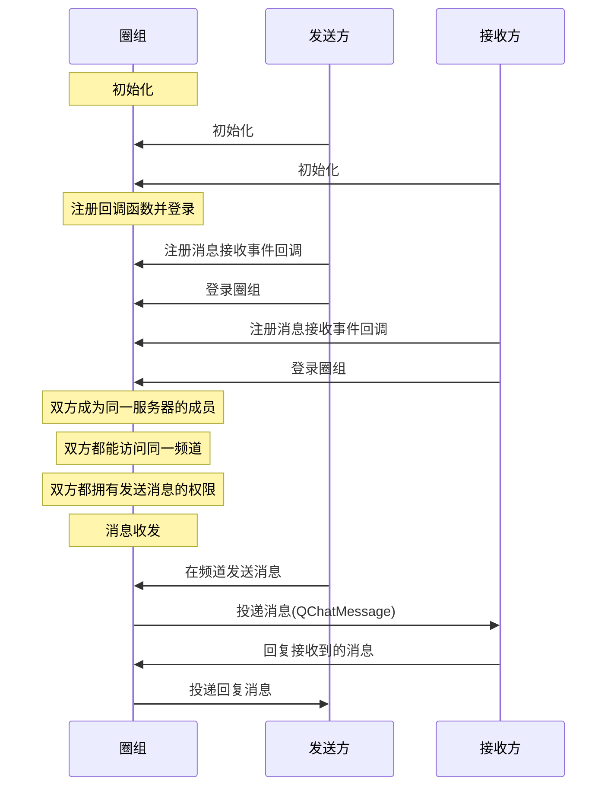

NIM SDK 提供会话消息回复（Thread）功能，可引用接收到的某一条消息进行针对性的回复，形成起始于该消息的消息回复树状结构。通过该功能，用户可针对某一条消息进行提问、反馈或补充相关背景信息，且不会对频道内的会话流造成干扰。

::: note notice 
圈组的会话消息回复功能在开通后只能在圈组内使用，且相关接口和即时通讯 IM 不同。
:::

## 功能介绍

### 什么是 Thread

Thread 指以一条消息作为根消息的消息回复树状结构，示例见下图。


上图中：

- 消息 A 是消息 B 的**父消息**，消息 B1 是消息 C 的**父消息**
- 消息 C 是消息 B1 的**子消息**
- 消息 A 是消息 B 和消息 C 的**根消息**
- 消息 A、B、C 统称为 **Threaded Message（串联起来的消息）**

::: note note :::
- 一条 Threaded Message 必须有一条父消息或至少一条子消息。如果一条消息既没有父消息，也没有子消息，则为普通消息。
- 若未开通会话消息回复功能，回复时系统会自动将所发消息转换为一条普通消息。
:::

### UI 示例

会话消息回复（Thread）的 UI 示例如下：


## 前提条件

开始会话消息回复相关功能集成前，请确保：

- 已[开通圈组的消息回复功能](https://doc.yunxin.163.com/messaging/docs/DMxMjU2NTE?platform=pc#圈组子功能列表说明)。圈组的会话消息回复功能需要在开通圈组功能的基础上额外开通后才能使用。
- 已完成圈组初始化。

## 实现流程


### API调用时序




### 具体流程

::: note note
本节仅对上图中标为部分的流程进行说明，其他流程请参考相关文档。例如：
- 服务器成员相关说明，可参见<a href="https://doc.yunxin.163.com/messaging/docs/DA3Nzc3MjM?platform=pc" target="_blank">圈组服务器成员管理</a>。
- 用户是否能访问某频道的相关说明，可参见<a href="https://doc.yunxin.163.com/messaging/docs/jczMzcwOTE?platform=pc" target="_blank">频道管理</a>中对于频道黑白名单的说明。
- 权限相关配置说明，可参见身份组相关文档。
:::

1. 发送方和接收方在登录圈组前，注册<a href="https://doc.yunxin.163.com/messaging/references/pc/doxygen/Latest/zh/classnim_1_1_message.html#aa4787c06597b0e6e9b6b31529bd1630d" target="_blank">`RegRecvCb`</a>消息接收回调函数。

    示例代码如下：

    ```c++
    QChatRegRecvMsgCbParam reg_receive_message_cb_param;
    reg_receive_message_cb_param.cb = [this](const QChatRecvMsgResp& resp) {
        // process messa
    };
    Message::RegRecvCb(reg_receive_message_cb_param);
    ```

2. 接收方在收到消息后，调用<a href="https://docs.netease.im/docs/interface/%E5%8D%B3%E6%97%B6%E9%80%9A%E8%AE%AFWindows%E7%AB%AF/NIMSDKAPI_CPP/html/classnim__qchat_1_1_message.html#a0c52a54926e0116f45a1e8e82c9433f0" target="_blank">`Reply`</a>方法发送回复消息。

    ::: note notice
    - 需要拥有发送消息的权限才能回复消息。
    - 两条消息的`server_id` 和 `channel_id` 必须相同，因为只能在同一个服务器和频道内回复消息。
    :::

    示例代码如下：


    ```
    QChatSendMessageParam param;
    param.message.server_id = 123456;
    param.message.channel_id = 123456;
    param.message.msg_body = "message body";
    param.message.msg_ext = "message ext";
    param.message.resend_flag = false;
    param.message.msg_id = ""; // only for resend. if not, leave it empty, we will generate it
    param.message.mention_all = false;
    param.message.mention_accids = {"accid1", "accid2"}; // if mention_all is true, this will be ignored
    param.message.history_enable = true;
    param.message.push_enable = false;
    param.message.push_payload = "push payload";
    param.message.push_content = "push content";
    param.message.need_badge = true;
    param.message.need_push_nick = true;
    param.message.route_enable = true;
    // thread 
    param.quote_message = quote_message; // quote_message is a QChatMessage you received or queried.
    param.cb = [this](const QChatSendMsgResp& resp) {
        if (resp.res_code != NIMResCode::kNIMResSuccess) {
            // error handling
            return;
        }
        // process response
        // ...
    };


    Message::Send(param);

    ```
3. `RegRecvCb`回调函数触发，发送方收到接收方回复的消息。


    
    

