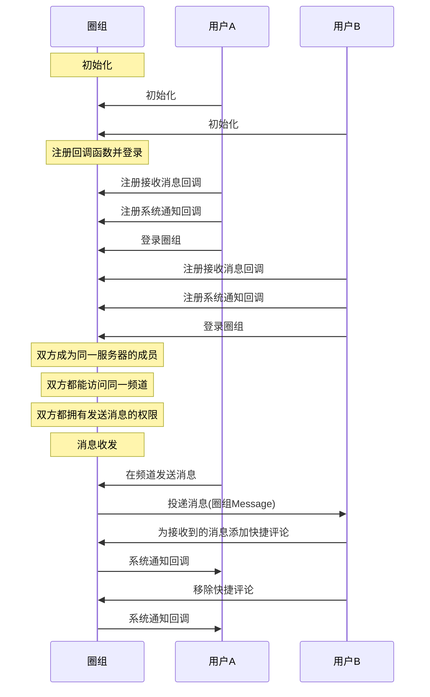

快捷评论是一个操作功能，并非一种消息类型。评论内容并非一条消息，而是一个 long 类型，由开发者指定评论内容与界面展示之间的联系。

快捷评论的 UI 示例见下图。


## 前提条件

- 已[开通圈组的快捷评论功能](https://doc.yunxin.163.com/messaging/docs/DMxMjU2NTE?platform=pc#圈组子功能列表说明)。圈组的快捷评论功能需要在开通圈组功能的基础上额外开通后才能使用。
- 已完成圈组初始化。

## 实现流程

### 添加/移除快捷评论

#### **API 调用时序**





#### 具体流程

::: note note
本节仅对上图中标为部分的流程进行说明，其他流程请参考相关文档。例如：
- 服务器成员相关说明，可参见<a href="https://doc.yunxin.163.com/messaging/docs/DA3Nzc3MjM?platform=pc" target="_blank">圈组服务器成员管理</a>
- 用户是否能访问某频道的相关说明，可参见<a href="https://doc.yunxin.163.com/messaging/docs/jczMzcwOTE?platform=pc" target="_blank">频道管理</a>中对于频道黑白名单的说明。
- 权限相关配置说明，可参见身份组相关文档。
:::


1. 用户A和用户B注册回调函数并登录。

    - 注册<a href="https://doc.yunxin.163.com/docs/interface/messaging/pc/doxygen/Latest/zh/classnim_1_1_message.html#aa4787c06597b0e6e9b6b31529bd1630d" target="_blank">`Message::RegRecvCb`</a>消息接收回调函数，监听快捷评论接收。
    - 注册<a href="https://doc.yunxin.163.com/docs/interface/messaging/pc/doxygen/Latest/zh/classnim_1_1_system_notification.html#af3f9812e996d3cbab744900afb0e1beb" target="_blank">`SystemNotification::RegRecvCb`</a>系统通知回调函数，监听快捷评论添加和移除。

    示例代码如下：
    :::::: div custom-tabs
    ::: tab 注册消息接收回调
    ```c++
    QChatRegRecvMsgCbParam reg_receive_message_cb_param;
    reg_receive_message_cb_param.cb = [this](const QChatRecvMsgResp& resp) {
        if (resp.res_code != NIMResCode::kNIMResSuccess) {
            // error handling
            return;
        }
        // process response
        // ...
    };
    Message::RegRecvCb(reg_receive_message_cb_param);
    ```
    :::
    ::: tab 注册系统通知回调
    ```
    QChatRegRecvSystemNotificationCbParam reg_receive_sysmessage_cb_param;
    reg_receive_sysmessage_cb_param.cb = [this](const QChatRecvSystemNotificationResp& resp) {
        if (resp.res_code != NIMResCode::kNIMResSuccess) {
            // error handling
            return;
        }
        // process response
        // ...
    };
    SystemNotification::RegRecvCb(reg_receive_sysmessage_cb_param);
    ```
    :::
    ::::::

2. 用户B在收到消息后，调用<a href="https://doc.yunxin.163.com/docs/interface/messaging/pc/doxygen/Latest/zh/classnim_1_1_message.html#a19a66551feb344918bf8bd77cef6bf0f" target="_blank">`AddQuickComment`</a>方法为接收到的消息添加快捷评论。调用成功后，系统通知回调触发，用户A收到系统通知。

    ::: note note 
    用户也可在搜索/查询消息后为消息添加快捷评论，本文仅以接收消息后添加快捷评论作为示例进行说明。
    :::


    ::: note notice
    云信服务端**不会**下发相关系统通知给发起“添加快捷评论”操作的设备，因为操作者不需要接收当前操作的通知。但如果操作者使用相同 IM 账号在其他设备登录，将收到该通知。
    :::

    <br>

    示例代码如下：
    ```
    QChatAddQuickCommentParam param;
    param.type = 1; // type is a user defined interger
    param.message = origin_message; // origin_message is a QChatMessage you received or queried.
    param.cb = [this](const QChatAddQuickCommentResp& resp) {
        if (resp.res_code != NIMResCode::kNIMResSuccess) {
            // error handling
            return;
        }
        // process response
        // ...
    };
    Message::AddQuickComment(param);

    ```


3. （可选）用户B调用<a href="https://doc.yunxin.163.com/docs/interface/messaging/pc/doxygen/Latest/zh/classnim_1_1_message.html#a3556130d7b81e65a35c73a987c0ab178" target="_blank">`RemoveQuickComment`</a> 方法移除快捷评论。

    调用成功后，快捷评论移除并触发系统通知回调。

    ::: note notice
    云信服务端**不会**下发相关系统通知给发起“移除快捷评论”操作的设备，因为操作者不需要接收当前操作的通知。但如果操作者使用相同 IM 账号在其他设备登录，将收到该通知。
    :::

    <br>

### 查询快捷评论列表

调用<a href="https://doc.yunxin.163.com/docs/interface/messaging/pc/doxygen/Latest/zh/classnim_1_1_message.html#a97d5b11559b810f7b984f933e3df6715" target="_blank">`GetQuickComments`</a> 可查询指定消息所包含的快捷评论列表。

返回的快捷评论详情 `QChatGetQuickCommentsResp` 包含 `res_code` 操作结果以及 `comments`（QChatQuickCommentInfo）快捷评论列表。

`QChatQuickCommentInfo`的参数说明如下：

参数  | 类型 | 说明     
----  | ----  | --------- 
`server_id`|uint64_t|服务器 ID
`channel_id`|uint64_t|频道 ID
`msg_server_id`|uint64_t|消息服务端 ID
`count`|uint64_t|总评论数
`timestamp`|uint64_t|消息评论最后一次操作的时间
`details`|`std::vector< QChatQuickCommentDetail >`|评论详情列表

其中`QChatQuickCommentDetail`的参数说明如下：

参数  | 类型 | 说明     
----  | ----  | --------- 
`type`|uint64_t |评论类型
`include_yourself`|bool|自己是否添加了该类型评论
`count`|uint64_t|总评论数
`create_time`|uint64_t|消息评论的创建时间
`accids`|`std::vector< std::string >`|若干个添加了此类型评论的用户 ID （`accid`）列表，随机获取结果
    

示例代码如下：

```
QChatGetQuickCommentsParam param;
param.server_id = 123456;
param.channel_id = 123456;
param.msg_server_id_list = {123, 456};
param.cb = [](const QChatGetQuickCommentsResp& resp) {
    if (resp.res_code != kNIMResSuccess) {
        // GetQuickComments failed
        // ......
        return
    }
    // process resp.comments
};
Message::GetQuickComments(param);
```


## API 参考


 <div style="width:80px">API</div> | <div style="width:120px">说明</div>
 :---- | :--------------
 <a href="https://doc.yunxin.163.com/docs/interface/messaging/pc/doxygen/Latest/zh/classnim_1_1_message.html#aa4787c06597b0e6e9b6b31529bd1630d" target="_blank">`RegRecvCb`</a> | 消息接收回调函数
 <a href="https://doc.yunxin.163.com/docs/interface/messaging/pc/doxygen/Latest/zh/classnim_1_1_system_notification.html#af3f9812e996d3cbab744900afb0e1beb" target="_blank">`nim_qchat::SystemNotification::RegRecvCb`</a> | 系统通知回调函数
<a href="https://doc.yunxin.163.com/docs/interface/messaging/pc/doxygen/Latest/zh/classnim_1_1_message.html#a19a66551feb344918bf8bd77cef6bf0f" target="_blank">`AddQuickComment`</a> | 添加快捷评论
<a href="https://doc.yunxin.163.com/docs/interface/messaging/pc/doxygen/Latest/zh/classnim_1_1_message.html#a3556130d7b81e65a35c73a987c0ab178" target="_blank">`RemoveQuickComment`</a> | 移除快捷评论
<a href="https://doc.yunxin.163.com/docs/interface/messaging/pc/doxygen/Latest/zh/classnim_1_1_message.html#a97d5b11559b810f7b984f933e3df6715" target="_blank">`GetQuickComments`</a> | 获取指定消息包含的快捷评论列表

