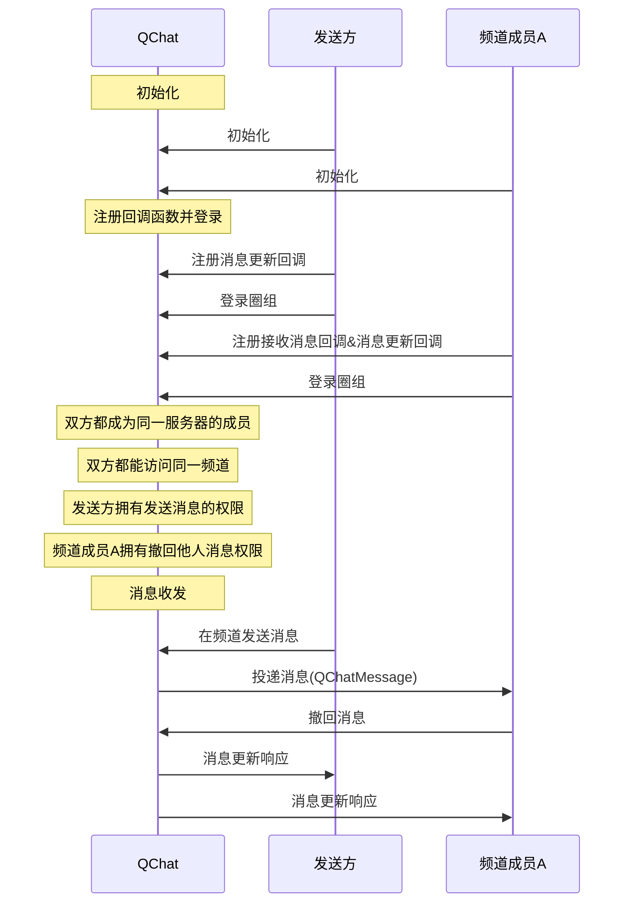

NIM SDK 的<a href="https://docs.netease.im/docs/interface/%E5%8D%B3%E6%97%B6%E9%80%9A%E8%AE%AFWindows%E7%AB%AF/NIMSDKAPI_CPP/html/classnim__qchat_1_1_message.html" target="_blank">`nim_qchat::Message`</a>类提供圈组消息撤回的方法，支持在消息发送后将消息撤回。圈组的消息撤回功能属于双向撤回。撤回之后，消息接收者和发送者都将收到一条消息撤回通知。

::: note notice
消息发送方和拥有撤回他人消息权限（`kPermissionRevokeMemberMessage`）的频道成员都可撤回消息。 
:::


## 前提条件

- 已[开通圈组功能](https://doc.yunxin.163.com/messaging/docs/DMxMjU2NTE?platform=pc)。
- 已完成圈组初始化。

## 实现流程

::: note note 
本文以 **发送方的消息被频道成员A 撤回** 为例进行介绍，即发送方在下文中为消息被撤回的一方。
:::

### API 调用时序



### 具体流程

::: note note
本节仅对上图中标为部分的流程进行说明，其他流程请参考相关文档。例如：
- 服务器成员相关说明，可参见<a href="https://doc.yunxin.163.com/messaging/docs/DA3Nzc3MjM?platform=pc" target="_blank">圈组服务器成员管理</a>。
- 用户是否能访问某频道的相关说明，可参见<a href="https://doc.yunxin.163.com/messaging/docs/jczMzcwOTE?platform=pc" target="_blank">频道管理</a>中对于频道黑白名单的说明。
- 权限相关配置说明，可参见身份组相关文档。
:::

1. 注册回调函数并登录。
    - 发送方在登录圈组前，注册<a href="https://docs.netease.im/docs/interface/%E5%8D%B3%E6%97%B6%E9%80%9A%E8%AE%AFWindows%E7%AB%AF/NIMSDKAPI_CPP/html/classnim__qchat_1_1_message.html#ac0e24830807a1870193239fad238d7e4" target="_blank">`RegUpdatedCb`</a>消息更新回调函数。
    - 频道成员A在登录圈组前，注册<a href="https://doc.yunxin.163.com/messaging/references/pc/doxygen/Latest/zh/classnim_1_1_message.html#aa4787c06597b0e6e9b6b31529bd1630d" target="_blank">`RegRecvCb`</a>消息接收回调函数和`RegUpdatedCb`消息更新回调函数。

    示例代码如下：

    :::::: div custom-tabs
    ::: tab 注册消息接收回调
    ```
    QChatRegRecvMsgCbParam reg_receive_message_cb_param;
    reg_receive_message_cb_param.cb = [this](const QChatRecvMsgResp& resp) {
        // process messa
    };
    Message::RegRecvCb(reg_receive_message_cb_param);
    ```
    :::
    ::: tab 注册消息更新回调
    ```
    QChatRegMsgUpdatedCbParam reg_msg_updated_cb_param;
    reg_msg_updated_cb_param.cb = [this](const QChatMsgUpdatedResp& resp) {
        if (resp.res_code != NIMResCode::kNIMResSuccess) {
            // error handling
            return;
        }
        // process response
        // ...
    };
    Message::RegUpdatedCb(reg_msg_updated_cb_param);

    ```
    :::
    ::::::

2. 频道成员A 接收到消息后，调用<a href="https://docs.netease.im/docs/interface/%E5%8D%B3%E6%97%B6%E9%80%9A%E8%AE%AFWindows%E7%AB%AF/NIMSDKAPI_CPP/html/classnim__qchat_1_1_message.html#a19905c7ec516391f711452a3294e0cb7" target="_blank">`Revoke`</a>方法撤回消息。

    <br>


    **调用限制**：

    <ul><li>默认只能在消息发送后 2 分钟内撤回消息。<details><summary>可在云信控制台配置“可撤回时长”</summary>在云信控制台选择应用，进入<strong>IM 即时通讯 > 功能配置 > 圈组 > 子功能配置 > 圈组消息可撤回时长</strong>即可配置。<br> </details></li><li>非消息发送方需要拥有撤回他人消息的权限，才能撤回消息。</li></ul>

    示例代码如下：


    ```
    QChatRevokeMessageParam param;
    param.id_info.server_id = 123456;
    param.id_info.channel_id = 123456;
    param.timestamp = 123456;
    param.msg_server_id = 123456;
    param.update_info.postscript = "postscript";
    param.update_info.extension = "extension";
    param.update_info.push_content = "push content";
    param.update_info.push_payload = "push payload";
    param.cb = [this](const QChatUpdateMsgResp& resp) {
        if (resp.res_code != NIMResCode::kNIMResSuccess) {
            // error handling
            return;
        }
        // process response
        // ...
    };
    Message::Revoke(param);

    ```

3. `RegUpdatedCb`回调函数触发，双方通过该回调接收消息更新响应。

    ::: note notice
    云信服务端**不会**下发“消息更新响应”通知给发起撤回操作的设备，因为操作者不需要接收当前操作的通知。但如果操作者使用相同 IM 账号在其他设备登录，将收到该通知。
    :::
