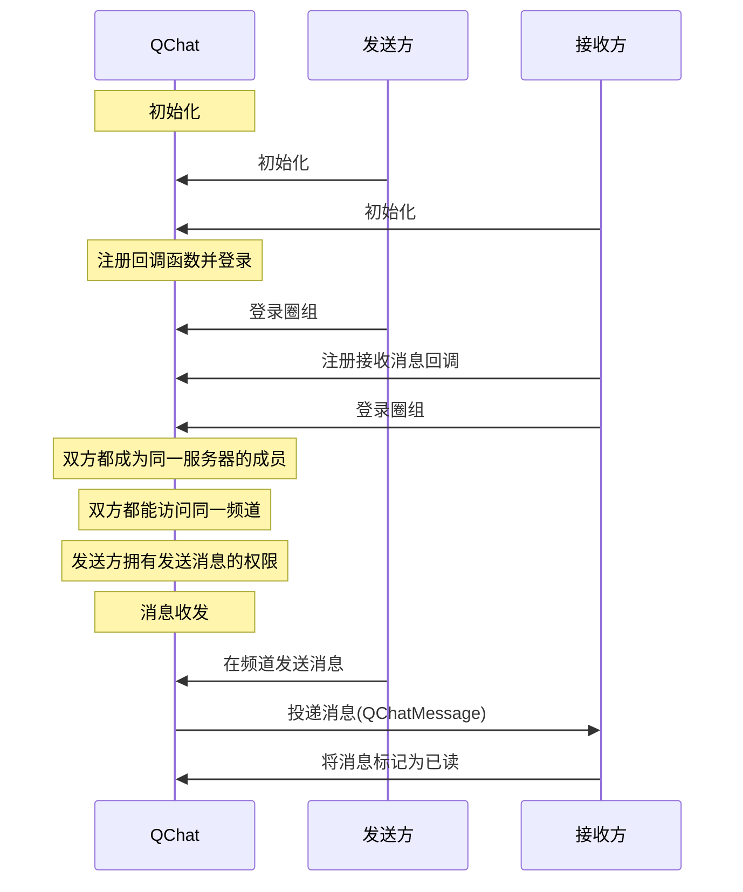

NIM SDK 的<a href="https://docs.netease.im/docs/interface/%E5%8D%B3%E6%97%B6%E9%80%9A%E8%AE%AFWindows%E7%AB%AF/NIMSDKAPI_CPP/html/classnim__qchat_1_1_message.html" target="_blank">`nim_qchat::Message`</a>类提供圈组消息收发的方法，支持支持文本、图片、语音、视频、文件、地理位置等消息类型。定义圈组消息的结构体为<a href="https://doc.yunxin.163.com/messaging/references/pc/doxygen/Latest/zh/structnim_1_1_q_chat_message.html" target="_blank">`QchatMessage`</a>。

## 功能介绍

| <div style="width:100px">消息类型</div> | <div style="width:100px">API关键字</div>  | 说明    |             
| :---------- | :----------|:----------------------------- |:----------------------------- |
| 文本消息        | `text` | 消息内容为普通文本 |  
| 图片消息        | `image`  | 消息内容为图片 URL 地址、尺寸、图片大小等信息               |  
| 语音消息        | `audio` | 消息内容为语音文件的 URL 地址、时长、大小、格式等信息 | 
| 视频消息        | `video` | 消息内容为视频文件的 URL 地址、时长、大小、格式等信息 | 
| 文件消息        |  `file` | 消息内容为文件的 URL 地址、大小、格式等信息         | 
| 位置消息      | `location`  | 消息内容为地理位置标题、经度、纬度信息         | 
| 提示消息        | `tip` | 又叫做 Tip 消息，没有推送和通知栏提醒，主要用于会话内的通知提醒，例如进入会话时出现的欢迎消息，或是会话过程中命中敏感词后的提示消息等场景 |
|  通知消息  |  `notification`  | 主要用于圈组的事件通知 | 
| 自定义消息       | `custom` | 开发者自定义的消息类型，例如红包消息、石头剪子布等形式的消息           | 

## 技术原理

下图展示了集成并初始化 NIM SDK 后，实现圈组消息收发的基本工作流。图中的 QChat 即为 NIM SDK 的圈组组件，云信服务端包含 IM 服务端和圈组服务端。


::: note notice 
- 上图仅以静态 Token 登录为例展示消息收发流程。网易云信 IM 还支持动态 Token 登录鉴权和第三方回调登录鉴权，相关详情请参见<a href="https://doc.yunxin.163.com/docs/TM5MzM5Njk/zE2NzA3Mjc?platformId=60353" target="_blank">登录鉴权</a>。
- **圈组服务端**与**圈组服务器**是两个不同概念，前者指云信服务器内提供圈组功能的服务端，后者为圈组的特殊概念，对应 Discord 的 Server, 为社群本身。
:::

<br>

上图中的流程可归纳为如下 5 步：

1. 账号集成与登录。
    1. 开发者将应用的用户账号传入云信 IM 服务端，注册云信 IM 账号。
    2. 云信 IM 服务端返回 Token 给应用服务器。
    3. 应用客户端登录应用服务器。
    4. 应用服务端将 Token 返回给应用客户端。
    5. 用户A 和用户B 带 Token 登录云信 IM 服务端。
2. 用户A 创建圈组服务器，并在服务器内创建频道。
3. 用户B 加入圈组服务器。
4. 用户A 在频道发送一条消息到云信圈组服务器。 
5. 云信圈组服务器投递消息至频道，用户B 接收消息。
    


## 前提条件

- 已[开通圈组功能](https://doc.yunxin.163.com/messaging/docs/DMxMjU2NTE?platform=pc)。
- 已完成圈组初始化。


::: note important
如果频道所属的服务器的成员人数超过 2000 人阈值，接收方还必须先订阅该频道，才能收到该频道的消息。如果未超过 2000 人阈值，无需订阅也能收到消息。订阅相关说明，请参见<a href="https://doc.yunxin.163.com/messaging/docs/TA0ODE3MDY?platform=pc" target="_blank">圈组订阅机制</a>。
:::


## 实现消息收发

### **API 调用时序**




### **具体流程**

本节仅对上图中标为部分的流程进行说明，其他流程请参考相关文档。例如：
- 服务器成员相关说明，可参见<a href="https://doc.yunxin.163.com/messaging/docs/DA3Nzc3MjM?platform=pc" target="_blank">圈组服务器成员管理</a>。
- 用户是否能访问某频道的相关说明，可参见<a href="https://doc.yunxin.163.com/messaging/docs/jczMzcwOTE?platform=pc" target="_blank">频道管理</a>中对于频道黑白名单的说明。
- 权限相关配置说明，可参见身份组相关文档。

<br>

1. 接收方在登录圈组前，注册<a href="https://doc.yunxin.163.com/messaging/references/pc/doxygen/Latest/zh/classnim_1_1_message.html#aa4787c06597b0e6e9b6b31529bd1630d" target="_blank">`RegRecvCb`</a>消息接收回调函数。

    示例代码如下：


    ```C++
    nim_qchat::QChatRegRecvMsgCbParam reg_receive_message_cb_param;
    reg_receive_message_cb_param.cb = [this](const nim_qchat::QChatRecvMsgResp& resp) {
        // p
    };
    nim_qchat::Message::RegRecvCb(reg_receive_message_cb_param);
    ```
2. 发送方调用<a href="https://doc.yunxin.163.com/messaging/references/pc/doxygen/Latest/zh/classnim_1_1_message.html#a9ea6079f062c4a4d8fce2d9123ed1721" target="_blank">`Send`</a>方法发送消息，调用时通过`msg_type`的类型枚举<a href="https://doc.yunxin.163.com/messaging/references/pc/doxygen/Latest/zh/nim__qchat__message__def_8h.html#ac2cbd84029867524e2bb46b0a45a2afd" target="_blank">`NIMQChatMsgType`</a>设置消息的类型。


    ::: note notice
    消息发送方需要拥有发送消息的权限`kPermissionSendMessage`。
    :::

    该方法的部分重要参数说明如下（全量请参见<a href="https://doc.yunxin.163.com/messaging/references/pc/doxygen/Latest/zh/structnim_1_1_q_chat_message.html" target="_blank">`QchatMessage`</a>）：
    <div style="width:100px">参数</div>  |   <div style="width:100px">类型</div>   |    说明
    ---- | -------------- | ---------
    `anti_spam_info`| <a href="https://doc.yunxin.163.com/messaging/references/pc/doxygen/Latest/zh/structnim_1_1_q_chat_message_anti_spam_info.html" target="_blank">`QChatMessageAntiSpamInfo`</a> | 配置安全通（易盾反垃圾）相关的各项参数。如果您配置了这些参数，在发送消息时，会对发送的文本和附件进行内容审核（反垃圾检测）。根据您在控制台预设的拦截/过滤规则，如果检测到违规内容，消息可能发送失败或者敏感信息被过滤。 <note type=notice>圈组的安全通功能属于增值功能，需要在开通圈组功能后再额外开通。如尚未开通，请通过云信官网首页提供的联系方式咨询商务经理开通</note>
    `mention_all` | bool |是否@所有人，false:否，true:是<note type=notice>用户需要拥有@所有人权限（`kPermissionAtAll`）才能@所有人</note>
    `mention_accid` | char ** 	| @部分人，如果将该消息设置为@所有人（即`mention_all`设置为true）或者@身份组（即`mention_role_ids` 不为空，则本参数无效）<note type=notice>用户需要拥有@某个人权限（`kPermissionAtMember `）才能@部分人。</note>
    `mention_role_ids` | uint64_t * 	| @的身份组列表，最多@ 10 个身份组。如果将该消息设置为@所有人（即`mention_all`设置为true），则本参数无效 <note type=notice>用户需要拥有@身份组权限（`kPermissionAtRole`）才能@身份组。</note>
    `resend_flag`| bool | 是否重发消息，false：否，true：是
    `msg_id` | std::string 	|消息重发时需要指定此消息的 ID（消息发送成功后云信会生成消息 ID）
   

    <div>
    <div>
    
    发送各类型消息的示例代码如下：
    
    :::::: div custom-tabs
    ::: tab 文本

    ```
    QChatSendMessageParam param;
    param.message.server_id = 123456;
    param.message.channel_id = 123456;
    param.message.msg_body = "message body";
    param.message.msg_ext = "message ext";
    param.message.resend_flag = false;
    param.message.msg_id = ""; // only for resend. if not, leave it empty, we will generate it
    param.message.mention_all = false;
    param.message.mention_accids = {"accid1", "accid2"}; // if mention_all is true, this will be ignored
    param.message.history_enable = true;
    param.message.push_enable = false;
    param.message.push_payload = "push payload";
    param.message.push_content = "push content";
    param.message.need_badge = true;
    param.message.need_push_nick = true;
    param.message.route_enable = true;
    // content moderation
    param.message.anti_spam_info.use_custom_content = false;
    param.message.anti_spam_info.anti_spam_using_yidun = true;
    param.message.anti_spam_info.anti_spam_content = "anti spam content";
    param.message.anti_spam_info.anti_spam_bussiness_id = "anti spam bussiness id";
    param.message.anti_spam_info.yidun_callback_url = "yidun callback url";
    param.message.anti_spam_info.yidun_anti_cheating = "yidun anti cheating";
    param.message.anti_spam_info.yidun_anti_spam_ext = "yidun anti spam ext";
    // text message
    param.message.msg_type = kNIMQChatMsgTypeText;
    auto attach = std::make_shared<QChatDefaultAttach>();
    attach->msg_attach = "msg attach";

    Message::Send(param);
    ```
    :::

    ::: tab 图片

    ```
    QChatSendMessageParam param;
    param.message.server_id = 123456;
    param.message.channel_id = 123456;
    param.message.msg_body = "message body";
    param.message.msg_ext = "message ext";
    param.message.resend_flag = false;
    param.message.msg_id = ""; // only for resend. if not, leave it empty, we will generate it
    param.message.mention_all = false;
    param.message.mention_accids = {"accid1", "accid2"}; // if mention_all is true, this will be ignored
    param.message.history_enable = true;
    param.message.push_enable = false;
    param.message.push_payload = "push payload";
    param.message.push_content = "push content";
    param.message.need_badge = true;
    param.message.need_push_nick = true;
    param.message.route_enable = true;
    // image message
    param.message.msg_type = kNIMQChatMsgTypeImage;
    auto attach = std::make_shared<QChatImageAttach>();
    attach->file_path = "image path";
    attach->width = 100;
    attach->height = 100;
    param.message.msg_attach = attach;

    Message::Send(param);
    ```
    :::

    ::: tab 语音

    ```
    QChatSendMessageParam param;
    param.message.server_id = 123456;
    param.message.channel_id = 123456;
    param.message.msg_body = "message body";
    param.message.msg_ext = "message ext";
    param.message.resend_flag = false;
    param.message.msg_id = ""; // only for resend. if not, leave it empty, we will generate it
    param.message.mention_all = false;
    param.message.mention_accids = {"accid1", "accid2"}; // if mention_all is true, this will be ignored
    param.message.history_enable = true;
    param.message.push_enable = false;
    param.message.push_payload = "push payload";
    param.message.push_content = "push content";
    param.message.need_badge = true;
    param.message.need_push_nick = true;
    param.message.route_enable = true;
    // audio message
    param.message.msg_type = kNIMQChatMsgTypeAudio;
    auto attach = std::make_shared<QChatAudioAttach>();
    attach->file_path = "audio path";
    attach->duration = 60;
    param.message.msg_attach = attach;

    Message::Send(param);

    ```
    :::

    ::: tab 视频

    ```
    QChatSendMessageParam param;
    param.message.server_id = 123456;
    param.message.channel_id = 123456;
    param.message.msg_body = "message body";
    param.message.msg_ext = "message ext";
    param.message.resend_flag = false;
    param.message.msg_id = ""; // only for resend. if not, leave it empty, we will generate it
    param.message.mention_all = false;
    param.message.mention_accids = {"accid1", "accid2"}; // if mention_all is true, this will be ignored
    param.message.history_enable = true;
    param.message.push_enable = false;
    param.message.push_payload = "push payload";
    param.message.push_content = "push content";
    param.message.need_badge = true;
    param.message.need_push_nick = true;
    param.message.route_enable = true;
    // video message
    param.message.msg_type = kNIMQChatMsgTypeVideo;
    auto attach = std::make_shared<QChatVideoAttach>();
    attach->file_path = "video path";
    attach->duration = 60;
    param.message.msg_attach = attach;

    Message::Send(param);
    ```
    :::

    ::: tab 文件

    ```
    QChatSendMessageParam param;
    param.message.server_id = 123456;
    param.message.channel_id = 123456;
    param.message.msg_body = "message body";
    param.message.msg_ext = "message ext";
    param.message.resend_flag = false;
    param.message.msg_id = ""; // only for resend. if not, leave it empty, we will generate it
    param.message.mention_all = false;
    param.message.mention_accids = {"accid1", "accid2"}; // if mention_all is true, this will be ignored
    param.message.history_enable = true;
    param.message.push_enable = false;
    param.message.push_payload = "push payload";
    param.message.push_content = "push content";
    param.message.need_badge = true;
    param.message.need_push_nick = true;
    param.message.route_enable = true;
    // file message
    param.message.msg_type = kNIMQChatMsgTypeFile;
    auto attach = std::make_shared<QChatFileAttach>();
    attach->file_path = "file path";
    param.message.msg_attach = attach;

    Message::Send(param);
    ```
    :::

    ::: tab 位置

    ```
    QChatSendMessageParam param;
    param.message.server_id = 123456;
    param.message.channel_id = 123456;
    param.message.msg_body = "message body";
    param.message.msg_ext = "message ext";
    param.message.resend_flag = false;
    param.message.msg_id = ""; // only for resend. if not, leave it empty, we will generate it
    param.message.mention_all = false;
    param.message.mention_accids = {"accid1", "accid2"}; // if mention_all is true, this will be ignored
    param.message.history_enable = true;
    param.message.push_enable = false;
    param.message.push_payload = "push payload";
    param.message.push_content = "push content";
    param.message.need_badge = true;
    param.message.need_push_nick = true;
    param.message.route_enable = true;
    // location message
    param.message.msg_type = kNIMQChatMsgTypeLocation;
    attach->latitude = 123.456;
    attach->longitude = 123.456;
    attach->title = "location title";
    param.message.msg_attach = attach;

    Message::Send(param);
    ```

    :::

    ::: tab 通知
    ```
    QChatSendMessageParam param;
    param.message.server_id = 123456;
    param.message.channel_id = 123456;
    param.message.msg_body = "message body";
    param.message.msg_ext = "message ext";
    param.message.resend_flag = false;
    param.message.msg_id = ""; // only for resend. if not, leave it empty, we will generate it
    param.message.mention_all = false;
    param.message.mention_accids = {"accid1", "accid2"}; // if mention_all is true, this will be ignored
    param.message.history_enable = true;
    param.message.push_enable = false;
    param.message.push_payload = "push payload";
    param.message.push_content = "push content";
    param.message.need_badge = true;
    param.message.need_push_nick = true;
    param.message.route_enable = true;
    // notification message
    param.message.msg_type = kNIMQChatMsgTypeNotification;
    auto attach = std::make_shared<QChatNotificationAttach>();
    attach->id = 1;
    attach->data = "notification data";
    param.message.msg_attach = attach;

    Message::Send(param);
    ```

    :::

    ::: tab 提示
    ```
    QChatSendMessageParam param;
    param.message.server_id = 123456;
    param.message.channel_id = 123456;
    param.message.msg_body = "message body";
    param.message.msg_ext = "message ext";
    param.message.resend_flag = false;
    param.message.msg_id = ""; // only for resend. if not, leave it empty, we will generate it
    param.message.mention_all = false;
    param.message.mention_accids = {"accid1", "accid2"}; // if mention_all is true, this will be ignored
    param.message.history_enable = true;
    param.message.push_enable = false;
    param.message.push_payload = "push payload";
    param.message.push_content = "push content";
    param.message.need_badge = true;
    param.message.need_push_nick = true;
    param.message.route_enable = true;
    // tips message
    param.message.msg_type = kNIMQChatMsgTypeTips;
    auto attach = std::make_shared<QChatTipsAttach>();
    attach->type = 1;
    attach->data = "tips data";
    param.message.msg_attach = attach;

    Message::Send(param);
    ```
    :::

    ::: tab 自定义

    ```
    QChatSendMessageParam param;
    param.message.server_id = 123456;
    param.message.channel_id = 123456;
    param.message.msg_body = "message body";
    param.message.msg_ext = "message ext";
    param.message.resend_flag = false;
    param.message.msg_id = ""; // only for resend. if not, leave it empty, we will generate it
    param.message.mention_all = false;
    param.message.mention_accids = {"accid1", "accid2"}; // if mention_all is true, this will be ignored
    param.message.history_enable = true;
    param.message.push_enable = false;
    param.message.push_payload = "push payload";
    param.message.push_content = "push content";
    param.message.need_badge = true;
    param.message.need_push_nick = true;
    param.message.route_enable = true;
    // custom message
    param.message.msg_type = kNIMQChatMsgTypeCustom;
    auto attach = std::make_shared<QChatDefaultAttach>();
    attach->msg_attach = "msg attach";

    Message::Send(param);
    ```

    :::


    ::::::


3. `RegRecvCb`回调函数触发，消息投递至接收方。

4. 接收方调用<a href="https://docs.netease.im/docs/interface/%E5%8D%B3%E6%97%B6%E9%80%9A%E8%AE%AFWindows%E7%AB%AF/NIMSDKAPI_CPP/html/classnim__qchat_1_1_message.html#ace5a81243553894d8b84fe0c4deb0442" target="_blank">`MarkRead`</a>方法将接收到的消息标记为已读。

    ::: note notice
    - 将消息标记为已读后，该消息之前接收到的消息全部变为已读状态。
    - 如果传入的`timestamp`参数为 0，则频道内所有消息将被标记为未读。
    - 该方法调用存在频控，200ms 内最多可调用一次。
    :::

    示例代码如下：

    ```
    QChatMarkMessageReadParam param;
    param.id_info.server_id = 123456;
    param.id_info.channel_id = 123456;
    param.timestamp = 123456;
    param.cb = [this, param](const QChatMarkMessageReadResp& resp) {
        if (resp.res_code != NIMResCode::kNIMResSuccess) {
            // error handling
            return;
        }
        // process response
        // ...
    };
    Message::MarkRead(param);
    ```


## 相关参考

### 消息未读数限制


- 所有未读消息（包括@消息）的消息阈值默认为 99 条。
- @消息的未读数的有效期，默认为 7 天，即默认存储 7 天。

若需要扩展上限，可在控制台配置圈组子功能项（**未读的@消息数-周期** 和 **所有未读消息（包括@）的消息计数-阈值**），具体请参考[开通和配置圈组功能](https://doc.yunxin.163.com/messaging/docs/DMxMjU2NTE?platform=pc)。
