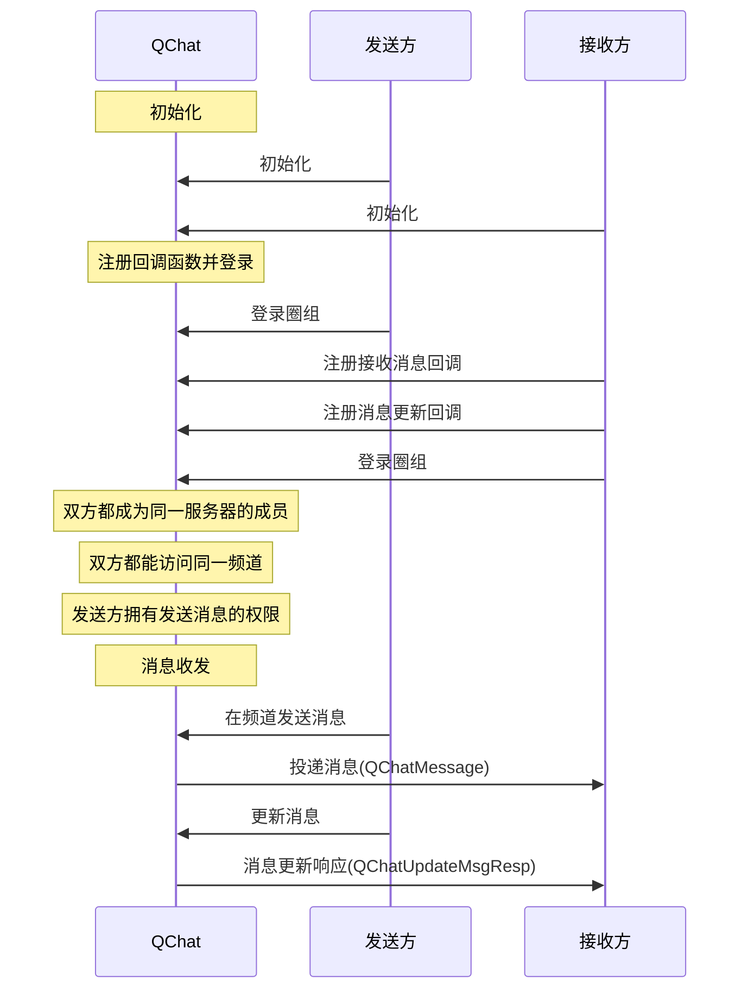

NIM SDK 的<a href="https://docs.netease.im/docs/interface/%E5%8D%B3%E6%97%B6%E9%80%9A%E8%AE%AFWindows%E7%AB%AF/NIMSDKAPI_CPP/html/classnim__qchat_1_1_message.html" target="_blank">`nim_qchat::Message`</a>类提供圈组消息更新的方法，支持在发送消息后更新消息。

## 前提条件

- 已[开通圈组功能](https://doc.yunxin.163.com/messaging/docs/DMxMjU2NTE?platform=pc)。
- 已完成圈组初始化。

## 实现流程

### API 调用时序




### 具体流程

::: note note
本节仅对上图中标为部分的流程进行说明，其他流程请参考相关文档。例如：
- 服务器成员相关说明，可参见<a href="https://doc.yunxin.163.com/messaging/docs/DA3Nzc3MjM?platform=pc" target="_blank">圈组服务器成员管理</a>。
- 用户是否能访问某频道的相关说明，可参见<a href="https://doc.yunxin.163.com/messaging/docs/jczMzcwOTE?platform=pc" target="_blank">频道管理</a>中对于频道黑白名单的说明。
- 权限相关配置说明，可参见身份组相关文档。
:::

1. 接收方在登录圈组前，注册<a href="https://doc.yunxin.163.com/messaging/references/pc/doxygen/Latest/zh/classnim_1_1_message.html#aa4787c06597b0e6e9b6b31529bd1630d" target="_blank">`RegRecvCb`</a>消息接收回调函数和<a href="https://docs.netease.im/docs/interface/%E5%8D%B3%E6%97%B6%E9%80%9A%E8%AE%AFWindows%E7%AB%AF/NIMSDKAPI_CPP/html/classnim__qchat_1_1_message.html#ac0e24830807a1870193239fad238d7e4" target="_blank">`RegUpdatedCb`</a>消息更新回调函数。

    示例代码如下：

    :::::: div custom-tabs
    ::: tab 注册消息接收回调

    ```
    QChatRegRecvMsgCbParam reg_receive_message_cb_param;
    reg_receive_message_cb_param.cb = [this](const QChatRecvMsgResp& resp) {
        // process message
    };
    Message::RegRecvCb(reg_receive_message_cb_param);
    ```
    :::
    ::: tab 注册消息更新回调
    ```
    QChatRegMsgUpdatedCbParam reg_msg_updated_cb_param;
    reg_msg_updated_cb_param.cb = [this](const QChatMsgUpdatedResp& resp) {
        if (resp.res_code != NIMResCode::kNIMResSuccess) {
            // error handling
            return;
        }
        // process response
        // ...
    };
    Message::RegUpdatedCb(reg_msg_updated_cb_param);

    ```
    :::
    ::::::
2. 发送方在发送消息后，调用<a href="https://docs.netease.im/docs/interface/%E5%8D%B3%E6%97%B6%E9%80%9A%E8%AE%AFWindows%E7%AB%AF/NIMSDKAPI_CPP/html/classnim__qchat_1_1_message.html#abda0a53eff96ce67d0419b16e3576bdf" target="_blank">`Update`</a>方法更新消息。

    示例代码如下：

    ```
    QChatUpdateMessageParam param;
    param.id_info.server_id = 123456;
    param.id_info.channel_id = 123456;
    param.timestamp = 0;
    param.msg_server_id = 123456;
    param.status = kMsgStatusNormal;
    param.msg_body = "message body";
    param.msg_ext = "message ext";
    param.update_info.postscript = "postscript";
    param.update_info.extension = "extension";
    param.update_info.push_content = "push content";
    param.update_info.push_payload = "push payload";
    param.message.anti_spam_info.use_custom_content = false;
    param.message.anti_spam_info.anti_spam_using_yidun = true;
    param.message.anti_spam_info.anti_spam_content = "anti spam content";
    param.message.anti_spam_info.anti_spam_bussiness_id = "anti spam bussiness id";
    param.message.anti_spam_info.yidun_callback_url = "yidun callback url";
    param.message.anti_spam_info.yidun_anti_cheating = "yidun anti cheating";
    param.message.anti_spam_info.yidun_anti_spam_ext = "yidun anti spam ext";
    param.cb = [this](const QChatUpdateMsgResp& resp) {
        if (resp.res_code != NIMResCode::kNIMResSuccess) {
            // error handling
            return;
        }
        // process response
        // ...
    };
    Message::Update(param);
    ```

3. `RegUpdatedCb`回调触发，将更新后的消息投递至接收方。
