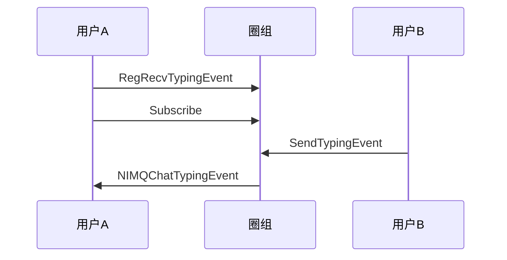

<!--keywords: 正在输入, 消息正在输入, 频道消息 -->

网易云信 IM 的圈组模块支持在频道内有消息输入时，频道成员能在频道内看到“正在输入”提示。

## 技术原理

网易云信即时通讯 NIM Windows SDK 中的[`NIMQChatTypingEvent`](https://docs.netease.im/docs/interface/%E5%8D%B3%E6%97%B6%E9%80%9A%E8%AE%AFWindows%E7%AB%AF/NIMSDKAPI_CPP/html/structnim__qchat_1_1_q_chat_typing_event.html)结构体定义了“正在输入事件系统通知”。SDK 的[`SystemNotification`](https://docs.netease.im/docs/interface/%E5%8D%B3%E6%97%B6%E9%80%9A%E8%AE%AFWindows%E7%AB%AF/NIMSDKAPI_CPP/html/classnim__qchat_1_1_system_notification.html)类提供[`SendTypingEvent`](https://docs.netease.im/docs/interface/%E5%8D%B3%E6%97%B6%E9%80%9A%E8%AE%AFWindows%E7%AB%AF/NIMSDKAPI_CPP/html/classnim__qchat_1_1_system_notification.html#a3fdf4d322ba40da87c2c69c193b7a481)方法发送“正在输入事件系统通知”。接收方只有在监听该事件且订阅消息所在频道后，才能在消息输入方发送该事件后，接收到该事件的系统通知。 


## 实现方法

我们以用户A 和用户B 在频道内的消息交互为例，介绍“正在输入”在频道显示的实现方法。


### **前提条件**

用户A 和用户B 都在频道内，即频道对两者都可见, 且用户B 拥有发送频道消息权限。

::: note note :::
- 要实现频道对用户A 和用户B 都可见，需确保两者都在私密频道的白名单内，或者都没有被加入公开频道的黑名单。
- 可通过将用户B 加入某身份组，并授予该身份组发送频道消息权限，让用户B 拥有发送频道消息的权限。也可为用户B 在频道内定制发送频道消息的权限。 
:::

### **实现流程**

1. 用户A 调用[`RegRecvTypingEvent`](https://docs.netease.im/docs/interface/%E5%8D%B3%E6%97%B6%E9%80%9A%E8%AE%AFWindows%E7%AB%AF/NIMSDKAPI_CPP/html/classnim__qchat_1_1_system_notification.html#a5f15031135b60334ff8ac89e4dabe738)方法监听正在输入事件（`NIMQChatTypingEvent`）。 
2. 用户A 调用[`Subscribe`](https://docs.netease.im/docs/interface/%E5%8D%B3%E6%97%B6%E9%80%9A%E8%AE%AFWindows%E7%AB%AF/NIMSDKAPI_CPP/html/classnim__qchat_1_1_channel.html#afef474e966a7a2ec066cecd7f58b13a9)方法，调用时将入参[`NIMQChatSubscribeType`](https://docs.netease.im/docs/interface/%E5%8D%B3%E6%97%B6%E9%80%9A%E8%AE%AFWindows%E7%AB%AF/NIMSDKAPI_CPP/html/nim__qchat__public__def_8h.html#a9ddcfda12a811d11124bdb2798a392d3)设为`kNIMQChatSubscribeTypeTypingEvent `，实现对正在输入事件的订阅。

    ::: note notice :::
    如果断线重连，SDK 会自动再次订阅正在输入事件。但如果用户调用 `Logout` 方法切断与圈组服务端的连接或销毁 SDK 实例后重建实例，那么用户需要再度调`Subscribe`方法重新订阅该事件。
    :::

3. 用户B 调用[`SendTypingEvent`](https://docs.netease.im/docs/interface/%E5%8D%B3%E6%97%B6%E9%80%9A%E8%AE%AFWindows%E7%AB%AF/NIMSDKAPI_CPP/html/classnim__qchat_1_1_system_notification.html#a3fdf4d322ba40da87c2c69c193b7a481)方法发送正在输入事件。

    发送该事件后，SDK 会触发用户A 在`RegRecvTypingEvent`方法中设置的回调，将`NIMQChatTypingEvent`投递至用户A。
    
    ::: note notice :::
    该方法有调用频率上限，目前默认 3,000 ms 一次。
    :::


### **API 调用时序**



### **示例代码**
```
// User A: register channel typing event callback on certain channel
QChatRegRecvTypingEventCbParam reg_receive_typing_event_cb_param;
reg_receive_typing_event_cb_param.cb = [this](const QChatRecvTypingEventResp& resp) {
    if (resp.res_code != NIMResCode::kNIMResSuccess) {
        // error handling
        return;
    }
    // process response
    // ...
};
SystemNotification::RegRecvTypingEvent(reg_receive_typing_event_cb_param);
// User A: subscribe typing event
QChatChannelSubscribeParam param;
param.ope_type = kNIMQChatSubscribeOpeTypeSubscribe;
param.sub_type = kNIMQChatSubscribeTypeTypingEvent; // subscribe typing event
NIMQChatChannelIDInfo id_info;
id_info.server_id = 123456;
id_info.channel_id = 123456;
param.id_infos.push_back(id_info);
param.cb = [this](const QChatChannelSubscribeResp& resp) {
    if (resp.res_code != NIMResCode::kNIMResSuccess) {
        // error handling
        return;
    }
    // process response
    // ...
};
Channel::Subscribe(param);
// User B: send tying event
QChatSendTypingEventParam param;
param.typing_event.server_id = 123456;
param.typing_event.channel_id = 123456;
param.typing_event.extension = "typing";
param.cb = [this](const QChatSendTypingEventResp& resp) {
    if (resp.res_code != NIMResCode::kNIMResSuccess) {
        // error handling
        return;
    }
    // process response
    // ...
};
SystemNotification::SendTypingEvent(param);
```

## API 参考


| <div style="width:80px">API</div> | <div style="width:120px">说明 </div>| 
| ---- | -------------- | 
|[`RegRecvTypingEvent`](https://docs.netease.im/docs/interface/%E5%8D%B3%E6%97%B6%E9%80%9A%E8%AE%AFWindows%E7%AB%AF/NIMSDKAPI_CPP/html/classnim__qchat_1_1_system_notification.html#a5f15031135b60334ff8ac89e4dabe738) | 监听正在输入事件 |                            
| [`SendTypingEvent`](https://docs.netease.im/docs/interface/%E5%8D%B3%E6%97%B6%E9%80%9A%E8%AE%AFWindows%E7%AB%AF/NIMSDKAPI_CPP/html/classnim__qchat_1_1_system_notification.html#a3fdf4d322ba40da87c2c69c193b7a481) |    发送正在输入事件    |
