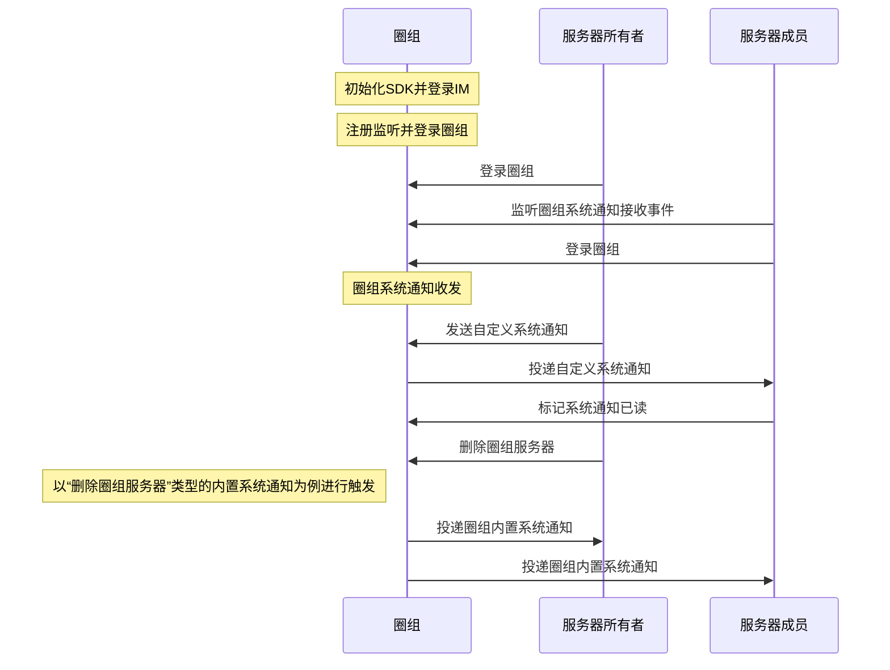

圈组系统通知是用户在使用圈组功能的过程中，由云信 IM 下发给用户相关事件的通知，比如圈组服务器中的成员变更，频道变更等事件。

## 功能介绍

圈组内置系统通知只能通过具体事件触发，由云信 IM 发送给相关的圈组用户。用户只需注册圈组系统通知的相关监听，就能接收到对应的系统通知。

圈组自定义系统通知支持用户主动发送，并可以指定发送给全员或部分成员。

云信 IM SDK 的 [`nim_qchat::SystemNotification`](https://doc.yunxin.163.com/messaging/references/pc/doxygen/Latest/zh/classnim_1_1_system_notification.html) 模块提供管理圈组系统通知的相关方法以及监听圈组系统通知的相关方法，帮助您快速实现对圈组系统通知的管理。

NIM SDK 中的 [`NIMQChatSystemNotification`](https://doc.yunxin.163.com/messaging/references/pc/doxygen/Latest/zh/struct_n_i_m_q_chat_system_notification.html) 定义了圈组的系统通知，其参数说明如下：

<details><summary>单击展开查看 NIMQChatSystemNotification 的参数说明</summary>

| 返回值类型  | 参数  | 说明     |
|  ----  | ----  | --------- |
|uint64_t|server_id|通知所属的圈组服务器的 ID|
|uint64_t |	channel_id|通知所属的频道的 ID|
|char *|to_accids|通知接收者账号列表，JSONArray|
|char *|from_accid|通知发送者的 accid|
|uint32_t|	from_client_type|通知发送者的客户端类型|
|char *|from_device_id|发送方设备 ID|
|char *|from_nick|发送方昵称|
|uint64_t |timestamp|消息发送时间|
|uint64_t |update_timestamp|通知更新时间|
|[`NIMQChatSystemNotificationType`](https://doc.yunxin.163.com/messaging/references/pc/doxygen/Latest/zh/nim__qchat__system__notification__def_8h.html#a68eb284bba17219f9f003e57d5ae414b)|msg_type|通知类型,具体系统通知类型的接收条件等信息，可参考服务器的 [`QChatSystemMsgType`](https://doc.yunxin.163.com/TM5MzM5Njk/docs/TkxMzc1NDg?platform=server#%E5%86%85%E7%BD%AE%E7%B3%BB%E7%BB%9F%E9%80%9A%E7%9F%A5%E7%B1%BB%E5%9E%8B)|
|void *|msg_data|	系统通知数据, 根据不同的系统通知类型，数据结构不同|
|char *|msg_id|客户端生成的消息 ID，会用于去重|
|uint64_t|msg_server_id|服务器生成的通知 ID，全局唯一|
|bool |history_enable|是否存离线，只有 to_accids 不为空，才能设置为存离线，默认 false|
|bool|resend_flag|重发标记，false:不是重发，true:是重发|
|char *|msg_body|通知内容|
|char *|msg_attach|通知附件|
|char *|msg_ext|扩展字段，推荐使用 JSON 格式|
|[`NIMQChatSystemNotificationStatus`](https://doc.yunxin.163.com/messaging/references/pc/doxygen/Latest/zh/nim__qchat__system__notification__def_8h.html#ab5d26068d0f45fc7f2da17ca99f7e12e)|status|通知状态，可以自定义。默认为普通状态|
|char *|push_payload|第三方自定义的推送属性，限制使用 JSON 格式|
|char *|push_content|自定义推送文案|
|bool|push_enable|是否需要推送，默认 false，不需要|
|bool|need_badge|是否需要消息计数，默认 true，需要|
|bool|	need_push_nick|	是否需要推送昵称，默认 true，需要|
|bool|route_enable|	是否需要抄送，默认 true，需要|
|char *|env|环境变量，用户可以根据不同的 env 配置不同的抄送和回调地址|
|char *|callback_ext|获取第三方回调回来的自定义扩展字段|

</details>


## 实现方法

本文以服务器所有者（即创建者）和服务器成员的交互为例，介绍服务器所有者发送圈组自定义系统通知的实现流程和触发内置圈组系统通知的实现流程。

### 前提条件

- 已[接入圈组](https://doc.yunxin.163.com/messaging/docs/zAzNTkwODk?platform=pc)，并已创建圈组服务器。
- 已[创建](https://doc.yunxin.163.com/messaging/docs/DQ3Nzk1MTY?platform=server)云信 IM 账号，作为下文中服务器所有者和服务器成员的云信 IM 账号。

:::note notice
如果用户所在服务器的成员人数超过 2000 人阈值，该用户还需先订阅相应的服务器或频道，才能收到对应服务器或频道的系统通知。如未超过该阈值，则无需订阅。订阅相关说明，请参见[圈组订阅机制](https://doc.yunxin.163.com/messaging/docs/TA0ODE3MDY?platform=pc)。
:::

### 实现流程





**以下只对部分重要步骤进行说明：**

1. 服务器成员注册监听 [`RegRecvCb`](https://doc.yunxin.163.com/messaging/references/pc/doxygen/Latest/zh/classnim_1_1_system_notification.html#af3f9812e996d3cbab744900afb0e1beb) 监听圈组系统通知的接收。

    示例代码：
    ```
    QChatRegRecvSystemNotificationCbParam reg_receive_sysmessage_cb_param;
    reg_receive_sysmessage_cb_param.cb = [this](const QChatRecvSystemNotificationResp& resp) {
        if (resp.res_code != NIMResCode::kNIMResSuccess) {
            // error handling
            return;
        }
        // process response
        // ...
    };
    SystemNotification::RegRecvCb(reg_receive_sysmessage_cb_param);
    ```

2. 服务器所有者通过调用 [`Send`](https://doc.yunxin.163.com/messaging/references/pc/doxygen/Latest/zh/classnim_1_1_system_notification.html#a2ee60ce951fd8caba559cb45efc8efcb) 发送圈组自定义系统通知。其中 [`QChatSendSystemNotificationParam`](https://doc.yunxin.163.com/messaging/references/pc/doxygen/Latest/zh/structnim_1_1_q_chat_send_system_notification_param.html) 是发送圈组自定义系统通知入参。

    示例代码：
    ```
    QChatSendSystemNotificationParam param;
    param.notification.server_id = 123456;
    param.notification.channel_id = 123456;
    param.notification.msg_type = kNIMQChatSystemNotificationTypeCustom;
    param.notification.msg_body = "msg body";
    param.notification.msg_attach = "msg attach";
    param.notification.msg_ext = "msg ext";
    param.notification.resend_flag = false;
    param.notification.msg_id = ""; // only for resend. if not, leave it empty, we will generate it
    param.notification.to_accids = {"accid1", "accid2"};
    param.notification.history_enable = false;
    param.notification.push_payload = "push payload";
    param.notification.push_content = "push content";
    param.notification.push_enable = false;
    param.notification.need_badge = true;
    param.notification.need_push_nick = true;
    param.cb = [this](const QChatSendSystemNotificationResp& resp) {
        if (resp.res_code != NIMResCode::kNIMResSuccess) {
            // error handling
            return;
        }
        // process response
        // ...
    };
    SystemNotification::Send(param);
    ```

3. 服务器成员收到来自服务器所有者的自定义系统通知。

4. 服务器成员通过调用 [`MarkSystemNotificationsRead`](https://doc.yunxin.163.com/messaging/references/pc/doxygen/Latest/zh/classnim_1_1_system_notification.html#ad22277f14e171cc161a94f4f34a1088d) 标记圈组系统通知已读。

    标记已读后的系统通知将从服务端删除，后续不会在其他端接收。

    示例代码：
    ```
    QChatMarkSystemNotificationsReadParam param;
    NIMQChatSystemNotificationMarkReadInfo info;
    info.msg_server_id = 123456;
    info.msg_type = kNIMQChatSystemNotificationTypeCustom;
    param.mark_read_infos.emplace_back(info);
    param.cb = [this](const QChatMarkReadSystemNotificationResp& resp) {
        if (resp.res_code != NIMResCode::kNIMResSuccess) {
            // error handling
            return;
        }
        // process response
        // ...
    };
    SystemNotification::MarkSystemNotificationsRead(param);
    ```

5. 服务器所有者调用 [`DeleteServer`](https://doc.yunxin.163.com/messaging/references/pc/doxygen/Latest/zh/classnim_1_1_server.html#a21888a25fef918f8974152433f16b877) 方法删除圈组服务器。

    示例代码：
    ```
    QChatServerDeleteParam param;
    param.server_id = 123456;
    param.cb = [this](const QChatServerDeleteResp& resp) {
        if (resp.res_code != NIMResCode::kNIMResSuccess) {
            // error handling
            return;
        }
        // process response
        // ...
    };
    Server::DeleteServer(param);
    ```
6. 服务器所有者和服务器成员收到系统投递的内置系统通知。

    :::note notice
    该示例收到类型为“删除服务器”的系统通知，更多事件类型和相应的通知接收条件，请参见[圈组系统通知分类](https://doc.yunxin.163.com/messaging/docs/zY1NzYwMTU?platform=pc#圈组系统通知分类)和[圈组系统通知接收机制](https://doc.yunxin.163.com/messaging/docs/zY1NzYwMTU?platform=pc#圈组系统通知接收机制)。
    :::

7. （可选）如果因为网络等原因，自定义系统通知发送失败，用户可以调用 [`Send`](https://doc.yunxin.163.com/messaging/references/pc/doxygen/Latest/zh/classnim_1_1_system_notification.html#a2ee60ce951fd8caba559cb45efc8efcb) 方法，将系统通知的 `resend_flag` 设置为 `true`，重新发送圈组自定义系统通知。
    示例代码如下：
    ```
    QChatSendSystemNotificationParam param;
    param.notification.server_id = 123456;
    param.notification.channel_id = 123456;
    param.notification.msg_type = kNIMQChatSystemNotificationTypeCustom;
    param.notification.msg_body = "msg body";
    param.notification.msg_attach = "msg attach";
    param.notification.msg_ext = "msg ext";
    param.notification.resend_flag = true;
    param.notification.msg_id = ""; // only for resend. if not, leave it empty, we will generate it
    param.notification.to_accids = {"accid1", "accid2"};
    param.notification.history_enable = false;
    param.notification.push_payload = "push payload";
    param.notification.push_content = "push content";
    param.notification.push_enable = false;
    param.notification.need_badge = true;
    param.notification.need_push_nick = true;
    param.cb = [this](const QChatSendSystemNotificationResp& resp) {
        if (resp.res_code != NIMResCode::kNIMResSuccess) {
            // error handling
            return;
        }
        // process response
        // ...
    };
    SystemNotification::Send(param);
    ```


