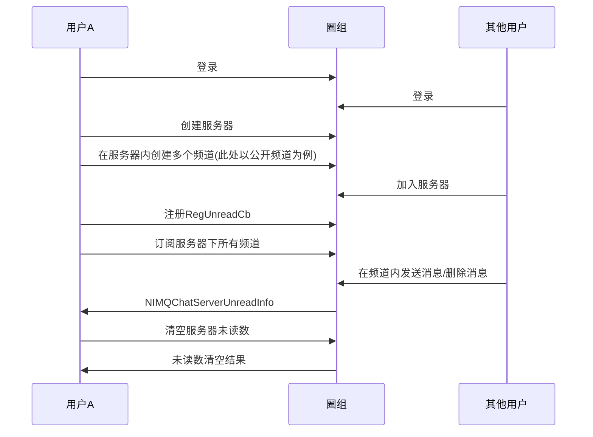

<!--keywords: 未读数, 服务器未读数, 圈组 -->

圈组服务器未读数，指圈组服务器下所有频道的消息总未读数。网易云信 NIM SDK 的[`NIMQChatServerUnreadInfo`](https://doc.yunxin.163.com/messaging/references/pc/doxygen/Latest/zh/struct_n_i_m_q_chat_server_unread_info.html)结构体定义了圈组服务器未读数信息。您可注册[`RegUnreadCb`](https://doc.yunxin.163.com/messaging/references/pc/doxygen/Latest/zh/classnim_1_1_server.html#ab4be741f8f4c85dc943221df926c896f)回调方法，监听`NIMQChatServerUnreadInfo`的变更，从而获取服务器未读数。

本文介绍获取服务器未读数的实现方法以及相应的示例代码。 

::: note notice
游客接收到的消息无已读未读逻辑。不支持对游客展示消息未读数。
:::

## 实现方法

本文以用户A 与其他用户在同一圈组服务器下的消息交互为例，介绍获取服务器未读数的实现方法。


  

### **前提条件**

- 已[登录圈组](https://doc.yunxin.163.com/docs/TM5MzM5Njk/jYzNjk3NTM?platformId=60227)，并已创建圈组服务器和频道。
- 用户A 和其他用户，均已加入圈组服务器。


### **实现流程**
1. 用户A 注册[`RegUnreadCb`](https://doc.yunxin.163.com/messaging/references/pc/doxygen/Latest/zh/classnim_1_1_server.html#ab4be741f8f4c85dc943221df926c896f)，监听`NIMQChatServerUnreadInfo`的变更。 
   
    示例代码如下：
    

    ```cpp
    QChatServerRegUnreadCbParam reg_unread_cb_param;
    reg_unread_cb_param.cb = [this](const QChatServerUnreadResp& resp) {
        if (resp.res_code != NIMResCode::kNIMResSuccess) {
            // error handling
            return;
        }
        // process response
        // ...
    };
    Server::RegUnreadCb(reg_unread_cb_param);
    ```


2. 根据实际业务情况，按如下方法订阅服务器下所有频道的未读数，获取并缓存各频道的初始未读数。

    - 如果服务器下的频道数量不超过 200，则用户A 可调用[`SubscribeAllChannel`](https://doc.yunxin.163.com/messaging/references/pc/doxygen/Latest/zh/classnim_1_1_server.html#a37ea6ef0e38328899260aacc60a936ac)方法一次性订阅服务器下的所有频道，调用时将订阅类型[`NIMQChatSubscribeType`](https://doc.yunxin.163.com/messaging/references/pc/doxygen/Latest/zh/nim__qchat__public__def_8h.html#a9ddcfda12a811d11124bdb2798a392d3)设置为未读数`kNIMQChatSubscribeTypeUnreadCount `）。需要注意的是，单次调用最多可传入 10 个服务器 ID。
    - 如果服务器下的频道数量超过 200，则用户A 调用[`Subscribe`](https://doc.yunxin.163.com/messaging/references/pc/doxygen/Latest/zh/classnim_1_1_channel.html#af876b23eb1eb00faccbc859e5a352c9a)方法订阅服务器下的所有频道，调用时将订阅类型[`NIMQChatSubscribeType`](https://doc.yunxin.163.com/messaging/references/pc/doxygen/Latest/zh/nim__qchat__public__def_8h.html#a9ddcfda12a811d11124bdb2798a392d3)设置为未读数`kNIMQChatSubscribeTypeUnreadCount `）。需要注意的是，单次调用最多可订阅 100 个频道。


    ::: note important
    - 通过`SubscribeAllChannel`方法订阅频道，单次调用可传入的服务器 ID 数量上限为 10 个。即使多次调用，单个服务器下最多仅能订阅 200 个 频道。如果目标服务器下频道数量大于 200，需改用`Subscribe`方法订阅服务器下所有频道（单次调用最多可订阅 100 个频道）。
    - 获取服务器的精确未读数，必须订阅服务器下的所有频道的未读数。
    :::
    

    - 调用`SubscribeAllChannel`方法的示例代码如下：

    ```cpp
    QChatServerSubscribeAllChannelParam param;
    param.sub_type = kNIMQChatSubscribeTypeMsg;
    param.server_ids = {123, 456};
    param.cb = [this](const QChatServerSubscribeAllChannelResp& resp) {
        if (resp.res_code != NIMResCode::kNIMResSuccess) {
            // error handling
            return;
        }
        // process response
        // ...
    };
    Server::SubscribeAllChannel(param);
    ```
    -调用`Subscribe`方法的示例代码如下：

    ```
    QChatChannelSubscribeParam param;
    param.ope_type = kNIMQChatSubscribeOpeTypeSubscribe;
    param.sub_type = kNIMQChatSubscribeTypeMsg;
    NIMQChatChannelIDInfo id_info;
    id_info.server_id = 123456;
    id_info.channel_id = 123456;
    param.id_infos.push_back(id_info);
    param.cb = [this](const QChatChannelSubscribeResp& resp) {
        if (resp.res_code != NIMResCode::kNIMResSuccess) {
            // error handling
            return;
        }
        // process response
        // ...
    };
    Channel::Subscribe(param);
    ```      

3. 其他用户发送或删除消息后，SDK 对服务器下所有已订阅频道的未读数进行累加计算。

    未读数**累加规则**如下：

    - 接到新消息，某个频道未读数 +1 时：
        - 如果累加未读数达到未读数上限（`max_unread_count`），则触发`ServerUnreadCallback`回调函数，给出`max_unread_count`。
        - 如果累加未读数没有达到`max_unread_count`，则触发`ServerUnreadCallback`回调函数，给出累加未读数。
    - 消息被删除，某个频道未读数 - 1 时：
        - 如果累加未读数达到`max_unread_count`，则触发`ServerUnreadCallback`回调函数，给出`max_unread_count`。
        - 如果累加未读数没有达到`max_unread_count`，则触发`ServerUnreadCallback`回调函数，给出累加未读数。

4. SDK 计算完累加未读数（`QChatServerUnreadInfo`）后，将其返回给用户A。

    ::: note notice :::
    - SDK 对`ServerUnreadCallback`回调函数的触发做了节流处理，100ms 内默认最多只能触发一次。您接收到该事件后可以直接渲染视图。
    - 服务器累加未读数在达到`max_unread_count`后，`ServerUnreadCallback`回调函数仍会触发，但服务器未读数不再继续累加。
    ::: 
5. 如果需要清空服务器未读数，可调用[`MarkRead`](https://doc.yunxin.163.com/messaging/references/pc/doxygen/Latest/zh/classnim_1_1_server.html#ac3173a3f1308609cb25e479b1497f387)方法进行清空。

    ```cpp
    QChatServerMarkReadParam param;
    param.sub_type = kNIMQChatSubscribeTypeMsg;
    param.server_ids = {123, 456};
    param.cb = [this](const QChatServerSubscribeAllChannelResp& resp) {
        if (resp.res_code != NIMResCode::kNIMResSuccess) {
            // error handling
            return;
        }
        // process response
        // ...
    };
    Server::SubscribeAllChannel(param);
    ```
