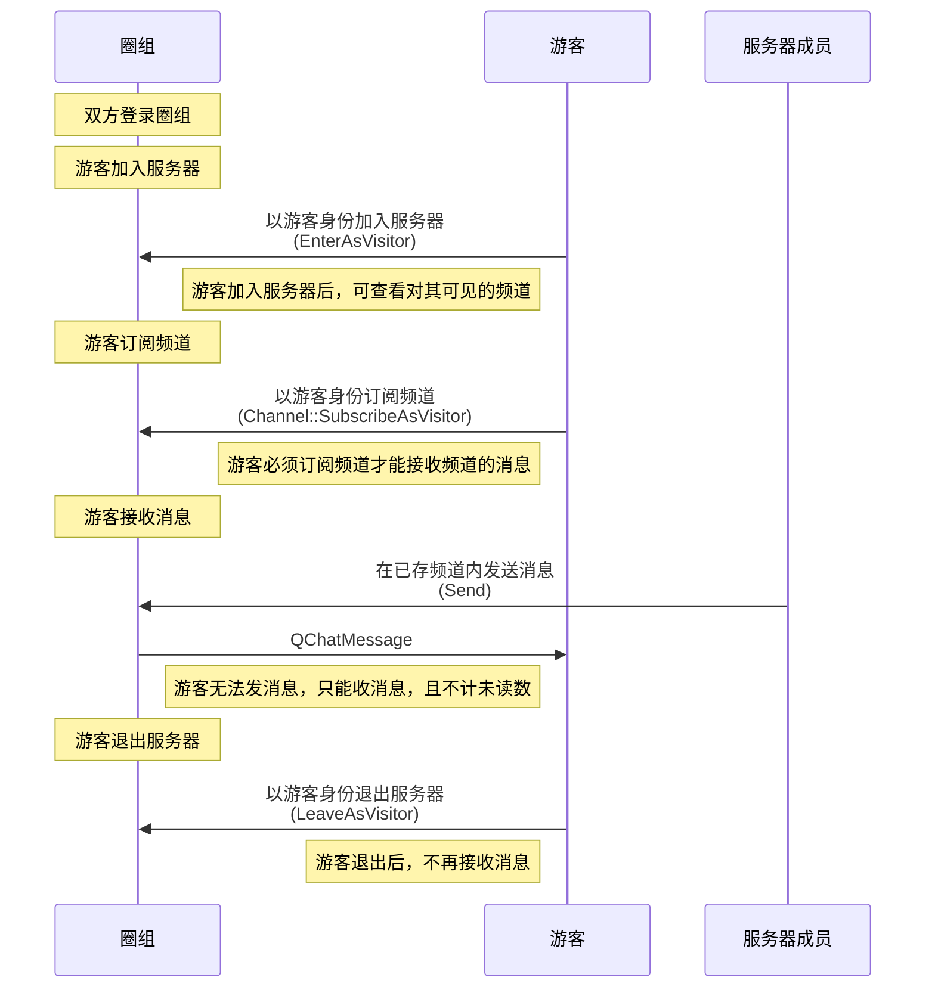
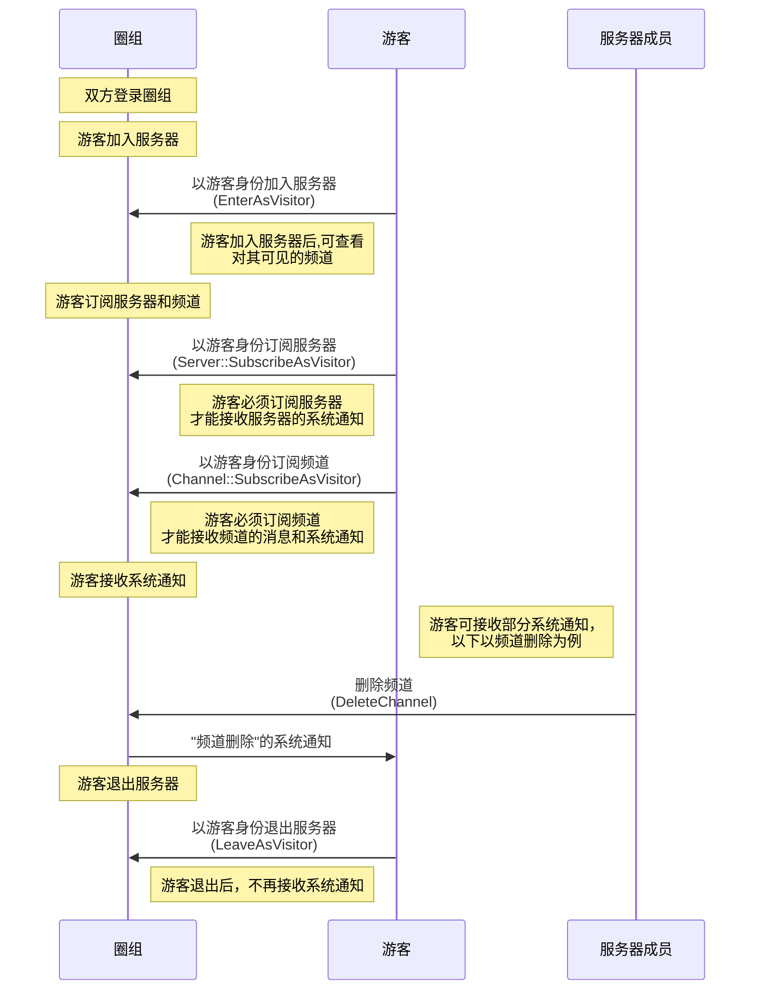
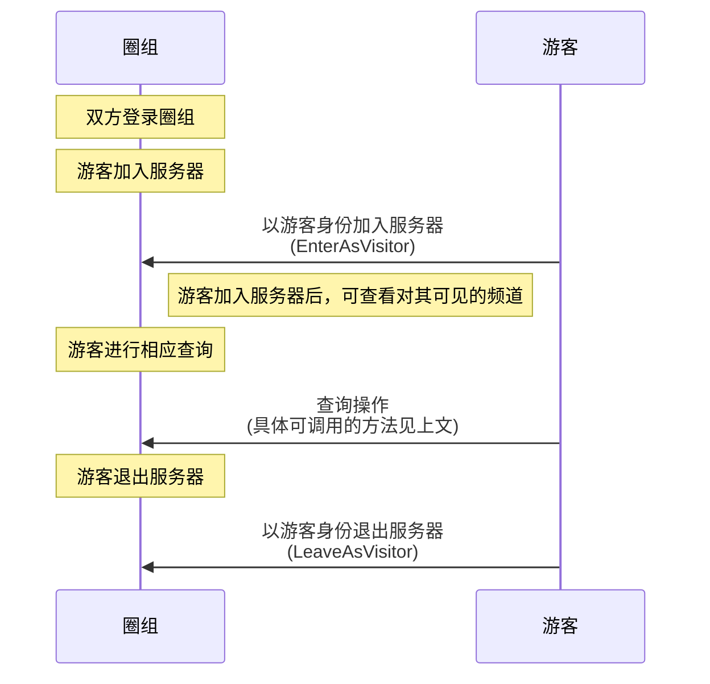

本文介绍游客功能的使用限制、实现方法、以及相关参考。 


## 功能介绍


自 v9.8.0 起，圈组支持用户在正式成为服务器成员之前，先以游客身份加入服务器体验相应线上社区的部分内容、活动以及氛围，之后再决策是否需要正式加入服务器。游客相当于临时性的只读普通成员，只能查看服务器和频道内的部分信息，无法发送消息，因此无法与服务器成员形成互动。


::: note notice
游客功能需要在开通圈组功能的基础上额外开通后才能使用。
:::

<br>


以下为对游客支持的功能： 


<div style="width:140px">功能</div> | 说明     | <div style="width:120px">限制</div>
---- | ---------------  |-----
加入和退出服务器  | 以游客身份加入和退出服务器，加入服务器后，可查看对其可见的频道和频道分组。频道是否对游客可见，可在频道创建和修改时设置。频道分组是否对游客可见，由其所包含的频道决定，具体见[频道管理](https://doc.yunxin.163.com/messaging/docs/jczMzcwOTE?platform=pc)和[频道分组](https://doc.yunxin.163.com/messaging/docs/DUxOTA3NTM?platform=pc)  | <ul><li>应用需已开通游客功能</li><li>服务器成员被封禁后不能再以游客身份加入</li></ul>
接收消息 | 接收成员在频道内发送的消息，游客接收到的消息无已读未读逻辑，因此不支持展示未读数  |  必须先订阅频道
接收服务器的系统通知  |   接收服务器相关事件的通知，具体可接收的通知类型，参见下文的[可接收的系统通知](#可接收的系统通知)                   |必须先订阅服务器
接收频道的系统通知   |   接收频道相关事件的通知，具体可接收的通知类型，参见下文的[可接收的系统通知](#可接收的系统通知)                   | 必须先订阅频道
查询部分信息   | 查询服务器、频道、消息和频道分组的部分信息，具体可调用的 SDK API，见下文的[实现查询操作](#实现查询操作) | 只能调用相应的 SDK API，无法调用服务端 API 
断网重连   | 用户以游客身份加入服务器后，如果网络异常断开，用户将在网络恢复时自动重新以游客身份加入服务器，如果游客之前已订阅服务器和服务器下的频道，将自动重新订阅 | -


## 前提条件

- 已联系商务经理或技术支持开通圈组的游客功能。
- 用户在以游客身份加入服务器前，需已登录圈组。

## 实现方法

### 实现加入和退出服务器


- 调用[`Server::EnterAsVisitor`](https://doc.yunxin.163.com/docs/interface/messaging/pc/doxygen/Latest/zh/classnim_1_1_server.html#a28ad85fc5c0145da781363de4826e628)方法以游客身份加入服务器。

    ::: note notice
    - 单个用户最多只能以游客身份加入 10 服务器。因此，调用该方法时，最多可传入 10 个服务器 ID。如果超限，将以加入失败列表的形式返回。
    - 单个服务器的游客数量上限为 2000。如果超限，将以加入失败列表的形式返回。
    :::


    <br>

    示例代码如下：

    ```
    QChatServerEnterAsVisitorParam param;
    param.server_ids.push_back(123456);
    param.cb = [this](const QChatServerEnterAsVisitorResp& resp) {
        if (resp.res_code != NIMResCode::kNIMResSuccess) {
            // error handling
            return;
        }
        // process response
        // ...
    };
    Server::EnterAsVisitor(param);
    ```

- 调用[`Server::LeaveAsVisitor`](https://doc.yunxin.163.com/docs/interface/messaging/pc/doxygen/Latest/zh/classnim_1_1_server.html#a6a04d962970a75129adc58fd28912afb)方法退出，调用时最多可传入 10 个服务器 ID。


    ::: note note 
    游客退出服务器后，订阅的服务器和频道将**自动取消订阅**。
    :::

    示例代码如下:
    ```
    QChatServerLeaveAsVisitorParam param;
    param.server_ids.push_back(123456);
    param.cb = [this](const QChatServerLeaveAsVisitorResp& resp) {
        if (resp.res_code != NIMResCode::kNIMResSuccess) {
            // error handling
            return;
        }
        // process response
        // ...
    };
    Server::LeaveAsVisitor(param);
    ```

### 实现消息接收
单个游客加入服务器后，可调用[`Channel::SubscribeAsVisitor`](https://doc.yunxin.163.com/docs/interface/messaging/pc/doxygen/Latest/zh/classnim_1_1_channel.html#a990481b02f2726880d6e4e05cd9ce850) 方法订阅对其可见的频道，从而在频道成员发送消息后接收消息，否则将无法接收。

::: note notice
- 一位游客最多可订阅 100 个频道。
- 不支持对游客显示消息未读数。
- 游客无法接收消息的离线推送。
:::

示例代码如下:
```
QChatChannelSubscribeAsVisitorParam param;
param.ope_type = (NIMQChatSubscribeOpeType)params["ope_type"].asInt64();
NIMQChatChannelIDInfo id_info;
id_info.server_id = 123456;
id_info.channel_id = 123456;
param.id_infos.push_back(id_info);
param.cb = [this](const QChatChannelSubscribeAsVisitorResp& resp) {
    if (resp.res_code != NIMResCode::kNIMResSuccess) {
        // error handling
        return;
    }
    // process response
    // ...
};
Channel::SubscribeAsVisitor(param);
```

### 实现系统通知接收


单个游客加入服务器后，可调用 [`Server::SubscribeAsVisitor`](https://doc.yunxin.163.com/docs/interface/messaging/pc/doxygen/Latest/zh/classnim_1_1_server.html#ae654bd2c2fd40cd2c81ea69334aff0db)方法订阅服务器，从而能够接收该服务器的部分事件通知，否则将无法接收。也可调用`Channel::SubscribeAsVisitor`方法订阅该服务器下对该游客可见的频道，从而能够接收该频道的部分事件通知，否则将无法接收。 


::: note notice
一位游客最多可订阅 10 个服务器和 100 个频道。
:::


示例代码如下:
```
QChatServerSubscribeAsVisitorParam param;
param.ope_type = (NIMQChatSubscribeOpeType)params["ope_type"].asInt64();
param.server_ids.push_back(123456);
param.cb = [this](const QChatServerSubscribeAsVisitorResp& resp) {
    if (resp.res_code != NIMResCode::kNIMResSuccess) {
        // error handling
        return;
    }
    // process response
    // ...
};
Server::SubscribeAsVisitor(param);
```

### 实现查询操作

用户在以游客身份加入服务器后，可调用如下方法查询服务器、频道、消息和频道分组的部分信息。

模块| 方法 | 说明 | 相关文档
---- | -------------- | ---------
服务器 | `GetServers`  |  根据服务器的 ID 查询对应的服务器的信息  | [根据服务器ID查询服务器](https://doc.yunxin.163.com/messaging/docs/Dk3MzY2MDY?platform=pc#按照服务器id查询)
 ^^ |`GetServerMembers`| 根据服务器成员的 ID 查询服务器成员的信息  |  [根据账号查询服务器成员](https://doc.yunxin.163.com/messaging/docs/DA3Nzc3MjM?platform=pc#按照服务器id和accid查询)
 ^^ |`GetServerMembersByPage` | 根据时间分页查询服务器成员列表    | [分页查询服务器成员列表](https://doc.yunxin.163.com/messaging/docs/DA3Nzc3MjM?platform=pc#按照时间分页查询)
频道 |`GetChannels`  | 根据频道 ID 查询频道信息   |  [根据频道ID查询频道](https://doc.yunxin.163.com/messaging/docs/jczMzcwOTE?platform=pc#按照频道id查询)
^^ | `GetChannelsByPage` |  根据时间分页查询频道列表（**仅返回对游客可见的频道**） | [分页查询频道列表](https://doc.yunxin.163.com/messaging/docs/jczMzcwOTE?platform=pc#按照时间分页查询)
^^ | `GetMembersByPage` | 根据时间分页查询频道成员列表     | [分页查询频道成员列表](https://doc.yunxin.163.com/messaging/docs/jczMzcwOTE?platform=pc#查询频道成员列表)
^^ |     `GetLastMessages`    |  获取多个频道的最后一条消息   | [获取频道最后一条消息](https://doc.yunxin.163.com/messaging/docs/DI1Mzk1MTY?platform=pc)
消息 |`GetMessages`| 查询历史消息 | [查询历史消息](https://doc.yunxin.163.com/messaging/docs/zAyMzQxNDY?platform=pc)
^^ | `GetMessageHistoryByIds`   |  根据回复消息的服务端 ID 查询历史回复消息（**注**：需先在云信控制台开通圈组的会话消息回复功能）</note>  | [会话消息回复（Thread）](https://doc.yunxin.163.com/messaging/docs/Tg0NDMzMDA?platform=pc)
^^ | `GetThreadMessages`   |   根据某个 Thread 中的任意一条消息分页查询该 Thread 的消息列表，即该 Thread 的聊天历史（**注**：需先在云信控制台开通圈组的会话消息回复功能） |    [会话消息回复（Thread）](https://doc.yunxin.163.com/messaging/docs/Tg0NDMzMDA?platform=pc)
^^ |  `GetThreadRootMessagesMeta`          | 批量查询某个频道下的多个 Thread 的根消息的 meta 信息，包括总回复数和最后回复时间 （**注**：需先在云信控制台开通圈组的会话消息回复功能）  | [会话消息回复（Thread）](https://doc.yunxin.163.com/messaging/docs/Tg0NDMzMDA?platform=pc)
^^ | `GetQuickComments`   | 查询指定消息所包含的快捷评论列表 （**注**：需先在云信控制台开通圈组的快捷评论功能）   | [圈组快捷评论](https://doc.yunxin.163.com/messaging/docs/jYyNjI0MzA?platform=pc)
频道分组  | `GetChannelCategoriesByID` | 根据频道分组的 ID 查询频道分组信息   |  [频道分组](https://doc.yunxin.163.com/messaging/docs/DUxOTA3NTM?platform=pc)


## 相关参考
### API调用时序


游客接收消息：



游客接收系统通知：



游客的查询操作：


  
  
### 可接收的系统通知


圈组系统通知的类型在[`NIMQChatSystemNotificationType`](https://doc.yunxin.163.com/docs/interface/messaging/pc/doxygen/Latest/zh/nim__qchat__system__notification__def_8h.html#a68eb284bba17219f9f003e57d5ae414b)枚举中定义，其中游客可接收的系统通知类型如下：


枚举值 | 说明   | <div style="width:120px">接收条件</div>
---- | ---------|-----  
`CHANNEL_VISIBILITY_TO_VISITOR_UPDATE`| 频道对游客可见性变更<note type=note>频道对游客的可见性，可通过修改频道的`visitor_mode`属性进行变更，也可能因频道分组的属性变更而变更。具体参见[频道管理](https://doc.yunxin.163.com/messaging/docs/jczMzcwOTE?platform=pc)中对游客可见性的说明。</note> | 订阅频道且在线
`kNIMQChatSystemNotificationTypeQuickCommentChanged` |更新快捷评论 | 订阅频道且在线
`kNIMQChatSystemNotificationTypeCustom` | 自定义系统通知 | 订阅服务器或频道且在线
`kNIMQChatSystemNotificationTypeServerRemove`| 删除服务器 | 订阅服务器且在线
`kNIMQChatSystemNotificationTypeServerUpdate` | 修改服务器信息 | 订阅服务器且在线
`kNIMQChatSystemNotificationTypeChannelCreate `| 创建频道   | 订阅服务器且在线
`kNIMQChatSystemNotificationTypeChannelDelete`  | 删除频道   |订阅频道且在线
`kNIMQChatSystemNotificationTypeChannelUpdate`|修改频道   |订阅频道且在线
`kNIMQChatSystemNotificationTypeChannelCategoryCreate`| 创建频道分组 | 订阅服务器且在线
`kNIMQChatSystemNotificationTypeChannelCategoryRemove`  |删除频道分组 |订阅服务器且在线
`kNIMQChatSystemNotificationTypeChannelCategoryUpdate`   | 修改频道分组信息  |订阅服务器且在线