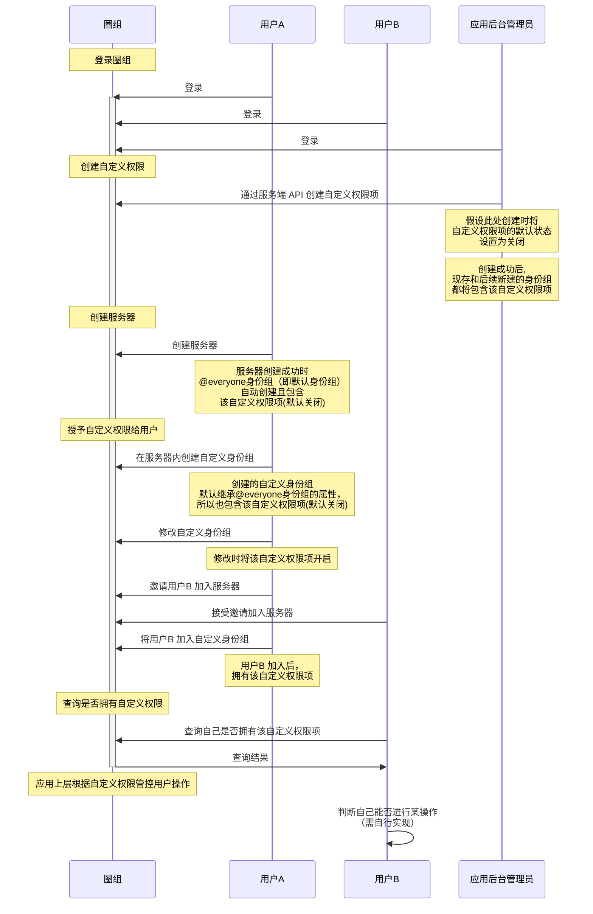

云信本身已提供较为完善的原子化权限，可供开发者调用实现基础的权限管控诉求。但不同行业的产品或同一产品的不同场景，对于用户权限管控的业务需求各有差异。因此云信圈组提供了新增自定义权限项的接口，帮助开发者快速实现符合自身需求的权限管控能力。


## 使用场景

- 自定义权限适用于如下业务场景：

    - 拓展圈组现有权限

        以消息相关权限为例。目前身份组虽然提供了发送消息的基础权限，但仍无法满足关于消息类型发送限制的能力。通过自定义权限，应用层可自定义如文字、图片、地理位置、语音消息、表情等消息体的发送权限；

    - 增加圈组权限类型。

        针对类贴吧微博等非即时通讯频道，通过自定义权限，应用层可设置发帖、评论等行为权限，保持权限的一致性。


    - 减少开发者的维护成本。

        云信提供新建、查询、计算等一系列的权限管理能力，应用层不需要独立维护权限，一个接口解决所有权限管控问题。

- 典型使用案例： 

    - 通过自定义权限接口新建发送文字消息权限、发送图片消息权限等不同消息类型的发送权限。然后在不同身份组中开启相应的权限，实现根据不同的身份组给予不同用户发送不同消息类型的权限。例如身份组A 的成员只能发送文字消息，身份组B 的成员只能发送文本和图片消息，身份组B 的成员可发送文字、图片、语音、自定义表情包等所有消息类型。


    - 通过自定义权限接口创建“禁言成员”权限，在应用上层自行实现相应逻辑，使拥有该权限的用户可对频道内其他用户设置禁言时间与禁言效果。


## 前提条件


- 已[开通圈组功能](https://doc.yunxin.163.com/messaging/docs/DMxMjU2NTE?platform=pc)。
- 已完成圈组初始化。


## 实现流程


**API 调用时序**





**流程说明**

以下仅对上图中标为部分的接口调用进行说明，其他相关接口说明请参考相应的接口文档。


1. 应用后台管理员调用服务端 API <a href="https://doc.yunxin.163.com/messaging/docs/zk3MzE0MjA?platform=server#创建自定义权限" target="_blank">`qchat/createCustomAuth.action`</a>创建身份组自定义权限项，调用时可通过`defaultRight`参数设置自定义权限是否在身份组中默认开启，如果开启，则身份组成员拥有该权限。**此处假设该自定义权限被设置为默认关闭**。

    ::: note notice
    自定义权限项创建后，@everyone 身份组和自定义身份组（包括已创建或新创建）将新增该自定义权限项。定义身份组权限项的`QChatPermission`中键值大于或等于 10000 的 int 型权限项即为自定义权限项。
    :::

2. 用户A 在新建服务器身份组中开启该自定义权限项，并邀请用户B 加入身份组，从而将自定义权限授予用户B。
    1. 用户A 调用<a href="https://doc.yunxin.163.com/messaging/references/pc/doxygen/Latest/zh/classnim_1_1_role.html#a76deb92f689bc6550adf7b57376a45b2" target="_blank">`CreateServerRole`</a>方法创建自定义身份组。对应上一步流程的场景，此时该自定义权限项在该身份组中默认关闭。 

        ::: note notice :::
        - 调用该方法需要拥有管理频道的权限（`kPermissionManageRole`），且必须是相应服务器的成员。如果没有该权限，调用该方法将返回 `403` 错误码。
        - 新创建的服务器自定义身份组的优先级，必须小于用户已有身份组的最高优先级。
        :::

        示例代码如下

        ```
        CreateServerRoleParam param;
        param.info.server_id = 123456;
        param.info.role_name = "role name";
        param.info.role_icon = "role icon url";
        param.info.extension = "extension";
        param.info.role_type = kRoleTypeCustom;
        param.info.priority = 1;
        param.anti_spam_info.text_bid = "anti spam text business id";
        param.anti_spam_info.pic_bid = "anti spam pic business id";
        param.cb = [this](const CreateServerRoleResp& resp) {
            if (resp.res_code != NIMResCode::kNIMResSuccess) {
                // error handling
                return;
            }
            // process response
            // ...
        };
        Role::CreateServerRole(param);
        ```
    2. 用户A 调用<a href="https://doc.yunxin.163.com/messaging/references/pc/doxygen/Latest/zh/classnim_1_1_role.html#ab47e3a432d56320db6c69f050b442032" target="_blank">`UpdateServerRole`</a>方法可修该服务器身份组，将该自定义权限项开启。

        ::: note notice
        - 调用该方法需要管理角色权限（`kPermissionManageRole`），且必须是相应服务器的成员。如没有该权限，调用将返回 `403` 错误码。
        - 该方法仅支持修改自定义身份组。创建服务器时默认创建的 @everyone 身份组不支持修改。 如调用该方法修改 @everyone 身份组信息（身份组的名称、图标、自定义扩展和优先级）， 将报错（错误码 `403`）。
        - 调用该方法修改身份组的优先级必须小于用户已有身份组的最高优先级。
        - 用户无法配置自己没有的权限。例如用户没有权限A，则无法修改权限A 的配置。
        - 用户无法将自己拥有的某个权限在全部所属身份组中都设置为关闭（`kPermissionSwitchDeny`）。例如用户属于 10 个身份组且这 10 个身份组都开启了权限A，那么用户最多可以将其中 9 个身份组的权限A 设置为关闭。
        :::      

        示例代码如下:

        ```
        UpdateServerRoleParam param;
        param.info.server_id = 123456;
        param.info.role_id = 123456;
        param.info.role_name = "role name";
        param.info.role_icon = "role icon url";
        param.info.extension = "extension";
        param.info.permissions[kPermissionManageServer] = kPermissionSwitchAllow;
        param.info.permissions[kPermissionManageChannel] = kPermissionSwitchDeny;
        param.info.permissions[kPermissionManageRole] = kPermissionSwitchExtend;
        param.info.permissions[kPermissionBanServerMember] = kPermissionSwitchAllow
        param.anti_spam_info.text_bid = "anti spam text business id";
        param.anti_spam_info.pic_bid = "anti spam pic business id";
        // ...
        param.info.priority = params["priority"].asUInt64();
        param.cb = [this](const UpdateServerRoleResp& resp) {
            if (resp.res_code != NIMResCode::kNIMResSuccess) {
                // error handling
                return;
            }
            // process response
            // ...
        };
        Role::UpdateServerRole(param);
        ```

    3. 用户A 调用<a href="https://doc.yunxin.163.com/messaging/references/pc/doxygen/Latest/zh/classnim_1_1_role.html#a251971fae69a601606e379c3390f426b" target="_blank">`AddMembersToServerRole`</a> 方法将用户B 加入该服务器身份组。加入后，用户B 拥有该自定义权限。

        ::: note notice 
        - 调用该方法必须先拥有`kPermissionManageRole`权限。如果没有该权限，调用该方法将返回 `403` 错误码。
        - 待加入用户必须为身份组所属服务器成员，才能被成功加入该身份组。
        - 将用户加入某服务器身份组会触发系统通知。具体的触发条件和接收条件请参考<a href="https://doc.yunxin.163.com/docs/TM5MzM5Njk/TkxMzc1NDg?platformId=60353" target="_blank">圈组系统通知</a>。
        :::


        示例代码如下：
        
        ```
        id<NIMQChatRoleManager> qchatRoleManager = [[NIMSDK sharedSDK] qchatRoleManager];
        NIMQChatAddServerRoleMembersParam *param = [[NIMQChatAddServerRoleMembersParam alloc] init];
        param.serverId = 123456; // 服务器ID
        param.roleId = 111;  //身份组ID
        param.accountArray = @[@"yunxin1", @"yunxin2", @"yunxin3"]; //待添加用户的 IM 账号列表
        [qchatRoleManager addServerRoleMembers:param
                        completion:^(NSError *__nullable error, NIMQChatAddServerRoleMembersResult *__nullable result) {
            // your code
        }];
        ``` 

    ::: note note
    通过频道身份组、频道用户定制权限、频道分组身份组或频道分组用户定制权限实现授权的流程，与通过服务器身份组授权类似，此处不做详细说明。
    :::
3. 用户B 调用<a href="https://doc.yunxin.163.com/docs/interface/%E5%8D%B3%E6%97%B6%E9%80%9A%E8%AE%AFiOS%E7%AB%AF/NIMSDK-iOS/Protocols/NIMQChatRoleManager.html#//api/name/checkPermission:completion:" target="_blank">`checkPermission:completion:`</a>方法查询自己是否拥有该自定义权限。也可调用<a href="https://doc.yunxin.163.com/docs/interface/%E5%8D%B3%E6%97%B6%E9%80%9A%E8%AE%AFiOS%E7%AB%AF/NIMSDK-iOS/Protocols/NIMQChatRoleManager.html#//api/name/checkPermissions:completion:" target="_blank">`checkPermissions:completion:`</a>方法查询自己是否拥有某些权限。

    示例代码如下：
    :::::: div custom-tabs
    ::: tab 查询自己是否拥有某权限
    ```
    NIMQChatCheckPermissionParam *param = [[NIMQChatCheckPermissionParam alloc] init];
    param.serverId = 62363463;
    // channelId为可选，如果不传，则查server权限；否则查channel权限
    param.channelId = 645374;
    param.permissionType = NIMQChatPermissionTypeKickOthersInServer;

    [[NINSDK sharedSDK].qchatServerManager checkPermission:param completion:^{
        //code here
    }];
    ```
    :::

    ::: tab 查询自己是否拥有某些权限
    ```
    NIMQChatCheckPermissionsParam *param = [[NIMQChatCheckPermissionsParam alloc] init];
    param.serverId = 1432214;
    param.channelId = 543252;
    param.permissions = @[@(NIMQChatPermissionTypeRemindAll), @(NIMQChatPermissionTypeManageServer), @(NIMQChatPermissionTypeManageBlackWhiteList)];

    [[NIMSDK sharedSDK].qchatRoleManager checkPermissions:param completion:^(NSError * _Nullable error, NIMQChatCheckPermissionsResult * _Nullable result) {
        //your code
    }];
    ```
    :::
    ::::::


4. 应用上层自行实现相应逻辑，针对用户B 是否拥有该自定义权限进行相应的操作管控。 


    ::: note notice
    云信服务器不对自定义权限做任何业务逻辑处理，只提供定义自定义权限项、在身份组添加自定义权限项、判断某个用户是否拥有自定义权限的能力。用户在该权限项下有权限或者无权限时能完成何种操作，您需自行实现相应业务逻辑。
    :::