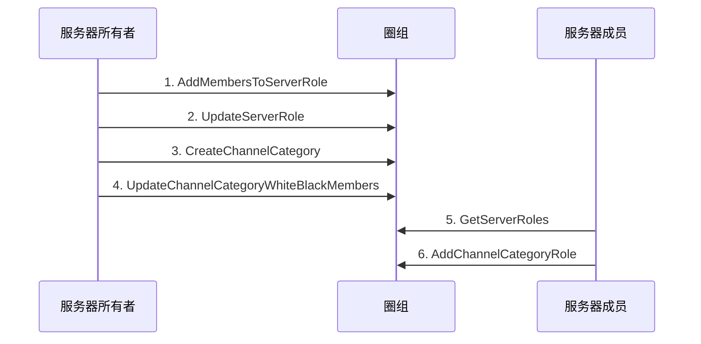

<!--keywords: 频道分组身份组, 频道分组身份组, 身份组 -->


本文以多用户交互的典型场景为例，介绍在频道分组维度对用户进行权限控制的实现方法和示例代码。


## 技术原理

网易云信即时通讯 NIM Windows SDK 的[`Role`](https://docs.netease.im/docs/interface/%E5%8D%B3%E6%97%B6%E9%80%9A%E8%AE%AFWindows%E7%AB%AF/NIMSDKAPI_CPP/html/classnim__qchat_1_1_role.html)类提供管理频道分组身份组的相关方法（如[`AddChannelCategoryRole`](https://docs.netease.im/docs/interface/%E5%8D%B3%E6%97%B6%E9%80%9A%E8%AE%AFWindows%E7%AB%AF/NIMSDKAPI_CPP/html/classnim__qchat_1_1_role.html#a4119f9ff6919066b6835fa19f2ce8035)），助您快速实现在频道分组维度对不同用户的权限控制。 

调用这些方法，需要管理角色的权限（[`NIMQChatPermissions`](https://docs.netease.im/docs/interface/%E5%8D%B3%E6%97%B6%E9%80%9A%E8%AE%AFWindows%E7%AB%AF/NIMSDKAPI_CPP/html/nim__qchat__role__def_8h.html#a0344c718a7e0e182d902db626b376943)枚举中的`kPermissionManageRole`）。

新创建的频道分组身份组的权限，默认继承自指定的服务器身份组（通过服务器身份组的 ID 指定）。如果需要在频道分组维度设置和服务器维度有区分的用户权限，需在创建频道分组身份组后调用[`UpdateChannelCategoryRole`](https://docs.netease.im/docs/interface/%E5%8D%B3%E6%97%B6%E9%80%9A%E8%AE%AFWindows%E7%AB%AF/NIMSDKAPI_CPP/html/classnim__qchat_1_1_role.html#ab6ae440b0eec43da113a0a754cd22c65)方法对权限做更改；或者调用[`AddChannelCategoryMemberRole`](https://docs.netease.im/docs/interface/%E5%8D%B3%E6%97%B6%E9%80%9A%E8%AE%AFWindows%E7%AB%AF/NIMSDKAPI_CPP/html/classnim__qchat_1_1_role.html#ab3768b5950b23f1766077f549859d341)方法创建成员在频道分组的定制权限，再调用[`UpdateChannelCategoryMemberRole`](https://docs.netease.im/docs/interface/%E5%8D%B3%E6%97%B6%E9%80%9A%E8%AE%AFWindows%E7%AB%AF/NIMSDKAPI_CPP/html/classnim__qchat_1_1_role.html#a236a1259009efe9b672631b0278468b9)方法设置具体的权限。


## 实现方法

本节以服务器所有者和服务器成员的交互为例（服务器成员仅被授予管理角色权限的场景），介绍服务器成员**创建频道分组身份组**的实现流程。

::: note note :::
- 服务器所有者可以在创建服务器和频道分组后直接调用[`AddChannelCategoryRole`](https://docs.netease.im/docs/interface/%E5%8D%B3%E6%97%B6%E9%80%9A%E8%AE%AFWindows%E7%AB%AF/NIMSDKAPI_CPP/html/classnim__qchat_1_1_role.html#a4119f9ff6919066b6835fa19f2ce8035)方法创建频道分组身份组。
- 创建后，用户可更新、删除、查询频道分组身份组，相关方法见本文的[API参考](https://doc.yunxin.163.com/docs/TM5MzM5Njk/zc5MDAxNzI?platformId=60227#API参考)。
- 服务器成员**创建频道分组某人的定制权限**的实现，可参考本场景的流程。
:::

### **前提条件**

- 已[接入圈组](https://doc.yunxin.163.com/docs/TM5MzM5Njk/TU1NzExODQ?platformId=60227)，并已创建圈组服务器和身份组。
- 已[创建](https://doc.yunxin.163.com/messaging/docs/jEyMjc5NjI?platform=pc#4-注册-im-账号) 2 个云信 IM 账号，作为下文中服务器所有者和服务器成员的云信 IM 账号。

### **实现流程**

1. 服务器所有者调用[`AddMembersToServerRole`](https://docs.netease.im/docs/interface/%E5%8D%B3%E6%97%B6%E9%80%9A%E8%AE%AFWindows%E7%AB%AF/NIMSDKAPI_CPP/html/classnim__qchat_1_1_role.html#ae6547c89f562e0282892862ddd158a07)方法，将服务器成员加入身份组。
2. 服务器所有者调用[`UpdateServerRole`](https://docs.netease.im/docs/interface/%E5%8D%B3%E6%97%B6%E9%80%9A%E8%AE%AFWindows%E7%AB%AF/NIMSDKAPI_CPP/html/classnim__qchat_1_1_role.html#a73ed1d414d00e26883336acc2e77159a)方法，授予该身份组管理角色的权限（`kPermissionManageRole`）。

    **结果**：
    
    服务器成员将拥有管理角色的权限。
    
3. 服务器所有者调用[`CreateChannelCategory`](https://docs.netease.im/docs/interface/%E5%8D%B3%E6%97%B6%E9%80%9A%E8%AE%AFWindows%E7%AB%AF/NIMSDKAPI_CPP/html/classnim__qchat_1_1_channel_category.html#a0ce2ad97e9176a1e29d625c7a581d017)方法，创建频道分组。
4. 如果创建的是私密频道分组，服务器所有者需调用[`UpdateChannelCategoryWhiteBlackMembers`](https://docs.netease.im/docs/interface/%E5%8D%B3%E6%97%B6%E9%80%9A%E8%AE%AFWindows%E7%AB%AF/NIMSDKAPI_CPP/html/classnim__qchat_1_1_channel_category.html#a661f5cdc8ef49703f72902a8f0563ddc)方法，将该成员加入频道分组白名单。

    ::: note note :::
    如果创建的是公开频道分组，请跳过这一步。
    :::

5. 服务器成员调用[`GetServerRoles`](https://docs.netease.im/docs/interface/%E5%8D%B3%E6%97%B6%E9%80%9A%E8%AE%AFWindows%E7%AB%AF/NIMSDKAPI_CPP/html/classnim__qchat_1_1_role.html#a4a1d08a2e767258ec7efe2978f1b3285)方法，查询目标服务器身份组 ID。

    ::: note notice :::
    如果服务器成员在服务器维度没有管理角色的权限，但在频道分组维度有该权限时，调用`GetServerRoles`方法时传入频道分组 ID（`channel_category_id`）才能查询服务器的身份组列表，进而获取目标服务器身份组 ID。
    :::

6. 服务器成员调用[`AddChannelCategoryRole`](https://docs.netease.im/docs/interface/%E5%8D%B3%E6%97%B6%E9%80%9A%E8%AE%AFWindows%E7%AB%AF/NIMSDKAPI_CPP/html/classnim__qchat_1_1_role.html#a4119f9ff6919066b6835fa19f2ce8035)方法，创建频道分组身份组。 

    入参 | 类型 | 是否必传 | 说明
    ---- | -------------- | ---------
    `server_id` | long | 是 | 频道分组所在的服务器的 ID
    `server_role_id` | long | 是 | 服务器身份组 ID。生成的频道分组身份组从该服务器身份组继承，以此 ID 作为频道身份组的`parentRoleId`
    `channel_category_id` | long | 是 | 频道分组 ID

    ::: note important :::
    服务器成员可通过圈组的内置系统通知（[`NIMQChatSystemNotificationType`](https://docs.netease.im/docs/interface/%E5%8D%B3%E6%97%B6%E9%80%9A%E8%AE%AFWindows%E7%AB%AF/NIMSDKAPI_CPP/html/nim__qchat__system__notification__def_8h.html#a68eb284bba17219f9f003e57d5ae414b)枚举中的`kNIMQChatSystemNotificationTypeChannelCategoryCreate`）获知`channel_category_id`。如服务器成员人数超过目前默认的阈值 2,000（可联系商务经理调整），成员需调用[`Server::Subscribe`](https://docs.netease.im/docs/interface/%E5%8D%B3%E6%97%B6%E9%80%9A%E8%AE%AFWindows%E7%AB%AF/NIMSDKAPI_CPP/html/classnim__qchat_1_1_server.html#a6716a82edd13d3d187a15fbca72549a9)方法订阅服务器才能接收到该系统通知。服务器成员人数在阈值内，则不需要订阅服务器也能接收到。
    :::


### **API 调用时序图**




### **示例代码**

```

// A: add user B to server role
QChatAddMembersToServerRoleParam param;
param.server_id = 123456;
param.role_id = 123456;
param.members_accids = {"B"};
param.cb = [this](const QChatAddMembersToServerRoleResp& resp) {
    if (resp.res_code != NIMResCode::kNIMResSuccess) {
        // error handling
        return;
    }
    // process response
    // ...
};
Role::AddMembersToServerRole(param);

// A: update server role to enable add role to channel category permission
QChatUpdateServerRoleParam param;
param.info.server_id = 123456;
param.info.role_id = 123456;
param.info.permissions[kPermissionManageChannel] = kPermissionSwitchAllow;
param.cb = [this](const QChatUpdateServerRoleResp& resp) {
    if (resp.res_code != NIMResCode::kNIMResSuccess) {
        // error handling
        return;
    }
    // process response
    // ...
};
Role::UpdateServerRole(param);


// B: get server role to add to channel category
QChatGetServerRolesParam param;
param.server_id = 123456;
param.limit = 20;
param.priority = 1;
param.cb = [this](const QChatGetServerRolesResp& resp) {
    if (resp.res_code != NIMResCode::kNIMResSuccess) {
        // error handling
        return;
    }
    // process response
    // ...
};
Role::GetServerRoles(param);

// B: add channel category role
QChatAddChannelCategoryRoleParam param;
param.server_id = 123456;
param.category_id = 123456;
param.parent_role_id = 123456; // server role id
param.cb = [this](const QChatAddChannelCategoryRoleResp& resp) {
    if (resp.res_code != NIMResCode::kNIMResSuccess) {
        // error handling
        return;
    }
    // process response
    // ...
};
Role::AddChannelCategoryRole(param);

// B: update channel category role permission
QChatUpdateChannelCategoryRoleParam param;
param.server_id = 123456;
param.category_id = 123456;
param.role_id = 123456;
param.permissions[kPermissionManageChannel] = kPermissionSwitchAllow;
param.cb = [this](const QChatUpdateChannelCategoryRoleResp& resp) {
    if (resp.res_code != NIMResCode::kNIMResSuccess) {
        // error handling
        return;
    }
    // process response
    // ...
};
Role::UpdateChannelCategoryRole(param);
```


## API参考


| <div style="width:80px">API</div> | <div style="width:120px">说明 </div>|
|:---- | :-------------- |
| [`AddChannelCategoryRole`](https://docs.netease.im/docs/interface/%E5%8D%B3%E6%97%B6%E9%80%9A%E8%AE%AFWindows%E7%AB%AF/NIMSDKAPI_CPP/html/classnim__qchat_1_1_role.html#a4119f9ff6919066b6835fa19f2ce8035) | 创建频道分组身份组。创建后，默认继承服务器身份组的权限。如需更改权限，需调用[`UpdateChannelCategoryRole`](https://docs.netease.im/docs/interface/%E5%8D%B3%E6%97%B6%E9%80%9A%E8%AE%AFWindows%E7%AB%AF/NIMSDKAPI_CPP/html/classnim__qchat_1_1_role.html#ab6ae440b0eec43da113a0a754cd22c65) |
| [`RemoveChannelCategoryRole`](https://docs.netease.im/docs/interface/%E5%8D%B3%E6%97%B6%E9%80%9A%E8%AE%AFWindows%E7%AB%AF/NIMSDKAPI_CPP/html/classnim__qchat_1_1_role.html#a39c1ab8692ac6f71a52ecbdaa70d78c4) | 删除频道分组身份组 |
| [`UpdateChannelCategoryRole`](https://docs.netease.im/docs/interface/%E5%8D%B3%E6%97%B6%E9%80%9A%E8%AE%AFWindows%E7%AB%AF/NIMSDKAPI_CPP/html/classnim__qchat_1_1_role.html#ab6ae440b0eec43da113a0a754cd22c65) | 更新频道分组身份组。设置频道分组身份组的权限，需调用该方法 |
| [`GetChannelCategoryRolesPage`](https://docs.netease.im/docs/interface/%E5%8D%B3%E6%97%B6%E9%80%9A%E8%AE%AFWindows%E7%AB%AF/NIMSDKAPI_CPP/html/classnim__qchat_1_1_role.html#a0ca476c3c9498a8427e049704221404c) | 查询频道分组身份组信息 |
| [`AddChannelCategoryMemberRole`](https://docs.netease.im/docs/interface/%E5%8D%B3%E6%97%B6%E9%80%9A%E8%AE%AFWindows%E7%AB%AF/NIMSDKAPI_CPP/html/classnim__qchat_1_1_role.html#ab3768b5950b23f1766077f549859d341) | 创建频道分组某人的定制权限，创建后还需调用[`UpdateChannelCategoryMemberRole`](https://docs.netease.im/docs/interface/%E5%8D%B3%E6%97%B6%E9%80%9A%E8%AE%AFWindows%E7%AB%AF/NIMSDKAPI_CPP/html/classnim__qchat_1_1_role.html#a2cb9a129f0bbf2cc47bd4174447d30a1)才能授予某人权限 |
| [`RemoveChannelCategoryMemberRole`](https://docs.netease.im/docs/interface/%E5%8D%B3%E6%97%B6%E9%80%9A%E8%AE%AFWindows%E7%AB%AF/NIMSDKAPI_CPP/html/classnim__qchat_1_1_role.html#a34dc7c85cb94f5c2ee6f92a273846a4e) | 删除频道分组某人的定制权限 |
| [`UpdateChannelCategoryMemberRole`](https://docs.netease.im/docs/interface/%E5%8D%B3%E6%97%B6%E9%80%9A%E8%AE%AFWindows%E7%AB%AF/NIMSDKAPI_CPP/html/classnim__qchat_1_1_role.html#a2cb9a129f0bbf2cc47bd4174447d30a1)   |      修改频道分组某人的定制权限。创建某人定制权限后，需再调用本方法才能授予某人权限          |
|  [`GetChannelCategoryMemberRolesPage`](https://docs.netease.im/docs/interface/%E5%8D%B3%E6%97%B6%E9%80%9A%E8%AE%AFWindows%E7%AB%AF/NIMSDKAPI_CPP/html/classnim__qchat_1_1_role.html#a72936624b534e0a239fbe5ee44f55b0c)               |    查询频道分组某人的定制权限       |

  