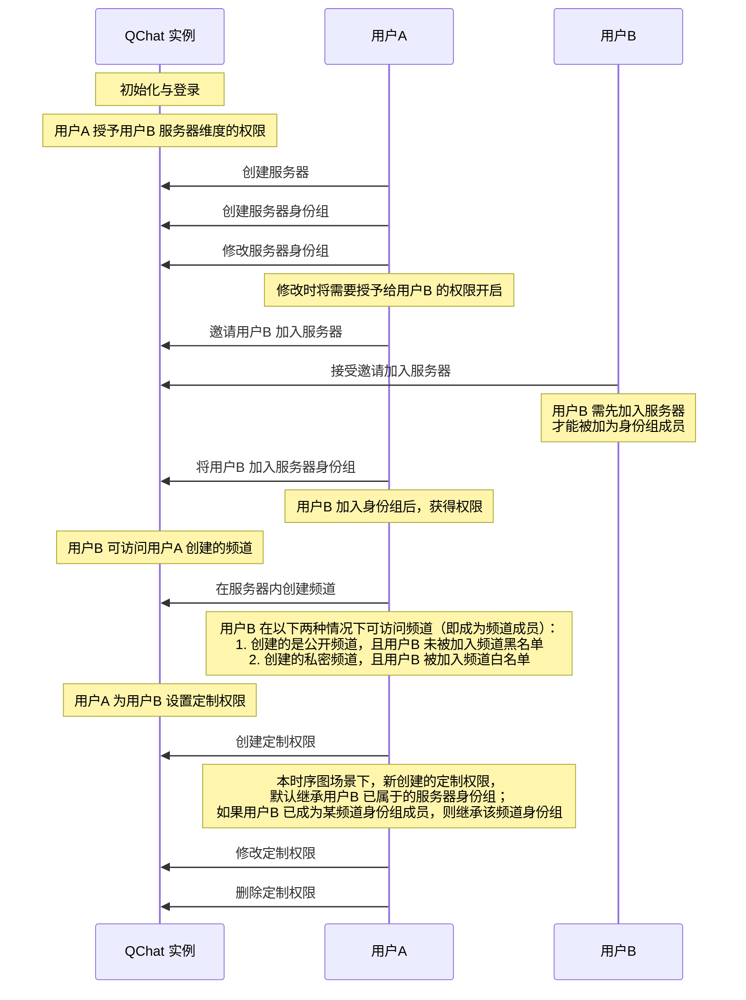

除了可以通过频道身份组对所有身份组成员在频道维度进行权限控制，也可以为某个频道成员专门定制权限，管控其在频道维度的操作。 


## 定制权限数据结构

频道成员定制权限由<a href="https://doc.yunxin.163.com/messaging/references/pc/doxygen/Latest/zh/structnim_1_1_q_chat_member_role_info.html" target="_blank">`QChatMemberRoleInfo`</a>结构体定义，其参数说明如下：


参数 | 类型 |说明
:---- | :-------------- | :---------
`role_id` | uint64_t  |  定制权限所在身份组的ID 
`member_info`| <a href="https://doc.yunxin.163.com/messaging/references/pc/doxygen/Latest/zh/structnim_1_1_q_chat_member_info.html" target="_blank">`QChatMemberInfo`</a> |定制权限的用户信息，包括`server_id`和`accid`等。
`channel_id` | uint64_t  | 成员所属的频道的 ID
`permissions`   |`QChatPermission`| 权限组合，由权限项（<a href="https://doc.yunxin.163.com/messaging/references/pc/doxygen/Latest/zh/nim__qchat__role__def_8h.html#a0344c718a7e0e182d902db626b376943" target="_blank">`NIMQChatPermissions`</a>）和权限开关（<a href="https://doc.yunxin.163.com/messaging/references/pc/doxygen/Latest/zh/nim__qchat__role__def_8h.html#a6e50d6636855c6bb8a2f889e293de55f" target="_blank">`NIMQChatPermissionsOption`</a>）组成。其中权限开关包括开启（`kPermissionSwitchAllow`）、关闭（`kPermissionSwitchDeny`）和继承（`kPermissionSwitchExtend `）三种状态。
`create_time` | uint64_t  |定制权限所在身份组的创建时间
`update_time` | uint64_t   | 定制权限所在身份组的更新时间


## 前提条件

开始调用定制权限相关方法前，请确保已创建频道。


## 实现方法




### 创建定制权限

调用<a href="https://doc.yunxin.163.com/messaging/references/pc/doxygen/Latest/zh/classnim_1_1_role.html#ab505b7f34bab19be3a4f25eaddfe7614" target="_blank">`AddMemberRole`</a> 方法为某个成员创建定制权限。新创建的定制权限配置默认继承自频道身份组相应权限的配置。

::: note notice 
调用该方法必须先拥有`kPermissionManageRole`权限和`kPermissionManageChannel`权限，且必须是该频道的成员。如果没有权限，调用该方法将返回 `403` 错误码。
:::

- 示例代码
    ```
    AddMemberRoleParam param;
    param.server_id = 123456;
    param.channel_id = 123456;
    param.account_id = "accid1";
    param.cb = [this](const AddMemberRoleResp& resp) {
        if (resp.res_code != NIMResCode::kNIMResSuccess) {
            // error handling
            return;
        }
        // process response
        // ...
    };
    Role::AddMemberRole(param);

    ```

### 修改定制权限

调用<a href="https://doc.yunxin.163.com/messaging/references/pc/doxygen/Latest/zh/classnim_1_1_role.html#adca112ca2d42e824aa4c60fd901be807" target="_blank">`UpdateMemberRole`</a>可修改某成员的定制权限。 


::: note notice 
- 调用该方法必须先拥有`kPermissionManageRole`权限和`kPermissionManageChannel`权限，且必须是该频道的成员。如果没有权限，调用该方法将返回 `403` 错误码。
- 用户无法配置自己没有的权限。例如用户没有权限A，则无法修改权限A 的配置。
:::


- 示例代码
    ```
    UpdateMemberRoleParam param;
    param.server_id = 123456;
    param.channel_id = 123456;
    param.account_id = "accid1";
    param.permissions[kPermissionManageChannel] = kPermissionSwitchAllow;
    param.permissions[kPermissionManageRole] = kPermissionSwitchDeny;
    param.permissions[kPermissionSendMessage] = kPermissionSwitchExtend;
    // ...
    param.cb = [this](const UpdateMemberRoleResp& resp) {
        if (resp.res_code != NIMResCode::kNIMResSuccess) {
            // error handling
            return;
        }
        // process response
        // ...
    };
    Role::UpdateMemberRole(param);
    ```

### 删除定制权限

调用<a href="https://doc.yunxin.163.com/messaging/references/pc/doxygen/Latest/zh/classnim_1_1_role.html#ac04bfc0ad033e0e712fe794529a43357" target="_blank">`RemoveMemberRole`</a>方法可将某人的定制权限删除。


::: note notice 
调用该方法必须先拥有`kPermissionManageRole`权限和`kPermissionManageChannel`权限，且必须是该频道的成员。如果没有权限，调用该方法将返回 `403` 错误码。
:::


- 示例代码
    ```
    RemoveMemberRoleParam param;
    param.server_id = 123456;
    param.channel_id = 123456;
    param.account_id = "accid1";
    param.cb = [this](const RemoveMemberRoleResp& resp) {
        if (resp.res_code != NIMResCode::kNIMResSuccess) {
            // error handling
            return;
        }
        // process response
        // ...
    };
    Role::RemoveMemberRole(param);

    ```
