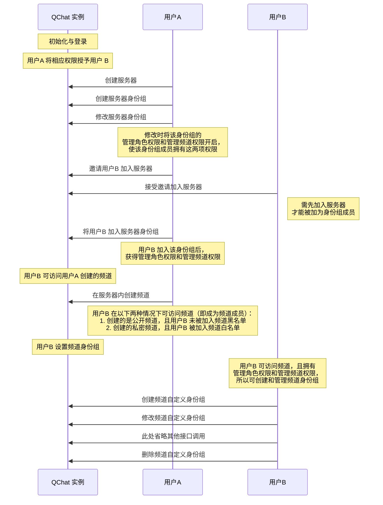
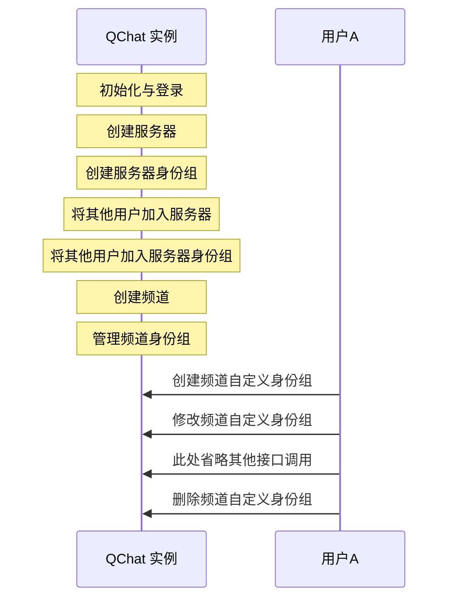

频道身份组用于对用户在频道维度进行权限控制。频道身份组分为两种，@everyone 身份组和自定义身份组。其中 @everyone 身份组在频道创建时默认自动创建，自定义身份组需要用户手动创建。

::: note note
频道下 @everyone 身份组的属性和权限默认继承自服务器的 @everyone 身份组。
:::

## 频道身份组数据结构
频道身份组由<a href="https://doc.yunxin.163.com/messaging/references/pc/doxygen/Latest/zh/structnim_1_1_q_chat_channel_role_info.html" target="_blank">`QChatChannelRoleInfo`</a>结构体定义，其成员参数说明如下：

参数 | 类型 |说明
:---- | :-------------- | :---------
`channel_id` | uint64_t  | 频道身份组所属的频道的 ID
`parent_role_id ` | uint64_t  | 频道身份组所继承的服务器身份组的 ID 
`server_id` | uint64_t | 频道身份组所属服务器的 ID
`role_id`  |  uint64_t  |  频道身份组 ID
`role_name` | std::string 	 	  | 频道身份组名称
`role_icon` | std::string 	 	  | 频道身份组图标的 URL 
`extension`| std::string 	 	  | 频道身份组的扩展字段 
`permissions`   |`QChatPermission`| 身份组权限 map
`role_type`|  <a href="NIMQChatRoleType" target="">`NIMQChatRoleType`</a>    | 身份组的类型，1 表示 @everyone 身份组，2 表示自定义身份组 
`create_time`  | uint64_t  | 频道身份组的创建时间
`update_time` | uint64_t  | 频道身份组的更新时间


## 实现方法

以下两个时序图分别展示了服务器普通成员（用户B）和服务器创建者（用户A）进行频道身份组管理前需要实现的业务逻辑。


服务器普通成员管理频道身份组：



服务器创建者管理频道身份组：




### **创建频道自定义身份组**

默认情况下，频道直接使用服务器身份组来控制权限。如有需要，可调用<a href="https://doc.yunxin.163.com/messaging/references/pc/doxygen/Latest/zh/classnim_1_1_role.html#a9350a84084b8d9dcf10d6ec2ffb0ec08" target="_blank">`AddChannelRole`</a>方法新增一个频道身份组，调用时必须通过`parent_role_id`指定新增的频道身份组继承自哪个服务器身份组。


::: note notice 
调用该方法必须先拥有`kPermissionManageRole`权限和`kPermissionManageChannel`权限，且必须是该频道的成员。如果没有权限，调用该方法将返回 `403` 错误码。
:::


新创建的频道身份组和被继承的服务器身份组有以下关联：


关联 | 说明
---- | -------------- 
成员关联 |公开频道的身份组成员等于被继承的服务器身份组成员去掉频道黑名单成员和频道黑名单身份组成员<br>私密频道的身份组成员是同时存在于频道白名单和被继承的服务器身份组的公共成员
权限关联 | 刚创建时两者权限一样。频道身份组刚创建时所有权限配置都为继承（`kPermissionSwitchExtend`），因此实际权限和被继承的服务器身份组一样，之后可以调用`UpdateChannelRole`方法手动修改，使频道身份组和服务器身份组拥有不一样的权限
其他 | 频道身份组的`parent_role_id`等于被继承的服务器身份组的`role_id`

  


- 示例代码

    ```
    AddChannelRoleParam param;
    param.server_id = 123456;
    param.parent_role_id = 123456; // i.e. server role id
    param.channel_id = params["channel_id"].asUInt64();
    param.cb = [this](const AddChannelRoleResp& resp) {
        if (resp.res_code != NIMResCode::kNIMResSuccess) {
            // error handling
            return;
        }
        // process response
        // ...
    };
    Role::AddChannelRole(param);

    ```


### **修改频道自定义身份组**

调用<a href="https://doc.yunxin.163.com/messaging/references/pc/doxygen/Latest/zh/classnim_1_1_role.html#aa45706a7bdb818d42f2a7117e4833c8c" target="_blank">`UpdateChannelRole`</a>方法可修改频道自定义身份组的权限配置。


::: note notice 
- 调用该方法必须先拥有`kPermissionManageRole`权限和`kPermissionManageChannel`权限，且必须是该频道的成员。如果没有权限，调用该方法将返回 `403` 错误码。
- 用户无法配置自己没有的权限。例如用户没有权限A，则无法修改权限A 的配置。
- 用户无法将自己拥有的某个权限在全部所属身份组中都设置为关闭（`kPermissionSwitchDeny`）。例如用户有 10 个身份组且这 10 各身份组的权限A 都开启，那么用户最多可以将其中 9 个 身份组的权限A 设置为`kPermissionSwitchDeny`。
- 只有修改频道身份组中的权限状态，才会触发系统通知。具体的触发条件和接收条件请参考[圈组系统通知](https://doc.yunxin.163.com/docs/TM5MzM5Njk/TkxMzc1NDg?platformId=60353)。
:::


- 示例代码
    ```
    UpdateChannelRoleParam param;
    param.server_id = params["server_id"].asUInt64();
    param.role_id = params["role_id"].asUInt64();
    param.channel_id = params["channel_id"].asUInt64();
    param.permissions[kPermissionManageChannel] = kPermissionSwitchAllow;
    param.permissions[kPermissionManageRole] = kPermissionSwitchDeny;
    param.permissions[kPermissionSendMessage] = kPermissionSwitchExtend;
    // ...
    param.cb = [this](const UpdateChannelRoleResp& resp) {
        if (resp.res_code != NIMResCode::kNIMResSuccess) {
            // error handling
            return;
        }
        // process response
        // ...
    };
    Role::UpdateChannelRole(param);
    ```

### **删除频道身份组**

调用 <a href="https://doc.yunxin.163.com/messaging/references/pc/doxygen/Latest/zh/classnim_1_1_role.html#aa40f59ba1a606dfab680fc8250c75bdd" target="_blank">`RemoveChannelRole`</a>可删除频道自定义身份组。

::: note notice 
调用该方法必须先拥有`kPermissionManageRole`权限和`kPermissionManageChannel`权限，且必须是该频道的成员。如果没有权限，调用该方法将返回 `403` 错误码。
:::


- 示例代码
    ```
    RemoveChannelRoleParam param;
    param.server_id = 123456;
    param.channel_id = 123456;
    param.role_id = 123456;
    param.cb = [this](const RemoveChannelRoleResp& resp) {
        if (resp.res_code != NIMResCode::kNIMResSuccess) {
            // error handling
            return;
        }
        // process response
        // ...
    };
    Role::RemoveChannelRole(param);
    ```
