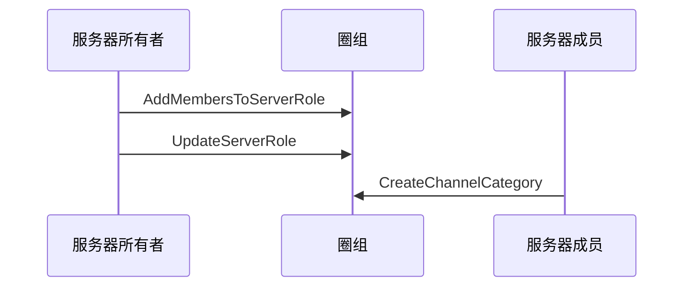

<!--keywords: 频道分组, 创建频道分组, 修改频道分组信息，查询频道分组 -->

本文介绍频道分组的技术原理、创建频道分组的实现方法以及相关示例代码。

## 技术原理

网易云信即时通讯 NIM Windows SDK 的[`NIMQChatChannelCategoryInfo`](https://docs.netease.im/docs/interface/%E5%8D%B3%E6%97%B6%E9%80%9A%E8%AE%AFWindows%E7%AB%AF/NIMSDKAPI_CPP/html/struct_n_i_m_q_chat_channel_category_info.html)结构体定义了频道分组。同时，SDK 的[`ChannelCategory`](https://docs.netease.im/docs/interface/%E5%8D%B3%E6%97%B6%E9%80%9A%E8%AE%AFWindows%E7%AB%AF/NIMSDKAPI_CPP/html/classnim__qchat_1_1_channel_category.html)类提供管理频道分组的相关方法，助您快速实现对频道的分类管理。

频道管理相关方法，基本都需要满足如下两个前提条件才能调用。各方法的具体调用前提，请参见本文的 [API参考](https://doc.yunxin.163.com/docs/TM5MzM5Njk/DUxOTA3NTM?platformId=60227#API参考)。

- 频道分组对用户可见，具体机制见下文的**频道分组可见机制**。
- 拥有管理频道的权限（[`NIMQChatPermission`](https://docs.netease.im/docs/interface/%E5%8D%B3%E6%97%B6%E9%80%9A%E8%AE%AFWindows%E7%AB%AF/NIMSDKAPI_CPP/html/nim__qchat__role__def_8h.html#a0344c718a7e0e182d902db626b376943)枚举中的`kPermissionManageChannel`）。


### **频道分组可见机制**
- 频道分组对**服务器成员**的可见机制与频道的类似，分如下两种情况：


    - 如果频道分组为公开频道分组，那么只要用户未被加入频道分组黑名单，频道分组就对其可见。
    - 如果频道分组为私密频道分组，那么用户需被加入频道分组白名单，频道分组才对其可见。

    ::: note note :::
    频道分组黑白名单相关说明，请参见[频道分组黑白名单](https://doc.yunxin.163.com/docs/TM5MzM5Njk/TAxMDc2ODI?platformId=60227)。
    :::
- 频道分组是否对**游客**可见，取决于频道分组内是否有频道对游客可见。如果频道分组内有频道对游客可见，则该频道分组对游客也可见。频道是否对游客可见由`visitor_mode`决定，可在创建频道和修改频道时设置，具体见[频道管理](https://doc.yunxin.163.com/messaging/docs/jczMzcwOTE?platform=pc)。

    <note type=notice>如果频道的 `visitor_mode` 为跟随模式，且同步模式（`sync_mode`）为“与频道分组同步”，则当该频道所属的频道分组的查看模式（`view_mode`）变更后，该频道对游客的可见性也将变更。例如，在这种情况下，频道分组的查看模式由公开变为私密，则此时该频道对游客从“可见”变为“不可见”。</note>


### **频道分组与频道的关联逻辑**

频道管理相关方法（如[`CreateChannel`](https://docs.netease.im/docs/interface/%E5%8D%B3%E6%97%B6%E9%80%9A%E8%AE%AFWindows%E7%AB%AF/NIMSDKAPI_CPP/html/classnim__qchat_1_1_channel.html#ad5e782aaf1aab8861fbced11311ae252)）的入参包含`category_id`和`sync_mode`。在调用[`CreateChannel`](https://docs.netease.im/docs/interface/%E5%8D%B3%E6%97%B6%E9%80%9A%E8%AE%AFWindows%E7%AB%AF/NIMSDKAPI_CPP/html/classnim__qchat_1_1_channel.html#ad5e782aaf1aab8861fbced11311ae252)时传入`category_id`可将频道加入某个频道分组；通过设置`sync_mode`，可实现频道数据与频道分组数据的同步。具体同步的数据包括查看模式（私密或公开）、黑白名单和身份组权限。


<div style="width:80px">参数</div> | <div style="width:80px">类型</div> |<div style="width:120px">说明 </div>
:---- | :-------------- |:--------------
`category_id` | long | 频道需加入或所在的频道分组 ID。设置为 `0` 表示频道没有频道分组。设置为频道分组 ID 表示归属某个频道分组  
`sync_mode` |   [`NIMQChatChannelSyncMode`](https://docs.netease.im/docs/interface/%E5%8D%B3%E6%97%B6%E9%80%9A%E8%AE%AFWindows%E7%AB%AF/NIMSDKAPI_CPP/html/nim__qchat__public__def_8h.html#a484de2cc6ea31546aef9ec24df3da52b)    |   <div>频道同步模式 <ul><li>传`kNIMQChatChannelSyncModeSync`同步</li><li>传`kNIMQChatChannelSyncModeNoSync`不同步</li><li>不传默认不同步</li><li>如果频道查看模式、黑白名单、身份组权限等被修改，自动改为不同步</li> </ul> </div>            

::: note notice :::
归属于单个频道分组的频道数量上限为 50。
:::


### **频道分组与服务器的关联逻辑**

定义了服务器的[`NIMQChatServerInfo`](https://docs.netease.im/docs/interface/%E5%8D%B3%E6%97%B6%E9%80%9A%E8%AE%AFWindows%E7%AB%AF/NIMSDKAPI_CPP/html/struct_n_i_m_q_chat_server_info.html)结构体中包含`channel_category_count`参数，该参数表示服务器内频道分组的数量。 

::: note notice :::
服务器内频道分组数量上限为 100。
:::

### **频道分组与系统通知的关联逻辑**

频道分组相关事件的系统通知为 SDK 内置系统通知，在[`NIMQChatSystemNotificationType`](https://docs.netease.im/docs/interface/%E5%8D%B3%E6%97%B6%E9%80%9A%E8%AE%AFWindows%E7%AB%AF/NIMSDKAPI_CPP/html/nim__qchat__system__notification__def_8h.html#a68eb284bba17219f9f003e57d5ae414b)枚举内定义。具体类型及相关的触发和接收条件见下表。

<div style="width:100px">系统通知类型</div> | <div style="width:120px">触发条件</div> | <div style="width:400px">接收条件</div> 
:---- | :-------------- | :--------- |:--------
`kNIMQChatSystemNotificationTypeChannelCategoryCreate` | 频道分组成功创建时  | <div><ul><li>服务器创建者和所有者：在线</li><li>其他成员：服务器成员数量低于 2,000 人阈值时只需要在线。如大于 2,000，需在线且订阅服务器</li></ul> </div>
`kNIMQChatSystemNotificationTypeChannelCategoryRemove` |  频道分组被删除时   | <div><ul><li>删除者和服务器所有者：在线</li><li>其他成员：服务器成员数量低于 2,000 人阈值时只需要在线。如大于 2,000，需在线且订阅服务器</li></ul> </div>
`kNIMQChatSystemNotificationTypeChannelCategoryUpdate `| 频道分组信息被修改时 | <div><ul><li>修改者和服务器所有者：在线</li><li>其他成员：服务器成员数量低于 2,000 人阈值时只需要在线。如大于 2,000，需在线且订阅服务器</li></ul> </div>
`kNIMQChatSystemNotificationTypeChannelCategoryWhiteBlackRoleUpdate`|  频道分组黑白名单身份组被修改时  |   <div><ul><li>修改者、服务器所有者和身份组成员（身份组成员限制 100 人）：在线</li><li>其他成员：服务器成员数量低于 2,000 人阈值时只需要在线。如大于 2,000，需在线且订阅服务器</li></ul> </div>
`kNIMQChatSystemNotificationTypeChannelCategoryWhiteBlackMembersUpdate`| 频道分组黑白名单成员被修改时 |   <div><ul><li>修改者、服务器所有者和被加入/移出黑白名单的用户：在线</li><li>其他成员：服务器成员数量低于 2,000 人阈值时只需要在线。如大于 2,000，需在线且订阅服务器</li></ul> </div>

::: note note :::
2,000 人阈值可联系商务经理调整。
::: 


## 实现方法

本节以服务器所有者（即创建者）和服务器成员的交互为例，介绍服务器成员**创建频道分组**的实现流程。

::: note note :::
- 服务器所有者拥有全局权限，可以在创建服务器后直接调用[`CreateChannelCategory`](https://docs.netease.im/docs/interface/%E5%8D%B3%E6%97%B6%E9%80%9A%E8%AE%AFWindows%E7%AB%AF/NIMSDKAPI_CPP/html/classnim__qchat_1_1_channel_category.html#a0ce2ad97e9176a1e29d625c7a581d017)方法创建频道分组。
- 用户创建频道分组后， 可对频道分组做更新、删除、修改和查询等操作，相关可调用的方法请参见本文的[API参考](https://doc.yunxin.163.com/docs/TM5MzM5Njk/DUxOTA3NTM?platformId=60227#API参考)。
:::

### **前提条件**

- 已[接入圈组](https://doc.yunxin.163.com/docs/TM5MzM5Njk/TU1NzExODQ?platformId=60227)，并已创建圈组服务器和身份组。
- 已[创建](https://doc.yunxin.163.com/docs/TM5MzM5Njk/Dc2NTM1NzI?platformId=60353#%E5%88%9B%E5%BB%BA%E7%BD%91%E6%98%93%E4%BA%91%E4%BF%A1IM%E8%B4%A6%E5%8F%B7) 2 个云信 IM 账号，作为下文中服务器所有者和服务器成员的云信 IM 账号。

### **实现流程**

1. 服务器所有者调用[`AddMembersToServerRole`](https://docs.netease.im/docs/interface/%E5%8D%B3%E6%97%B6%E9%80%9A%E8%AE%AFWindows%E7%AB%AF/NIMSDKAPI_CPP/html/classnim__qchat_1_1_role.html#ae6547c89f562e0282892862ddd158a07)方法，将服务器成员加入身份组。
2. 服务器所有者调用[`UpdateServerRole`](https://docs.netease.im/docs/interface/%E5%8D%B3%E6%97%B6%E9%80%9A%E8%AE%AFWindows%E7%AB%AF/NIMSDKAPI_CPP/html/classnim__qchat_1_1_role.html#a73ed1d414d00e26883336acc2e77159a)方法，授予该身份组管理频道的权限（`NIMQChatPermissionType`）。
3. 服务器成员调用[`CreateChannelCategory`](https://docs.netease.im/docs/interface/%E5%8D%B3%E6%97%B6%E9%80%9A%E8%AE%AFWindows%E7%AB%AF/NIMSDKAPI_CPP/html/classnim__qchat_1_1_channel_category.html#a0ce2ad97e9176a1e29d625c7a581d017)方法创建频道分组。

### **API 调用时序图**


### **示例代码**

```

// A: add user B to server role
QChatAddMembersToServerRoleParam param;
param.server_id = 123456;
param.role_id = 123456;
param.members_accids = {"B"};
param.cb = [this](const QChatAddMembersToServerRoleResp& resp) {
    if (resp.res_code != NIMResCode::kNIMResSuccess) {
        // error handling
        return;
    }
    // process response
    // ...
};
Role::AddMembersToServerRole(param);

// A: update server role to enable create channel category permission
QChatUpdateServerRoleParam param;
param.info.server_id = 123456;
param.info.role_id = 123456;
param.info.permissions[kPermissionManageChannel] = kPermissionSwitchAllow;
param.cb = [this](const QChatUpdateServerRoleResp& resp) {
    if (resp.res_code != NIMResCode::kNIMResSuccess) {
        // error handling
        return;
    }
    // process response
    // ...
};
Role::UpdateServerRole(param);


// B: now B has permission to create channel category
QChatChannelCategoryCreateParam param;
param.server_id = 123456;
param.name = "channel category name";
param.custom = "channel category custom";
param.view_mode = kNIMQChatChannelViewModePublic;
param.cb = [this](const QChatChannelCategoryCreateResp& resp) {
    if (resp.res_code != NIMResCode::kNIMResSuccess) {
        // error handling
        return;
    }
    // process response
    // ...
};
ChannelCategory::CreateChannelCategory(param);
```


## API参考

 <div style="width:80px">API</div> | <div style="width:120px">调用前提 </div>| <div style="width:120px">说明</div>
 :---- | :-------------- |:--------
 [`CreateChannelCategory`](https://docs.netease.im/docs/interface/%E5%8D%B3%E6%97%B6%E9%80%9A%E8%AE%AFWindows%E7%AB%AF/NIMSDKAPI_CPP/html/classnim__qchat_1_1_channel_category.html#a0ce2ad97e9176a1e29d625c7a581d017) |  用户拥有管理频道的权限        |   创建频道分组
   [`RemoveChannelCategory`](https://docs.netease.im/docs/interface/%E5%8D%B3%E6%97%B6%E9%80%9A%E8%AE%AFWindows%E7%AB%AF/NIMSDKAPI_CPP/html/classnim__qchat_1_1_channel_category.html#ab574525478d3f36dd755147ff6c47755)            |    频道分组对用户可见，且用户拥有管理频道的权限      | 删除频道分组
   [`UpdateChannelCategory`](https://docs.netease.im/docs/interface/%E5%8D%B3%E6%97%B6%E9%80%9A%E8%AE%AFWindows%E7%AB%AF/NIMSDKAPI_CPP/html/classnim__qchat_1_1_channel_category.html#a7573bebbe0bf2c69cb819a3e385cbc63)            |    频道分组对用户可见，且用户拥有管理频道的权限      | 修改频道分组信息
   [`GetChannelCategoriesByID`](https://docs.netease.im/docs/interface/%E5%8D%B3%E6%97%B6%E9%80%9A%E8%AE%AFWindows%E7%AB%AF/NIMSDKAPI_CPP/html/classnim__qchat_1_1_channel_category.html#a0e76f722141ce4e7ced900e8e2bd3367)            |    无     | 按分组 ID 查询频道分组
   [`GetChannelCategoryChannelsPage`](https://docs.netease.im/docs/interface/%E5%8D%B3%E6%97%B6%E9%80%9A%E8%AE%AFWindows%E7%AB%AF/NIMSDKAPI_CPP/html/classnim__qchat_1_1_channel_category.html#a89e6897129dd8f22b5c1b815fe6f8763)  |    频道分组对用户可见，且用户拥有管理频道的权限      |  分页查询频道分组下频道列表
   [`GetChannelCategoriesPage`](https://docs.netease.im/docs/interface/%E5%8D%B3%E6%97%B6%E9%80%9A%E8%AE%AFWindows%E7%AB%AF/NIMSDKAPI_CPP/html/classnim__qchat_1_1_channel_category.html#a181ac73f8b337670fe88f3ea8b1bf9e9) | 频道分组对用户可见，且用户拥有管理频道的权限 | 分页查询频道分组列表