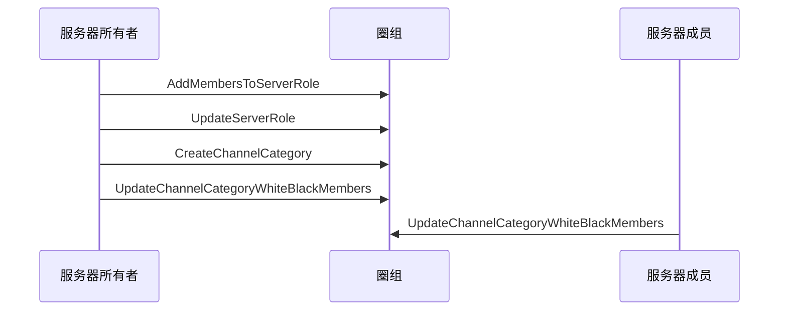

<!--keywords: 频道分组黑白名单, 黑白名单, 频道分组 -->

本文介绍频道分组黑白名单的技术原理、实现方法以及相关的示例代码。


## 技术原理

网易云信即时通讯 NIM Windows SDK 的[`ChannelCategory`](https://docs.netease.im/docs/interface/%E5%8D%B3%E6%97%B6%E9%80%9A%E8%AE%AFWindows%E7%AB%AF/NIMSDKAPI_CPP/html/classnim__qchat_1_1_channel_category.html)类提供管理频道分组黑白名单（包括名单成员和名单身份组）的方法。

### **频道分组可见机制**

频道分组黑白名单与频道分组类型（公开/私密）共同判定频道分组是否对服务器成员可见。

- 公开频道分组：如果服务器成员被加入公开频道分组的黑名单或黑名单身份组，那么该频道分组对该成员不可见，反之可见。
- 私密频道分组：如果服务器成员被加入私密频道分组的白名单或白名单身份组，那么该频道分组对该成员可见，反之不可见。

### **权限要求**

调用管理频道黑白名单的相关方法，需要管理黑白名单的权限（即[`NIMQChatPermissions`](https://docs.netease.im/docs/interface/%E5%8D%B3%E6%97%B6%E9%80%9A%E8%AE%AFWindows%E7%AB%AF/NIMSDKAPI_CPP/html/nim__qchat__role__def_8h.html#a0344c718a7e0e182d902db626b376943)枚举中的`kPermissionManageBlackWhiteList`）

## 实现方法

本节以服务器所有者和服务器成员的交互为例，介绍**服务器成员**更新频道分组黑白名单的实现流程。

::: note note :::
- 更新频道分组黑白名单身份组的实现流程，与更新黑白名单的实现流程类似，本文不做详细介绍。
- 服务器所有者拥有全量权限，可直接调用[`UpdateChannelCategoryWhiteBlackMembers`](https://docs.netease.im/docs/interface/%E5%8D%B3%E6%97%B6%E9%80%9A%E8%AE%AFWindows%E7%AB%AF/NIMSDKAPI_CPP/html/classnim__qchat_1_1_channel_category.html#a661f5cdc8ef49703f72902a8f0563ddc)和[`UpdateChannelCategoryWhiteBlackRoles`](https://docs.netease.im/docs/interface/%E5%8D%B3%E6%97%B6%E9%80%9A%E8%AE%AFWindows%E7%AB%AF/NIMSDKAPI_CPP/html/classnim__qchat_1_1_channel_category.html#ac248934d755b4a803d7f4ae1079a8c03)方法分别更新频道分组黑白名单和黑白名单身份组。
- 用户更新频道分组黑白名单身份组/成员后，可查询黑白名单身份组/成员。相关方法请参见本文的[API参考](https://doc.yunxin.163.com/docs/TM5MzM5Njk/TAxMDc2ODI?platformId=60227#API参考)。
:::

### **前提条件**

- 已[接入圈组](https://doc.yunxin.163.com/docs/TM5MzM5Njk/TU1NzExODQ?platformId=60227)，并已创建圈组服务器和身份组。
- 已[注册](https://doc.yunxin.163.com/messaging/docs/jEyMjc5NjI?platform=pc#4-注册-im-账号) 2 个云信 IM 账号，作为下文中服务器所有者和服务器成员的云信 IM 账号。

### **实现流程**

1. 服务器所有者调用[`AddMembersToServerRole`](https://docs.netease.im/docs/interface/%E5%8D%B3%E6%97%B6%E9%80%9A%E8%AE%AFWindows%E7%AB%AF/NIMSDKAPI_CPP/html/classnim__qchat_1_1_role.html#ae6547c89f562e0282892862ddd158a07)方法，将服务器成员加入身份组。
2. 服务器所有者调用[`UpdateServerRole`](https://docs.netease.im/docs/interface/%E5%8D%B3%E6%97%B6%E9%80%9A%E8%AE%AFWindows%E7%AB%AF/NIMSDKAPI_CPP/html/classnim__qchat_1_1_role.html#a73ed1d414d00e26883336acc2e77159a)方法，授予该身份组管理黑白名单的权限。

    **结果**：
    
    服务器成员将拥有管理黑白名单的权限。
3. 服务器所有者调用[`CreateChannelCategory`](https://docs.netease.im/docs/interface/%E5%8D%B3%E6%97%B6%E9%80%9A%E8%AE%AFWindows%E7%AB%AF/NIMSDKAPI_CPP/html/classnim__qchat_1_1_channel_category.html#a0ce2ad97e9176a1e29d625c7a581d017)创建频道分组。
4. 如果创建的是私密频道分组，服务器所有者需调用[`UpdateChannelCategoryWhiteBlackMembers`](https://docs.netease.im/docs/interface/%E5%8D%B3%E6%97%B6%E9%80%9A%E8%AE%AFWindows%E7%AB%AF/NIMSDKAPI_CPP/html/classnim__qchat_1_1_channel_category.html#a661f5cdc8ef49703f72902a8f0563ddc)将成员加入频道分组白名单。
5. 服务器成员调用[`UpdateChannelCategoryWhiteBlackMembers`](https://docs.netease.im/docs/interface/%E5%8D%B3%E6%97%B6%E9%80%9A%E8%AE%AFWindows%E7%AB%AF/NIMSDKAPI_CPP/html/classnim__qchat_1_1_channel_category.html#a661f5cdc8ef49703f72902a8f0563ddc)更新频道分组的黑白名单成员。

### **API 调用时序图**



### **示例代码**

::: note note :::
以下示例代码中的 A 代表服务器所有者，B 代表服务器成员。
:::

```
// A: create server role
QChatCreateServerRoleParam param;
param.info.server_id = 123456;
param.info.role_name = "role name";
param.info.role_icon = "role icon url";
param.info.extension = "extension";
param.info.role_type = kRoleTypeCustom;
param.info.priority = 1;
param.anti_spam_info.text_bid = "anti spam text business id";
param.anti_spam_info.pic_bid = "anti spam pic business id";
param.cb = [this](const QChatCreateServerRoleResp& resp) {
    if (resp.res_code != NIMResCode::kNIMResSuccess) {
        // error handling
        return;
    }
    // process response
    // ...
};
Role::CreateServerRole(param);
// A: update server role to enable add role to channel category permission
QChatUpdateServerRoleParam param;
param.info.server_id = 123456;
param.info.role_id = 123456;
param.info.permissions[kPermissionManageBlackWhiteList] = kPermissionSwitchAllow;
param.cb = [this](const QChatUpdateServerRoleResp& resp) {
    if (resp.res_code != NIMResCode::kNIMResSuccess) {
        // error handling
        return;
    }
    // process response
    // ...
};
Role::UpdateServerRole(param);
// A: add user B to server role
QChatAddMembersToServerRoleParam param;
param.server_id = 123456;
param.role_id = 123456;
param.members_accids = {"B"};
param.cb = [this](const QChatAddMembersToServerRoleResp& resp) {
    if (resp.res_code != NIMResCode::kNIMResSuccess) {
        // error handling
        return;
    }
    // process response
    // ...
};
Role::AddMembersToServerRole(param);
// B: update channel category white/black roles
QChatChannelCategoryUpdateWhiteBlackRoleParam param;
param.server_id = 123456;
param.category_id = 123456;
param.role_id = 123456;
param.type = kNIMQChatChannelBlack;
param.ope_type = kNIMQChatChannelWhiteBlackOpeTypeAdd;
param.cb = [this](const QChatChannelCategoryUpdateWhiteBlackRoleResp& resp) {
    if (resp.res_code != NIMResCode::kNIMResSuccess) {
        // error handling
        return;
    }
    // process response
    // ...
};
ChannelCategory::UpdateChannelCategoryWhiteBlackRole(param);
// B: update channel category white/black members
QChatChannelCategoryUpdateWhiteBlackMembersParam param;
param.server_id = params["server_id"].asUInt64();
param.category_id = params["category_id"].asUInt64();
param.accids = {"C", "D"};
param.type = kNIMQChatChannelBlack;
param.ope_type = kNIMQChatChannelWhiteBlackOpeTypeAdd;
param.cb = [this](const QChatChannelCategoryUpdateWhiteBlackMembersResp& resp) {
    if (resp.res_code != NIMResCode::kNIMResSuccess) {
        // error handling
        return;
    }
    // process response
    // ...
};
ChannelCategory::UpdateChannelCategoryWhiteBlackMembers(param);
```

## API参考

| <div style="width:80px">API</div> | <div style="width:120px">说明 </div>|
|:---- | :-------------- |
| [`UpdateChannelCategoryWhiteBlackRole`](https://docs.netease.im/docs/interface/%E5%8D%B3%E6%97%B6%E9%80%9A%E8%AE%AFWindows%E7%AB%AF/NIMSDKAPI_CPP/html/classnim__qchat_1_1_channel_category.html#ac248934d755b4a803d7f4ae1079a8c03) | 更新频道分组黑白名单身份组 |
| [`GetExistingChannelCategoryWhiteBlackRoles`](https://docs.netease.im/docs/interface/%E5%8D%B3%E6%97%B6%E9%80%9A%E8%AE%AFWindows%E7%AB%AF/NIMSDKAPI_CPP/html/classnim__qchat_1_1_channel_category.html#a938d17c225add7ea25162e8db9c1cb53) |根据身份组 ID 查询频道分组白/黑名单身份组列表 |
| [`GetChannelCategoryWhiteBlackRolesPage`](https://docs.netease.im/docs/interface/%E5%8D%B3%E6%97%B6%E9%80%9A%E8%AE%AFWindows%E7%AB%AF/NIMSDKAPI_CPP/html/classnim__qchat_1_1_channel_category.html#a87c0d90812709251c1cb0f6727387395) | 分页查询频道分组黑白名单身份组列表 |
| [`UpdateChannelCategoryWhiteBlackMembers`](https://docs.netease.im/docs/interface/%E5%8D%B3%E6%97%B6%E9%80%9A%E8%AE%AFWindows%E7%AB%AF/NIMSDKAPI_CPP/html/classnim__qchat_1_1_channel_category.html#a661f5cdc8ef49703f72902a8f0563ddc) | 更新频道分组白/黑名单成员 |
| [`GetExistingChannelCategoryWhiteBlackMembers`](https://docs.netease.im/docs/interface/%E5%8D%B3%E6%97%B6%E9%80%9A%E8%AE%AFWindows%E7%AB%AF/NIMSDKAPI_CPP/html/classnim__qchat_1_1_channel_category.html#a7b7d96c8f3f5f32fac1f3730200e130d) | 根据成员 ID 查询频道分组黑白名单列表 |
| [`GetChannelCategoryWhiteBlackMembersPage`](https://docs.netease.im/docs/interface/%E5%8D%B3%E6%97%B6%E9%80%9A%E8%AE%AFWindows%E7%AB%AF/NIMSDKAPI_CPP/html/classnim__qchat_1_1_channel_category.html#a719183a38ee76f9a2902d781056ff691) | 分页查询频道分组白/黑名单成员列表 |

