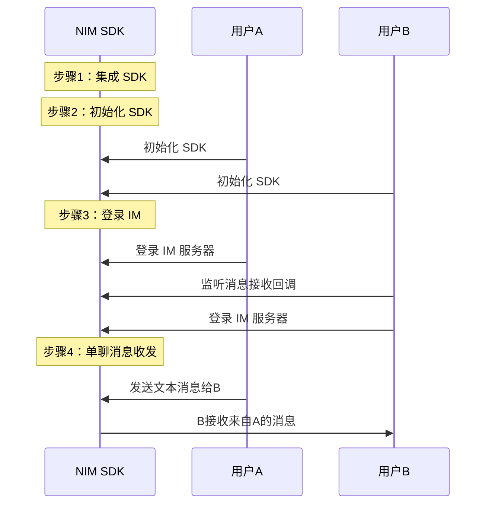

<!-- keywords: 即时通讯,IM,基本功能,消息收发,实现 -->

网易云信 IM 即时通讯服务提供一整套即时通讯基础能力，助您快速实现多样化的即时通讯场景。

本文主要介绍通过集成 NetEase IM SDK（NIM SDK）并调用 API，快速实现单聊消息收发功能。

::: note note
- 群聊消息收发需要先进入群组，后续流程与单聊消息收发相同。
- 超大群、聊天室和圈组的消息收发，需单独配置。
:::

## 使用前准备

- NIM SDK 兼容的系统包括 Windows 7、Windows 8/8.1、Windows 10、macOS 10.10（仅支持 x86_64 架构，不支持 i386）。SDK 从V3.2.5版本开始全面支持32位和64位程序接入。

- 已在云信控制台[创建应用](https://doc.yunxin.163.com/console/docs/TIzMDE4NTA?platform=console)，获取 App Key。
- 已[注册云信 IM 账号](https://doc.yunxin.163.com/messaging/docs/jEyMjc5NjI?platform=pc#4-注册-im-账号)，获取 accid 和 token。

## 实现流程

### 流程概览

实现单聊消息收发的流程，可分为下图所示的 4 大步骤。




### 步骤 1：集成 SDK

::: note note
自 V8.4.0 版本起，对目录进行了调整，C++ 封装层使用 CMake 进行管理，根据不同的情况，在接入 C++ 封装层时可能需要适当的修改。
:::

目录可拆分为如下结构：
```
├─bin
├─include
├─lib
└─wrapper
```
- `bin` 目录存放 NIM C SDK 的动态库文件
- `include` 目录存放了 NIM C SDK 的导出头文件
- `lib` 目录存放了 NIM C SDK 的动态库符号链接文件
- `wrapper` 目录存放了 C++ 封装层的源代码（含头文件）

这里主要介绍以 CMake 工程接入的方式，更多接入方式（包括 VS、Qt、Xcode等传统方式）请参见<a href="https://doc.yunxin.163.com/docs/TM5MzM5Njk/TY1OTIzODA?platformId=60227" target="_blank">集成方式</a>。

1. 使用 `ADD_SUBDIRECTORY` 命令将 `wrapper` 目录添加为子目录。

2. 使用 `INCLUDE_DIRECTORIES` 方法将 `include` 和 `wrapper` 文件夹添加为头文件搜索路径。

3. 根据您的执行目标使用 `TARGET_LINK_LIBRARIES` 按需添加链接库即可。链接库如下：

    - `nim_cpp_wrapper` NIM C++ 封装层库
    - `nim_chatroom_cpp_wrapper` Chatroom C++ 封装层库
    - `nim_wrapper_util` NIM 及 Chatroom C++ 封装层库通用的工具库
    - `nim_tools_cpp_wrapper` NIM HTTP 组件 C++ 封装层库
    - `nim_qchat_cpp_wrapper` NIM QChat 圈组 C++ 封装层库


::: note notice
- 不建议将 CMake 产生的工程文件直接引用到项目中使用，因为 CMake 使用将绝对路径写入到工程的配置文件（`.vcxproj`）中，您在自己设备上生成的工程文件无法在其他设备中顺利编译。
- 如果您的工程项目已经是基于 CMake 管理，则只需将 `wrapper` 工程作为您主项目的依赖即可，其他无需任何多余配置。如果您的工程项目不是基于 CMake 管理的，那么建议您在持续集成（Continuous Integration, CI） 或者与其他同事协作时，通过自定义脚本在项目编译前始终执行 CMake 来生成并编译工程得到需要的二进制文件产物。
:::

### 步骤 2：初始化 SDK

将 SDK 集成到客户端后，需要先完成 SDK 的初始化才能使用其他功能。

这里主要以 C++ 的代码形式实现初始化。

1. 将 SDK 相关的 dll 文件（nim.dll，nim_audio.dll, nim_tools_http.dll, nrtc.dll）放至 App 的运行目录下。

::: note note 
SDK 基于vs2017+vs2013 开发，如果 App 没有对应的运行时库文件，请将 `redist_packages`文件夹中动态库及 `msvcp120.dll` 和 `msvcr120.dll` 放至 App 的运行目录下。
:::

2. 在项目文件中引入头文件。
```
#include <nim_cpp_wrapper/nim_cpp_api.h>
```

3. 调用<a href="https://doc.yunxin.163.com/messaging/references/pc/doxygen/Latest/zh/classnim_1_1_client.html#ad107cfd26954bb8d7d1f9e1951c19b67" target="_blank">`nim::Client::Init`</a>方法进行初始化。

示例代码如下：
```
nim::SDKConfig config;
//组装SDK能力参数（必填）
config.database_encrypt_key_ = "Netease";	 //string（db key必填，目前只支持最多32个字符的加密密钥，建议使用32个字符）
// 载入网易云信sdk，初始化安装目录和用户目录，第一个参数是App Key
bool ret = nim::Client::Init("45c6af****d0bdd6e", "Netease", "", config);
```

参数列表如下：

参数	|类型	|必须	|说明
:-----|:------|:--------|:--------
|`app_key(C++)`|	std::string	|是	|应用注册的云信 App Key
|`app_data_dir`	|std::string	|是	|使用默认路径时只需传入单个目录名(不以反斜杠结尾)，使用自定义路径时需传入完整路径(以反斜杠结尾，并确保有正确的读写权限)
|`app_install_dir`|	std::string	|否	|SDK动态库所在的目录全路径(如果传入为空，则按照默认规则搜索该动态库)
|<a href="https://doc.yunxin.163.com/messaging/references/pc/doxygen/Latest/zh/structnim_1_1_s_d_k_config.html" target="_blank">`config`</a>|	struct	|否	|初始化特殊参数

::: note note
更多初始化相关说明，请参见<a href="https://doc.yunxin.163.com/docs/TM5MzM5Njk/zE1MTQwMTY?platformId=60227" target="_blank">初始化</a>。
:::

### 步骤 3：登录 IM 服务器

这里主要以 C++ 的代码形式实现登录。

调用 <a href="https://doc.yunxin.163.com/messaging/references/pc/doxygen/Latest/zh/classnim_1_1_client.html#a0e8d4b3f4cfcad3cd4bdffd98bdba4c4" target="_blank"> `nim::Client::Login	`</a> 方法进行手动登录。示例代码如下：

```
void OnLoginCallback(const nim::LoginRes& login_res)
{
	if (login_res.res_code_ == nim::kNIMResSuccess)
	{
		if (login_res.login_step_ == nim::kNIMLoginStepLogin)
		{
			···
		}
	}
	else
	{
		···
	}
}
nim::Client::Login(app_key, "app account", "token", &OnLoginCallback);

```

参数列表如下：

参数	|类型	|必须	|说明
:-----|:------|:--------|:--------
app_key|	string	|是	|注册的云信 App Key
account|	string|	是	|账号
password	|string	|是	|密码，即 token
cb|	<a href="https://doc.yunxin.163.com/messaging/references/pc/doxygen/Latest/zh/classnim_1_1_client.html#a980acea3b3c27e7e85867ccb43939814" target="_blank">`LoginCallback`</a>	|是	|登录流程的回调函数
json_extension|	string	|否	|JSON扩展参数

::: note note 
更多登录相关说明，请参见<a href="https://doc.yunxin.163.com/docs/TM5MzM5Njk/jQ4NDI2MDI?platformId=60227" target="_blank">登录登出</a>。
:::


### 步骤 4：单聊消息收发

本节以用户 A 和用户 B 的消息交互为例，介绍快速实现单聊消息收发的流程。更多消息类型的收发，请参见<a href="https://doc.yunxin.163.com/docs/TM5MzM5Njk/Tg4OTM3ODM?platformId=60227" target="_blank">消息收发</a>。

1. 用户 B 调用 <a href="https://doc.yunxin.163.com/messaging/references/pc/doxygen/Latest/zh/classnim_1_1_talk.html#afd2bcaa9d06340be1277ef3fa58b0708" target="_blank">` nim::Talk::RegReceiveCb`</a> 方法注册接收消息回调。示例代码如下：

```
void OnReceiveMsgCallback(const nim::IMMessage& msg)
{
	// process msg
}
nim::Talk::RegReceiveCb(OnReceiveMsgCallback);
```
2. 用户 A 调用 <a href="https://doc.yunxin.163.com/messaging/references/pc/doxygen/Latest/zh/classnim_1_1_talk.html#a297d3d62db242907a34c33867b9d1017" target="_blank">` nim::Talk::CreateTextMessage`</a> 方法构建一条文本消息，然后调用 <a href="https://doc.yunxin.163.com/messaging/references/pc/doxygen/Latest/zh/classnim_1_1_talk.html#a174ce306d735cd89d8059510d00859d5"  target="_blank">`nim::Talk::SendMsg`</A> 方法将消息发送给 B。示例代码如下：

```
nim::MessageSetting settings;
// configure setting...
std::string json_msg = nim::Talk::CreateTextMessage("accid", nim::kNIMSessionTypeP2P, "", "this is a text msg", settings);
nim::Talk::SendMsg(json_msg);
```
目前 NIM SDK 支持多种消息类型，包括文本消息、图片消息、语音消息、视频消息、文件消息、地理位置消息、提示消息、通知消息以及自定义消息。具体请参见<a href="https://doc.yunxin.163.com/docs/TM5MzM5Njk/Tg4OTM3ODM?platformId=60227" target="_blank">消息收发</a>。

3. 触发消息发送回调（`SendMsgCallback`），用户 B 收到文本消息。


## 后续步骤

为保障通信安全，如果您在调试环境中的使用的是云信控制台生成的测试用 IM 账号 和 `token`，请确保在后续的正式生产环境中，将其替换为通过 <a href="https://doc.yunxin.163.com/TM5MzM5Njk/docs/DQ3Nzk1MTY?platform=server" target="_blank">IM 服务端 API</a> 生成的正式 IM 账号（`accid`）和 `token`。


## 常见问题

- 初始化失败，即调用 `nim::Client::Init` 返回 false。  
    - SDK 未拷贝到可执行文件同级目录，导致加载失败。
    - 可执行文件和 SDK 架构不匹配。

