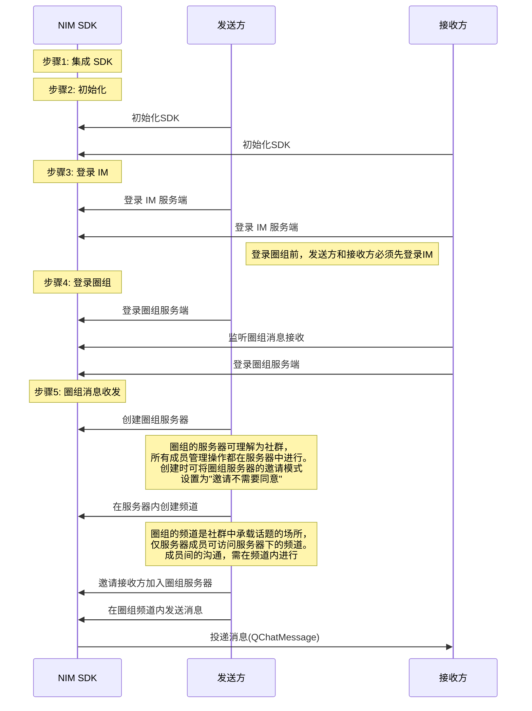

<a href="https://doc.yunxin.163.com/docs/TM5MzM5Njk/Tc1NTk0NTA?platformId=60227" target="_blank">圈组</a>是网易云信 IM 即时通讯服务的全新能力，可助您快速构建“类 Discord 即时通讯社群”。本文介绍如何通过较少的代码集成 NetEase IM SDK （NIM SDK）并调用 API，在您的应用中实现圈组消息收发。


## 使用前准备

- <a href="http://yunxin.163.com/im-sdk-demo" target="_blank">下载 PC 版 NIM SDK（C++）</a>。
- 已在云信控制台[创建应用](https://doc.yunxin.163.com/console/docs/TIzMDE4NTA?platform=console)，获取 App Key。
- 已[注册云信 IM 账号](https://doc.yunxin.163.com/messaging/docs/jEyMjc5NjI?platform=pc#4-注册-im-账号)，获取 accid 和 token。

- 已[开通和配置圈组功能](https://doc.yunxin.163.com/messaging/docs/DMxMjU2NTE?platform=pc)。

## 实现流程

### **流程概览**

实现圈组消息收发的流程，可分为下图所示的 5 大步骤。



### **步骤1: 集成 NIM SDK**

本节仅以较为快速的 CMake 集成为例进行介绍（其他集成方式请参见<a href="https://doc.yunxin.163.com/docs/TM5MzM5Njk/TY1OTIzODA?platformId=60227" target="_blank">集成方式</a>），具体步骤如下：

1. 使用 `ADD_SUBDIRECTORY` 命令将`wrapper`目录添加为子目录。
2. 使用 `INCLUDE_DIRECTORIES` 方法将`include`和`wrapper`文件夹添加为头文件搜索路径。
3. 根据您的执行目标使用 `TARGET_LINK_LIBRARIES` 按需添加链接库即可。链接库如下：

   - `nim_cpp_wrapper`：NIM C++ 封装层库
   - `nim_chatroom_cpp_wrapper`：Chatroom C++ 封装层库
   - `nim_wrapper_util`：NIM 及 Chatroom C++ 封装层库通用的工具库
   - `nim_tools_cpp_wrapper`：NIM HTTP 组件 C++ 封装层库
   - `nim_qchat_cpp_wrapper`：NIM QChat 圈组 C++ 封装层库

::: note notice
- 如果您的工程项目基于 CMake 管理，只需将 wrapper 工程作为您主项目的依赖即可，其他无需任何多余配置。如果您的工程项目未基于 CMake 管理，建议您在持续集成（Continuous Integration，CI）或者与其他同事协作时，通过自定义脚本在项目编译前始终通过 CMake 来生成并编译工程，从而得到需要的二进制文件产物。
- 不建议将 CMake 产生的工程文件直接引用到项目中使用。因为 CMake 使用将绝对路径写入到工程的配置文件（`.vcxproj`）中，您在自己设备上生成的工程文件无法在其他设备中顺利编译。
:::


### **步骤2：初始化 SDK**

1. 执行如下命令，将圈组 SDK 引入到您的本地项目。

    ```
    #include "nim_qchat_cpp_wrapper/nim_cpp_qchat_api.h" // 引入 QChat 库
    ```
2. 调用<a href="https://doc.yunxin.163.com/messaging/references/pc/doxygen/Latest/zh/classnim_1_1_q_chat.html#ae75d56ffa59345f521c61ecd40fb9f06" target="_blank">`QChat::Init`</a>方法将圈组 SDK 初始化。

    示例代码如下：

    ```
    QChatInitParam param;
    bool result = QChat::Init(param);
    if (!result) {
        // error handling
        return;
    }
    ```
::: note notice
- <a href="https://doc.yunxin.163.com/messaging/references/pc/doxygen/Latest/zh/structnim_1_1_q_chat_init_param.html" target="_blank">`QChatInitParam`</a>的成员参数如果不传则使用默认值。如果您仅需体验消息收发，使用默认值即可。
- 更多初始化相关说明，请参见<a href="https://doc.yunxin.163.com/docs/TM5MzM5Njk/DcwOTY0MjI?platformId=60227" target="_blank">初始化</a>。
:::


### **步骤3：登录 IM**


调用<a href="https://doc.yunxin.163.com/messaging/references/pc/doxygen/Latest/zh/classnim_1_1_client.html#a0e8d4b3f4cfcad3cd4bdffd98bdba4c4">`nim::Login`</a>方法登录 IM 服务端。

示例代码如下：

```cpp
void foo()
{
    nim::Client::Login(app_key, "app account", "token", [](const nim::LoginRes& res){
        if (login_res.res_code_ == nim::kNIMResSuccess){
            if (login_res.login_step_ == nim::kNIMLoginStepLogin){
                ···
            }
        } else {
            ···
        }
    }, "");
}
```

### **步骤4：登录圈组**

1. 接收方在登录圈组之前，调用<a href="https://doc.yunxin.163.com/messaging/references/pc/doxygen/Latest/zh/classnim_1_1_message.html#aa4787c06597b0e6e9b6b31529bd1630d">`RegRecvCb`</a>方法监听消息接收。 

    示例代码如下：

    ```
    QChatRegRecvMsgCbParam reg_receive_message_cb_param;
    reg_receive_message_cb_param.cb = [this](const QChatRecvMsgResp& resp) {
        if (resp.res_code != NIMResCode::kNIMResSuccess) {
            // error handling
            return;
        }
        // process response
        // ...
    };
    Message::RegRecvCb(reg_receive_message_cb_param);
    ```
2. 发送方和接收方调用<a href="https://doc.yunxin.163.com/messaging/references/pc/doxygen/Latest/zh/classnim_1_1_plugin_in.html#a501aca4bf6df7fe6e2a101c7dc45c02d" target="_blank">`PluginIn::QChatRequestLinkAddress`</a>方法获取圈组服务端的连接地址。

    ::: note notice
    请务必先完成上一步的 IM 服务端登录，否则将无法获取圈组服务端的连接地址。
    :::

    示例代码如下：


    ```cpp
    // Note: log on to IM first
    // ...
    uint32_t ip_version = 2; // ip协议, 0:ipv4, 1:ipv6, 2:all
    PluginIn::QChatRequestLinkAddress(ip_version, [](int error_code, const std::list<std::string>& link_address_list) {
        if (error_code != 0) {
            // error handling
            return;
        }
        // process response
        // ...
    });
    ```

    ::: note note
    您也可以通过服务端 API （<a href="https://doc.yunxin.163.com/docs/TM5MzM5Njk/DY3NDU0NDU?platformId=60353" target="_blank">`qchat/requestAddr.action`</a>）直接获取圈组服务端的连接地址。通过服务端 API 获取，无需先登录 IM。
    :::

3. 发送方和接收方调用<a href="https://doc.yunxin.163.com/messaging/references/pc/doxygen/Latest/zh/classnim_1_1_q_chat.html#a234e57505c154a78327f19fe4aa0693f" target="_blank">`QChat::Login`</a>方法登录圈组服务端。

    示例代码如下：


    ```
    QChatLoginParam param;
    param.appkey = "your appkey"; // 传入您的 App Key
    param.accid = "your accid";  // 传入您的云信 IM 账号
    param.auth_type = kNIMQChatLoginAuthTypeDefault;
    param.login_token = "your login token"; // 传入您的 Token 
    param.link_address = {"link1", "link2"}; // 传入获取的圈组服务端连接地址
    param.cb = [](const QChatLoginResp& resp) {
        if (resp.res_code != NIMResCode::kNIMResSuccess) {
            // error handling
            return;
        }
        // process response
        // ...
    };
    QChat::Login(param);
    ```


### **步骤5：实现圈组消息收发**

本节以发送方与接收方的消息交互为例，介绍在不考虑用户权限控制的情况下，使用 SDK API 快速实现圈组消息收发的流程。


1. 发送方调用<a href="https://doc.yunxin.163.com/messaging/references/pc/doxygen/Latest/zh/classnim_1_1_server.html#a7f0686dd0afc2b5dcafd2caa8b22f23e" target="_blank">`CreateServer`</a>方法创建圈组服务器。为更加快速实现消息收发，创建时可将`invite_mode`设置为`kNIMQChatServerApplyModeNormal `（发送邀请后，不需要被邀请方同意，被邀请方立即加入服务器）。

    示例代码如下：

    ```
    QChatServerCreateParam param;
    param.server_info.name = "server name";
    param.server_info.invite_mode = kNIMQChatServerApplyModeNormal;
    param.server_info.apply_mode = kNIMQChatServerApplyModeNormal;
    param.cb = [this](const QChatServerCreateResp& resp) {
        if (resp.res_code != NIMResCode::kNIMResSuccess) {
            // error handling
            return;
        }
        // process response
        // ...
    };
    Server::CreateServer(param);
    ```


2. 发送方调用<a href="https://doc.yunxin.163.com/messaging/references/pc/doxygen/Latest/zh/classnim_1_1_channel.html#af7457bd81c198bd35e709f69d2e51975" target="_blank">`CreateChannel`</a>方法，调用时传入上一步中创建的圈组服务器的`server_id `，且将`view_mode`和`type`分别设置为公开模式（`kNIMQChatChannelViewModePublic`）和文本消息频道（`kNIMQChatChannelTypeText`），从而在圈组服务器中创建一个文本消息类型的公开频道。 

    示例代码如下：

    ```
    QChatChannelCreateParam param;
    param.channel_info.server_id = 123456;
    param.channel_info.name = "channel name";
    param.channel_info.type = kNIMQChatChannelTypeText;
    param.channel_info.view_mode = kNIMQChatChannelViewModePublic;
    param.cb = [this](const QChatChannelCreateResp& resp) {
        if (resp.res_code != NIMResCode::kNIMResSuccess) {
            // error handling
            return;
        }
        // process response
        // ...
    };
    Channel::CreateChannel(param);
    ```


3. 发送方调用<a href="https://doc.yunxin.163.com/messaging/references/pc/doxygen/Latest/zh/classnim_1_1_server.html#a9c608f426f20e564a5f627087307d76c" target="_blank">`Invite`</a>方法，邀请接收方加入服务器。


    示例代码如下：

    ```
    QChatServerInviteParam param;
    param.server_id = 123456；
    param.invite_ids = {"accid1", "accid2"};
    param.postscript = "your postscript";
    param.cb = [this](const QChatServerInviteResp& resp) {
        if (resp.res_code != NIMResCode::kNIMResSuccess) {
            // error handling
            return;
        }
        // process response
        // ...
    };
    Server::Invite(param);
    ```


4. 发送方调用<a href="https://doc.yunxin.163.com/messaging/references/pc/doxygen/Latest/zh/classnim_1_1_message.html#a9ea6079f062c4a4d8fce2d9123ed1721" target="_blank">`Send`</a>方法，调用时传入服务器与公开频道的ID，从而在公开频道中发送一条消息。


    示例代码如下：
    ```
    QChatSendMessageParam param;
    param.message.server_id = 123456; // Specify the ID of the server.
    param.message.channel_id = 123456; // Specify the ID of the channel.
    param.message.msg_body = "message body"; // Specify the content of the message.
    param.message.resend_flag = false; // Specify whether to resend the message.
    param.message.msg_id = ""; // Only for resending the message. If not required, leave it empty, the SDK will generate it by default.
    param.message.history_enable = false; // Specify whether to enable cloud storage for the message.

    // text message
    param.message.msg_type = kNIMQChatMsgTypeText;
    auto attach = std::make_shared<QChatDefaultAttach>();
    attach->msg_attach = "msg attach";

    Message::Send(param);
    
    ```


5. SDK 触发消息发送（`SendMsgCallback`）回调函数，接收方通过该回调接收消息（`QChatMessage`）。


## 后续步骤

为保障通信安全，如果您在调试环境中的使用的是云信控制台生成的测试用 IM 账号 和 `token`，请确保在后续的正式生产环境中，将其替换为通过 <a href="https://doc.yunxin.163.com/TM5MzM5Njk/docs/DQ3Nzk1MTY?platform=server" target="_blank">IM 服务端 API</a> 生成的正式 IM 账号（`accid`）和 `token`。


## 常见问题

- `QChat::Init` 返回 `false`  
    - SDK 没有拷贝到可执行文件同级目录导致加载失败
    - 可执行文件和 SDK 架构不匹配