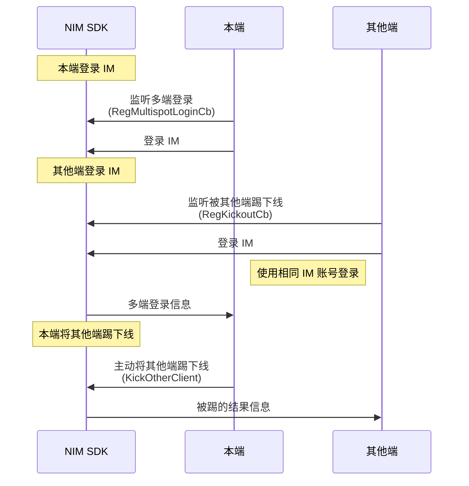

您可通过两种方式实现 IM 的多端登录与互踢。


## 方式1：通过云信控制台配置


当前 NIM SDK 支持通过云信控制台配置四种不同的 IM 多端登录策略：

- 只允许一端登录，PC、Web、Android、iOS 彼此互踢。
- 桌面端 PC 与 Web 互踢，移动端 Android 和 iOS 互踢，且桌面端与移动端可同时登录
- 各端均可以同时登录在线（最多 10 个设备同时在线）
- 自定义多端登录配置

通过该方式的配置，可实现自动管控 IM 的多端登录。具体如何配置，请参见[多端登录与互踢策略](https://doc.yunxin.163.com/messaging/docs/DYyMDc4Njg?platform=pc)。


## 方式2：主动将其他端踢下线


### API 调用时序




### 踢方操作


#### <span id="多端登录监听">步骤1：监听多端登录</span>


注册[`RegMultispotLoginCb`](https://doc.yunxin.163.com/docs/interface/messaging/pc/doxygen/Latest/zh/classnim_1_1_client.html#aa8d7c4b25f89bd0356e0bf46566581b5)回调，监听多端登录事件。 当用户在某个客户端登录时，其他已经在线的客户端会触发该回调。


当同账号的其他客户端类型登录或登出，本端都会收到通知，通知信息包括通知类型 `notify_type`（[NIMMultiSpotNotifyType ](https://doc.yunxin.163.com/docs/interface/messaging/pc/doxygen/Latest/zh/nim__client__def_8h.html#a0082716a6b9582bfe37de412e644ee18)）和其他在线的客户端列表 `	other_clients`（[OtherClientPres](https://doc.yunxin.163.com/docs/interface/messaging/pc/doxygen/Latest/zh/structnim_1_1_other_client_pres.html)）。

#### <span id="互踢">步骤2：将其他端踢下线</span>

调用[`KickOtherClient`](https://doc.yunxin.163.com/docs/interface/messaging/pc/doxygen/Latest/zh/classnim_1_1_client.html#a53e7750d01f816c048f3c14eac30706e)方法将其他同时登录的设备端踢下线。 


示例代码如下：

```
Client::RegMultispotLoginCb(
    [](const MultiSpotLoginRes& res) {
        // process multispot login res
    },
    "");
```


### 被踢方操作

被踢的设备端，可在登录 IM 前，注册[`RegKickoutCb`](https://doc.yunxin.163.com/docs/interface/messaging/pc/doxygen/Latest/zh/classnim_1_1_client.html#af18d6833cb06bc6fba93a58660fd6cdf)回调，监听被踢事件。

当被其他客户端踢下线后，会收到通知，通知信息包括被踢原因 `kick_reason`（[`NIMKickReason`](https://doc.yunxin.163.com/docs/interface/messaging/pc/doxygen/Latest/zh/nim__client__def_8h.html#ae0e67282f0bc2c5994675214aaf61bf9)）和将其踢下线的设备端的客户端类型 `client_type`（[`NIMClientType`](https://doc.yunxin.163.com/docs/interface/messaging/pc/doxygen/Latest/zh/nim__client__def_8h.html#ac527fbe48688134f69a107d4b9d3ee89)）等信息。

收到被踢回调后，建议进行注销并切换到登录界面。

示例代码如下：

```
Client::RegKickoutCb(
    [](const KickoutRes& res) {
        // current client is kicked out
        // ......
    },
    "");
```


