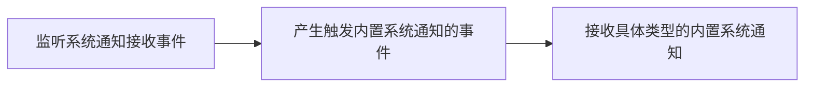

<!--keywords: 系统通知,通知,监听,获取,删除,更新,内置-->

网易云信 NIM SDK 支持接收和存储内置系统通知。同时提供处理、查询、删除内置系统通知、修改通知状态等内置系统通知管理功能。


## 技术原理

内置系统通知是云信系统内建的通知，由云信服务器推送给用户或群组，用于云信系统类的事件通知。

系统通知相关 API 都挂载在 SDK 的 `nim::SystemMsg` 模块中，具体请参见 [`nim::SystemMsg`](https://doc.yunxin.163.com/messaging/references/pc/doxygen/Latest/zh/classnim_1_1_system_msg.html)。


## <span id="监听系统通知">监听系统通知</span>

只有在注册监听内置系统通知相关事件后，用户才会收到对应的系统通知。



可以使用接收系统通知回调模板（`ReceiveSysmsgCallback`）并调用 [`RegSysmsgCb`](https://doc.yunxin.163.com/messaging/references/pc/doxygen/Latest/zh/classnim_1_1_system_msg.html#a301da7e46ff96b152d2041b2064d44ec) 方法来监听系统通知接收事件。

除了接收系统通知回调模板（`ReceiveSysmsgCallback`），SDK 还提供以下回调模板：
- `QueryMsgCallback`：查询系统通知回调模板
- `NotifySysmsgResCallback`：修改系统通知回调模板
- `	QuerySysmsgUnreadCallback`：查询系统通知未读数回调模板
- `ReadAllCallback`：设置系统通知已读状态回调模板
- `DeleteAllCallback`：删除全部系统通知回调模板
- `BatchSetCallback`：批量调整系统通知回调模板
- `NotifySingleSysmsgCallback`：修改（单条）系统通知回调模板
- `SetStatusCallback`：设置系统通知状态回调模板
- `DeleteCallback`：删除系统通知回调模板
- `SendCustomSysmsgCallback`：发送自定义通知回调模板

示例代码：
```
void UIReceiveSysmsgCallback(nim::SysMessage& msg)
{
	if (msg.type_ == nim::kNIMSysMsgTypeCustomP2PMsg || msg.type_ == nim::kNIMSysMsgTypeCustomTeamMsg)
	{

	｝
	else
	{

	}
}

void foo()
{
	nim::SystemMsg::RegSysmsgCb(&OnReceiveSysmsgCallback);
}
```

注册后的回调通知给 APP。为了保证整个程序逻辑的一致性，APP 需要针对不同类型的系统通知进行相应的操作。

目前云信内置的能触发内置系统通知的事件包括：

通知类型|说明
:----|:-----
`kNIMSysMsgTypeTeamInvite `|邀请用户加入高级群
`kNIMSysMsgTypeTeamApply `|用户申请加入高级群
`kNIMSysMsgTypeTeamInviteReject `|用户拒绝加入高级群邀请
`kNIMSysMsgTypeTeamReject `|拒绝用户的加入高级群申请
`kNIMSysMsgTypeFriendAdd `|加好友，通知内容 `kNIMSysMsgKeyAttach: {"vt":verifyType}` 中会返回具体的验证类型
`kNIMSysMsgTypeFriendDel `|删除好友
`kNIMSysMsgTypeUnknown `|未知类型，本地使用，发送时勿使用，作为默认


## <span id="查询内置系统通知">查询内置系统通知</span>


通过调用 [`QueryMsgAsync`](https://doc.yunxin.163.com/messaging/references/pc/doxygen/Latest/zh/classnim_1_1_system_msg.html#a78aa1458ed12c9ba871b3fba68f8eb9b) 方法查询本地所有的内置系统通知。

**参数说明：**

|参数|说明|
|:---|:---|
|last_time|上次查询的最后一条系统通知的时间戳|
|limit_count|本次查询的系统通知数量，最多和默认都为 100 条|
|json_extension|JSON 扩展参数|
|cb|结果回调函数，返回的列表按时间逆序逆序排列|


**示例代码：**

```
void LoadEventsCb(int count, int unread, const std::list<nim::SysMessage> &result)
{

}

void foo()
{
	nim::SystemMsg::QueryMsgAsync(20, 0, &LoadEventsCb);
}
```
:::note note
在支持数据库时，SDK 会将内置系统通知存储于数据库中。
:::


## <span id="删除内置系统通知">删除内置系统通知</span>

### <span id="删除所有内置系统通知">删除所有内置系统通知</span>

通过调用 [`DeleteAllAsync`](https://doc.yunxin.163.com/messaging/references/pc/doxygen/Latest/zh/classnim_1_1_system_msg.html#ae21a256819ffcada4211ae3a4fb498f0) 方法删除所有的本地内置系统通知。示例代码如下：

```
void DeleteAllCb(nim::NIMResCode res_code, int unread)
{

}

void foo()
{
	nim::SystemMsg::DeleteAllAsync(&DeleteAllCb);
}
```

### <span id="删除指定的内置系统通知">删除指定的内置系统通知</span>


通过调用 [`DeleteAsync`](https://doc.yunxin.163.com/messaging/references/pc/doxygen/Latest/zh/classnim_1_1_system_msg.html#ab5b59275c248a4de689dedaa94faad76) 方法根据 `msg_id`（系统通知 ID）删除指定的内置系统通知。示例代码如下：

```
void DeleteCb(nim::NIMResCode code, __int64 msg_id, int unread)
{

}

void foo(__int64 msg_id)
{
	nim::SystemMsg::DeleteAsync(msg_id, &DeleteCb);
}
```

### <span id="删除指定类型的内置系统通知">删除指定类型的内置系统通知</span>


通过调用 [`DeleteByTypeAsync`](https://doc.yunxin.163.com/messaging/references/pc/doxygen/Latest/zh/classnim_1_1_system_msg.html#a98b4d9aa265901f1f45b40b4d9077bcf) 方法根据 `type`（系统通知类型）删除指定的内置系统通知。

系统通知类型具体请参见[`NIMSysMsgType`](https://doc.yunxin.163.com/messaging/references/pc/doxygen/Latest/zh/nim__sysmsg__def_8h.html#aca66cca1d454dc8938338ebd5ec08561)。

示例代码如下：

```
SystemMsg::DeleteByTypeAsync(kNIMSysMsgTypeTeamApply, [](NIMResCode res_code, int unread_count) {
	// process response
});
```


## <span id="设置系统通知状态">设置系统通知状态</span>

SDK 的系统通知状态通过 [`NIMSysMsgStatus`](https://doc.yunxin.163.com/messaging/references/pc/doxygen/Latest/zh/nim__sysmsg__def_8h.html#a288ad771c707b641639cfcedca5e7b6d) 来定义，目前主要内置了以下六种状态。
- `kNIMSysMsgStatusNone`：未读，默认
- `kNIMSysMsgStatusRead `：已读
- `kNIMSysMsgStatusPass `：已通过
- `kNIMSysMsgStatusDecline `：已拒绝
- `kNIMSysMsgStatusDeleted `：已删除
- `kNIMSysMsgStatusInvalid `：已失效

### <span id="设置指定的内置系统通知状态">设置指定的内置系统通知状态</span>

通过调用 [`SetStatusAsync`](https://doc.yunxin.163.com/messaging/references/pc/doxygen/Latest/zh/classnim_1_1_system_msg.html#a4268cbab02884b7ce386d08063a144eb) 方法根据 `msg_id`（系统通知 ID）设置指定的内置系统通知状态。示例代码如下：

```
void SetStatusCb(nim::NIMResCode code, __int64 msg_id, int unread)
{
	
}

void foo(__int64 msg_id)
{
	nim::SystemMsg::SetStatusAsync(msg_id_, nim::kNIMSysMsgStatusInvalid, &SetStatusCb);
}
```

:::note note
更新的字段只会在本地数据库中更新，服务器上不会更新。
:::


### <span id="设置指定类型的内置系统通知状态">设置指定类型的内置系统通知状态</span>


通过调用 [`SetStatusByTypeAsync`](https://doc.yunxin.163.com/messaging/references/pc/doxygen/Latest/zh/classnim_1_1_system_msg.html#a4f5b9de50d946f9c4101fe95629e39f3) 方法根据 `type`（系统通知类型）设置指定类型的内置系统通知状态。示例代码如下：

```
SystemMsg::SetStatusByTypeAsync(kNIMSysMsgTypeTeamApply, kNIMSysMsgStatusPass, [](NIMResCode res_code, int unread_count) {
	// process response
	// ...
});

```

:::note note
- 系统通知类型具体请参见[`NIMSysMsgType`](https://doc.yunxin.163.com/messaging/references/pc/doxygen/Latest/zh/nim__sysmsg__def_8h.html#aca66cca1d454dc8938338ebd5ec08561)。
- 更新的字段只会在本地数据库中更新，服务器上不会更新。
:::


