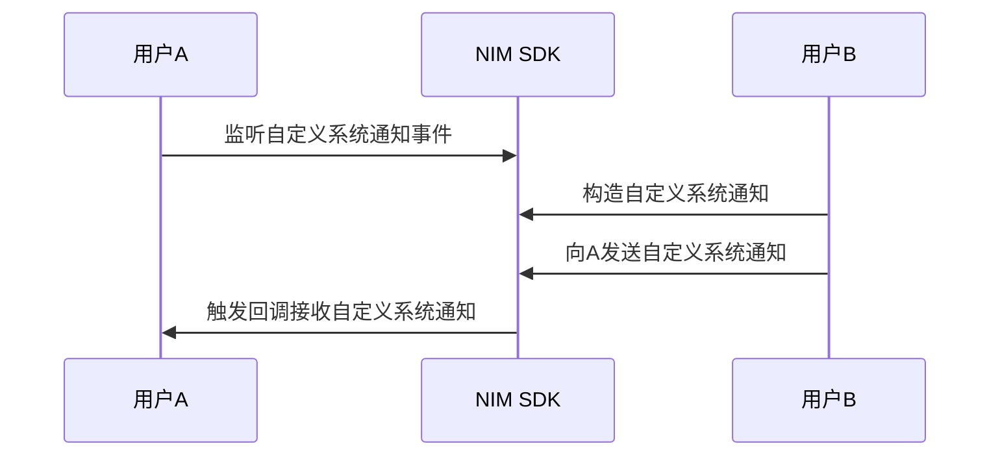

<!--keywords: 自定义系统通知,构造,发送,接收,推送-->


NIM SDK 支持自定义系统通知的收发，帮助您快速实现多样化的业务场景。

本文介绍通过网易云信 NIM SDK 实现自定义系统通知的技术原理、具体的实现流程以及典型的应用场景。

## 技术原理

NIM SDK 提供自定义系统通知，既可以由客户端发起，也可以由开发者服务器发起。SDK 仅透传自定义系统通知，不负责解析和存储。通知内容由第三方 APP 自由扩展。

开发者可以根据其业务逻辑自定义一些事件状态的通知，来实现各种业务场景。例如实现单聊场景中的对方“正在输入”的功能。

## <span id="实现流程">实现流程</span>



1. 注册监听。


	- 使用接收系统通知回调模板（`ReceiveSysmsgCallback`）并调用 [`RegSysmsgCb`](https://doc.yunxin.163.com/messaging/references/pc/doxygen/Latest/zh/classnim_1_1_system_msg.html#a301da7e46ff96b152d2041b2064d44ec) 方法来监听系统通知接收事件。
	- 使用接收系统通知回调模板（`SendCustomSysmsgCallback`）并调用 [`RegSendCustomSysmsgCb`](https://doc.yunxin.163.com/messaging/references/pc/doxygen/Latest/zh/classnim_1_1_system_msg.html#a48e9ba57175294a4a72646b84010c694) 监听发送自定义系统通知的回调。

	示例代码如下：
	```
	//监听系统通知接收事件
	SystemMsg::RegSysmsgCb([](const SysMessage& msg) {
		// process msg
	});

	//监听发送自定义系统通知事件
	SystemMsg::RegSendCustomSysmsgCb([](const SendMessageArc& arc) {
		// process arc
	});
	```

2. 构造自定义系统通知。

	通过调用[`CreateCustomNotificationMsg`](https://doc.yunxin.163.com/messaging/references/pc/doxygen/Latest/zh/classnim_1_1_system_msg.html#a095e06848359a1ca252353929cd9dee6) 方法构造自定义系统通知。

	**参数说明：**
	|参数|说明|
	|:---|:---|
	|timetag|时间戳
	|type|系统通知类型，具体请参见[`NIMSysMsgType`](https://doc.yunxin.163.com/messaging/references/pc/doxygen/Latest/zh/nim__sysmsg__def_8h.html#aca66cca1d454dc8938338ebd5ec08561) 
	|content|系统通知内容
	|receiver_id|接收者 ID
	|client_msg_id|本地通知 ID
	|msg_setting|系统通知相关配置，如是否需要推送、计数，是否支持离线发送等，具体请参见[`SysMessageSetting`](https://doc.yunxin.163.com/messaging/references/pc/doxygen/Latest/zh/structnim_1_1_sys_message_setting.html)

	**示例代码：**

	```
	std::string sysmsg = SystemMsg::CreateCustomNotificationMsg("receiver_id", kNIMSysMsgTypeCustomTeamMsg, "client_msg_id", "content", SysMessageSetting());
	```

3. 发送自定义系统通知。

	通过调用[`SendCustomNotificationMsg`](https://doc.yunxin.163.com/messaging/references/pc/doxygen/Latest/zh/classnim_1_1_system_msg.html#a6fe82c5124fb98583c05485e56de7870) 方法发送自定义系统通知。示例代码如下：

	```
	void foo()
	{
		Json::Value json;
		Json::FastWriter writer;
		json["id"] = "1";

		nim::SysMessage msg;
		msg.receiver_accid_ = ;	//接收者id
		msg.sender_accid_ = ; 	//自己id
		msg.client_msg_id_ = QString::GetGUID();	//本地定义的消息id
		msg.attach_ = writer.write(json);			//通知附件内容
		msg.type_ = nim::kNIMSysMsgTypeCustomP2PMsg; //通知类型

		nim::SystemMsg::SendCustomNotificationMsg(msg.ToJsonString());
	}
	```

	::: note notice
	一秒内默认最多调用该接口 100 次。如需上调上限，请在官网首页通过微信、在线消息或电话等方式咨询商务人员。
	:::

4. 触发回调，收到自定义系统通知。

## 典型应用场景

这里以实现单聊场景中的对方“正在输入”的功能为例，示例代码如下：

```
SystemMsg::RegSysmsgCb([](const SysMessage& msg) {
	if (msg.type_ == kNIMSysMsgTypeCustomP2PMsg) {
		// 自定义点对点消息
		Json::Value value;
		Json::Reader reader;
		if (reader.parse(msg.attach_, value) && value.isObject()) {
			auto msg_type = value["msg_type"].asString();
			if (msg_type == "typing") {
				std::cout << "收到对方正在输入的通知" << std::endl;
				// process typing notification
				// ...
				return;
			}
			// ...
		}
	}
	// ...
});

void SendTypingNotification(){
	Json::Value json;
	Json::FastWriter writer;
	json["msg_type"] = "typing";

	nim::SysMessage msg;
	msg.receiver_accid_ = ;	//接收者id
	msg.sender_accid_ = ; 	//自己id
	msg.client_msg_id_ = QString::GetGUID();	//本地定义的消息id
	msg.attach_ = writer.write(json);			//通知附件内容
	msg.type_ = nim::kNIMSysMsgTypeCustomP2PMsg; //通知类型

	nim::SystemMsg::SendCustomNotificationMsg(msg.ToJsonString());
}
```
