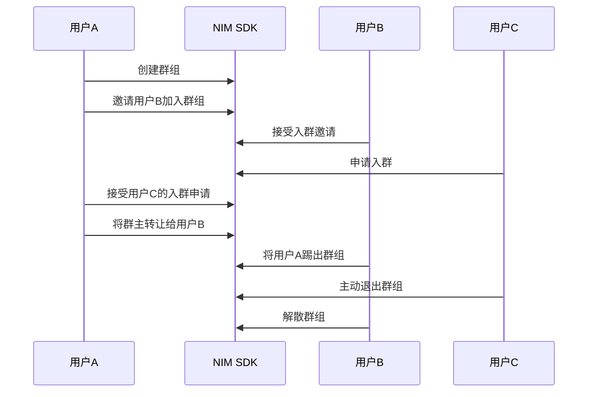

<!-- keywords: IM群组,高级群,群组管理,创建,解散,转让,更新,退出 -->


网易云信 NIM SDK 提供了高级群形式的群组功能，支持用户创建、加入、退出、转让、修改、查询、解散群组，拥有完善的管理功能。


## 技术原理

网易云信 NIM SDK 的群组相关 API 都挂载在 `nim::Team` 模块中， [`nim::Team`](https://doc.yunxin.163.com/messaging/references/pc/doxygen/Latest/zh/classnim_1_1_team.html) 提供群组操作相关接口，帮助您快速实现和使用群组的管理功能。 


## 群组相关事件监听

在进行群组操作前，您可以提前注册监听群相关事件。监听后，在进行群组管理相关操作时，会收到对应的通知。

可以使用回调模板（`OnTeamEventCallback`）并调用 [`RegTeamEventCb`](https://doc.yunxin.163.com/messaging/references/pc/doxygen/Latest/zh/classnim_1_1_team.html#ad70facebf9dc19f31ee4cba04bcc8629) 方法来监听群组事件通知。

其中群组事件的详细信息请参见 [`TeamEvent`](https://doc.yunxin.163.com/messaging/references/pc/doxygen/Latest/zh/structnim_1_1_team_event.html)。

示例代码：
```
void OnTeamEventCallback(const nim::TeamEvent& result)
{
	···
}

foo()
{
	nim::Team::RegTeamEventCb(&OnTeamEventCallback);
}
```

对于部分查询接口，有单独的回调模板，具体请参见[`nim::Team`](https://doc.yunxin.163.com/messaging/references/pc/doxygen/Latest/zh/classnim_1_1_team.html)。


:::note note
- 由于获取群组信息和群成员信息需要跨进程异步调用，开发者最好能在第三方 APP 中做好群组和群成员信息缓存，查询群组和群成员信息时都从本地缓存中访问。在群组或者群成员信息有变化时，SDK 会告诉注册的观察者，此时，第三方 APP 可更新缓存，并刷新界面。
- SDK 在收到群通知之后，会对本地缓存的群信息做出对应的修改，然后触发与修改相对应的监听事件回调。
- 群通知是接收型的消息，开发者无法手动创建和发送群通知消息。
:::

## 实现流程

本章节通过群主、管理员、普通成员之间的交互为例，介绍群组管理的实现流程。




## 创建群组

:::note note
- 创建群组时邀请的用户会收到类型为 `kNIMSysMsgTypeTeamInvite` 的系统通知（`NIMSysMsgType`）。
- 若被邀请模式（`NIMTeamBeInviteMode`）为需要验证（`kNIMTeamBeInviteModeNeedAgree`），那么创建群组后，需要用户接受邀请，才会成为群成员。
:::


通过调用 `CreateTeamAsyncEx` 方法创建群组，创建者即为该群群主。

<note type=notice>原创建群接口`CreateTeamAsync`已废弃。 </note>


**参数说明：**

| 参数  | 说明     |
|  ----   | --------- |
|team_info | 群组信息，请参见[`TeamInfo`](https://doc.yunxin.163.com/messaging/references/pc/doxygen/Latest/zh/structnim_1_1_team_info.html) <note type=note>群组类型默认为 `kNIMTeamTypeAdvanced ` 创建高级群，高级群拥有完善的成员权限体系及管理功能。为避免产生问题，不建议使用其他取值。</note>|
|invitation_postscript| 邀请入群的附言|
|ids | 邀请加入的成员帐号列表|
|json_extension|json扩展参数<br/>目前可用于配置反垃圾相关参数<br/>格式{"anti_spam_business_id":"{\"textbid\":\"xxxx\",\"picbid\":\"xxxx\"}"}|
|cb|群通知的回调函数，请参见[`TeamEventCallback`](https://doc.yunxin.163.com/messaging/references/pc/doxygen/Latest/zh/classnim_1_1_team.html#a54ec613878aa6fa6a69621aacd57df04)|

**示例代码：**

```
void OnTeamEventCallback(const nim::TeamEvent& result)
{
	...
}
void foo()
{
	std::list<std::string> id_list;
	id_list.push_back("test1");
	id_list.push_back("test2");

	nim::TeamInfo tinfo;
	tinfo.SetName("test");
	tinfo.SetType(nim::kNIMTeamTypeAdvanced );
	nim::Team::CreateTeamAsyncEx(tinfo, id_list, "", &OnTeamEventCallback);
}
```
**错误码：**

| 状态码  | 说明     |
|  ----   | --------- |
|200| 成功 |
|810|邀请初始成员成功，并带上tinfo 
|414|成员不足 
|801|成员数超出限制 
|404|成员中有非法用户


## 加入群组

加入群组可以通过以下两种方式：
- 用户接受邀请入群。
- 用户主动申请入群。

### 邀请入群

::: note note
邀请入群的模式可以通过 `NIMTeamInviteMode` 来定义，设为 `kNIMTeamInviteModeManager`，那么仅限群主和管理员可以邀请人进群；设为 `kNIMTeamInviteModeEveryone` ，那么群组内的所有人都可以邀请人进群。
:::


通过调用 [`InviteAsync`](https://doc.yunxin.163.com/messaging/references/pc/doxygen/Latest/zh/classnim_1_1_team.html#a910ca81905b7602614b11c136b1db340) 方法邀请其他用户进入群组。
  - 若群组的被邀请模式 `NIMTeamBeInviteMode` 为 `kNIMTeamBeInviteModeNotNeedAgree `，那么无需验证，其他用户可直接加入群组。
  - 若群组的被邀请模式 `NIMTeamBeInviteMode` 为 `kNIMTeamBeInviteModeNeedAgree `，那么需要被邀请用户同意才能加入群组。
  
如果在被邀请成员中存在成员拥有的群组数量已达上限，则会返回失败成员的账号列表。

**参数说明：**

| 参数   | 说明     |
|  ----    | --------- |
|tid | 群ID |
|ids| 邀请入群的用户账号列表|
|json_extension|自定义扩展字段|
|invitation_postscript|邀请附言，不需要的话设置为空|
|cb|邀请的回调函数|


- 发起邀请后，被邀请用户会收到 [`NIMSysMsgType`](https://doc.yunxin.163.com/messaging/references/pc/doxygen/Latest/zh/nim__sysmsg__def_8h.html#aca66cca1d454dc8938338ebd5ec08561) 系统通知，其通知类型为`kNIMSysMsgTypeTeamInvite `。
- 被邀请用户可以调用 [`AcceptInvitationAsync`](https://doc.yunxin.163.com/messaging/references/pc/doxygen/Latest/zh/classnim_1_1_team.html#a4cc173817f93df6ab7650d6590b1ffec) 方法接受入群邀请，接受即入群。所有群成员会收到群组通知消息（消息类型为 `kNIMMessageTypeNotification `），触发事件为`kNIMNotificationIdTeamInviteAccept`。
- 也可以调用 [`RejectInvitationAsync`](https://doc.yunxin.163.com/messaging/references/pc/doxygen/Latest/zh/classnim_1_1_team.html#a6db392f65cc6d5aa261824694f00770f) 方法拒绝入群邀请。拒绝后，邀请者会收到 [`NIMSysMsgType`](https://doc.yunxin.163.com/messaging/references/pc/doxygen/Latest/zh/nim__sysmsg__def_8h.html#aca66cca1d454dc8938338ebd5ec08561) 系统通知，其通知类型为 `kNIMSysMsgTypeTeamInviteReject`。

**示例代码：**

```
void OnTeamEventCallback(const nim::TeamEvent& result)
{
	···
}

void foo()
{
	const std::list<std::string> friend_list;
	friend_list.push_back("test1");
	friend_list.push_back("test2");
	nim::Team::InviteAsync("123445", friend_list, "", &OnTeamEventCallback);
}

//接受入群邀请
void TeamEventCb(const nim::TeamEvent& team_event)
{
	···
}

void foo()
{
	nim::Team::AcceptInvitationAsync("12345", "my_id", &TeamEventCb);
}

//拒绝入群邀请
void TeamEventCb(const nim::TeamEvent& team_event)
{
	···
}

void foo()
{
	nim::Team::RejectInvitationAsync("12345", "my_id", "", &TeamEventCb);
}
```  

**错误码：**

| 状态码  | 说明     |
|  ----   | --------- |
|200| 成功 |
|810|邀请初始成员成功，并带上timetag
|801|成员数超出限制 
|802|没有权限
|803|群不存在
|404|非法用户
  

### 申请入群

通过调用 [`ApplyJoinAsync`](https://doc.yunxin.163.com/messaging/references/pc/doxygen/Latest/zh/classnim_1_1_team.html#ad0e5f809e9ef0b2d5361e8a517b17a2f) 方法申请加入群组。
  - 若群组的加入模式 `NIMTeamJoinMode` 为 `kNIMTeamJoinModeNoAuth`，那么无需验证，其他用户可直接加入群组。
  - 若群组的加入模式 `NIMTeamJoinMode` 为 `kNIMTeamJoinModeNeedAuth `，那么需要群主或者群管理员同意才能加入群组。
  - 若群组的加入模式 `NIMTeamJoinMode` 为 `kNIMTeamJoinModeRejectAll `，那么该群组不接受入群申请，仅能通过邀请方式入群。


**参数说明：**

| 参数 | 说明     |
|  ----  | --------- |
|tid| 群ID |
|reason|申请附言|
|json_extension|自定义扩展字段|
|cb|申请入群的回调函数|

- 当用户发起入群申请后，该群群主和管理员会收到 [`NIMSysMsgType`](https://doc.yunxin.163.com/messaging/references/pc/doxygen/Latest/zh/nim__sysmsg__def_8h.html#aca66cca1d454dc8938338ebd5ec08561) 系统通知，其通知类型为`kNIMSysMsgTypeTeamApply `。
- 群主和群管理员可以调用 [`PassJoinApplyAsync`](https://doc.yunxin.163.com/messaging/references/pc/doxygen/Latest/zh/classnim_1_1_team.html#a50d50a542e0413df9b6baad85f8b0b10) 方法接受入群申请，接受即入群。所有群成员会收到群组通知消息（消息类型为 `kNIMMessageTypeNotification `），触发事件为`kNIMNotificationIdTeamApplyPass `。
- 群主和群管理员也可以调用 [`RejectJoinApplyAsync`](https://doc.yunxin.163.com/messaging/references/pc/doxygen/Latest/zh/classnim_1_1_team.html#a788fd247d97c76059000079e5a266b7e) 方法拒绝入群申请。拒绝后，申请者会收到 [`NIMSysMsgType`](https://doc.yunxin.163.com/messaging/references/pc/doxygen/Latest/zh/nim__sysmsg__def_8h.html#aca66cca1d454dc8938338ebd5ec08561) 系统通知，其通知类型为 `kNIMSysMsgTypeTeamReject `。

**示例代码：**

```
void OnApplyJoinCb(const nim::TeamEvent& team_event)
{
	QLOG_APP(L"apply join: {0}") << team_event.res_code_;
	
	switch (team_event.res_code_)
	{
	case nim::kNIMResTeamAlreadyIn:
	{
		···
	}
	break;
	case nim::kNIMResSuccess:
	{
		···
	}
	break;
	case nim::kNIMResTeamApplySuccess:
		···
		break;
	default:
	{
		···
	}
	break;
	}
}

void foo()
{
	nim::Team::ApplyJoinAsync("12345", "", &OnApplyJoinCb);
}

//同意申请

void TeamEventCb(const nim::TeamEvent& team_event)
{
	switch (team_event.res_code_)
	{
	case nim::kNIMResTeamAlreadyIn:
	{
		···
	}
	break;
	case nim::kNIMResSuccess:
	{
		···
	}
	break;
	case nim::kNIMResTeamApplySuccess:
		···
		break;
	default:
	{
		···
	}
	break;
	}
}

void foo()
{
	nim::Team::PassJoinApplyAsync("12345", "my_id", &TeamEventCb);
}

//拒绝申请

void TeamEventCb(const nim::TeamEvent& team_event)
{
	switch (team_event.res_code_)
	{
	case nim::kNIMResTeamAlreadyIn:
	{
		···
	}
	break;
	case nim::kNIMResSuccess:
	{
		···
	}
	break;
	case nim::kNIMResTeamApplySuccess:
		···
		break;
	default:
	{
		···
	}
	break;
	}
}

void foo()
{
	nim::Team::RejectJoinApplyAsync("12345", "sender_id", "", &TeamEventCb);
}
```

**错误码：**

| 状态码  | 说明     |
|  ----   | --------- |
|200| 成功 |
|801|成员数超出限制 
|802|群验证方式为拒绝所有人申请
|803|群不存在
|805|群类型错误|
|808|申请成功|
|809|已在群组中|


## 转让群组

::: note note
只有群主才有转让群组的权限。
:::


通过调用 [`TransferTeamAsync`](https://doc.yunxin.163.com/messaging/references/pc/doxygen/Latest/zh/classnim_1_1_team.html#a619019a69f9bd13e34efe972da8fadb2) 方法将群组转让给其他成员。

- 转让群后, 群主身份转移，所有群成员会收到群组通知消息（消息类型为 `kNIMMessageTypeNotification `），触发事件为`kNIMNotificationIdTeamOwnerTransfer `。
- 如果转让群的同时离开群, 那么相当于同时调用[`LeaveAsync`](https://doc.yunxin.163.com/messaging/references/pc/doxygen/Latest/zh/classnim_1_1_team.html#a2298829594c9a1dbe286833726cf9f92)主动退群。所有群成员会收到群组通知消息（消息类型为 `kNIMMessageTypeNotification `），触发事件为`kNIMNotificationIdTeamLeave `。


**参数说明：**

| 参数  | 说明     |
|  ----   | --------- |
|tid | 群ID |
|new_owner_id|转让后的群主账号|
|is_leave|转让群的同时是否退出该群<br/>true：退出<br/>false：不退出，身份变为普通群成员|
|json_extension|自定义扩展字段|
|cb|转让群主的回调函数|

**示例代码：**

```
void OnTeamEventCallback(const nim::TeamEvent& result)
{
	···
}

foo()
{
	nim::Team::TransferTeamAsync("tid_", "user_id", false, &OnTeamEventCallback);
}
```

**错误码：**

| 状态码  | 说明     |
|  ----   | --------- |
|200| 成功 |
|802|没有权限
|803|群不存在
|805|群类型错误|
|806|群数量超出限制


## 退出群组

退出群组可以通过以下两种方式：
- 群主或群组管理员将用户踢出群组。所有群成员会收到群组通知消息（消息类型为 `kNIMMessageTypeNotification `），触发事件为`kNIMNotificationIdTeamKick`。
- 用户主动退群。主动退群后，所有群成员会收到群组通知消息（消息类型为 `kNIMMessageTypeNotification `），触发事件为`kNIMNotificationIdTeamLeave `。

### 踢人出群
::: note note
- 只有群主和管理员才能将成员踢出群组。
- 管理员不能踢群主和其他管理员。
:::


通过调用 [`KickAsync`](https://doc.yunxin.163.com/messaging/references/pc/doxygen/Latest/zh/classnim_1_1_team.html#af40faece8446e5d99fb895b4af5f25c8) 方法将成员踢出群组。


**参数说明：**

| 参数 | 说明     |
|  ----  | --------- |
|tid | 群ID |
|ids|被踢出的群成员账号列表|
|json_extension	|自定义扩展字段|
|cb|踢人的回调函数|


**示例代码：**

```
Team::KickAsync("tid", {123456, 456789}, [this](const TeamEvent& team_event) {
	// process team_event
});
```

**错误码：**

| 状态码  | 说明     |
|  ----   | --------- |
|200| 成功 |
|403|被踢的是管理员或群主|
|404|非法用户|
|801|群人数超出限制|
|802|没有权限
|803|群不存在


### 主动退群

除群主（需先转让群主）外，其他用户均可以直接主动退群。


通过调用 [`LeaveAsync`](https://doc.yunxin.163.com/messaging/references/pc/doxygen/Latest/zh/classnim_1_1_team.html#a2298829594c9a1dbe286833726cf9f92) 方法主动退出群组。


**参数说明：**

| 参数 | 说明     |
|  ----  | --------- |
|tid | 群ID |
|json_extension	|自定义扩展字段|
|cb|退群的回调函数|

**示例代码：**

```
void TeamEventCb(const nim::TeamEvent& team_event)
{
	···
}

void foo()
{
	nim::Team::LeaveAsync("12345", &TeamEventCb);
}
```
**错误码：**

| 状态码  | 说明     |
|  ----   | --------- |
|200| 成功 |
|803|群不存在
|804|用户不在群组中


## 解散群组

解散群后, 所有群成员会收到群组通知消息（消息类型为 `kNIMMessageTypeNotification `），触发事件为`kNIMNotificationIdTeamDismiss `。

::: note note
只有群主才能解散群组。
:::


通过调用 [`DismissAsync`](https://doc.yunxin.163.com/messaging/references/pc/doxygen/Latest/zh/classnim_1_1_team.html#a3b029f26ba07d0d31374b43a84a31f77) 方法解散群组。


**参数说明：**

| 参数 | 说明     |
|  ----  | --------- |
|tid | 群ID |
|json_extension	|自定义扩展字段|
|cb|解散群的回调函数|

**示例代码：**

```
void OnTeamEventCallback(const nim::TeamEvent& result)
{
	···
}

foo()
{
	nim::Team::DismissAsync("tid_", &OnTeamEventCallback);
}
```
**错误码：**

| 状态码  | 说明     |
|  ----   | --------- |
|200| 成功 |
|802|没有权限|
|803|群不存在


## 修改群组信息

当用户更新群组信息后，所有群成员会收到群组通知消息（消息类型为 `kNIMMessageTypeNotification `），触发事件为`kNIMNotificationIdTeamUpdate `。

::: note note
修改群信息需要权限。若该群组的群信息修改权限（`NIMTeamUpdateInfoMode`）为 `kNIMTeamUpdateInfoModeManager`，那么只有群主和管理员才能修改群组信息；若为 `kNIMTeamUpdateInfoModeEveryone `，则群组内的所有人都可以修改群组信息。
:::


通过调用 [`UpdateTeamInfoAsync`](https://doc.yunxin.163.com/messaging/references/pc/doxygen/Latest/zh/classnim_1_1_team.html#a9d67c500f029505ca44be91759a98395) 方法修改群组的信息。


**参数说明：**
| 参数    | 说明     |
|  ----    | --------- |
|tid|群ID|
|team_info|待更新的群组信息，具体请参见[`TeamInfo`](https://doc.yunxin.163.com/messaging/references/pc/doxygen/Latest/zh/structnim_1_1_team_info.html)|
|json_extension	|自定义扩展字段|
|cb|个更新群组信息的回调函数|

**示例代码：**

```
void OnUpdateBroadCb(const nim::TeamEvent& team_event)
{
	if (team_event.res_code_ == 200)
	{
		···
	}
}

void foo()
{
	Json::Value broad;
	broad["title"] = "title";
	broad["content"] = "内容";
	broad["creator"] = "test_user";

	Json::Value broads;
	broads.append(broad);

	Json::FastWriter writer;
	nim::TeamInfo param;
	param.SetAnnouncement(writer.write(broads));
	param.SetTeamID("tid_");

	nim::Team::UpdateTeamInfoAsync("tid_", param, &OnUpdateBroadCb);
}
```

**错误码：**

| 状态码  | 说明     |
|  ----   | --------- |
|200| 成功 |
|802|没有权限|
|803|群不存在


## 查询群组信息

SDK 在程序启动时会对本地群信息进行同步，所以只需要调用本地缓存接口获取群即可。

SDK 支持批量获取自己加入的所有群组、根据单个群 ID 查询群组、以及远程（从服务器）获取群信息功能。

### 本地查询自己加入的群组列表

:::note note
查询的是本地所有有效群。有效群需要满足两个条件：群有效以及我在群里。
:::


通过调用[`QueryAllMyTeamsAsync`](https://doc.yunxin.163.com/messaging/references/pc/doxygen/Latest/zh/classnim_1_1_team.html#a2992026997ecd10b2f6881dca61c2817)方法从本地查询自己加入的所有群组列表。

示例代码如下：
```
Team::QueryAllMyTeamsAsync([this](int count, const std::list<std::string>& team_id_list) {
	std::string ids;
	for (auto&& tid : team_id_list) {
		ids += tid + ";";
	}
	std::cout << "[Team] QueryAllMyTeamsAsync. count: " << count << ", team_ids: " << ids << std::endl;
});
```

### 本地查询自己加入的所有群组信息

:::note note
- 默认查询的是本地所有有效群信息。有效群需要满足两个条件：群有效以及我在群里。
- SDK 2.7.0 支持通过配置扩展参数（`json_extension`）条件获取缓存中有的无效群(我已不在里面的群或者解散的群)，例如 "{"include_invalid" : true}"。
- 在回调函数中，开发者通过解析群组信息 JSON 后，通过 `kNIMTeamInfoKeyValidFlag` 字段区分该群为存在的群还是已经解散的群，通过 `kNIMTeamInfoKeyMemberValid` 字段区分自己是否还在该群。
:::


通过调用[`QueryAllMyTeamsInfoAsync`](https://doc.yunxin.163.com/messaging/references/pc/doxygen/Latest/zh/classnim_1_1_team.html#a3f56616806f0a9151a8559220741e772)方法从本地查询自己加入的所有群组信息。


示例代码如下：
```
Team::QueryAllMyTeamsInfoAsync([this](int count, const std::list<TeamInfo>& team_info_list) {
	std::cout << "count: " << count << std::endl;
	for (auto& info : team_info_list) {
		// process team_info
	}
});
```


### 查询指定群组信息


通过异步调用[`QueryTeamInfoAsync`](https://doc.yunxin.163.com/messaging/references/pc/doxygen/Latest/zh/classnim_1_1_team.html#a1d3befca5d90345d14ec5b62baa5bb3a)方法或者同步调用[`QueryTeamInfoBlock`](https://doc.yunxin.163.com/messaging/references/pc/doxygen/Latest/zh/classnim_1_1_team.html#a227f6386dfec281607b2ff6235799809)方法从本地查询指定群组信息。

示例代码如下：
```
//异步调用
Team::QueryTeamInfoAsync(params["tid"].asString(), [this](const std::string& tid, const TeamInfo& result) {
	std::cout << "[Team] QueryTeamInfoAsync. team_id: " << tid << std::endl;
});

//同步调用
TeamInfo result = Team::QueryTeamInfoBlock("tid");
std::cout << "[Team] QueryTeamInfoAsync. team_id: " << result.GetTeamID() << std::endl;
```
:::note notice

- 异步调用 `QueryTeamInfoAsync`时，如果本地没有该群组信息，则自动去服务器查询。
- 同步调用 `QueryTeamInfoBlock` 时，仅查询本地，不会去服务器请求。如果自己不在该群组中，接口返回的可能是过期信息，如需最新的，请调用 [`QueryTeamInfoOnlineAsync`](https://doc.yunxin.163.com/messaging/references/pc/doxygen/Latest/zh/classnim_1_1_team.html#ae1dcac596dd0a5d6d9ce1f8e5c546298) 方法去服务器查询。
- 同步接口，可能会堵塞 NIM 内部线程，请谨慎使用。
:::


### 批量查询指定群组信息


通过调用[`GetTeaminfoList`](https://doc.yunxin.163.com/messaging/references/pc/doxygen/Latest/zh/classnim_1_1_team.html#a0c5423a48d3debf0f1b4f809811d776b)方法根据群组 ID 批量查询指定群组信息。


示例代码如下：
```
Team::GetTeaminfoList({"tid1", "tid2", "tid3"}, [](NIMResCode error_code, const std::list<nim::TeamInfo>& team_info_list, const std::list<std::string>& fail_list){
	std::cout << "GetTeaminfoList error_code:" << error_code << std::endl;
});
```


**群组信息 SDK 本地存储说明：**

- 解散群、退出群或者被移出群时，本地数据库会继续保留该群组信息，只是设置了无效标记，此时依然可以查询该群组信息。 如果用户手动清空全部本地数据，下次登录同步时，服务器将不同步无效的群组，用户将无法取得已退出群的群组信息。

- 群解散后，从服务器查询群组信息时结果将返回空值。

### 从服务器查询指定群组


通过调用[`QueryTeamInfoOnlineAsync`](https://doc.yunxin.163.com/messaging/references/pc/doxygen/Latest/zh/classnim_1_1_team.html#ae1dcac596dd0a5d6d9ce1f8e5c546298)方法从服务器查询指定的群组信息。示例代码如下：
```
Team::QueryTeamInfoOnlineAsync("tid", [this](const TeamEvent& team_event) {
	// process team_event
});
```

## 群组检索


通过调用[`QueryTeamInfoByKeywordAsync`](https://doc.yunxin.163.com/messaging/references/pc/doxygen/Latest/zh/classnim_1_1_team.html#a1eb506291cd49248d16a02dd8626c45a)方法搜索与关键字匹配的所有群信息。示例代码如下：
```
Team::QueryTeamInfoByKeywordAsync("keyword", [this](int count, const std::list<TeamInfo>& team_info_list) {
	std::cout << "QueryTeamInfoByKeywordAsync count: " << count << std::endl;
});
```