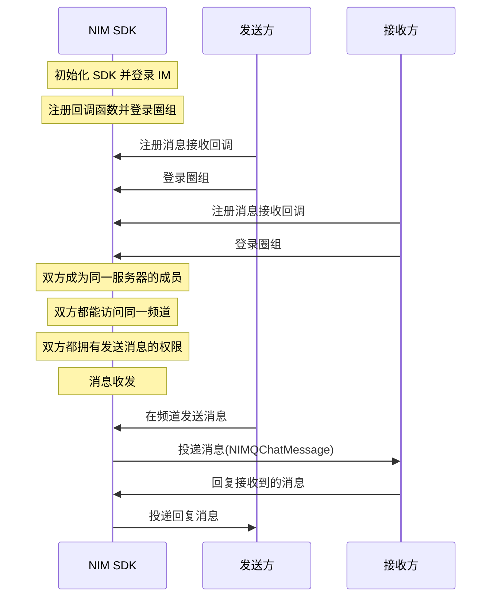

NIM SDK 提供会话消息回复（Thread）功能，可引用接收到的某一条消息进行针对性的回复，形成起始于该消息的消息回复树状结构。通过该功能，用户可针对某一条消息进行提问、反馈或补充相关背景信息，且不会对频道内的会话流造成干扰。NIM SDK 的<a href="https://doc.yunxin.163.com/docs/interface/messaging/iOS/doxygen/Latest/zh/d5/d9c/protocol_n_i_m_q_chat_message_extend_manager-p.html" target="_blank">`NIMQChatMessageExtendManager`</a>协议提供了会话消息回复相关方法。

:::note notice
圈组的会话消息回复功能只能在圈组内使用，且相关接口和即时通讯 IM 的不同。
:::

## 功能介绍

### **什么是 Thread**

Thread 指以一条消息作为根消息的消息回复树状结构，示例见下图。


上图中：

- 消息 A 是消息 B 的**父消息**，消息 B1 是消息 C 的**父消息**
- 消息 C 是消息 B1 的**子消息**
- 消息 A 是消息 B 和消息 C 的**根消息**
- 消息 A、B、C 统称为 **Threaded Message（串联起来的消息）**

::: note note :::
- 一条 Threaded Message 必须有一条父消息或至少一条子消息。如果一条消息既没有父消息，也没有子消息，则为普通消息。
- 若未开通会话消息回复功能，回复时系统会自动将所发消息转换为一条普通消息。
:::

### **UI 示例**

会话消息回复（Thread）的 UI 示例如下：


## 前提条件

开始会话消息回复相关功能集成前，请确保：

- 已[开通圈组的消息回复功能](https://doc.yunxin.163.com/messaging/guide/TM1OTU0MTM?platform=iOS)。圈组的会话消息回复功能需要在开通圈组功能的基础上额外开通后才能使用。
- 已完成圈组初始化。

## 实现方法

### **实现会话消息回复**

#### **API调用时序**




#### **具体流程**

::: note note 
本节仅对上图中标为部分的流程进行说明，其他流程请参考相关文档。例如：
- 服务器成员相关说明，可参见<a href="https://doc.yunxin.163.com/messaging/guide/zMyODEwMTg?platform=iOS" target="_blank">圈组服务器成员管理</a>
- 用户是否能访问某频道的相关说明，可参见<a href="https://doc.yunxin.163.com/messaging/guide/zMwMzg5ODE?platform=iOS" target="_blank">频道黑白名单</a>。
- 权限相关配置说明，可参见[身份组相关](https://doc.yunxin.163.com/messaging/guide/Dk5MTI4Mzc?platform=iOS)。 
:::


1. 发送方和接收方在登录圈组前，调用<a href="https://doc.yunxin.163.com/docs/interface/messaging/iOS/doxygen/Latest/zh/d5/d9c/protocol_n_i_m_q_chat_message_extend_manager-p.html#a548f34af1c270dbbfd7a798026904a0b" target="_blank">`addDelegate:`</a>方法注册<a href="https://doc.yunxin.163.com/docs/interface/messaging/iOS/doxygen/Latest/zh/d4/d3f/protocol_n_i_m_q_chat_message_manager_delegate-p.html#ae9cd05fec4d2efebc7605f1d2f919fc3" target="_blank">`onRecvMessages:`</a>消息接收回调函数。

    示例代码如下：

    ```
    - (void)onRecvMessages:(NSArray<NIMQChatMessage *> *)messages
    {
        //your code, deal messages
    }
    ```

2. 接收方在收到消息后，调用<a href="https://doc.yunxin.163.com/docs/interface/messaging/iOS/doxygen/Latest/zh/d5/d9c/protocol_n_i_m_q_chat_message_extend_manager-p.html#a4168d3018bf1bc48e2c4de3342efcd53" target="_blank">`reply:to:error:`</a>或<a href="https://doc.yunxin.163.com/docs/interface/messaging/iOS/doxygen/Latest/zh/d5/d9c/protocol_n_i_m_q_chat_message_extend_manager-p.html#aefcdaa1a1955470579ad1d1bc6824837" target="_blank">`reply:to:completion:`</a>（异步）方法发送回复消息。

    ::: note notice
    - 需要拥有发送消息的权限才能回复消息。
    - 两条消息的`qchatServerId` 和 `qchatChannelId` 必须相同，因为只能在同一个服务器和频道内回复消息。
    :::

    <br>

    示例代码如下：


    ```
    id<NIMQChatMessageExtendManager> qchatMessageExtendManager = [[NIMSDK sharedSDK] qchatMessageExtendManager];
    NIMQChatMessage *replyMessage = [[NIMQChatMessage alloc] init];
    replyMessage.text = @"回复文本消息的内容";

    //targetMsg--- 被回复的消息是由服务端返回或者缓存中取到的消息

    //同步方法
    NSError *error = nil;
    BOOL result = [qchatMessageExtendManager reply:replyMessage
            to:targetMsg
            error:&error];

    //异步方法
    [qchatMessageExtendManager reply:replyMessage to:targetMsg completion: ^(NSError *error){
        //your code
    }];
    ```
3. `onRecvMessages:`回调函数触发，发送方通过该回调收到接收方回复的消息。


### **相关查询**

#### **根据消息 ID 批量查询回复消息**


调用<a href="https://doc.yunxin.163.com/docs/interface/messaging/iOS/doxygen/Latest/zh/d2/db1/protocol_n_i_m_q_chat_message_manager-p.html#a14ca2a6af92bdc7bb739ad4e1f4731ed" target="_blank">`getMessageHistoryByIds:completion:`</a>，可根据回复消息的 ID 数组查询历史回复消息。查询结果不分页，一次最多查询 100 条。


#### **查询某消息的父消息以及根消息**

调用<a href="https://doc.yunxin.163.com/docs/interface/messaging/iOS/doxygen/Latest/zh/d5/d9c/protocol_n_i_m_q_chat_message_extend_manager-p.html#a34259ae09ba36a307f673d6231cec26b" target="_blank">`getReferMessages:type:completion:`</a>方法查询 Thread 中某条消息的父消息和根消息。

引用类型`NIMQChatMessageReferType`枚举的说明如下：
- `NIMQChatMessageReferTypeReply`：只查询父消息
- `NIMQChatMessageReferTypeThread`：只查询根消息
- `NIMQChatMessageReferTypeAll`：同时查询父消息和根消息

::: note notice
传入的需要查询的消息不能是根消息，否则会返回 414 错误码。
:::

示例代码如下：

```objc
//此处消息来源可以是服务端查询到的，或者收到的，或者缓存的等
NIMQChatMessage *message = ***;
[[NIMSDK sharedSDK].qchatMessageExtendManager getReferMessages: message type: NIMQChatMessageReferTypeReply completion:^(NSError * error, NIMQChatGetMessageHistoryResult * result){
    // your code 
}];

```

#### **查询 Thread 的消息列表**

调用<a href="https://doc.yunxin.163.com/docs/interface/messaging/iOS/doxygen/Latest/zh/d5/d9c/protocol_n_i_m_q_chat_message_extend_manager-p.html#aff2aaa1f21227b11fcb4a77b2491e98e" target="_blank">`getThreadMessages:completion:`</a>方法，可根据某个 Thread 中的任意一条消息分页查询该 Thread 的消息列表（即该 Thread 的聊天历史）。

部分重要参数说明如下：

类型  | 参数  | 说明     
----  | ----  | --------- 
NSTimeInterval |`fromTime`|起始时间
NSNumber * 	|`toTime`|结束时间，如果设置为 0 则为当前时间
NSString * 	|`excludeMsgId`|排除消息ID。如果`fromTime`上有多条消息，可以通过该参数指定实际的起始时间为 `excludeMsgId` 对应的消息的下一条消息的时间
NSNumber * 	|`limit`| 查询结果条数限制，默认 100 条。如果`fromTime`到 `toTime` 之间消息大于 `limit` 条，返回 `limit` 条记录；如果小于 `limit` 条，返回实际条数；当已经查询到头时，返回的结果列表的 size 可能会比 `limit` 小
NSNumber * 	|`reverse`| 是否反向查询（默认 NO ，表示从 `toTime` 开始往前查找历史消息）<br><p>如果17:00:00 到18:00:00的消息总共有200条，查询该时段最多返回 100 条：<p><ul><li>如果设置为 NO，则返回后100条，时间逆序排列，时间从新到旧</li><li>如果设置为 YES，则前100条，时间正序排列，时间从旧到新</li></ul>


示例代码如下：

```objc
NIMQChatGetThreadMessagesParam *param = [NIMQChatGetThreadMessagesParam new];
param.message = msg; //某条用来定位查询的源消息
param.fromTime = 0;
param.toTime = @(0);
param.limit = 5;

[[NIMSDK sharedSDK].qchatMessageExtendManager getThreadMessages:param completion:^(NSError * error, NIMQChatGetThreadMessagesResult * result){
    // your code 
}];

```

#### **批量查询根消息 meta 信息**


调用<a href="https://doc.yunxin.163.com/docs/interface/messaging/iOS/doxygen/Latest/zh/d5/d9c/protocol_n_i_m_q_chat_message_extend_manager-p.html#a21cf68cd5c221cfe0f65606ed4801703" target="_blank">`batchGetMessageThreadInfo:completion:`</a>方法，可批量查询某个频道下的多个 Thread 的根消息的 meta 信息（如总回复数和最后回复时间）。如果查询的消息并非 Thread 的根消息，将不会返回任何信息。故此方法的回调结果为字典结构数据，每条消息 ID 与查询到的信息相对应。


示例代码如下：

```objc

NSArray *msgArr = @[msg1, msg2];

[[NIMSDK sharedSDK].qchatMessageExtendManager batchGetMessageThreadInfo:msgArr completion:^(NSError * error, NSDictionary <NSString *, NIMQChatMessageThreadInfo *> * result){
    // your code 
}];

```
## API 参考

更多相关方法，请参见<a href="https://doc.yunxin.163.com/docs/interface/messaging/iOS/doxygen/Latest/zh/d5/d9c/protocol_n_i_m_q_chat_message_extend_manager-p.html" target="_blank">`NIMQChatMessageExtendManager`</a>协议。


    
    

