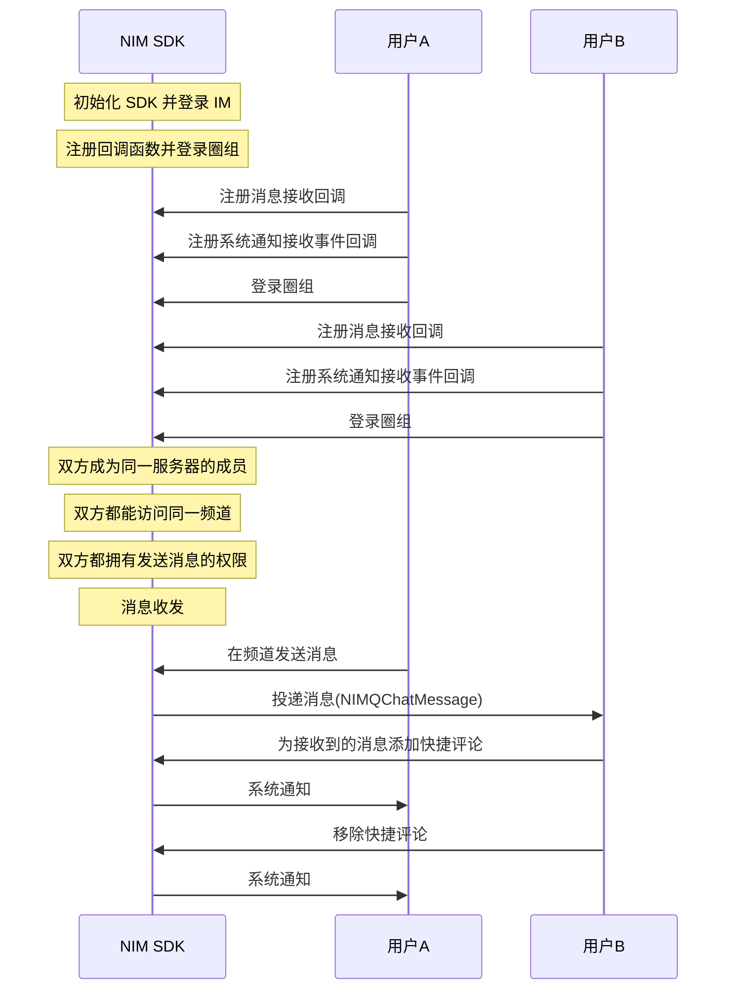

快捷评论是一个操作功能，并非一种消息类型。评论内容并非一条消息，而是一个 int 类型，由开发者指定评论内容与界面展示之间的联系。NIM SDK 的<a href="https://doc.yunxin.163.com/docs/interface/messaging/iOS/doxygen/Latest/zh/d5/d9c/protocol_n_i_m_q_chat_message_extend_manager-p.html" target="_blank">`NIMQChatMessageExtendManager`</a>协议提供了圈组快捷评论的相关方法。

快捷评论的 UI 示例见下图。


## 前提条件

开始圈组快捷评论相关集成前，请确保：

- 已[开通圈组的快捷评论功能](https://doc.yunxin.163.com/messaging/guide/TM1OTU0MTM?platform=iOS)。圈组的快捷评论功能需要在开通圈组功能的基础上额外开通后才能使用。
- 已完成圈组初始化。


## 实现方法

### 添加/移除快捷评论

#### **API 调用时序**




#### **具体流程**

::: note note 
本节仅对上图中标为部分的流程进行说明，其他流程请参考相关文档。例如：
- 服务器成员相关说明，可参见<a href="https://doc.yunxin.163.com/messaging/guide/zMyODEwMTg?platform=iOS" target="_blank">圈组服务器成员管理</a>。
- 用户是否能访问某频道的相关说明，可参见<a href="https://doc.yunxin.163.com/messaging/guide/zMwMzg5ODE?platform=iOS" target="_blank">频道黑白名单</a>。
- 权限相关配置说明，可参见[身份组相关](https://doc.yunxin.163.com/messaging/guide/Dk5MTI4Mzc?platform=iOS)。 
:::


1. 用户A和用户B调用<a href="https://doc.yunxin.163.com/docs/interface/messaging/iOS/doxygen/Latest/zh/d5/d9c/protocol_n_i_m_q_chat_message_extend_manager-p.html#a548f34af1c270dbbfd7a798026904a0b" target="_blank">`addDelegate:`</a>方法注册回调函数并登录。

    - 注册<a href="https://doc.yunxin.163.com/docs/interface/messaging/iOS/doxygen/Latest/zh/d4/d3f/protocol_n_i_m_q_chat_message_manager_delegate-p.html#ae9cd05fec4d2efebc7605f1d2f919fc3" target="_blank">`onRecvMessages:`</a>消息接收回调函数。


    - 注册<a href="https://doc.yunxin.163.com/docs/interface/messaging/iOS/doxygen/Latest/zh/d4/d3f/protocol_n_i_m_q_chat_message_manager_delegate-p.html#aaf1d34a4b6373edc5fbc408f36b98853" target="_blank">`onRecvSystemNotification:`</a>系统通知接收事件回调函数。

    示例代码如下：

    
    :::::: div custom-tabs
    ::: tab 注册消息接收回调

    ```
    - (void)onRecvMessages:(NSArray<NIMQChatMessage *> *)messages
    {
        //your code, deal messages
    }
    ```

    :::
    ::: tab 注册系统通知接收事件回调
    ```
    - (void)onRecvSystemNotification:(NIMQChatReceiveSystemNotificationResult *)result
    {
        //your code 
    }

    ```
    :::
    ::::::

2. 用户B在收到消息后，调用<a href="https://doc.yunxin.163.com/docs/interface/messaging/iOS/doxygen/Latest/zh/d5/d9c/protocol_n_i_m_q_chat_message_extend_manager-p.html#a1ea4e265472c02f86adb99da7cf00506" target="_blank">`addQuickCommentType:toMessage:completion:`</a>方法为接收到的消息添加快捷评论。调用成功后，系统通知接收观察者的回调触发，用户A收到系统通知（`NIMQChatSystemNotificationTypeUpdateQuickComment `）。


    ::: note note 
    用户也可在搜索/查询消息后为消息添加快捷评论，本文仅以接收消息后添加快捷评论作为示例进行说明。
    :::

    ::: note notice
    云信服务端**不会**下发相关系统通知给发起“添加快捷评论”操作的设备，因为操作者不需要接收当前操作的通知。但如果操作者使用相同 IM 账号在其他设备登录，将收到该通知。
    :::

    <br>

    示例代码如下：

    ```

    //服务端获得或本地缓存的消息
    NIMQChatMessage *msg = ***;

    [[NIMSDK sharedSDK].qchatMessageExtendManager addQuickCommentType:6 toMessage:msg completion:^(NSError * error){
        // your code 
    }];

    ```


3. （可选）用户B调用<a href="https://doc.yunxin.163.com/docs/interface/messaging/iOS/doxygen/Latest/zh/d5/d9c/protocol_n_i_m_q_chat_message_extend_manager-p.html#a075a90fe342eb6522ff19618a69d1b46" target="_blank">`deleteQuickCommentType:toMessage:completion:`</a> 方法移除快捷评论。调用成功后，系统通知接收观察者的回调函数触发，用户A收到系统通知（`NIMQChatSystemNotificationTypeUpdateQuickComment `）。


    ::: note notice
    云信服务端**不会**下发相关系统通知给发起“移除快捷评论”操作的设备，因为操作者不需要接收当前操作的通知。但如果操作者使用相同 IM 账号在其他设备登录，将收到该通知。
    :::

    <br>


    示例代码如下：

    
    ```
    //服务端获得或本地缓存的消息
    NIMQChatMessage *msg = ***;

    [[NIMSDK sharedSDK].qchatMessageExtendManager deleteQuickCommentType:6 toMessage:msg completion:^(NSError * error){
        // your code 
    }];

    ```
### 查询快捷评论列表

调用<a href="https://doc.yunxin.163.com/docs/interface/messaging/iOS/doxygen/Latest/zh/d5/d9c/protocol_n_i_m_q_chat_message_extend_manager-p.html#a84774a475b25475f121cb345ff50edb0" target="_blank">`fetchQuickComments:completion:`</a>可查询指定消息所包含的快捷评论列表。

返回的快捷评论详情 `NIMQChatFetchQuickCommentsByMsgsResult` 的结构为 NSDictionary，key 为消息的 `msgIdQuickCommentDic`，value 为 `NIMQChatMessageQuickCommentInfo`。

`NIMQChatMessageQuickCommentInfo`的参数说明如下：

参数  | 类型 | 说明     
----  | ----  | --------- 
`serverId`|unsigned long long |服务器 ID
`channelId`|unsigned long long |频道 ID
`msgServerId`|NSString|消息服务端 ID
`count`|NSInteger|总评论数
`updateTime`|NSTimeInterval |消息评论最后一次操作的时间
`commentArray`|`NSArray< NIMQChatMessageQuickCommentsDetail * > *`|评论详情列表

其中`NIMQChatMessageQuickCommentsDetail`的参数说明如下：

参数  | 类型 | 说明     
----  | ----  | --------- 
`replyType`|NSInteger |评论类型
`selfReplyed`|BOOL|自己是否添加了该类型评论
`count`|NSInteger|总评论数
`createTime`|NSTimeInterval |消息评论的创建时间
`replyAccIds`|`NSArray< NSString * > * `|若干个添加了此类型评论的用户 ID （`accid`）列表，随机获取结果
    

示例代码如下：

```
//服务端获得或本地缓存的消息
NSArray *msgArr = @[msg1, msg2];

[[NIMSDK sharedSDK].qchatMessageExtendManager fetchQuickComments:msgArr completion:^(NSError *  error, NIMQChatFetchQuickCommentsByMsgIdsResult * result){
    // your code 
}];

```

### 查询指定快捷评论类型的所有用户信息

**若需要全量获取指定消息下某个快捷评论类型的所有用户信息**，可调用 `getCommentators` 方法实现。

该接口为分页接口，可多次调用接口，通过翻页的形式查询到全量用户的基本信息。

该接口的入参 `NIMQChatGetCommentatorsParam` 如下：

参数  | 类型 | 是否必填|说明     
----  | ----  | --------- |------
`serverId`|unsigned long long|是|圈组服务器 ID
`channelId`|unsigned long long|是|频道 ID
`messageServerId`|NSString |是|消息的服务端 ID
`type`|NSInteger|是|快捷评论的类型（自定义），即评论内容
`limit`|NSInteger|否|单页查询的数量限制，默认值和最大值都为 100
`pageToken`|NSString|否|分页标记符，第一页不传，翻下一页传接口返回的pageToken


查询成功后，返回的快捷评论所有用户信息如下：

参数  | 类型 | 说明     
----  | ----  | --------- 
`commentators`|`NSArray< NIMQChatCommentator * > *`|该快捷评论下的所有用户列表信息
 `accountId`|NSString |用户账号 ID
 `nick`|NSString|用户昵称
 `avatar`|NSString|用户头像
 `createTime`|NSTimeInterval |评论时间戳
`total`|NSInteger|该快捷评论下的评论者总数量
`hasMore`|BOOL |是否还有下一页数据
`pageToken`|NSString|分页标记符，翻下一页时使用


示例代码如下：

```objective-c
NIMQChatGetCommentatorsParam *param = [[NIMQChatGetCommentatorsParam alloc] init];
param.serverId = 10000;
param.channelId = 20000;
// 评论类型
param.type = 1;
// 消息的服务器ID，是一个正整数格式的字符串
param.messageServerId = @"123456";
param.limit = 100;
// 第一页不填，第二页填上一页返回的pageToken
// param.pageToken = @"12xx";
[[NIMSDK sharedSDK].qchatMessageExtendManager getCommentators:param
                                                   completion:^(NSError *_Nullable error, NIMQChatGetCommentatorsResult *_Nullable result) 
                                                   {
                                                       if (error) 
                                                       {
                                                           // 成功
                                                           // 翻页在pageToken一项填入result.pageToken
                                                       } else 
                                                       {
                                                           // 失败
                                                       }
                                                   }];

```
