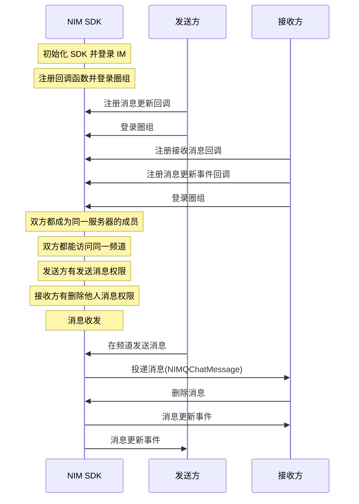

NIM SDK 的<a href="https://doc.yunxin.163.com/docs/interface/messaging/iOS/doxygen/Latest/zh/d2/db1/protocol_n_i_m_q_chat_message_manager-p.html" target="_blank">`NIMQChatMessageManager`</a>协议提供方法支持在发送消息后删除消息。

::: note notice
消息发送方和拥有删除他人消息权限（`NIMQChatPermissionTypeDeleteOtherMsg`）的频道成员都可删除消息。 
:::

## 前提条件

- 已[开通圈组功能](https://doc.yunxin.163.com/messaging/guide/TM1OTU0MTM?platform=iOS)。
- 已完成圈组初始化。

## 实现流程

### API 调用时序




### 具体流程

::: note note 
本节仅对上图中标为部分的流程进行说明，其他流程请参考相关文档。例如：
- 服务器成员相关说明，可参见<a href="https://doc.yunxin.163.com/messaging/guide/zMyODEwMTg?platform=iOS" target="_blank">圈组服务器成员管理</a>。
- 用户是否能访问某频道的相关说明，可参见<a href="https://doc.yunxin.163.com/messaging/guide/zMwMzg5ODE?platform=iOS" target="_blank">频道黑白名单</a>。
- 权限相关配置说明，可参见[身份组相关](https://doc.yunxin.163.com/messaging/guide/Dk5MTI4Mzc?platform=iOS)。 
:::


1. 调用 <a href="https://doc.yunxin.163.com/docs/interface/messaging/iOS/doxygen/Latest/zh/d2/db1/protocol_n_i_m_q_chat_message_manager-p.html#af7c4d8b6a4ffe00dd6b40d3dd01e40fa" target="_blank">`addDelegate:`</a> 方法添加委托（具体回调函数如下）并登录。
    - 发送方在登录圈组前，注册<a href="https://doc.yunxin.163.com/docs/interface/messaging/iOS/doxygen/Latest/zh/d4/d3f/protocol_n_i_m_q_chat_message_manager_delegate-p.html#a4ae4b554d71de6b99f5428c38bd7824d" target="_blank">`onMessageUpdate:`</a>消息更新事件回调函数。
    - 接收方在登录圈组前，注册<a href="https://doc.yunxin.163.com/docs/interface/messaging/iOS/doxygen/Latest/zh/d4/d3f/protocol_n_i_m_q_chat_message_manager_delegate-p.html#ae9cd05fec4d2efebc7605f1d2f919fc3" target="_blank">`onRecvMessages:`</a>消息接收回调函数和`onMessageUpdate:`消息更新事件回调函数。

    示例代码如下：


    :::::: div custom-tabs
    ::: tab 注册消息接收回调

    ```
    - (void)onRecvMessages:(NSArray<NIMQChatMessage *> *)messages
    {
        //your code, deal messages
    }
    ```
    :::

    ::: tab 注册消息更新回调

    ```
    - (void)onMessageUpdate:(NIMQChatUpdateMessageEvent *)event
    {
        
    }
    ```

    :::
    ::::::
    
2. 接收方在收到消息后，调用<a href="https://doc.yunxin.163.com/docs/interface/messaging/iOS/doxygen/Latest/zh/d2/db1/protocol_n_i_m_q_chat_message_manager-p.html#afc9c73c001a22be332f49ea2ac95f13e" target="_blank">`deleteMessage:completion:
`</a>方法删除消息。

    ::: note notice 
    删除未读消息将影响未读数。
    :::

    <br>

    示例代码如下：

    ```
    id<NIMQChatMessageManager> qchatMessageManager = [[NIMSDK sharedSDK] qchatMessageManager];
    NIMQChatDeleteMessageParam *param = [[NIMQChatDeleteMessageParam alloc] init];
    param.message = message;
    NIMQChatUpdateParam *updateParam = [[NIMQChatUpdateParam alloc] init];
    updateParam.postscript = @"删除附言";
    param.updateParam = updateParam;
    [qchatMessageManager deleteMessage:param
        completion:^(NSError *__nullable error, NIMQChatUpdateMessageResult *__nullable result) {
        // your code
    }];
    ```

3. `onMessageUpdate:`消息更新事件回调触发，接收方和发送方通过该回调获取消息删除结果。


