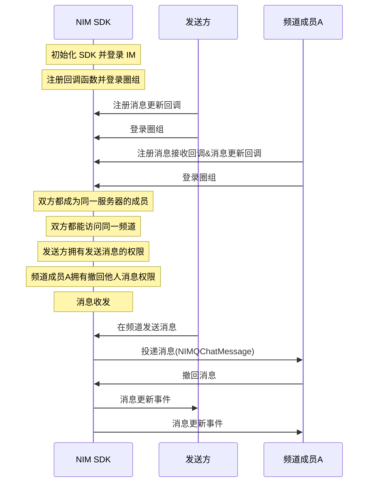

NIM SDK 的<a href="https://doc.yunxin.163.com/docs/interface/messaging/iOS/doxygen/Latest/zh/d2/db1/protocol_n_i_m_q_chat_message_manager-p.html" target="_blank">`NIMQChatMessageManager`</a>协议提供圈组消息撤回的方法，支持在消息发送后将消息撤回。圈组的消息撤回功能属于双向撤回。撤回之后，消息接收者和发送者都将收到消息更新事件。

::: note notice
消息发送方和拥有撤回他人消息权限（`NIMQChatPermissionTypeRevokeMsg`）的频道成员都可撤回消息。 
:::


## 前提条件

- 已[开通圈组功能](https://doc.yunxin.163.com/messaging/guide/TM1OTU0MTM?platform=iOS)。
- 已完成圈组初始化。


## 使用限制

圈组消息可撤回时长默认为 120s，即默认只能在消息发送后 2 分钟内撤回消息。

若需要扩展上限，可在控制台配置圈组子功能项（**圈组消息可撤回时长**），具体请参考[开通和配置圈组功能](https://doc.yunxin.163.com/messaging/guide/TM1OTU0MTM?platform=iOS)。


## 实现流程


::: note note 
本文以 **发送方的消息被频道成员A 撤回** 为例进行介绍，即发送方在下文中为消息被撤回的一方。
:::

### API 调用时序




### 具体流程


::: note note 
本节仅对上图中标为部分的流程进行说明，其他流程请参考相关文档。例如：
- 服务器成员相关说明，可参见<a href="https://doc.yunxin.163.com/messaging/guide/zMyODEwMTg?platform=iOS" target="_blank">圈组服务器成员管理</a>。
- 用户是否能访问某频道的相关说明，可参见<a href="https://doc.yunxin.163.com/messaging/guide/zMwMzg5ODE?platform=iOS" target="_blank">频道黑白名单</a>。
- 权限相关配置说明，可参见[身份组相关](https://doc.yunxin.163.com/messaging/guide/Dk5MTI4Mzc?platform=iOS)。 
:::


1. 调用 <a href="https://doc.yunxin.163.com/docs/interface/messaging/iOS/doxygen/Latest/zh/d2/db1/protocol_n_i_m_q_chat_message_manager-p.html#af7c4d8b6a4ffe00dd6b40d3dd01e40fa" target="_blank">`addDelegate:`</a> 方法添加委托（具体回调函数如下）并登录。
    - 双方在登录圈组前，注册<a href="https://doc.yunxin.163.com/docs/interface/messaging/iOS/doxygen/Latest/zh/d4/d3f/protocol_n_i_m_q_chat_message_manager_delegate-p.html#a4ae4b554d71de6b99f5428c38bd7824d" target="_blank">`onMessageUpdate:`</a>消息更新事件回调函数。
    - 频道成员A 在登录圈组前，注册<a href="https://doc.yunxin.163.com/docs/interface/messaging/iOS/doxygen/Latest/zh/d4/d3f/protocol_n_i_m_q_chat_message_manager_delegate-p.html#ae9cd05fec4d2efebc7605f1d2f919fc3" target="_blank">`onRecvMessages:`</a>消息接收回调函数；同时注册`onMessageUpdate:`消息更新事件回调函数。

    示例代码如下：


    :::::: div custom-tabs
    ::: tab 消息接收回调

    ```
    - (void)onRecvMessages:(NSArray<NIMQChatMessage *> *)messages
    {
        //your code, deal messages
    }
    ```
    :::
    ::: tab 消息更新事件回调

    ```
    - (void)onMessageUpdate:(NIMQChatUpdateMessageEvent *)event
    {
        
    }
    ```


    :::
    ::::::

2. 频道成员A 接收消息后，调用<a href="https://doc.yunxin.163.com/docs/interface/messaging/iOS/doxygen/Latest/zh/d2/db1/protocol_n_i_m_q_chat_message_manager-p.html#ae5ea875ca1bd6ad476188a8e55a44b61" target="_blank">`revokeMessage:completion:`</a>方法撤回该消息。


    <note type=note>非消息发送方需要拥有撤回他人消息的权限，才能撤回消息。</note>
    
    示例代码如下：


    ```
    id<NIMQChatMessageManager> qchatMessageManager = [[NIMSDK sharedSDK] qchatMessageManager];
    NIMQChatRevokeMessageParam *param = [[NIMQChatRevokeMessageParam alloc] init];
    param.message = message;
    NIMQChatUpdateParam *updateParam = [[NIMQChatUpdateParam alloc] init];
    updateParam.postscript = @"撤回附言";
    param.updateParam = updateParam;
    [qchatMessageManager revokeMessage:param
        completion:^(NSError *__nullable error, NIMQChatUpdateMessageResult *__nullable result) {
        // your code
    }];

    ```

3. `onMessageUpdate:`消息更新事件回调触发，发送方和频道成员A 可通过该回调获取消息撤回通知。


    ::: note notice
    云信服务端**不会**下发“消息撤回通知”给发起撤回操作的设备，因为操作者不需要接收当前操作的通知。但如果操作者使用相同 IM 账号在其他设备登录，将收到该通知。
    :::