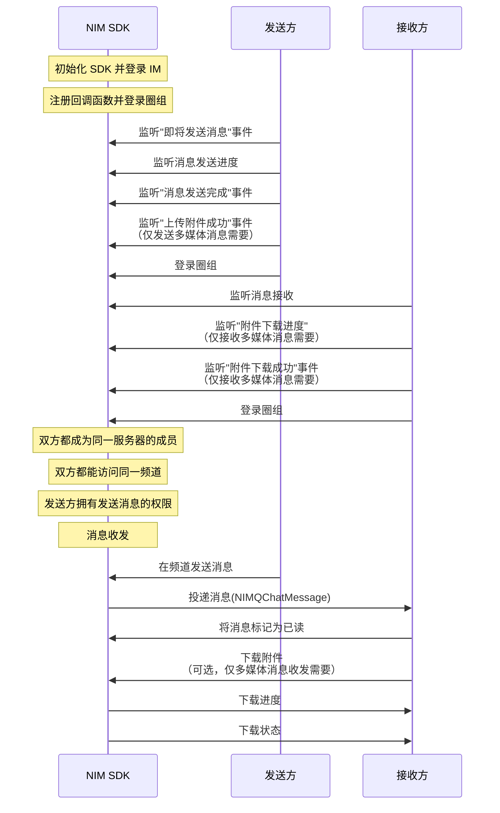

NIM SDK 的<a href="https://doc.yunxin.163.com/docs/interface/messaging/iOS/doxygen/Latest/zh/d2/db1/protocol_n_i_m_q_chat_message_manager-p.html" target="_blank">`NIMQChatMessageManager`</a>协议提供圈组消息收发的方法，支持支持文本、图片、语音、视频、文件、地理位置和自定义等消息类型。定义圈组消息的结构体为<a href="https://doc.yunxin.163.com/docs/interface/messaging/iOS/doxygen/Latest/zh/de/d21/interface_n_i_m_q_chat_message.html" target="_blank">`NIMQchatMessage`</a>。

## 功能介绍

| <div style="width:100px">消息类型</div> | <div style="width:100px">API关键字</div>  | 说明    |             
| :---------- | :----------|:----------------------------- |:----------------------------- |
| 文本消息        | `text` | 消息内容为普通文本 |  
| 图片消息        | `image`  | 消息内容为图片 URL 地址、尺寸、图片大小等信息               |  
| 语音消息        | `audio` | 消息内容为语音文件的 URL 地址、时长、大小、格式等信息 | 
| 视频消息        | `video` | 消息内容为视频文件的 URL 地址、时长、大小、格式等信息 | 
| 文件消息        |  `file` | 消息内容为文件的 URL 地址、大小、格式等信息         | 
| 位置消息      | `location`  | 消息内容为地理位置标题、经度、纬度信息         | 
| 提示消息        | `tip` | 又叫做 Tip 消息，没有推送和通知栏提醒，主要用于会话内的通知提醒，例如进入会话时出现的欢迎消息，或是会话过程中命中敏感词后的提示消息等场景 |
|  通知消息  |  `notification`  | 主要用于圈组的事件通知 | 
| 自定义消息       | `custom` | 开发者自定义的消息类型，例如红包消息、石头剪子布等形式的消息           | 

## 技术原理

下图展示了集成并初始化 NIM SDK 后，实现圈组消息收发的基本工作流。图中的 QChat 即为 NIM SDK 的圈组组件，云信服务端包含 IM 服务端和圈组服务端。


::: note notice 
- 上图仅以静态 Token 登录为例展示消息收发流程。网易云信 IM 还支持动态 Token 登录鉴权和第三方回调登录鉴权，相关详情请参见<a href="https://doc.yunxin.163.com/messaging/guide/zE2NzA3Mjc?platformId=60353" target="_blank">登录鉴权</a>。
- **圈组服务端**与**圈组服务器**是两个不同概念，前者指云信服务器内提供圈组功能的服务端，后者为圈组的特殊概念，对应 Discord 的 Server, 为社群本身。
:::

<br>

上图中的流程可归纳为如下 5 步：

1. 账号集成与登录。
    1. 开发者将应用的用户账号传入云信 IM 服务端，注册云信 IM 账号。
    2. 云信 IM 服务端返回 Token 给应用服务端。
    3. 应用客户端登录应用服务端。
    4. 应用服务端将 Token 返回给应用客户端。
    5. 用户A 和用户B 带 Token 登录云信 IM 服务端。
    6. 用户A 和用户B 登录云信圈组服务端，此时无需再传入 Token 等参数。
7. 用户A 创建圈组服务器，并在服务器内创建频道。
8. 用户B 加入圈组服务器。
8. 用户A 在频道发送一条消息到云信圈组服务端。 
7. 云信圈组服务端投递消息至频道，用户B 接收消息。


## 前提条件

- 已[开通圈组功能](https://doc.yunxin.163.com/messaging/guide/TM1OTU0MTM?platform=iOS)。
- 已完成圈组初始化。

::: note important
如果频道所属的服务器的成员人数超过 2000 人阈值，接收方还必须先订阅该频道，才能收到该频道的消息。如果未超过 2000 人阈值，无需订阅也能收到消息。订阅相关说明，请参见<a href="https://doc.yunxin.163.com/messaging/guide/zAxNjQzMDA?platform=iOS" target="_blank">圈组订阅机制</a>。
:::


## 实现流程

### 实现消息收发


#### **API 调用时序**




#### **流程说明**

::: note note 
本节仅对上图中标为部分的流程进行说明，其他流程请参考相关文档。例如：
- 服务器成员相关说明，可参见<a href="https://doc.yunxin.163.com/messaging/guide/zMyODEwMTg?platform=iOS" target="_blank">圈组服务器成员管理</a>。
- 用户是否能访问某频道的相关说明，可参见<a href="https://doc.yunxin.163.com/messaging/guide/zMwMzg5ODE?platform=iOS" target="_blank">频道黑白名单</a>。
- 权限相关配置说明，可参见[身份组相关](https://doc.yunxin.163.com/messaging/guide/Dk5MTI4Mzc?platform=iOS)。 
:::


1. 发送方在登录圈组前，调用 <a href="https://doc.yunxin.163.com/docs/interface/messaging/iOS/doxygen/Latest/zh/d2/db1/protocol_n_i_m_q_chat_message_manager-p.html#af7c4d8b6a4ffe00dd6b40d3dd01e40fa" target="_blank">`addDelegate:`</a> 方法添加委托（具体回调函数如下）。
    - 注册<a href="https://doc.yunxin.163.com/docs/interface/messaging/iOS/doxygen/Latest/zh/d4/d3f/protocol_n_i_m_q_chat_message_manager_delegate-p.html#a951eceb54118fc00f3d08a42ccf11e00" target="_blank">`willSendMessage`</a>消息即将发送回调函数。 
    - 注册<a href="https://doc.yunxin.163.com/docs/interface/messaging/iOS/doxygen/Latest/zh/d4/d3f/protocol_n_i_m_q_chat_message_manager_delegate-p.html#a8478a23a4aa02f66fca957223b14ef96" target="_blank">`sendMessage:progress:`</a>消息发送进度回调函数。

    - 注册<a href="https://doc.yunxin.163.com/docs/interface/messaging/iOS/doxygen/Latest/zh/d4/d3f/protocol_n_i_m_q_chat_message_manager_delegate-p.html#a15781b32b18e69b7e7812a0809f6165d" target="_blank">`sendMessage:didCompleteWithError:`</a>消息发送完成回调函数。
    - 如果发送的是**多媒体消息**（包括图片、语音、视频和文件消息），还需注册<a href="https://doc.yunxin.163.com/docs/interface/messaging/iOS/doxygen/Latest/zh/d4/d3f/protocol_n_i_m_q_chat_message_manager_delegate-p.html#a7d6bd3524db9677bca14d0e52eb82eb3" target="_blank">`uploadAttachmentSuccess:forMessage:`</a>附件上传完成回调函数。


    示例代码如下：


    :::::: div custom-tabs
    ::: tab 消息即将发送回调
    ```
    - (void)willSendMessage:(NIMQChatMessage *)message
    {
        //your code
    }
    ```
    :::
    ::: tab 消息发送进度回调
    ```objc
    //消息发送进度
    - (void)sendMessage:(NIMQChatMessage *)message
           progress:(float)progress
    {
        //your code    
    }
    ```
    :::
    ::: tab 消息发送完成回调
    ```objc
    - (void)sendMessage:(NIMQChatMessage *)message didCompleteWithError:(nullable NSError *)error
    {
    //your code
    }
    ```
    :::
    ::: tab 附件上传完成回调
    ```objc
    - (void)uploadAttachmentSuccess:(NSString *)urlString
                     forMessage:(NIMQChatMessage *)message
    {
        //your code
    }
    ```
    :::
    ::::::
    
2. 接收方在登录前，调用<a href="https://doc.yunxin.163.com/docs/interface/messaging/iOS/doxygen/Latest/zh/d2/db1/protocol_n_i_m_q_chat_message_manager-p.html#af7c4d8b6a4ffe00dd6b40d3dd01e40fa" target="_blank">`addDelegate:`</a>方法添加委托（具体回调函数如下）。
    - 注册<a href="https://doc.yunxin.163.com/docs/interface/messaging/iOS/doxygen/Latest/zh/d4/d3f/protocol_n_i_m_q_chat_message_manager_delegate-p.html#ae9cd05fec4d2efebc7605f1d2f919fc3" target="_blank">`onRecvMessages:`</a>消息接收回调函数。
    - 如果接收多媒体消息，还需注册<a href="https://doc.yunxin.163.com/docs/interface/messaging/iOS/doxygen/Latest/zh/d4/d3f/protocol_n_i_m_q_chat_message_manager_delegate-p.html#a4e7350af9dedcfe7087e216ef5b44a2c" target="_blank">`fetchMessageAttachment:progress:`</a>消息下载进度回调函数。
    - 如果接收多媒体消息，还需注册<a href="https://doc.yunxin.163.com/docs/interface/messaging/iOS/doxygen/Latest/zh/d4/d3f/protocol_n_i_m_q_chat_message_manager_delegate-p.html#a1e0cdc7ad8f888d572b9e3644237c136" target="_blank">`fetchMessageAttachment:didCompleteWithError:`</a>消息下载完成回调函数。

    示例代码如下：


    :::::: div custom-tabs
    ::: tab 消息接收回调函数
    ```
    - (void)onRecvMessages:(NSArray<NIMQChatMessage *> *)messages
    {
        //your code, deal messages
    }
    ```
    :::

    ::: tab 附件下载进度进度回调
    ```objc
    /**
     *  收取消息附件回调
     *  @param message  当前收取的消息
     *  @param progress 进度
     *  @discussion 附件包括:图片,视频的缩略图,语音文件
     */
    - (void)fetchMessageAttachment:(NIMQChatMessage *)message
                      progress:(float)progress
    {
        //your code
    }
    ```
    :::

    ::: tab 附件下载完成回调
    ```objc
    /**
     *  收取消息附件完成回调
     *
     *  @param message 当前收取的消息
     *  @param error   错误返回,如果收取成功,error为nil
     */
    - (void)fetchMessageAttachment:(NIMQChatMessage *)message
            didCompleteWithError:(nullable NSError *)error
    {
        //your code
    }
    ```
    :::
    ::::::
    
3. 发送方构建一条消息，并调用<a href="https://doc.yunxin.163.com/docs/interface/messaging/iOS/doxygen/Latest/zh/d2/db1/protocol_n_i_m_q_chat_message_manager-p.html#a24452d81b713fb77b6704dcf55521b7b" target="_blank">`sendMessage:toSession:error:`</a>或针对大文件的<a href="https://doc.yunxin.163.com/docs/interface/messaging/iOS/doxygen/Latest/zh/d2/db1/protocol_n_i_m_q_chat_message_manager-p.html#a15fb23ede995f9695a134a6d38895a02" target="_blank">`sendMessage:toSession:completion:`</a>异步方法发送该消息。调用时通过`messageType`参数设置消息类型。


    调用时，可通过<a href="https://doc.yunxin.163.com/docs/interface/messaging/iOS/doxygen/Latest/zh/dc/dda/interface_n_i_m_message_setting.html" target="_blank">`NIMMessageSetting`</a>配置消息是否保存历史消息、计入未读数、需要推送和开启抄送等。


    ::: note notice
    消息发送方需要拥有发送消息的权限（`NIMQChatPermissionTypeSendMsg`）。
    :::


    <br>


    部分重要方法说明如下：
    
    参数  |   类型   |    说明
    ---- | -------------- | ---------
    `yidunAntiSpamSetting`| <a href="https://doc.yunxin.163.com/docs/interface/messaging/iOS/doxygen/Latest/zh/d0/d1a/interface_n_i_m_q_chat_message_antispam_setting.html" target="_blank">`NIMQChatMessageAntispamSetting`</a>  | 配置安全通（易盾反垃圾）相关的各项参数。如果您配置了这些参数，在发送消息时，会对发送的文本和附件进行内容审核（反垃圾检测）。根据您在云信控制台预设的拦截/过滤规则，如果检测到违规内容，消息可能发送失败或者敏感信息被过滤。<note type=notice>圈组的安全通功能属于增值功能，需要在开通圈组功能后再额外开通，具体请参考[开通 IM 安全通](https://doc.yunxin.163.com/messaging/guide/jYxOTcyNzY?platform=server)。</note>
    `mentionAll` | BOOL |是否@所有人，false:否，true:是<note type=notice>用户需要拥有@所有人权限才能@所有人。</note>
    `mentionedAccids` | `NSArray<NSString *>`	| @部分人，如果将该消息设置为@所有人或者@身份组，则本参数无效）<note type=notice>用户需要拥有@他人权限（`remindOther`）才能@部分人。</note>
    `mentionRoleIds` | `NSArray<NSString *>` | @的身份组列表，最多@ 10 个身份组。如果将该消息设置为@所有人，则本参数无效 <note type=notice>用户需要拥有@身份组权限才能@身份组。</note>

    <div>
    
    发送不同类型消息的示例代码如下：


    
    :::::: div custom-tabs
    ::: tab 文本
    ```
    id<NIMQChatMessageManager> qchatMessageManager = [[NIMSDK sharedSDK] qchatMessageManager];
    NIMQChatMessage *message = [[NIMQChatMessage alloc] init];
    NIMSession * session = [NIMSession sessionForQChat:121212 qchatServerId:123456];
    message.text = @"文本消息的内容";

    //反垃圾
    NIMQChatMessageAntispamSetting *antispamSetting = [NIMQChatMessageAntispamSetting new];
    antispamSetting.antiSpamBusinessId = @"{\"txtbid\":\"5624564236342d543\"}";
    antispamSetting.antiSpamUsingYidun = YES;
    message.yidunAntiSpamSetting = antispamSetting;

    //抄送
    message.env = @"***"

    NSError *error = nil;
    BOOL result = [qchatMessageManager sendMessage:message
        toSession:session
            error:&error];

    ```
    :::

    ::: tab 图片
    ```
    id<NIMQChatMessageManager> qchatMessageManager = [[NIMSDK sharedSDK] qchatMessageManager];
    NIMQChatMessage *message = [[NIMQChatMessage alloc] init];
    NIMSession * session = [NIMSession sessionForQChat:121212 qchatServerId:123456];
    message.text = @"图片";
    NIMImageObject * imageObject = [[NIMImageObject alloc] initWithImage:[UIImage imageNamed:@"**"]];
    message.messageObject        = imageObject;
    //反垃圾
    NIMQChatMessageAntispamSetting *antispamSetting = [NIMQChatMessageAntispamSetting new];
    antispamSetting.antiSpamBusinessId = @"{\"txtbid\":\"5624564236342d543\"}";
    antispamSetting.antiSpamUsingYidun = YES;
    message.yidunAntiSpamSetting = antispamSetting;

    //抄送
    message.env = @"***"

    NSError *error = nil;
    BOOL result = [qchatMessageManager sendMessage:message
        toSession:session
            error:&error];

    ```

    ::: 

    ::: tab 语音
    ```
    id<NIMQChatMessageManager> qchatMessageManager = [[NIMSDK sharedSDK] qchatMessageManager];
    NIMQChatMessage *message = [[NIMQChatMessage alloc] init];
    NIMSession * session = [NIMSession sessionForQChat:121212 qchatServerId:123456];
    message.text = @"语音";
    //filePath 为音频路径 
    NIMAudioObject *audioObject = [[NIMAudioObject alloc] initWithSourcePath:filePath];
    message.messageObject      = audioObject;
    //反垃圾
    NIMQChatMessageAntispamSetting *antispamSetting = [NIMQChatMessageAntispamSetting new];
    antispamSetting.antiSpamBusinessId = @"{\"txtbid\":\"5624564236342d543\"}";
    antispamSetting.antiSpamUsingYidun = YES;
    message.yidunAntiSpamSetting = antispamSetting;

    //抄送
    message.env = @"***"

    NSError *error = nil;
    BOOL result = [qchatMessageManager sendMessage:message
        toSession:session
            error:&error];

    ```
    :::

    ::: tab 视频
    ```
    id<NIMQChatMessageManager> qchatMessageManager = [[NIMSDK sharedSDK] qchatMessageManager];
    NIMQChatMessage *message = [[NIMQChatMessage alloc] init];
    NIMSession * session = [NIMSession sessionForQChat:121212 qchatServerId:123456];
    message.text = @"文本消息的内容";
    //filePath 为视频路径 
    NIMVideoObject *videoObject = [[NIMVideoObject alloc] initWithSourcePath:filePath];
    message.messageObject       = videoObject;

    //反垃圾
    NIMQChatMessageAntispamSetting *antispamSetting = [NIMQChatMessageAntispamSetting new];
    antispamSetting.antiSpamBusinessId = @"{\"txtbid\":\"5624564236342d543\"}";
    antispamSetting.antiSpamUsingYidun = YES;
    message.yidunAntiSpamSetting = antispamSetting;

    //抄送
    message.env = @"***"

    NSError *error = nil;
    BOOL result = [qchatMessageManager sendMessage:message
        toSession:session
            error:&error];

    ```
    :::

    ::: tab 文件
    ```
    id<NIMQChatMessageManager> qchatMessageManager = [[NIMSDK sharedSDK] qchatMessageManager];
    NIMQChatMessage *message = [[NIMQChatMessage alloc] init];
    NIMSession * session = [NIMSession sessionForQChat:121212 qchatServerId:123456];
    message.text = @"文件";
    //filePath 为文件路径
    NIMFileObject *object = [[NIMFileObject alloc] initWithSourcePath:filepath];  
    message.messageObject = object;  
    //反垃圾
    NIMQChatMessageAntispamSetting *antispamSetting = [NIMQChatMessageAntispamSetting new];
    antispamSetting.antiSpamBusinessId = @"{\"txtbid\":\"5624564236342d543\"}";
    antispamSetting.antiSpamUsingYidun = YES;
    message.yidunAntiSpamSetting = antispamSetting;
    
    //抄送
    message.env = @"***"

    NSError *error = nil;
    BOOL result = [qchatMessageManager sendMessage:message
        toSession:session
            error:&error];

    ```
    :::

    ::: tab 提示
    ```
    id<NIMQChatMessageManager> qchatMessageManager = [[NIMSDK sharedSDK] qchatMessageManager];
    NIMQChatMessage *message = [[NIMQChatMessage alloc] init];
    NIMSession * session = [NIMSession sessionForQChat:121212 qchatServerId:123456];
    message.text = @"提示";
    NIMTipObject *object = [[NIMTipObject alloc] init];
    object.attach = @"*****";
    message.messageObject = object;
    //反垃圾
    NIMQChatMessageAntispamSetting *antispamSetting = [NIMQChatMessageAntispamSetting new];
    antispamSetting.antiSpamBusinessId = @"{\"txtbid\":\"5624564236342d543\"}";
    antispamSetting.antiSpamUsingYidun = YES;
    message.yidunAntiSpamSetting = antispamSetting;

    //抄送
    message.env = @"***"

    NSError *error = nil;
    BOOL result = [qchatMessageManager sendMessage:message
        toSession:session
            error:&error];

    ```
    :::

    ::: tab 通知
    ```
    id<NIMQChatMessageManager> qchatMessageManager = [[NIMSDK sharedSDK] qchatMessageManager];
    NIMQChatMessage *message = [[NIMQChatMessage alloc] init];
    NIMSession * session = [NIMSession sessionForQChat:121212 qchatServerId:123456];
    message.text = @"通知";
    NIMNotificationObject *object = [[NIMNotificationObject alloc] init];
    object.content = @"**向你打了个招呼";
    message.messageObject         = object;
    //反垃圾
    NIMQChatMessageAntispamSetting *antispamSetting = [NIMQChatMessageAntispamSetting new];
    antispamSetting.antiSpamBusinessId = @"{\"txtbid\":\"5624564236342d543\"}";
    antispamSetting.antiSpamUsingYidun = YES;
    message.yidunAntiSpamSetting = antispamSetting;

    //抄送
    message.env = @"***"

    NSError *error = nil;
    BOOL result = [qchatMessageManager sendMessage:message
        toSession:session
            error:&error];

    ```
    :::

    ::: tab 自定义
    ```
    id<NIMQChatMessageManager> qchatMessageManager = [[NIMSDK sharedSDK] qchatMessageManager];
    NIMQChatMessage *message = [[NIMQChatMessage alloc] init];
    NIMSession * session = [NIMSession sessionForQChat:121212 qchatServerId:123456];
    NIMCustomObject *object = [[NIMCustomObject alloc] init];
    //自定义对象的附件需要实现<>
    object.attachment = id<NIMCustomAttachment>**;
    message.messageObject         = object;

    //反垃圾
    NIMQChatMessageAntispamSetting *antispamSetting = [NIMQChatMessageAntispamSetting new];
    antispamSetting.antiSpamBusinessId = @"{\"txtbid\":\"5624564236342d543\"}";
    antispamSetting.antiSpamUsingYidun = YES;
    message.yidunAntiSpamSetting = antispamSetting;

    //抄送
    message.env = @"***"

    NSError *error = nil;
    BOOL result = [qchatMessageManager sendMessage:message
        toSession:session
            error:&error];

    ```
    :::
    
    ::::::

3. 消息接收回调函数触发，消息投递至接收方。

4. 接收方调用<a href="https://doc.yunxin.163.com/docs/interface/messaging/iOS/doxygen/Latest/zh/d2/db1/protocol_n_i_m_q_chat_message_manager-p.html#a9396b9895d6c6ce125facb29dd856241" target="_blank">`markMessageRead:completion:`</a>方法将接收到的消息标记为已读。

    ::: note notice
    - 将消息标记为已读后，该消息之前接收到的消息全部变为已读状态。
    - 如果传入的时间戳参数为 0，则频道内所有消息将被标记为未读。
    - 该方法调用存在频控，300ms 内最多可调用一次。
    :::

    示例代码如下：

    ```
    id<NIMQChatMessageManager> qchatMessageManager = [[NIMSDK sharedSDK] qchatMessageManager];
    NIMQChatMarkMessageReadParam *param = [[NIMQChatMarkMessageReadParam alloc] init];
    param.serverId = 123456;
    param.channelId = 121212;
    param.ackTimestamp = 1641006661.111;
    [qchatMessageManager markMessageRead:param
            completion:^(NSError *__nullable error) {
        // your code
    }];

    ```
5. 如果接收方接收到的是多媒体消息，可调用<a href="https://doc.yunxin.163.com/docs/interface/messaging/iOS/doxygen/Latest/zh/d2/db1/protocol_n_i_m_q_chat_message_manager-p.html#a931e683293d13f99f0e39184d86aa7ed" target="_blank">`fetchMessageAttachment:error:`</a>方法下载附件。

    下载附件会触发附件下载进度和附件下载完成回调函数。


    <br>


    示例代码如下：

    
    ```
    id<NIMQChatMessageManager> qchatMessageManager = [[NIMSDK sharedSDK] qchatMessageManager];
    NSError *error = nil;
    BOOL result = [qchatMessageManager fetchMessageAttachment:(NIMQChatMessage *)message
                        error:&error];

    ```

:::note note
圈组自定义消息的解析流程，请参考 [自定义消息收发](https://doc.yunxin.163.com/messaging/guide/jIzMDI3MjA?platform=iOS#实现流程) 的示例。
:::

### 实现消息重发


如果因为网络等原因消息发送失败，可以调用<a href="https://doc.yunxin.163.com/docs/interface/messaging/iOS/doxygen/Latest/zh/d2/db1/protocol_n_i_m_q_chat_message_manager-p.html#a9b9991f7d4fc22daea7083370abd5e6d" target="_blank">`resendMessage:error:`</a>方法重发消息。该方法的入参`message`需传入待重发的消息体（`NIMQChatMessage`）。

示例代码如下：

```
id<NIMQChatMessageManager> qchatMessageManager = [[NIMSDK sharedSDK] qchatMessageManager];
NSError *error = nil;
BOOL result = [qchatMessageManager resendMessage:(NIMQChatMessage *)message
        error:&error];


```


## 相关参考


### 消息未读数限制


- 所有未读消息（包括@消息）的消息阈值默认为 99 条。
- @消息的未读数的有效期，默认为 7 天，即默认存储 7 天。

若需要扩展上限，可在控制台配置圈组子功能项（**未读的@消息数-周期** 和 **所有未读消息（包括@）的消息计数-阈值**），具体请参考[开通和配置圈组功能](https://doc.yunxin.163.com/messaging/guide/TM1OTU0MTM?platform=iOS)。