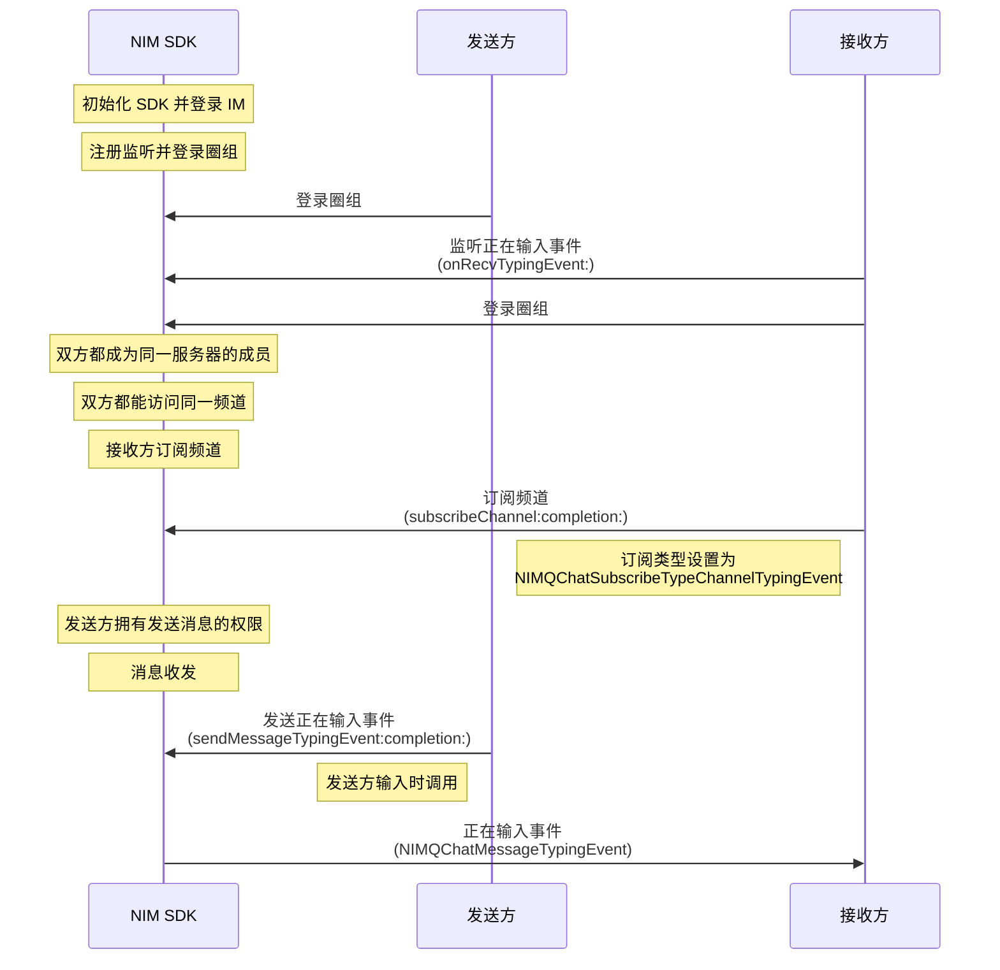

<!--keywords: 正在输入, 消息正在输入, 频道消息 -->


网易云信即时通讯 NIM iOS SDK 中的[`NIMQChatMessageManager`](https://doc.yunxin.163.com/docs/interface/messaging/iOS/doxygen/Latest/zh/d2/db1/protocol_n_i_m_q_chat_message_manager-p.html)协议，提供方法发送“频道消息正在输入事件”。接收方需先订阅发送消息的频道中的该事件，并实现相应代理方法，才能在消息输入方发送该事件后，接收到该事件。 


## **前提条件**

发送方和接收方都在频道内，即频道对两者都可见, 且发送方拥有发送频道消息权限（即[`NIMQChatPermissionType`](https://doc.yunxin.163.com/docs/interface/messaging/iOS/doxygen/Latest/zh/d2/ddd/_n_i_m_q_chat_defs_8h.html#aeee4335aecd193652bc2e7e05679ebb0)枚举下的`NIMQChatPermissionTypeSendMsg`）。

- 要实现频道对双方都可见，需确保两者都在私密频道的白名单内，或者都没有被加入公开频道的黑名单，具体参见[频道黑白名单](https://doc.yunxin.163.com/messaging/guide/zMwMzg5ODE?platform=iOS)。
- 用户操作权限通过身份组进行管控，具体参见[身份组相关](https://doc.yunxin.163.com/messaging/guide/Dk5MTI4Mzc?platform=iOS)。


## **实现流程**


### **流程概览**



### **流程说明**


::: note note 
本节仅对上图中标为部分的流程进行说明，其他流程请参考相关文档。例如：
- 服务器成员相关说明，可参见<a href="https://doc.yunxin.163.com/messaging/guide/zMyODEwMTg?platform=iOS" target="_blank">圈组服务器成员管理</a>。
- 用户是否能访问某频道的相关说明，可参见<a href="https://doc.yunxin.163.com/messaging/guide/zMwMzg5ODE?platform=iOS" target="_blank">频道黑白名单</a>。
- 权限相关配置说明，可参见[身份组相关](https://doc.yunxin.163.com/messaging/guide/Dk5MTI4Mzc?platform=iOS)。 
:::


1. 接收方实现[`onRecvTypingEvent:`](https://doc.yunxin.163.com/docs/interface/messaging/iOS/doxygen/Latest/zh/d4/d3f/protocol_n_i_m_q_chat_message_manager_delegate-p.html#adf908db38e4cb7fa268a40b458737070)回调方法监听正在输入事件（`NIMQChatMessageTypingEvent`）。
2. 接收方调用[`subscribeChannel:completion:`](https://doc.yunxin.163.com/docs/interface/messaging/iOS/doxygen/Latest/zh/df/d6b/protocol_n_i_m_q_chat_channel_manager-p.html#a3353e33c8c986078b4bfc63015ae49a0)方法，调用时将入参`NIMQChatSubscribeType`设为`NIMQChatSubscribeTypeChannelTypingEvent`，实现对频道消息正在输入事件的订阅。

    ::: note notice :::
    如果断线重连，SDK 会自动再次订阅频道消息正在输入事件。但如果用户调用 `logout` 方法切断与圈组服务端的连或销毁 SDK 实例后重建实例，那么用户需要再度调`subscribeChannel`方法重新订阅该事件。
    :::

3. 发送方调用[`sendMessageTypingEvent:completion:`](https://doc.yunxin.163.com/docs/interface/messaging/iOS/doxygen/Latest/zh/d2/db1/protocol_n_i_m_q_chat_message_manager-p.html#a317f738802abd63f4b5cf3b5bc0dfd69)方法发送频道消息正在输入事件。

    发送该事件后，SDK 触发用户A在`onRecvTypingEvent`方法中设置的回调，将`NIMQChatMessageTypingEvent`投递至用户A。

    ::: note notice :::
    该方法有调用频率上限，目前为 3,000 ms 一次。
    :::


### **示例代码**
```
//************************用户A设置正在输入事件监听回调************************/
    [[NIMSDK sharedSDK].qchatMessageManager addDelegate:self];
    - (void)onRecvSystemNotification:(NIMQChatReceiveSystemNotificationResult *)result
    {
        
    }
    
    //************************用户A订阅某频道正在输入事件************************/
    //服务器Id
    long serviceId = 2114708;
    //频道Id
    long channelId = 233479;
    
    NIMQChatSubscribeChannelParam *subscibeParam = [[NIMQChatSubscribeChannelParam alloc] init];
    subscibeParam.subscribeType = NIMQChatSubscribeTypeChannelTypingEvent;
    subscibeParam.operationType = NIMQChatSubscribeOperationTypeSubscribe;
    NIMQChatChannelIdInfo *channelIdInfo = [[NIMQChatChannelIdInfo alloc] init];
    channelIdInfo.serverId = serverId;
    channelIdInfo.channelId = channelId;
    subscibeParam.targets = @[channelIdInfo];
    [[NIMSDK sharedSDK].qchatChannelManager subscribeChannel:subscibeParam completion:^(NSError * _Nullable error) {
        //code
    }];

    //************************用户B发送正在输入事件************************/
    NIMQChatMessageTypingEvent *event = [[NIMQChatMessageTypingEvent alloc] init];
    event.channelId = channelId;
    event.serverId = serverId;
    [[NIMSDK sharedSDK].qchatMessageManager sendMessageTypingEvent:event completion:^(NSError * _Nullable error, NIMQChatMessageTypingEvent * _Nullable result) {
            //code
    }];
```

