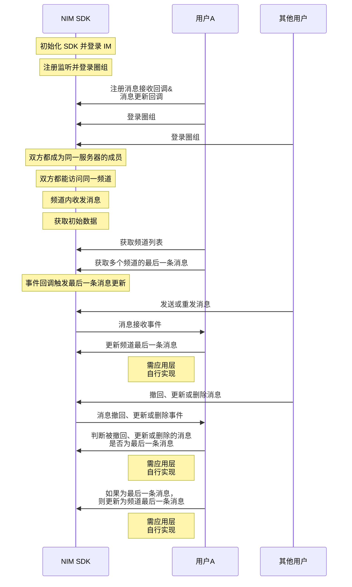
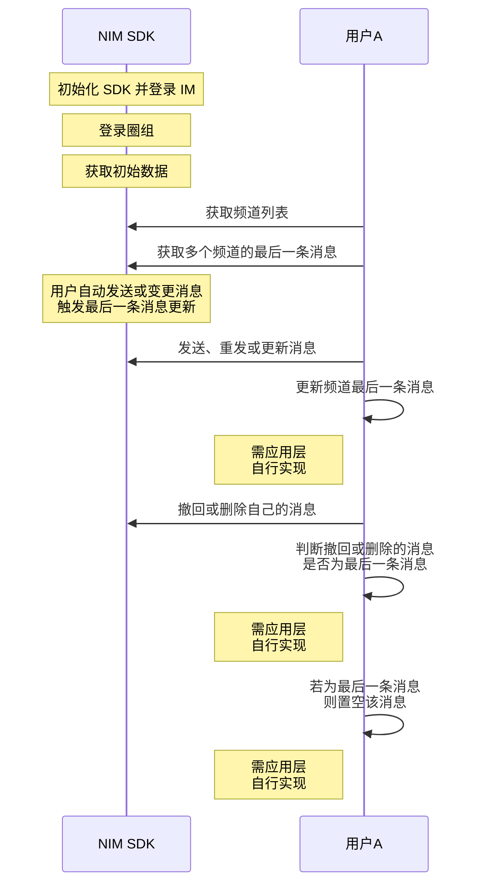

<!--keywords: 最后一条消息, 频道最后一条消息, 最后一条 -->


网易云信 NIM SDK 的[`NIMQChatMessageManager`](https://doc.yunxin.163.com/docs/interface/messaging/iOS/doxygen/Latest/zh/d2/db1/protocol_n_i_m_q_chat_message_manager-p.html)协议提供[`getLastMessageOfChannels`](https://doc.yunxin.163.com/docs/interface/messaging/iOS/doxygen/Latest/zh/d2/db1/protocol_n_i_m_q_chat_message_manager-p.html#a97550ec72020289b1765a83f5d3b3bd3)方法，用于获取多个频道的最后一条消息，该方法的响应[`NIMQChatGetLastMessageOfChannelsResult`](https://doc.yunxin.163.com/docs/interface/messaging/iOS/doxygen/Latest/zh/d5/d84/interface_n_i_m_q_chat_get_last_message_of_channels_result.html)返回的结果为 map，key 值对应每一个`channelId`，value 值是消息体`QChatMessage`。基于该方法的调用，您可通过在应用上层自行开发相关业务逻辑，实现频道列表动态更新各频道的最后一条消息。


## UI 示例
频道列表显示最后一条消息的简易 UI 示例如下：


## 前提条件

已登录圈组，并已创建圈组服务器和频道。


## 实现流程


### API 调用时序

频道最后一条消息动态更新的业务场景，可分为如下两种。


场景1：事件回调触发更新


  
场景2：自己发送或变更消息触发更新



### 流程说明


1. 登录圈组前，调用[`addDelegate`](https://doc.yunxin.163.com/docs/interface/messaging/iOS/doxygen/Latest/zh/d2/db1/protocol_n_i_m_q_chat_message_manager-p.html#af7c4d8b6a4ffe00dd6b40d3dd01e40fa)方法添加委托（回调函数如下）：
    - [`onRecvMessages:`](https://doc.yunxin.163.com/docs/interface/messaging/iOS/doxygen/Latest/zh/d4/d3f/protocol_n_i_m_q_chat_message_manager_delegate-p.html#ae9cd05fec4d2efebc7605f1d2f919fc3)消息接收事件回调，用于监听消息接收事件。
    - [`onMessageUpdate:`](https://doc.yunxin.163.com/docs/interface/messaging/iOS/doxygen/Latest/zh/d4/d3f/protocol_n_i_m_q_chat_message_manager_delegate-p.html#a4ae4b554d71de6b99f5428c38bd7824d)消息更新事件回调，用于监听消息更新、撤回和删除。

    示例代码如下：

    :::::: div custom-tabs 
    ::: tab 监听消息接收
    ```
    - (void)onRecvMessages:(NSArray<NIMQChatMessage *> *)messages
    {
        //your code, deal messages
    }

    ```
    :::


    ::: tab 监听消息更新
    ```
    - (void)onMessageUpdate:(NIMQChatUpdateMessageEvent *)event
    {
        
    }

    ```
    :::

    ::::::

2. 获取频道最后一条消息的初始数据。
    1. 调用[`getChannelsByPage:completion:`](https://doc.yunxin.163.com/docs/interface/messaging/iOS/doxygen/Latest/zh/df/d6b/protocol_n_i_m_q_chat_channel_manager-p.html#a906f0987d0cd8c3a240cb998599aff6d)拉取频道列表。
    2. 调用[`getLastMessageOfChannels:completion:`](https://doc.yunxin.163.com/docs/interface/messaging/iOS/doxygen/Latest/zh/d2/db1/protocol_n_i_m_q_chat_message_manager-p.html#a97550ec72020289b1765a83f5d3b3bd3)方法获取若干个频道的最后一条消息。

        ::: note notice :::
        - 最多只能传入 20 个频道 ID 获取它们的最后一条消息。
        - 您需自行维护调用该方法返回的结果。
        - 被撤回的消息仍能通过调用该方法查到，但被删除的消息无法查到。如果最后一条消息是撤回消息，推荐把对应的最后一条消息置空，并给出提示表明“撤回消息”。
        :::

    3. 在您的应用内存中维护相关频道的最后一条消息。

    示例代码如下：

```objc
NIMQChatGetChannelsByPageParam *param = [[NIMQChatGetChannelsByPageParam alloc] init];
param.serverId = serverId;
[NIMSDK.sharedSDK.qchatChannelManager getChannelsByPage:param completion:^(NSError *__nullable error,NIMQChatGetChannelsByPageResult *__nullable result)
{
    // 获取失败
    if (error)
    {
        return;
    }
    // 没有符合条件的频道
    if (result.channels.count <= 0)
    {
        return;
    }
    NIMQChatGetLastMessageOfChannelsParam *lastMessageOfChannelsParam = [[NIMQChatGetLastMessageOfChannelsParam alloc] init];
    lastMessageOfChannelsParam.serverId = serverId;
    NSMutableArray *channelIds = [NSMutableArray array];
    for (NIMQChatChannel *channel in result.channels)
    {
        [channelIds addObject:@(channel.channelId)];
    }
    lastMessageOfChannelsParam.channelIds = channelIds;
    [NIMSDK.sharedSDK.qchatMessageManager getLastMessageOfChannels:lastMessageOfChannelsParam
                                                        completion:^(NSError *__nullable error, NIMQChatGetLastMessageOfChannelsResult *__nullable result)
    {
        //your code
    }];
}];
```

3. 参照下表，在应用层**自行开发**，实现后续频道最后一条消息在不同场景下的动态更新。


    <div style="width:100px">场景</div> | 场景说明     |  推荐处理方法
    ---- | -------------- | ---------
    事件回调触发更新 | 频道内，其他用户发送消息或重发消息，触发消息接收回调| 更新频道最后一条消息<div></div>
    ^^ |   频道内，其他用户撤回、更新或删除消息，触发消息更新回调   |  判断撤回、更新、删除的消息是否为频道最后一条消息，若非最后一条消息，则忽略；若为最后一条消息，且：<div><ul><li>为撤回或删除消息，则把最后一条消息置空</li><li>为更新消息，则更新频道最后一条消息 </li></ul> </div>
    自己发送或变更消息触发更新        |     自己在频道内发送、重发或更新消息      | 更新频道内最后一条消息
   ^^  | 自己在频道内撤回或删除消息| 判断撤回或删除的消息是否为频道最后一条消息，若非最后一条消息，则忽略；若为最后一条消息，则把最后一条消息置空
   
  

## 相关信息

圈组各端 （Android、iOS、Windows 和 含圈组版 Web）监听消息更新、消息撤回和消息删除的方式略有差异，具体为：Android 将消息更新、消息撤回和消息删除三个事件进行区分；而其他端的消息撤回和消息删除事件，都并入消息更新事件，不进行区分。

各端的相关事件回调接口如下：


|  | Android | iOS | Windows  | 含圈组版 Web |
|---- | -------- | ------| ---|
|**监听消息更新** | [`observeMessageUpdate`](https://doc.yunxin.163.com/docs/interface/messaging/android/doxygen/Latest/zh/interfacecom_1_1netease_1_1nimlib_1_1sdk_1_1qchat_1_1_q_chat_service_observer.html#a9db8d9bcafa0f15b402cd9941e8ec874) | [`onMessageUpdate:`](https://doc.yunxin.163.com/docs/interface/messaging/iOS/doxygen/Latest/zh/d4/d3f/protocol_n_i_m_q_chat_message_manager_delegate-p.html#a4ae4b554d71de6b99f5428c38bd7824d)  | [`RegUpdatedCb`](https://doc.yunxin.163.com/docs/interface/messaging/pc/doxygen/Latest/zh/classnim_1_1_message.html#a0d47693a07a9eb59072054e71dbc46bf)  |  [`messageUpdate`](https://doc.yunxin.163.com/messaging-enhanced/api-refer/web/typedoc/Latest/zh/QChat/interfaces/src_QChatInterface.QChatEventInterface.html#messageUpdate) |
|**监听消息撤回** | [`observeMessageRevoke`](https://doc.yunxin.163.com/docs/interface/messaging/android/doxygen/Latest/zh/interfacecom_1_1netease_1_1nimlib_1_1sdk_1_1qchat_1_1_q_chat_service_observer.html#aa45c9939e58acf7867853e87d5460680)  | ^^ |   ^^ |  ^^ |
|**监听消息删除** | [`observeMessageDelete`](https://doc.yunxin.163.com/docs/interface/messaging/android/doxygen/Latest/zh/interfacecom_1_1netease_1_1nimlib_1_1sdk_1_1qchat_1_1_q_chat_service_observer.html#a8a3bd8f0fdfd0467e74ffd1bab6796f7)| ^^ |  ^^ | ^^  |


  