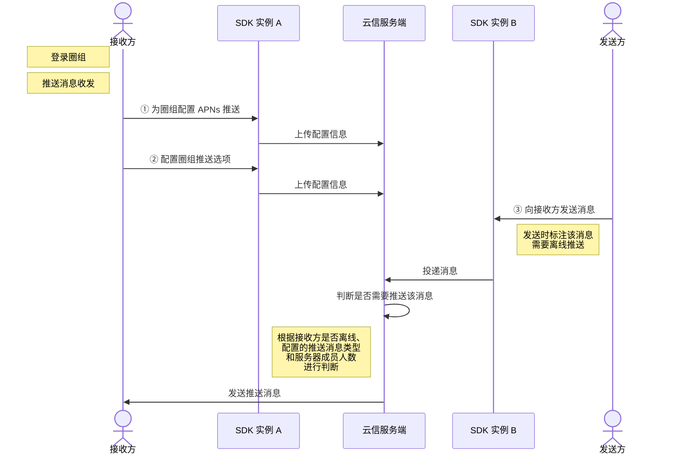

<!--keywords: 推送,圈组推送,消息推送,圈组消息推送 -->

圈组支持接收方在**个人使用的多个维度**（设备、圈组服务器、频道分组和频道）配置离线消息推送。NIM SDK 的[`NIMQChatApnsManager`](https://doc.yunxin.163.com/docs/interface/messaging/iOS/doxygen/Latest/zh/dd/d4f/protocol_n_i_m_q_chat_apns_manager-p.html)协议提供了配置圈组 APNs 离线推送的方法。同时 SDK 也提供了[`NIMQChatOption`](https://doc.yunxin.163.com/docs/interface/messaging/iOS/doxygen/Latest/zh/d7/d76/interface_n_i_m_q_chat_option.html)类，用于为圈组配置 APNs 推送证书名和云信 PushKit 推送证书名。

## 功能介绍


圈组根据消息优先级和推送范围的大小确定消息是否离线推送，具体推送机制见下图。


上图中，推送消息被分为高中低优先级三种类型：
- 高优先级消息：@指定人（有具体目标、有@意愿）。对于被@的用户而言，该消息为高优消息。
- 中优先级消息：@所有人、@指定身份组（没有具体目标、有@意愿）。
- 低优先级消息：普通消息（没有具体目标、没有@意愿）。

::: note notice
消息优先级基于**消息接收者**判断。如某消息@A用户，那么对于A用户来说该消息为高优消息，而对于除A外的其他圈组服务器成员而言，该消息为低优消息（普通消息）。
:::

<br>


SDK 的[`NIMPushNotificationProfile`](https://doc.yunxin.163.com/docs/interface/messaging/iOS/doxygen/Latest/zh/dc/d19/_n_i_m_push_notification_setting_8h.html#a774ac799249824afaa7f3a5ebcafa119)枚举定义了圈组消息推送类型（见下表）。
| <div style="width:120px">枚举值</div>                                            |      说明              |
|---------------------------------------------------|--------------------|
| `NIMPushNotificationProfileNotSet`                  | 未指定需接收的推送消息类型             |
| `NIMPushNotificationProfileEnableAll`               | 接收全部类型的推送消息    |
| `NIMPushNotificationProfileOnlyHighAndMediumLevel`  | 只接收高、中优先级的推送消息|
| `NIMPushNotificationProfileOnlyHighLevel`           | 只接收高优先级的推送消息    |
| `NIMPushNotificationProfileDisableAll`              | 全部推送消息都不收     |
| `NIMPushNotificationProfilePlatformDefault`         | 使用平台默认配置，即接收全部类型的推送消息   |


需要接收的推送消息类型可在**个人使用的不同维度**进行配置，包括设备维度、服务器维度、频道分组维度和频道维度。

- 如果多个维度同时配置了推送消息类型，最终生效的推送消息类型取决于维度的优先级。

    不同维度的优先级为**频道>频道分组>服务器>设备**。最终实际生效的推送消息类型，为 **最高优维度** 的配置。
    
- 圈组的推送消息类型默认为**接收全部类型的推送消息**。


::: note notice
- 服务器成员数**大于或等于** 2000 人阈值时，即使接收方将推送消息类型设置为“接收全部类型的消息推送”，也无法收到低优先级消息的离线推送。 
- 如果接收方离线而且消息不走离线推送，接收方可通过[查询历史消息](https://doc.yunxin.163.com/messaging/guide/DA1NDA5NDk?platform=iOS)的方式获取离线消息。
:::

## 前提条件


- 已了解消息被推送前的流转过程，具体参见[图解圈组消息流转](https://doc.yunxin.163.com/messaging/guide/jU1NjUwNjM?platform=iOS)。
- 已完成配置 APNs 推送的准备工作，具体参见[实现 APNs 离线推送](https://doc.yunxin.163.com/messaging/guide/DMxMjU0MDY?platform=iOS)的步骤 1 至步骤 4。

## 实现圈组消息推送


实现圈组消息推送的流程如下图所示。

::: note note
下图可能因为网络问题而显示异常。如显示异常，一般刷新当前页面即可正常显示。
:::



  

### **步骤1：为圈组配置 APNs 推送**


在初始化时，通过[`NIMQChatOption`](https://doc.yunxin.163.com/docs/interface/messaging/iOS/doxygen/Latest/zh/d7/d76/interface_n_i_m_q_chat_option.html)传入 APNs 推送证书名和云信 PushKit 推送证书名。

示例代码如下：


```objc
NIMQChatOption *qchatOption = [NIMQChatOption option];
qchatOption.apnsCername = @"YunXinApnsCername"; // APNs推送证书名
qchatOption.pkCername = @"YunXinPkCername"; // 云信PushKit推送证书名
[[NIMSDK sharedSDK] qchatWithOption:qchatOption];
```
### **步骤2：配置圈组推送选项**


为圈组配置 APNs 推送后，接收方可按需配置其他选项，包括推送免打扰和圈组各维度需要接收的推送消息类型。


#### **推送免打扰**


调用[`updateApnsSetting:completion:`](https://doc.yunxin.163.com/docs/interface/messaging/iOS/doxygen/Latest/zh/dd/d4f/protocol_n_i_m_q_chat_apns_manager-p.html#a88679d03f579edc23ea98df46c325b5b)方法更新圈组推送的免打扰设置，包括是否开启圈组推送免打扰，以及设置免打扰时间段。如果设置了免打扰时间，则在该时间段内将不再收到任何推送消息。


示例代码如下：

```objc
NIMPushNotificationSetting *setting = [[NIMPushNotificationSetting alloc] init];
setting.noDisturbing = YES;
setting.noDisturbingStartH = 10;
setting.noDisturbingStartM = 30;
setting.noDisturbingEndH = 22;
setting.noDisturbingEndM = 0;
[[[NIMSDK sharedSDK] qchatApnsManager] updateApnsSetting:setting
        completion:^(NSError * error) {
    // your code
}];
```


#### **服务器维度的推送消息类型**


调用[`updatePushNotificationProfile:server:completion:`](https://doc.yunxin.163.com/docs/interface/messaging/iOS/doxygen/Latest/zh/dd/d4f/protocol_n_i_m_q_chat_apns_manager-p.html#af323d9a346d7ab12ad9609c02e1b2ff4)方法配置某个服务器下用户自己需要接收的推送消息类型。 


示例代码如下：

```objc
[[[NIMSDK sharedSDK] qchatApnsManager] updatePushNotificationProfile:NIMPushNotificationProfileOnlyHighAndMediumLevel serverId: 534262 completion:^(NSError * error) {
    // your code
}];
```


#### **频道分组维度的推送消息类型**

调用[`updatePushNotificationProfile:channelCategory`](https://doc.yunxin.163.com/docs/interface/messaging/iOS/doxygen/Latest/zh/dd/d4f/protocol_n_i_m_q_chat_apns_manager-p.html#abc12695a5c3875c46c46ea80ba909ff4)配置某个频道分组下用户自己需要接收的推送消息类型。


示例代码如下：

```
NIMQChatChannelCategoryIdInfo *info = [[NIMQChatChannelCategoryIdInfo alloc] init];
info.serverId = 5432623;
info.categoryId = 70979;

[[[NIMSDK sharedSDK] qchatApnsManager] updatePushNotificationProfile:NIMPushNotificationProfileOnlyHighAndMediumLevel channelCategory:info completion:^(NSError * error) {
    // your code
}];
```


#### **频道维度的推送消息类型**

调用[` updatePushNotificationProfile:channel:completion:`](https://doc.yunxin.163.com/docs/interface/messaging/iOS/doxygen/Latest/zh/dd/d4f/protocol_n_i_m_q_chat_apns_manager-p.html#a2aee8444e7a9a850f485a090e1cc51d1)方法配置某个频道下自己需要接收的推送消息类型。


示例代码如下：

```objc

NIMQChatChannelIdInfo *info = [[NIMQChatChannelIdInfo alloc] init];
info.serverId = 5432623;
info.channelId = 70979;

[[[NIMSDK sharedSDK] qchatApnsManager] updatePushNotificationProfile:NIMPushNotificationProfileOnlyHighAndMediumLevel channel:info completion:^(NSError * error) {
    // your code
}];
```


### **步骤3：发消息时配置推送**

发送方调用[`sendMessage:toSession:error:`](https://doc.yunxin.163.com/docs/interface/messaging/iOS/doxygen/Latest/zh/d2/db1/protocol_n_i_m_q_chat_message_manager-p.html#a24452d81b713fb77b6704dcf55521b7b)或[` sendMessage:toSession:completion:`](https://doc.yunxin.163.com/docs/interface/messaging/iOS/doxygen/Latest/zh/d2/db1/protocol_n_i_m_q_chat_message_manager-p.html#a15fb23ede995f9695a134a6d38895a02)方法[发送某条消息](https://doc.yunxin.163.com/messaging/guide/zM0OTk2NDM?platform=iOS#实现消息收发)时，确保[`apnsEnabled`](https://doc.yunxin.163.com/docs/interface/messaging/iOS/doxygen/Latest/zh/dc/dda/interface_n_i_m_message_setting.html#a4e147dd865cd72d8974cf4091ca96bd7)参数设置为 YES，即该消息需要离线推送。

::: note note
`apnsEnabled`默认为 YES，即圈组的消息默认需要推送。
:::


<br>

发送方发消息时还可配置如下选项：


参数 |说明
---- | -------------- 
[`apnsContent`](https://doc.yunxin.163.com/docs/interface/messaging/iOS/doxygen/Latest/zh/de/d21/interface_n_i_m_q_chat_message.html#a69d665047813821d6ced0db9931bb593) | 消息的推送文案，长度限制 500 字，撤回消息时该字段无效
[`apnsPayload`](https://doc.yunxin.163.com/docs/interface/messaging/iOS/doxygen/Latest/zh/de/d21/interface_n_i_m_q_chat_message.html#ab5397238a5ecd22b5789f823e3b8e14b) | 消息推送的 Payload，支持字段参考 [Apple 开发者文档](https://developer.apple.com/documentation/usernotifications/modifying_content_in_newly_delivered_notifications/)。长度限制 2000 字，撤回消息时该字段无效
[`apnsWithPrefix`](https://doc.yunxin.163.com/docs/interface/messaging/iOS/doxygen/Latest/zh/dc/dda/interface_n_i_m_message_setting.html#a980a610009038663758b9134532cf978)  | 推送是否需要带前缀（一般为发送者昵称）
[`shouldBeCounted`](https://doc.yunxin.163.com/docs/interface/messaging/iOS/doxygen/Latest/zh/dc/dda/interface_n_i_m_message_setting.html#af57fb51e7cf39c76d37d12962847dc1a)  | 推送消息是否计入未读数 

<note type=note>如果需要获取应用角标未读数，需调用[`registerBadgeCountHandler:`](https://doc.yunxin.163.com/docs/interface/messaging/iOS/doxygen/Latest/zh/dd/d4f/protocol_n_i_m_q_chat_apns_manager-p.html#afcd8de47622c8dab29a84eec931cf8b5)方法注册获取（示例代码如下）。应用上层可根据获取的角标未读数进行角标自定义。</note>
<details><summary>示例代码</summary>
```objc
[[[NIMSDK sharedSDK] qchatApnsManager] registerBadgeCountHandler:^NSUInteger() {
    NSUInteger badge;
    // your code
    return badge;
}];
```
</details>


## 获取圈组推送配置

接收方在其他设备端登录时，可按需调用如下方法获取相应的配置。

### 获取推送免打扰配置
调用[`currentSetting`](https://doc.yunxin.163.com/docs/interface/messaging/iOS/doxygen/Latest/zh/dd/d4f/protocol_n_i_m_q_chat_apns_manager-p.html#a76db3b1816a2f1e21371e856531d8f1b)方法获取圈组当前的推送免打扰配置（[`NIMPushNotificationSetting`](https://doc.yunxin.163.com/docs/interface/messaging/iOS/doxygen/Latest/zh/d9/d24/interface_n_i_m_push_notification_setting.html)）。


示例代码如下：

```objc
NIMPushNotificationSetting *setting = [[[NIMSDK sharedSDK] qchatApnsManager] currentSetting];
// your code
```


### 获取服务器维度的推送配置列表

调用[`getUserPushNotificationConfigByServer:completion:`](https://doc.yunxin.163.com/docs/interface/messaging/iOS/doxygen/Latest/zh/dd/d4f/protocol_n_i_m_q_chat_apns_manager-p.html#a9b6909c91b0f12145195331c3bf357ba)方法获取多个服务器的推送配置列表。 


::: note notice
单次调用最多可传入 10 个服务器 ID 进行查询。 
:::


示例代码如下：


```objc

NSArray *serverIds = @[@(74356), @(53426)];

[[[NIMSDK sharedSDK] qchatApnsManager] getUserPushNotificationConfigByServer:serverIds  completion:^(NSError * error,
                                                            NSArray<NIMQChatUserPushNotificationConfig *> * config){
    // your code
}];
```


### 获取频道分组推送配置

调用[`getUserPushNotificationConfigByChannelCategories`](https://doc.yunxin.163.com/docs/interface/messaging/iOS/doxygen/Latest/zh/dd/d4f/protocol_n_i_m_q_chat_apns_manager-p.html#ab18f4608715da672ec8c130bc8a4e4fd)获取多个频道分组的推送配置列表。


::: note notice
单次调用最多可传入 10 个频道分组 ID 进行查询。
:::

示例代码如下：


```
//获取“频道分组”层级推送设置
NIMQChatChannelCategoryIdInfo *info = [[NIMQChatChannelCategoryIdInfo alloc] init];
info.serverId = 5432623;
info.categoryId = 70979;

NSArray *categories = @[info];

[[[NIMSDK sharedSDK] qchatApnsManager] getUserPushNotificationConfigByChannelCategories:categories  completion:^(NSError * error,
                                                            NSArray<NIMQChatUserPushNotificationConfig *> * config){
    // your code
}];
```


### 获取频道维度的推送配置

调用[` getUserPushNotificationConfigByChannel:completion:`](https://doc.yunxin.163.com/docs/interface/messaging/iOS/doxygen/Latest/zh/dd/d4f/protocol_n_i_m_q_chat_apns_manager-p.html#a3c13d9c5cd40df6e600c3fcf7d34d786)方法获取多个频道的推送配置列表。


::: note notice 
单次调用最多可传入 10 频道 ID 进行查询。
:::


示例代码如下：


```objc

NIMQChatChannelIdInfo *info = [[NIMQChatChannelIdInfo alloc] init];
info.serverId = 5432623;
info.channelId = 70979;

NSArray *channels = @[info];

[[[NIMSDK sharedSDK] qchatApnsManager] getUserPushNotificationConfigByChannel:channels  completion:^(NSError * error,
                                                            NSArray<NIMQChatUserPushNotificationConfig *> * config){
    // your code
}];
```


