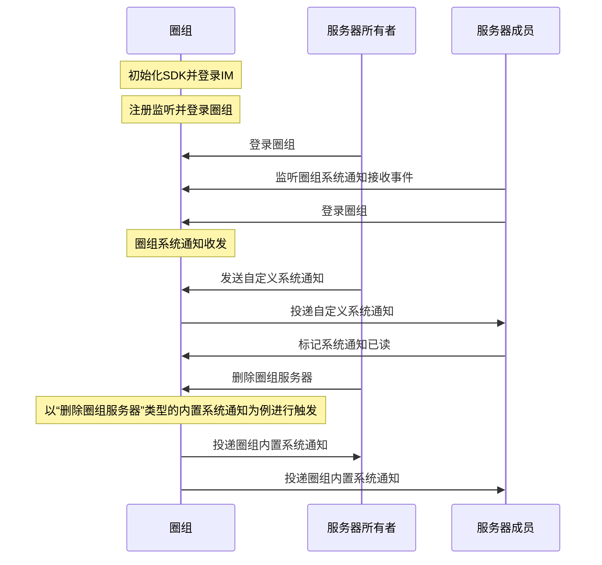

圈组系统通知是用户在使用圈组功能的过程中，由云信 IM 下发给用户相关事件的通知，比如圈组服务器中的成员变更，频道变更等事件。

## 功能介绍

圈组内置系统通知只能通过具体事件触发，由云信 IM 发送给相关的圈组用户。用户只需注册圈组系统通知的相关监听，就能接收到对应的系统通知。

圈组自定义系统通知支持用户主动发送，并可以指定发送给全员或部分成员。

云信 IM iOS SDK 的 [`NIMQChatMessageManager`](https://doc.yunxin.163.com/docs/interface/messaging/iOS/doxygen/Latest/zh/d2/db1/protocol_n_i_m_q_chat_message_manager-p.html) 接口提供管理圈组系统通知的相关方法，[`NIMQChatMessageManagerDelegate`](https://doc.yunxin.163.com/docs/interface/messaging/iOS/doxygen/Latest/zh/d4/d3f/protocol_n_i_m_q_chat_message_manager_delegate-p.html) 接口提供监听圈组系统通知的相关方法，帮助您快速实现对圈组系统通知的管理。

NIM SDK 中的 [`NIMQChatSystemNotification`](https://doc.yunxin.163.com/docs/interface/messaging/iOS/doxygen/Latest/zh/d9/d1c/interface_n_i_m_q_chat_system_notification.html) 类定义了圈组的系统通知，其内置方法如下：

<details><summary>单击展开查看 QChatSystemNotification 的参数说明</summary>

| 返回值类型  | 参数  | 说明     |
|  ----  | ----  | --------- |
|unsinged long long|serverId|系统通知所属的圈组服务器的 ID|
|unsinged long long|channelId|系统通知所属的频道的 ID|
|NSArray<NSString*>|toAccids|系统通知接收者账号列表|
|NSString|fromAccount|系统通知发送者的 accid|
|[`NIMQChatSystemNotificationToType`](https://doc.yunxin.163.com/docs/interface/messaging/iOS/doxygen/Latest/zh/d2/ddd/_n_i_m_q_chat_defs_8h.html#a8ea996c7fd86ba0b6a997387c63c0aa2)| toType|通知发送对象类型。主要分为服务器，服务器成员，频道，频道成员|
|NSInteger|fromClientType|系统通知发送者的客户端类型|
|NSString|fromDeviceId|发送方设备 ID|
|NSString|fromNick|发送方昵称|
|NSTimeInterval|time|系统通知发送时间|
|NSTimeInterval|updateTime|系统通知更新时间|
|[`NIMQChatSystemNotificationType`](https://doc.yunxin.163.com/docs/interface/messaging/iOS/doxygen/Latest/zh/d2/ddd/_n_i_m_q_chat_defs_8h.html#a68eb284bba17219f9f003e57d5ae414b)|type|系统通知类型，具体系统通知类型的接收条件等信息，可参考服务器的 [`QChatSystemMsgType`](https://doc.yunxin.163.com/messaging/guide/TkxMzc1NDg?platformId=60353#%E5%86%85%E7%BD%AE%E7%B3%BB%E7%BB%9F%E9%80%9A%E7%9F%A5%E7%B1%BB%E5%9E%8B)|
|NSString|messageClientId|客户端生成的消息 ID，用于去重|
|unsigned long long|messageServerID|服务器生成的通知 ID，全局唯一|
|NSString|body|系统通知内容|
|[`NIMQChatSystemNotificationAttachment`](https://doc.yunxin.163.com/docs/interface/messaging/iOS/doxygen/Latest/zh/df/da1/protocol_n_i_m_q_chat_system_notification_attachment-p.html)|attach|系统通知附件|
|NSString|ext|扩展字段，推荐使用 JSON 格式|
|NSInteger|status|系统通知状态，可以自定义。默认为 0，大于 10,000 为用户自定义的状态，具体可查看[`NIMQChatSystemNotificationStatus`](https://doc.yunxin.163.com/docs/interface/messaging/iOS/doxygen/Latest/zh/d7/db8/_n_i_m_q_chat_system_notification_8h.html#ab5d26068d0f45fc7f2da17ca99f7e12e)|
|NSString|pushPayload|第三方自定义的推送属性，限制使用 JSON 格式|
|NSString|pushContent|自定义推送文案|
|[`NIMQChatSystemNotificationSetting`](https://doc.yunxin.163.com/docs/interface/messaging/iOS/doxygen/Latest/zh/d3/d42/interface_n_i_m_q_chat_system_notification_setting.html)|setting|自定义系统通知设置，如是否需要计入推送未读，是否需要带推送前缀等|
|NSString|env|环境变量，用于指向不同的抄送，第三方回调等配置|
|NSString|callbackExt|获取第三方回调回来的自定义扩展字段|

</details>


## 实现方法

本文以服务器所有者（即创建者）和服务器成员的交互为例，介绍服务器所有者发送圈组自定义系统通知的实现流程和触发内置圈组系统通知的实现流程。

### 前提条件

- 已[接入圈组](https://doc.yunxin.163.com/messaging/guide/TczMjQyMTA?platform=iOS)，并已创建圈组服务器。
- 已[创建](https://doc.yunxin.163.com/messaging/guide/DQ3Nzk1MTY?platform=server)云信 IM 账号，作为下文中服务器所有者和服务器成员的云信 IM 账号。

:::note notice
如果用户所在服务器的成员人数超过 2000 人阈值，该用户还需先订阅相应的服务器或频道，才能收到对应服务器或频道的系统通知。如未超过该阈值，则无需订阅。订阅相关说明，请参见[圈组订阅机制](https://doc.yunxin.163.com/messaging/guide/zAxNjQzMDA?platform=iOS)。
:::

### 实现流程



**以下只对部分重要步骤进行说明：**

1. 服务器成员注册 [`onRecvSystemNotification:`](https://doc.yunxin.163.com/docs/interface/messaging/iOS/doxygen/Latest/zh/d4/d3f/protocol_n_i_m_q_chat_message_manager_delegate-p.html#aaf1d34a4b6373edc5fbc408f36b98853) 监听圈组系统通知的接收。

    示例代码：
    ```
    // 添加监听
    - (void)addListener {
        [[[NIMSDK sharedSDK] qchatMessageManager] addDelegate:self];
    }
    // 移除监听
    - (void)removeListener {
        [[[NIMSDK sharedSDK] qchatMessageManager] removeDelegate:self];
    }
    // 回调方法
    - (void)qchatKickedOut:(NIMLoginKickoutResult *)result {
        // your code
    }
    ```

2. 服务器所有者通过调用 [`sendSystemNotification:`](https://doc.yunxin.163.com/docs/interface/messaging/iOS/doxygen/Latest/zh/d2/db1/protocol_n_i_m_q_chat_message_manager-p.html#a1fbf97ebf1c71252ff0bb49ef7621f60) 发送圈组自定义系统通知。

    其中 [`NIMQChatSendSystemNotificationParam`](https://doc.yunxin.163.com/docs/interface/messaging/iOS/doxygen/Latest/zh/d5/d1d/interface_n_i_m_q_chat_send_system_notification_param.html) 是发送圈组自定义系统通知入参，提供四种构造方法，通过入参的不同来进行区分，通知给不同的对象：

    通知的对象|涉及的函数
    :----|:----
    通知给圈组服务器全员|[`initWithServerId:`](https://doc.yunxin.163.com/docs/interface/messaging/iOS/doxygen/Latest/zh/d5/d1d/interface_n_i_m_q_chat_send_system_notification_param.html#aec66a62dadfc98a9a0cf779d2ad38c34)：提供服务器 ID
    通知给圈组服务器中的某个频道全员|[`initWithServerId:channelId:`](https://doc.yunxin.163.com/docs/interface/messaging/iOS/doxygen/Latest/zh/d5/d1d/interface_n_i_m_q_chat_send_system_notification_param.html#a68bc27117111f52f75e1fe7e4f2c6961)：提供服务器 ID 和频道 ID
    通知给圈组服务器中的部分成员|[`initWithServerId:toAccids:`](https://doc.yunxin.163.com/docs/interface/messaging/iOS/doxygen/Latest/zh/d5/d1d/interface_n_i_m_q_chat_send_system_notification_param.html#ad70edb852cd60c9567ac42cd56fda648)：提供服务器 ID 和通知的服务器成员列表
    通知给圈组服务器中的某个频道中的部分成员|[`initWithServerId:channelId:toAccids:`](https://doc.yunxin.163.com/docs/interface/messaging/iOS/doxygen/Latest/zh/d5/d1d/interface_n_i_m_q_chat_send_system_notification_param.html#a8791b06ea63fef57b38093ecfc35156c)：提供服务器 ID，频道 ID 和通知的频道成员列表

    若需要在发送自定义系统通知前提前构造一个 `NIMQChatSystemNotification`，您可以通过`NIMQChatSendSystemNotificationParam` 的 [`toQChatSystemNotification`](https://doc.yunxin.163.com/docs/interface/messaging/iOS/doxygen/Latest/zh/d5/d1d/interface_n_i_m_q_chat_send_system_notification_param.html#a9aeb1b672d73c7b96c448f8e73151add) 构造圈组自定义系统通知。

    示例代码：
    ```
    id<NIMQChatMessageManager> qchatMessageManager = [[NIMSDK sharedSDK] qchatMessageManager];
    NIMQChatSendSystemNotificationParam *param = [[NIMQChatSendSystemNotificationParam alloc] initWithServerId:123456 channelId:121212];
    param.body = @"系统通知内容";
    [qchatMessageManager sendSystemNotification:param
                    completion:^(NSError *__nullable error, NIMQChatSendSystemNotificationResult *__nullable result) {
        // your code
    }];
    ```

3. 服务器成员收到来自服务器所有者的自定义系统通知。

4. 服务器成员通过调用 [`markSystemNotificationsRead:`](https://doc.yunxin.163.com/docs/interface/messaging/iOS/doxygen/Latest/zh/d2/db1/protocol_n_i_m_q_chat_message_manager-p.html#aa5d5d8cd328ceb15fa02018566ae184a) 标记圈组系统通知已读。

    标记已读后的系统通知将从服务端删除，后续不会在其他端接收。

    示例代码：
    ```
    id<NIMQChatMessageManager> qchatMessageManager = [[NIMSDK sharedSDK] qchatMessageManager];
    NIMQChatMarkSystemNotificationsReadParam *param = [[NIMQChatMarkSystemNotificationsReadParam alloc] init];
    NIMQChatMarkSystemNotificationsReadItem *item = [[NIMQChatMarkSystemNotificationsReadItem alloc] init];
    item.messageServerId = 10101010;
    item.type = NIMQChatSystemNotificationTypeCustom;
    param.items = @[item];
    [qchatMessageManager markSystemNotificationsRead:param
                        completion:^(NSError *__nullable error) {
        // your code
    }];
    ```

5. 服务器所有者调用 [`deleteServer:`](https://doc.yunxin.163.com/docs/interface/messaging/iOS/doxygen/Latest/zh/df/dac/protocol_n_i_m_q_chat_server_manager-p.html#a27419098912219b1425c262e6b85c1dd) 方法删除圈组服务器。

    示例代码：
    ```
    NIMQChatDeleteServerParam *param = [[NIMQChatDeleteServerParam alloc] init];
    param.serverId = 123456;
    id <NIMQChatServerManager> qchatServerManager = [[NIMSDK sharedSDK] qchatServerManager];
    [qchatServerManager deleteServer:param
                        completion:^(NSError *error) {
        // your code
    }];
    ```
6. 服务器所有者和服务器成员收到系统投递的内置系统通知。

    :::note notice
    该示例收到类型为“删除服务器”的系统通知，更多事件类型和相应的通知接收条件，请参见[圈组系统通知分类](https://doc.yunxin.163.com/messaging/guide/DMwMjIzNTY?platform=iOS#圈组系统通知分类)和[圈组系统通知接收机制](https://doc.yunxin.163.com/messaging/guide/DMwMjIzNTY?platform=iOS#圈组系统通知接收机制)。
    :::

7. （可选）如果因为网络等原因，自定义系统通知发送失败，用户可以调用 [`resendSystemNotification:`](https://doc.yunxin.163.com/docs/interface/messaging/iOS/doxygen/Latest/zh/d2/db1/protocol_n_i_m_q_chat_message_manager-p.html#a21b12f53ca104c6ad216e1cf3944b38b) 方法重新发送自定义系统通知。

    :::note notice
    如果重发已经发送成功的自定义系统通知，那么通知接收方不会再次收到该系统通知。
    :::

    示例代码：
    ```
    id<NIMQChatMessageManager> qchatMessageManager = [[NIMSDK sharedSDK] qchatMessageManager];
    NIMQChatResendSystemNotificationParam *param = [[NIMQChatResendSystemNotificationParam alloc] init];
    param.systemNotification = systemNotification;
    [qchatMessageManager resendSystemNotification:param
                    completion:^(NSError *__nullable error, NIMQChatSendSystemNotificationResult *__nullable result) {
        // your code
    }];
    ```

