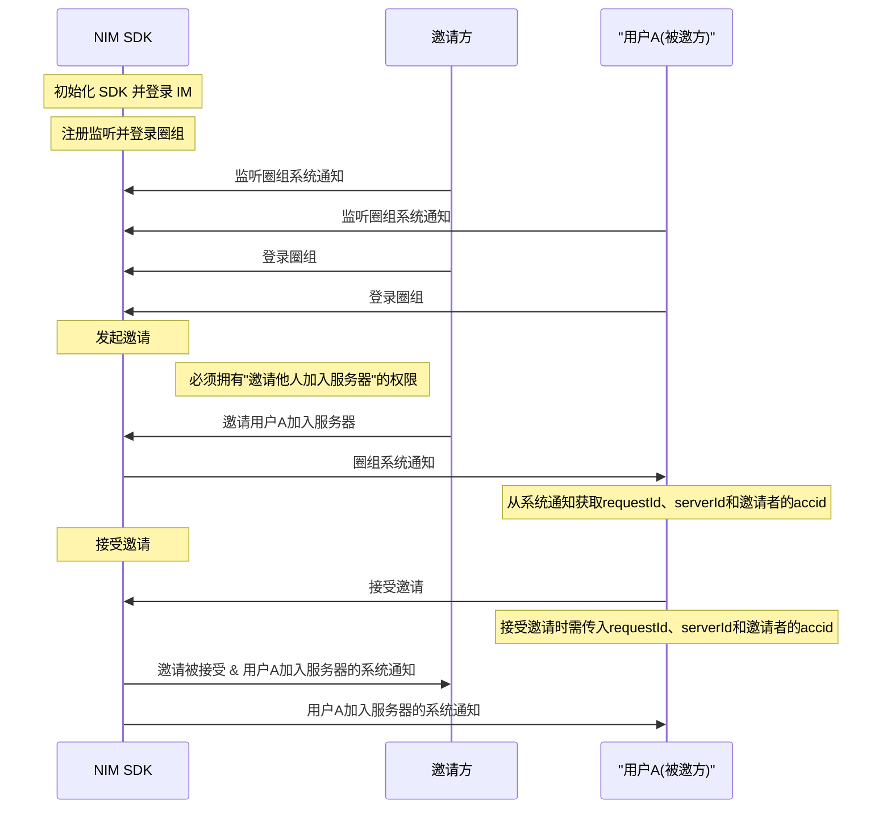
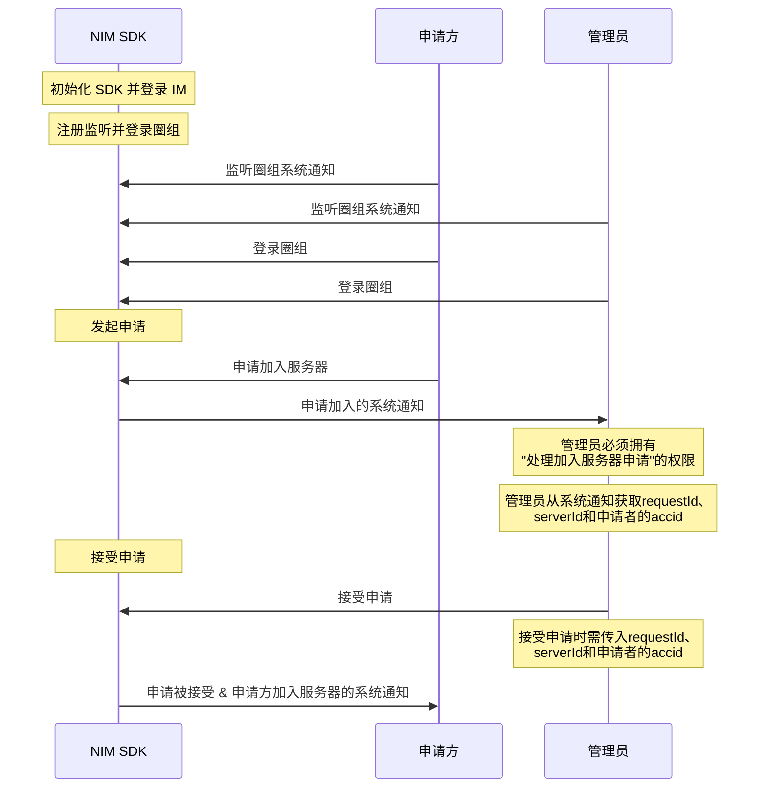

NIM SDK 的<a href="https://doc.yunxin.163.com/docs/interface/messaging/iOS/doxygen/Latest/zh/df/dac/protocol_n_i_m_q_chat_server_manager-p.html" target="_blank">`NIMQChatServerManager`</a>类提供了管理服务器成员的方法，包括加入服务器、离开服务器、将成员踢出服务器和封禁成员等。

## 服务器成员定义

SDK 的<a href="https://doc.yunxin.163.com/docs/interface/messaging/iOS/doxygen/Latest/zh/d8/d5c/interface_n_i_m_q_chat_server_member.html" target="_blank">`NIMQChatServerMember`</a>类定义了服务器成员。该类的成员参数如下：

<details><summary>点击展开查看 QChatServerMember 的成员参数</summary>

<div style="width:100px">参数</div> | <div style="width:120px">类型</div> | 说明
---- | -------------- | ---------
`accid`| NSString *  | 成员的云信 IM 账号
`avatar`| NSString * 	 | 成员在服务器内展示的头像
`createTime` |NSTimeInterval  |  服务器创建时间
`custom` | NSString * 	  | 成员的自定义扩展字段
`inviter` | NSString * 	 | 邀请当前成员加入服务器的用户
`joinTime`| NSTimeInterval  | 成员加入服务器的时间
`nick` | NSString * 	 | 成员加入服务器的时间
`serverId` | unsigned long long 	 | 服务器 ID 
`type` | `NIMQChatServerMemberType ` | 成员类型：<ul><li>`NIMQChatServerMemberTypeCommon`：普通成员</li><li>`NIMQChatServerMemberTypeOwner`：服务器所有者，默认为服务器创建者</li></ul>
`updateTime` | NSTimeInterval  | 更新时间
`validFlag` | BOOL | 有效标志

</details>

## 前提条件

- 已注册[`onRecvSystemNotification:`](https://doc.yunxin.163.com/docs/interface/messaging/iOS/doxygen/Latest/zh/d4/d3f/protocol_n_i_m_q_chat_message_manager_delegate-p.html#aaf1d34a4b6373edc5fbc408f36b98853)监听圈组的系统通知。示例代码参见[圈组系统通知收发](https://doc.yunxin.163.com/messaging/guide/DAzNzk2NjY?platform=iOS)。

  具体**与服务器成员管理相关**的系统通知类型，见本文末尾的[相关系统通知](#相关系统通知)。
  

- 已<a href="https://doc.yunxin.163.com/messaging/guide/zA0ODY0NzQ?platform=iOS#创建服务器" target="_blank">创建服务器</a>。


## 使用限制

服务器存在如下与其成员数量相关的限制：

- 单个用户的服务器的数量上限（包括自己创建的和加入的）默认为 100 个。 
- 单个服务器可容人数上限默认为 500000。

若需要扩展上限，可在控制台配置圈组子功能项（**单个用户 server 数** 和 **单 server 容纳人数**），具体请参考[开通和配置圈组功能](https://doc.yunxin.163.com/messaging/guide/TM1OTU0MTM?platform=iOS)。


## 实现方法

### 加入服务器


#### 邀请用户加入

拥有“邀请他人加入服务器的权限”（[`NIMQChatPermissionType`](https://doc.yunxin.163.com/docs/interface/messaging/iOS/doxygen/Latest/zh/d2/ddd/_n_i_m_q_chat_defs_8h.html#aeee4335aecd193652bc2e7e05679ebb0)枚举中的`NIMQChatPermissionTypeInviteServer`）的用户，可邀请其他用户加入服务器。

::: note notice 
如果没有该权限，无法成功发起邀请。服务器所有者默认拥有全部权限。权限通过身份组进行配置和管理，具体请参见<a href="https://doc.yunxin.163.com/messaging/guide/Dk5MTI4Mzc?platform=iOS" target="_blank">身份组概述</a>及其他身份组相关文档。
:::

<br>

根据服务器的不同邀请模式（[`NIMQChatServerInviteMode`](https://doc.yunxin.163.com/docs/interface/messaging/iOS/doxygen/Latest/zh/d2/ddd/_n_i_m_q_chat_defs_8h.html#a15ea8fdec9694244723107abe518a5e9)），被邀者成功加入服务器的流程略有不同。服务器的邀请模式，在创建服务器时配置，创建后也可修改。

:::::: div custom-tabs 
::: tab “邀请需要同意”模式


如果服务器的邀请模式被设置为“邀请需要同意”，那么被邀方需要接受邀请才能加入服务器。


**API调用时序**

以下时序图可能因为网络问题显示异常。如显示异常，一般刷新当前页面即可正常显示。



**流程说明**

1. 用户A 调用<a href="https://doc.yunxin.163.com/docs/interface/messaging/iOS/doxygen/Latest/zh/df/dac/protocol_n_i_m_q_chat_server_manager-p.html#a83f7643421a00e1f722d7a1adb39796c" target="_blank">`inviteServerMembers:completion:`</a>方法邀请多位用户加入服务器。

    调用时需传入被邀者的账号（`accid`）列表以及指定的服务器 ID（`serverId`）。还可以设置有效时长和邀请附言（最多 5000 个字符）。

    - 发起邀请后，被邀方将收到邀请服务器成员的系统通知（[`NIMQChatSystemNotificationType`](https://doc.yunxin.163.com/docs/interface/messaging/iOS/doxygen/Latest/zh/d2/ddd/_n_i_m_q_chat_defs_8h.html#a68eb284bba17219f9f003e57d5ae414b)枚举中的`NIMQChatSystemNotificationTypeServerMemberInvite `）。

    - 如果邀请成员失败，可从该方法的回调（`NIMQChatInviteServerMembersHandler`的[`NIMQChatInviteServerMembersResult`](https://doc.yunxin.163.com/docs/interface/messaging/iOS/doxygen/Latest/zh/dd/ddd/interface_n_i_m_q_chat_invite_server_members_result.html)）获取邀请失败的成员列表，如因为被封禁而无法邀请的成员列表。

    <br>
    
    示例代码如下：

    ```    
    NIMQChatInviteServerMembersParam *param = [[NIMQChatInviteServerMembersParam alloc] init];
    param.serverId = 123456;
    param.accids = @[@"yunxin1", @"yunxin2", @"yunxin3"];
    param.ttl = 4535;
    id <NIMQChatServerManager> qchatServerManager = [[NIMSDK sharedSDK] qchatServerManager];
    [qchatServerManager inviteServerMembers:param
                                completion:^(NSError *error) {
        // your code
    }];
    ```

2. 被邀方接受或拒绝邀请。

    调用以下两个方法均需要传入接受加入的服务器ID（`serverId`）、邀请者账号（`accid`）以及邀请唯一标识（`requestId`）。其中`requestId`可以从邀请服务器成员（`NIMQChatSystemNotificationTypeServerMemberInvite`）系统通知附件中获取，也可以通过调用[`getInviteApplyRecordOfServer:completion:`](https://doc.yunxin.163.com/docs/interface/messaging/iOS/doxygen/Latest/zh/df/dac/protocol_n_i_m_q_chat_server_manager-p.html#ad8c85a14ecb493edd95318fd3f18a7aa)方法查询服务器下的申请邀请记录来获取。

    - 调用<a href="https://doc.yunxin.163.com/docs/interface/messaging/iOS/doxygen/Latest/zh/df/dac/protocol_n_i_m_q_chat_server_manager-p.html#a9d9ce6e82adde8212447a57b9c2eb684" target="_blank">`acceptServerInvite:completion:`</a>方法接受邀请加入服务器。


        示例代码如下：

        ```
        NIMQChatAcceptServerInviteParam *param = [[NIMQChatAcceptServerInviteParam alloc] init];
        param.serverId = 123456;
        param.accid = @"yunxin0";
        param.requestId = 645356;
        id <NIMQChatServerManager> qchatServerManager = [[NIMSDK sharedSDK] qchatServerManager];
        [qchatServerManager acceptServerInvite:param
                                    completion:^(NSError *error) {
            // your code
        }];

        ```

    - 调用<a href="https://doc.yunxin.163.com/docs/interface/messaging/iOS/doxygen/Latest/zh/df/dac/protocol_n_i_m_q_chat_server_manager-p.html#a38cb24208eda9cc6dafce898c93ec550" target="_blank">`rejectServerInvite:completion:`</a>方法拒绝邀请。拒绝邀请后，邀请方将收到“拒绝邀请”的系统通知([`NIMQChatSystemNotificationType`](https://doc.yunxin.163.com/docs/interface/messaging/iOS/doxygen/Latest/zh/d2/ddd/_n_i_m_q_chat_defs_8h.html#a68eb284bba17219f9f003e57d5ae414b)枚举中的`NIMQChatSystemNotificationTypeServerMemberInviteReject`） 
    
        示例代码如下：

        ```
        NIMQChatRejectServerInviteParam *param = [[NIMQChatRejectServerInviteParam alloc] init];
        param.serverId = 123456;
        param.accid = @"yunxin0";
        param.requestId = 654364;
        id <NIMQChatServerManager> qchatServerManager = [[NIMSDK sharedSDK] qchatServerManager];
        [qchatServerManager rejectServerInvite:param
                                    completion:^(NSError *error) {
            // your code
        }];

        ```


:::
::: tab “邀请不需要同意”模式

如果服务器的邀请模式被设置为“邀请不需要同意”，那么邀请方调用<a href="https://doc.yunxin.163.com/docs/interface/messaging/iOS/doxygen/Latest/zh/df/dac/protocol_n_i_m_q_chat_server_manager-p.html#a83f7643421a00e1f722d7a1adb39796c" target="_blank">`inviteServerMembers`</a>方法方法发起邀请后，被邀请方自动加入服务器。

示例代码如下：


:::
::::::


#### 申请加入

用户也可以主动申请加入某个服务器。根据服务器的不同申请模式，申请方成功加入服务器的流程略有不同。

:::::: div custom-tabs 
::: tab “申请需要同意”模式


**API 调用时序**

以下时序图可能因为网络问题显示异常。如显示异常，一般刷新当前页面即可正常显示。



**流程说明**

1. 申请方调用<a href="https://doc.yunxin.163.com/docs/interface/messaging/iOS/doxygen/Latest/zh/df/dac/protocol_n_i_m_q_chat_server_manager-p.html#af5aedc6a8b90f6d3017a74b3625c48a5" target="_blank">`applyServerJoin:completion:`</a>方法主动申请加入某个服务器。调用时需要传入申请加入的服务器的 ID（`serverId`），还可以设置有效时长和申请附言（最多 5000 字符）。

    

    示例代码如下：


2. 该服务器内拥有“处理加入服务器申请的权限”（`NIMQChatPermissionTypeHandleServerApply`）的用户将收到“申请加入服务器”（`NIMQChatSystemNotificationTypeServerMemberApply`）的系统通知。收到申请通知的用户接受或拒绝申请。申请被同意，申请方才能加入服务器。

    ::: note notice
    接受或拒绝申请，需要拥有“处理加入服务器申请的权限”。权限通过身份组进行配置和管理，具体请参见<a href="https://doc.yunxin.163.com/messaging/guide/Dk5MTI4Mzc?platform=iOS" target="_blank">身份组概述</a>及其他身份组相关文档。
    :::

    调用以下两个方法均需要传入拒绝加入的服务器的 ID（`serverId`）、申请者账号（`accid`）以及申请唯一标识（`requestId`）。其中`requestId`可以从“申请加入服务器”系统通知附件中获取，也可以通过调用[`getInviteApplyRecordOfServer`]()方法查询服务器下的申请邀请记录来获取。

    - 调用<a href="https://doc.yunxin.163.com/docs/interface/messaging/iOS/doxygen/Latest/zh/df/dac/protocol_n_i_m_q_chat_server_manager-p.html#a3b38159dde3c263666b7331820b08335" target="_blank">`acceptServerApply:completion:`</a>方法接受申请。

        示例代码如下：

        ```
        NIMQChatAcceptServerApplyParam *param = [[NIMQChatAcceptServerApplyParam alloc] init];
        param.serverId = 123456;
        param.requestId = 523652;
        param.accid = @"yunxin0";
        id <NIMQChatServerManager> qchatServerManager = [[NIMSDK sharedSDK] qchatServerManager];
        [qchatServerManager acceptServerApply:param
                                completion:^(NSError *error) {
            // your code
        }];
        ```


    - 调用<a href="https://doc.yunxin.163.com/docs/interface/messaging/iOS/doxygen/Latest/zh/df/dac/protocol_n_i_m_q_chat_server_manager-p.html#adc4bc957ca9e61e83d275e92c308d322" target="_blank">`rejectServerApply:completion:`</a>方法拒绝申请。
    
        示例代码如下：

        ```
        NIMQChatRejectServerApplyParam *param = [[NIMQChatRejectServerApplyParam alloc] init];
        param.serverId = 123456;
        param.requestId = 543265;
        param.accid = @"yunxin0";
        id <NIMQChatServerManager> qchatServerManager = [[NIMSDK sharedSDK] qchatServerManager];
        [qchatServerManager rejectServerApply:param
                                completion:^(NSError *error) {
            // your code
        }];
        ```


:::

::: tab “申请不需要同意”模式

如果服务器的申请模式被设置为“申请不需要同意”，那么申请方调用<a href="https://doc.yunxin.163.com/docs/interface/messaging/iOS/doxygen/Latest/zh/df/dac/protocol_n_i_m_q_chat_server_manager-p.html#af5aedc6a8b90f6d3017a74b3625c48a5" target="_blank">`applyServerJoin:completion:`</a>方法发起申请后，将自动加入服务器。

示例代码如下：


```
NIMQChatApplyServerJoinParam *param = [[NIMQChatApplyServerJoinParam alloc] init];
param.serverId = 123456;
id <NIMQChatServerManager> qchatServerManager = [[NIMSDK sharedSDK] qchatServerManager];
[qchatServerManager applyServerJoin:param
                         completion:^(NSError *error) {
    // your code
}];
```

:::

::::::


#### 通过邀请码加入

用户可通过服务器成员分享的邀请码（通过第三方应用分享，如微信）加入服务器。

1. 用户A 调用<a href="https://doc.yunxin.163.com/docs/interface/messaging/iOS/doxygen/Latest/zh/df/dac/protocol_n_i_m_q_chat_server_manager-p.html#a9646a5a39bc451de54753527f6e5b3fb" target="_blank">`generateInviteCode:completion:`</a>方法生成邀请码。调用时必须传入服务器 ID（`serverId`），邀请码有效期可不传。

    ::: note notice
    拥有“邀请他人加入服务器的权限”（`NIMQChatPermissionTypeInviteToServer`）的服务器成员才能生成邀请码。权限通过身份组进行配置和管理，具体请参见<a href="https://doc.yunxin.163.com/messaging/guide/Dk5MTI4Mzc?platform=iOS" target="_blank">身份组概述</a>及其他身份组相关文档。
    :::

    <br>

    示例代码如下：
    ```
    NIMQChatGenerateInviteCodeParam *param = [NIMQChatGenerateInviteCodeParam alloc] init];
    param.serverId = 543245;
    param.ttl = 543632;

    [[NIMSDK sharedSDK].qchatServerManager generateInviteCode:param completion:^(NSError *__nullable error, NIMQChatGenerateInviteCodeResult *__nullable result) {
        //code 
    }];
    ```
    

2. 用户B 调用<a href="https://doc.yunxin.163.com/docs/interface/messaging/iOS/doxygen/Latest/zh/df/dac/protocol_n_i_m_q_chat_server_manager-p.html#ae62d71dac4442a753ad77ba29266da1a" target="_blank">`joinByInviteCode:completion:`</a>方法，通过邀请码加入服务器。 调用时必须传入服务器ID 和邀请码。

    示例代码如下：
    ```
    NIMQChatJoinByInviteCodeParam *param = [NIMQChatJoinByInviteCodeParam alloc] init];
    param.serverId = 543245;
    param.inviteCode = @"543632";

    [[NIMSDK sharedSDK].qchatServerManager joinByInviteCode:param completion:^(NSError * _Nullable error) {
        //code 
    }];
    ```


### 退出服务器

用户既可以主动退出服务器，也可以被动退出，即被其他用户踢出服务器。 


#### 主动退出服务器

加入服务器后如不想继续待在此服务器中，用户可以调用<a href="https://doc.yunxin.163.com/docs/interface/messaging/iOS/doxygen/Latest/zh/df/dac/protocol_n_i_m_q_chat_server_manager-p.html#a9f2f82311a3d29922611ab6cc9308e37" target="_blank">`leaveServer:completion:`</a>方法主动退出，调用时需传入服务器 ID。离开后将不再接收该服务器下的消息和通知。

示例代码如下：

```
NIMQChatLeaveServerParam *param = [[NIMQChatLeaveServerParam alloc] init];
param.serverId = 123456;
id <NIMQChatServerManager> qchatServerManager = [[NIMSDK sharedSDK] qchatServerManager];
[qchatServerManager leaveServer:param
                     completion:^(NSError *error) {
    // your code
}];
```


#### 踢出服务器成员


调用<a href="https://doc.yunxin.163.com/docs/interface/messaging/iOS/doxygen/Latest/zh/df/dac/protocol_n_i_m_q_chat_server_manager-p.html#ac87f0077361dfe544133accd0ecba94a" target="_blank">`kickServerMembers:completion:`</a>方法将其他成员踢出服务器。调用时需要传入当前服务器 ID（`serverId`）和需要被踢出用户的`accid`列表。

::: note notice
调用该接口需拥有“踢出他人权限”（`NIMQChatPermissionTypeKickOthersInServer`）。权限通过身份组进行配置和管理，具体请参见<a href="https://doc.yunxin.163.com/messaging/guide/Dk5MTI4Mzc?platform=iOS" target="_blank">身份组概述</a>及其他身份组相关文档。
:::

<br>

示例代码如下：

```
NIMQChatKickServerMembersParam *param = [[NIMQChatKickServerMembersParam alloc] init];
param.serverId = 123456;
param.accids = @[@"yunxin1", @"yunxin2", @"yunxin3"];
id <NIMQChatServerManager> qchatServerManager = [[NIMSDK sharedSDK] qchatServerManager];
[qchatServerManager kickServerMembers:param
                           completion:^(NSError *error) {
    // your code
}];
```


### 修改成员信息

V9.9.2 新增 “圈组用户资料复用 IM 用户资料” 的能力。

- 如果某用户未配置自己的服务器成员信息，该用户进入服务器后的初始成员信息将直接复用对应的 IM 用户资料（目前仅支持复用昵称和头像）。 

- 如果某用户在未配置自己的服务器成员信息的情况下修改了自己的 IM 用户资料（昵称或头像），系统通知（通知类型`NIMQChatSystemNotificationTypeMyMemberInfoUpdated`）将触发，通知该用户需要在哪些服务器重新获取资料。

:::note note
该功能需要在开通圈组功能的基础上额外开通后才能使用，具体请参考[开通圈组功能](https://doc.yunxin.163.com/messaging/guide/TM1OTU0MTM?platform=iOS)。
:::


#### 修改自己的成员信息

调用<a href="https://doc.yunxin.163.com/docs/interface/messaging/iOS/doxygen/Latest/zh/df/dac/protocol_n_i_m_q_chat_server_manager-p.html#af2e83e271d9ca4660a1f67b8da3470c1" target="_blank">`updateMyMemberInfo:completion:`</a>方法可修改自己在当前服务器的成员信息。调用时需要传入对应的服务器 ID 以及相应的修改项。支持对成员昵称、头像和自定义扩展的修改，9.1.0版本后可设置反垃圾配置`antispamBusinessId`（更多圈组反垃圾相关说明请参见[圈组内容审核](https://doc.yunxin.163.com/messaging/guide/zMxMTQxMDc?platform=iOS)）。

示例代码如下：
```
NIMQChatUpdateMyMemberInfoParam *param = [[NIMQChatUpdateMyMemberInfoParam alloc] init];
param.serverId = 123456;
param.nick = @"我的新昵称";
//反垃圾业务id
param.antispamBusinessId = @"{\"picbid\": \"804265342b7425324f53425c343454\", \"txtbid\": \"804265342b7425324f53425c343454\"}";
id <NIMQChatServerManager> qchatServerManager = [[NIMSDK sharedSDK] qchatServerManager];
[qchatServerManager updateMyMemberInfo:param
                            completion:^(NSError * error, NIMQChatServerMember * result) {
    // your code
}];
```

#### 修改他人的成员信息

调用[`updateServerMemberInfo:completion:`](https://doc.yunxin.163.com/docs/interface/messaging/iOS/doxygen/Latest/zh/df/dac/protocol_n_i_m_q_chat_server_manager-p.html#acf19a75e4c7cfd3f0f966b5460b04611)方法可修改其他成员的信息。

::: note notice 
调用该方法需要拥有修改他人成员信息的权限（`NIMQChatPermissionTypeModifyOthersInfoInServer`）。权限通过身份组进行配置和管理，具体请参见<a href="https://doc.yunxin.163.com/messaging/guide/Dk5MTI4Mzc?platform=iOS" target="_blank">身份组概述</a>及其他身份组相关文档。
:::

调用时需传入对应的服务器 ID （`serverId`）、待修改成员的账号（`accid`）以及相应的修改项。支持修改其他成员的昵称和头像，9.1.0版本后可设置反垃圾配置 `QChatAntiSpamConfig`。更多圈组反垃圾相关说明请参见[圈组内容审核](https://doc.yunxin.163.com/messaging/guide/zMxMTQxMDc?platform=iOS)。


示例代码如下：

```
NIMQChatUpdateServerMemberInfoParam *param = [[NIMQChatUpdateServerMemberInfoParam alloc] init];
param.serverId = 123456;
param.nick = @"我的新昵称";
//反垃圾业务id
param.antispamBusinessId = @"{\"picbid\": \"804265342b7425324f53425c343454\", \"txtbid\": \"804265342b7425324f53425c343454\"}";
id <NIMQChatServerManager> qchatServerManager = [[NIMSDK sharedSDK] qchatServerManager];
[qchatServerManager updateServerMemberInfo:param
                                completion:^(NSError * error, NIMQChatServerMember * result) {
    // your code
}];
```


### 成员封禁管理


#### 封禁服务器成员

拥有封禁他人权限（`NIMQChatPermissionTypeManageBanServerMember`）的用户可调用[`banServerMember:completion:`](https://doc.yunxin.163.com/docs/interface/messaging/iOS/doxygen/Latest/zh/df/dac/protocol_n_i_m_q_chat_server_manager-p.html#a64fa7cbe28567b057fbe155a553310c1)方法封禁某位服务器成员。调用时需传入服务器 ID（`serverId`）和待封禁成员的账号（`accid`）。

::: note notice
执行封禁操作，必须拥有封禁他人的权限。
:::

被封禁的成员将直接被踢出服务器，且不能再申请加入服务器或被邀请加入服务器。某成员被封禁后，所有该服务器成员都会收到该封禁成员被踢的系统通知（`NIMQChatSystemNotificationTypeServerMemberKick`）。

示例代码如下：

```
NIMQChatUpdateServerMemberBanParam *param = [[NIMQChatUpdateServerMemberBanParam alloc] init];
param.serverId = 62363463;
param.targetAccid = @"lixiaolong";

[[NINSDK sharedSDK].qchatServerManager banServerMember:param completion:^{
    //code here
 }];

```


#### 分页查询封禁成员列表


调用[`getServerBanedMembersByPage:completion:`](https://doc.yunxin.163.com/docs/interface/messaging/iOS/doxygen/Latest/zh/df/dac/protocol_n_i_m_q_chat_server_manager-p.html#af7ad187f502b49e6a57a441276eb41be)方法可分页查询某服务器下被封禁的成员列表。


该方法的入参包括服务器 ID （`serverId`）、查询时间戳（`timeTag`）和查询数量限制（`limit`)，`timeTag`传 0 表示当前时间，limit 默认 100。
如调用成功，该方法的回参结构`NIMQChatGetServerBanedMembersByPageHandler`返回被封禁成员列表`NSArray< NIMQChatServerMemberBanInfo * > * `。

`QChatBannedServerMember`参数说明如下：
| 类型  | 参数  | 说明     |
|  ----  | ----  | --------- |
|unsigned long long 	|`serverId`|服务器id|
|NSString * 	|`accid`|用户的 IM 账号|
|NSString * 	|`custom`|自定义扩展|
|NSTimeInterval |`banTime`|封禁时间|
|BOOL |`validFlag`|获取有效标志：false-无效，true-有效|
|NSTimeInterval 	|`createTime`|创建时间|
|NSTimeInterval |`updateTime`|更新时间|

示例代码如下：

```
NIMQChatGetServerBanedMembersByPageParam *param = [[NIMQChatGetServerBanedMembersByPageParam alloc] init];
param.serverId = 62363463;
param.timetag = 0;
param.limit = 20;

[[NINSDK sharedSDK].qchatServerManager getServerBanedMembersByPage:param completion:^{
    //code here
 }];

```


#### 解封服务器成员


调用[`unbanServerMember:completion:`](https://doc.yunxin.163.com/docs/interface/messaging/iOS/doxygen/Latest/zh/df/dac/protocol_n_i_m_q_chat_server_manager-p.html#a78b43c69c6df1e93fdb6eeb9d173119d)方法可将已封禁用户解封。调用时需要传入服务器ID（`serverId`）和待解封成员账号（`accid`）。待解封的成员账号，可通过调用[`getServerBanedMembersByPage:completion:`](https://doc.yunxin.163.com/docs/interface/messaging/iOS/doxygen/Latest/zh/df/dac/protocol_n_i_m_q_chat_server_manager-p.html#af7ad187f502b49e6a57a441276eb41be)方法获取。

被解封的用户可正常申请加入服务器或被邀请加入服务器。

::: note notice 
调用该方法需要拥有封禁他人权限（`NIMQChatPermissionTypeManageBanServerMember`）。
:::

示例代码如下：
```
NIMQChatUpdateServerMemberBanParam *param = [[NIMQChatUpdateServerMemberBanParam alloc] init];
param.serverId = 62363463;
param.targetAccid = @"lixiaolong";

[[NINSDK sharedSDK].qchatServerManager unbanServerMember:param completion:^{
    //code here
 }];
```


### 服务器成员查询

#### 根据账号查询服务器成员

用户登录圈组且进入服务器后，如果需要检索当前服务器内的成员，可调用[`getServerMembers:completion:`](https://doc.yunxin.163.com/docs/interface/messaging/iOS/doxygen/Latest/zh/df/dac/protocol_n_i_m_q_chat_server_manager-p.html#afebf2784798418cac290cb8a6ef0498f)方法查询多个服务器成员的信息。 调用时需传入由服务器 ID （`serverId`）和 IM 账号（`accid`）组成的键值对列表（`NSArray<NIMQChatGetServerMemberItem *>*`）。


::: note notice 
调用该方法时最多可传入 200 个 `accid`。
:::

<br>

示例代码如下：


```
NIMQChatGetServerMembersParam *param = [[NIMQChatGetServerMembersParam alloc] init];
param.serverAccids = @[@"yunxin1", @"yunxin2", @"yunxin3"];
id <NIMQChatServerManager> qchatServerManager = [[NIMSDK sharedSDK] qchatServerManager];
[qchatServerManager getServerMembers:param
                          completion:^(NSError * error, NIMQChatGetServerMembersResult * result) {
    // your code
}];
```

#### 分页查询服务器成员

用户登录圈组且进入服务器后，如需要获取当前服务器的成员，可调用[`getServerMembersByPage:completion:`](https://doc.yunxin.163.com/docs/interface/messaging/iOS/doxygen/Latest/zh/df/dac/protocol_n_i_m_q_chat_server_manager-p.html#ad768d68df96c2b61265621269e0e56b4)方法可按成员加入服务器的时间倒序（由近及远）分页查询圈组的服务器列表。 


示例代码如下：

```
NIMQChatGetServerMembersByPageParam *param = [[NIMQChatGetServerMembersByPageParam alloc] init];
// 传0拉取最新的成员
param.timeTag = 0;
param.limit = 20;
id <NIMQChatServerManager> qchatServerManager = [[NIMSDK sharedSDK] qchatServerManager];
[qchatServerManager getServerMembersByPage:param
                                completion:^(NSError * error, NIMQChatGetServerMemberListByPageResult * result) {
    // your code
}];
```

### 申请与邀请记录查询


#### 查询服务器记录

调用[`getInviteApplyRecordOfServer:completion:`](https://doc.yunxin.163.com/docs/interface/messaging/iOS/doxygen/Latest/zh/df/dac/protocol_n_i_m_q_chat_server_manager-p.html#ad8c85a14ecb493edd95318fd3f18a7aa)方法可查询服务器下的申请与邀请记录。调用时需要传入服务器 ID， 其他参数值可为空。

::: note notice 
调用该方法需要拥有申请邀请历史查看权限（`NIMQChatPermissionTypeQueryServerInviteApplyHistory`）。
:::


示例代码如下：

```
NIMQChatGetInviteApplyRecordOfServerParam *param = [[NIMQChatGetInviteApplyRecordOfServerParam alloc] init];
param.serverId = 534543;
param.fromTime = 1665342532;
param.toTime = 167543256;
param.limit = 20;

[[NIMSDK sharedSDK].qchatServerManager getInviteApplyRecordOfServer:param completion:^(NSError * _Nullable error, NIMQChatGetInviteApplyHistoryByServerResult * _Nullable result) {
    // your code  
}];
```


#### 查询自己的记录

用户如果需要查询自己的申请或邀请记录，可调用[`getInviteApplyRecordOfSelf`](https://doc.yunxin.163.com/docs/interface/messaging/iOS/doxygen/Latest/zh/df/dac/protocol_n_i_m_q_chat_server_manager-p.html#a51f2e969d3a45099109ff33535333175)方法进行查询。 


::: note notice
调用该方法需要拥有申请邀请记录的查看权限（`NIMQChatPermissionTypeQueryServerInviteApplyHistory`）。
:::

<br>


示例代码如下：

```
NIMQChatGetInviteApplyRecordOfSelfParam *param = [[NIMQChatGetInviteApplyRecordOfSelfParam alloc] init];
param.serverId = 534543;
param.fromTime = 1665342532;
param.toTime = 167543256;
param.limit = 20;

[[NIMSDK sharedSDK].qchatServerManager getInviteApplyRecordOfSelf:param completion:^(NSError * _Nullable error, NIMQChatGetInviteApplyHistorySelfResult * _Nullable result) {
    // your code  
}];
```


## 相关系统通知


圈组系统通知的类型在[`NIMQChatSystemNotificationType`](https://doc.yunxin.163.com/docs/interface/messaging/iOS/doxygen/Latest/zh/d2/ddd/_n_i_m_q_chat_defs_8h.html#a68eb284bba17219f9f003e57d5ae414b)枚举中定义，与服务器成员管理相关的内置系统通知类型如下：


枚举值| 说明
---- | --------------
`NIMQChatSystemNotificationTypeServerMemberInvite` | 邀请服务器成员
`NIMQChatSystemNotificationTypeServerMemberInviteReject`| 拒绝邀请
`NIMQChatSystemNotificationTypeServerMemberApply` | 申请加入服务器
`NIMQChatSystemNotificationTypeServerMemberApplyReject`| 拒绝申请
`NIMQChatSystemNotificationTypeServerMemberInviteDone` | 用户已被邀请
`NIMQChatSystemNotificationTypeServerMemberInviteAccept` |接受邀请
`NIMQChatSystemNotificationTypeServerMemberApplyDone`| 已申请加入服务器
`NIMQChatSystemNotificationTypeServerMemberApplyAccept` | 申请被接受
`NIMQChatSystemNotificationTypeServerMemberKick`| 踢除服务器成员
`NIMQChatSystemNotificationTypeServerMemberLeave`| 主动退出服务器
`NIMQChatSystemNotificationTypeServerMemberUpdate` | 服务器成员的信息更新
`NIMQChatSystemNotificationTypeServerMemberJoinByInviteCode`| 用户通过邀请码加入服务器
`NIMQChatSystemNotificationTypeServerEnterLeave` |  服务器成员加入或退出服务器
`NIMQChatSystemNotificationTypeMyMemberInfoUpdated` |   修改 IM 用户资料触发的对服务器成员信息的联动变更


::: note note
更多圈组系统通知相关说明，参见[圈组系统通知相关](https://doc.yunxin.163.com/messaging/guide/DMwMjIzNTY?platform=iOS)。 
:::