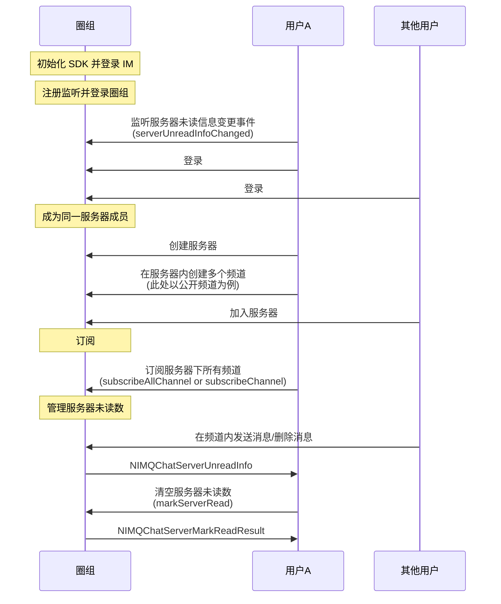

<!--keywords: 未读数, 服务器未读数, 圈组 -->

服务器未读数，指圈组服务器下所有频道的消息总未读数。网易云信 NIM SDK 的[`NIMQChatMessageManagerDelegate`](https://doc.yunxin.163.com/messaging/references/iOS/doxygen/Latest/zh/d4/d3f/protocol_n_i_m_q_chat_message_manager_delegate-p.html)协议提供[`serverUnreadInfoChanged`](https://doc.yunxin.163.com/messaging/references/iOS/doxygen/Latest/zh/d4/d3f/protocol_n_i_m_q_chat_message_manager_delegate-p.html#a82eab65257af7c26621097a8ea5fb02a)回调方法，监听圈组服务器未读数变更。用户在圈组频道内发送或删除消息后，SDK 触发回调，得到未读信息[`NIMQChatServerUnreadInfo`](https://doc.yunxin.163.com/messaging/references/iOS/doxygen/Latest/zh/d1/d23/interface_n_i_m_q_chat_server_unread_info.html)


本文介绍获取服务器未读数的实现方法以及相应的示例代码。 


::: note notice
游客接收到的消息无已读未读逻辑。不支持对游客展示消息未读数。
:::

## 前提条件

- 已[登录圈组](https://doc.yunxin.163.com/messaging/guide/TM2MjY5NzE?platform=iOS)，并已创建服务器和频道。
- 用户已加入服务器。


## 使用限制

服务器未读数管理存在如下与未读数相关的限制：

- 所有未读消息（包括@消息）的消息阈值默认为 99 条。
- @消息的未读数的有效期，默认为 7 天，即默认存储 7 天。

若需要扩展上限，可在控制台配置圈组子功能项（**未读的@消息数-周期** 和 **所有未读消息（包括@）的消息计数-阈值**），具体请参考[开通和配置圈组功能](https://doc.yunxin.163.com/messaging/guide/TM1OTU0MTM?platform=iOS)。


## 实现流程

### 流程概览

::: note note
以下时序图可能因为网络问题显示异常。如显示异常，一般刷新当前页面即可正常显示。
:::


  


### **流程说明**
1. 用户A 注册[`serverUnreadInfoChanged:`](https://doc.yunxin.163.com/docs/interface/messaging/iOS/doxygen/Latest/zh/d4/d3f/protocol_n_i_m_q_chat_message_manager_delegate-p.html#a82eab65257af7c26621097a8ea5fb02a)回调方法，监听`NIMQChatServerUnreadInfo`的变化。
   
    示例代码如下：

    ```
    - (void)serverUnreadInfoChanged:(NSDictionary <NSNumber *, NIMQChatServerUnreadInfo *> *)serverUnreadInfoDic
    {
        //code here
    }
    ```

2. 根据服务器下的频道数量，按如下方法订阅服务器下的所有频道的未读数，订阅后 SDK 获取并缓存各频道的初始未读数。

    - 如果服务器下的频道数量不超过 200，则用户A 可调用[`subscribeAllChannel:completion`](https://doc.yunxin.163.com/docs/interface/messaging/iOS/doxygen/Latest/zh/df/dac/protocol_n_i_m_q_chat_server_manager-p.html#a2a363e0217a79ee8c1fc6453a59dfba7)方法一次性订阅服务器下所有的频道的未读数（将参数[`NIMQChatSubscribeType`](https://doc.yunxin.163.com/docs/interface/messaging/iOS/doxygen/Latest/zh/d2/ddd/_n_i_m_q_chat_defs_8h.html#a9ddcfda12a811d11124bdb2798a392d3)设为`NIMQChatSubscribeTypeChannelMsgUnreadCount`）。需要注意的是，单次调用该方法，最多仅能传入 10 个服务器 ID。


    - 如果服务器下的频道数量超过 200，则用户A 需调用[`subscribeChannel:completion`](https://doc.yunxin.163.com/docs/interface/messaging/iOS/doxygen/Latest/zh/df/d6b/protocol_n_i_m_q_chat_channel_manager-p.html#a3353e33c8c986078b4bfc63015ae49a0)方法订阅服务器下所有频道的未读数（将参数[`NIMQChatSubscribeType`](https://doc.yunxin.163.com/docs/interface/messaging/iOS/doxygen/Latest/zh/d2/ddd/_n_i_m_q_chat_defs_8h.html#a9ddcfda12a811d11124bdb2798a392d3)设为`NIMQChatSubscribeTypeChannelMsgUnreadCount`）。需要注意的是，单次调用该方法，最多仅能订阅 100 个频道。


    ::: note important
    - 通过`subscribeChannel:completion`订阅频道，单次调用可传入的服务器 ID 数量上限为 10 个。即使多次调用，单个服务器下最多仅能订阅 200 个 频道。如果目标服务器下频道数量大于 200，需改用`subscribeChannel:completion`方法订阅服务器下所有频道（单次调用最多可订阅 100 个频道）。
    - 获取服务器的精确未读数，必须订阅服务器下的所有频道的未读数。
    :::


    <br>


    :::::: div custom-tabs 
    ::: tab subscribeAllChannel

    ```
    NIMQChatSubscribeAllChannelParam *param = [[NIMQChatSubscribeAllChannelParam alloc] init];
    param.serverId = 1432214;
    param.subscribeType = NIMQChatSubscribeTypeChannelMsgUnreadCount;

    [[NIMSDK sharedSDK].qchatServerManager subscribeAllChannel:param completion:^(NSError * _Nullable error, NIMQChatSubscribeAllChannelResult * _Nullable result) {
        //your code
    }];
    ```
    :::
    ::: tab subscribeChannel
    

    ```
    NIMQChatChannelIdInfo *idInfo = [[NIMQChatChannelIdInfo alloc] init];
    idInfo.serverId = 123786;
    idInfo.channelId = 123098;
    NIMQChatSubscribeChannelParam *param = [[NIMQChatSubscribeChannelParam alloc] init];
    param.targets = @[idInfo];
    param.subscribeType = NIMQChatSubscribeTypeChannelMsgUnreadCount;
    param.operationType = NIMQChatSubscribeOperationTypeSubscribe;
    [[NIMSDK sharedSDK].qchatChannelManager subscribeChannel:param completion:^(NSError * _Nullable error, NIMQChatSubscribeChannelResult * _Nullable result) {
       //code
    }];
    ```
    :::
    ::::::
3. 其他用户发送或删除消息后，SDK 对服务器下所有已订阅频道的未读数进行累加计算。

    未读数**累加规则**如下：

    - 接到新消息，某个频道未读数 +1 时：
        - 如果累加未读数达到未读数上限（`maxCount`），则触发回调，给出`maxCount`。
        - 如果累加未读数没有达到`maxCount`，则触发回调，给出累加未读数。
    - 消息被删除，某个频道未读数 - 1 时：
        - 如果累加未读数达到`maxCount`，则触发回调，给出`maxCount`。
        - 如果累加未读数没有达到`maxCount`，则触发回调，给出累加未读数。

4. SDK 计算完所有已订阅频道的累加未读数（`NIMQChatServerUnreadInfo`）后，组成 以对应的服务器ID（serverId）的 NSNumber 包装为Key，相应IMQChatServerUnreadInfo 为 value 的字典，将其返回给用户A。

    ::: note notice :::
    - SDK 对未读信息变化回调的触发做了节流处理，100ms 内默认最多只能触发一次。您接收到该事件后可以直接渲染视图。
    - 服务器累加未读数在达到`maxCount`后，回调仍会触发，但服务器未读数不再继续累加。
    ::: 

5. 如需清空服务器未读数，可调用[`markServerRead:completion`](https://doc.yunxin.163.com/docs/interface/messaging/iOS/doxygen/Latest/zh/df/dac/protocol_n_i_m_q_chat_server_manager-p.html#a8acbb09eef92cf983545e9d4c7989cc6)方法进行清空。 

    ```
    NIMQChatMarkServerReadParam *param = [[NIMQChatMarkServerReadParam alloc] init];
    param.serverIds = @[@(1432214), @(423532), @(5345253)];

    [[NIMSDK sharedSDK].qchatServerManager markServerRead:param completion:^(NSError * _Nullable error, NIMQChatMarkServerReadResult * _Nullable result) {
        //your code
    }];
    ```


