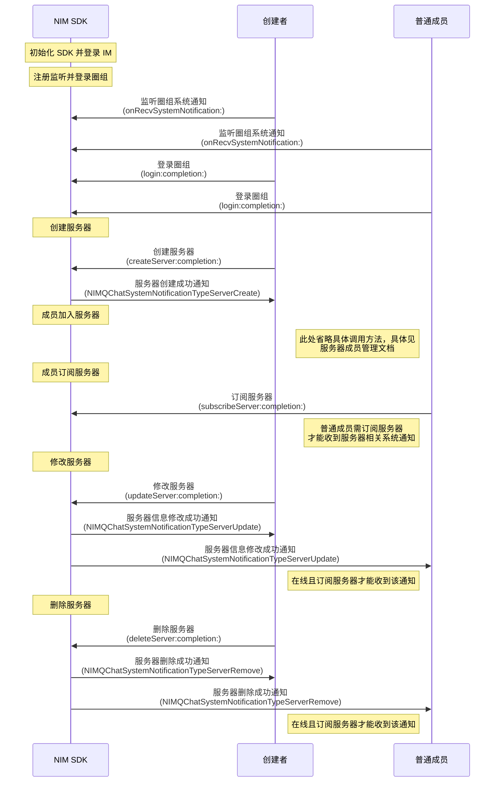

NIM SDK 的<a href="https://doc.yunxin.163.com/docs/interface/messaging/iOS/doxygen/Latest/zh/df/dac/protocol_n_i_m_q_chat_server_manager-p.html" target="_blank">`NIMQChatServerManager`</a>协议提供管理服务器的相关方法，支持圈组服务器的创建、修改、删除和查询。


## 前提条件


- 已注册`onRecvSystemNotification:`监听系统通知的接收。示例代码参见[圈组系统通知收发](https://doc.yunxin.163.com/messaging/guide/DAzNzk2NjY?platform=iOS)。

  具体**与服务器管理相关**的系统通知类型以及触发时序，见本文末尾的[相关系统通知](#相关系统通知)。

- 已<a href="https://doc.yunxin.163.com/messaging/guide/TM2MjY5NzE?platform=iOS" target="_blank">登录圈组</a>。


## 使用限制


单个用户的服务器的数量上限（包括自己创建的和加入的）默认为 100 个。 

若需要扩展上限，可在控制台配置圈组子功能项（**单个用户 server 数**），具体请参考[开通和配置圈组功能](https://doc.yunxin.163.com/messaging/guide/TM1OTU0MTM?platform=iOS)。


## 实现方法


### 创建服务器


调用<a href="https://doc.yunxin.163.com/docs/interface/messaging/iOS/doxygen/Latest/zh/df/dac/protocol_n_i_m_q_chat_server_manager-p.html#a328f438ee785c36d6be0e292ab33b8b7" target="_blank">`createServer:completion:`</a>方法可创建一个服务器。

入参说明见[`NIMQChatCreateServerParam`](https://doc.yunxin.163.com/docs/interface/messaging/iOS/doxygen/Latest/zh/d9/dc7/interface_n_i_m_q_chat_create_server_param.html)。


示例代码如下：

```
NIMQChatCreateServerParam *param = [[NIMQChatCreateServerParam alloc] init];
param.name = @"云信Server";
//反垃圾业务id
param.antispamBusinessId = @"{\"picbid\": \"542364432634d6\"}";
id <NIMQChatServerManager> qchatServerManager = [[NIMSDK sharedSDK] qchatServerManager];
[qchatServerManager createServer:param
                      completion:^(NSError *error, NIMQChatCreateServerResult *result) {
    // your code
}];
```


::: note note
上述示例代码中的`antispamBusinessId`为圈组内容审核的配置项，详情请参见<a href="https://doc.yunxin.163.com/messaging/guide/zMxMTQxMDc?platform=iOS" target="_blank">圈组内容审核</a>。
:::


### 修改服务器


调用<a href="https://doc.yunxin.163.com/docs/interface/messaging/iOS/doxygen/Latest/zh/df/dac/protocol_n_i_m_q_chat_server_manager-p.html#aabe27353073337c17b5afcf4e2c06b12" target="_blank">` updateServer:completion:`</a>方法可修改服务器的配置信息，包括服务器名称、服务器图标、服务器自定义扩展、服务器邀请模式和服务器申请模式等。

入参说明见[`NIMQChatUpdateServerParam`](https://doc.yunxin.163.com/docs/interface/messaging/iOS/doxygen/Latest/zh/da/de9/interface_n_i_m_q_chat_update_server_param.html)。


::: note notice
调用该方法需要拥有“管理服务器”的权限（[`NIMQChatPermissionType`](https://doc.yunxin.163.com/docs/interface/messaging/iOS/doxygen/Latest/zh/d2/ddd/_n_i_m_q_chat_defs_8h.html#aeee4335aecd193652bc2e7e05679ebb0)枚举中的`NIMQChatPermissionTypeManageServer`）。权限通过身份组进行配置和管理，具体请参见<a href="https://doc.yunxin.163.com/messaging/guide/Dk5MTI4Mzc?platform=iOS" target="_blank">身份组概述</a>及其他身份组相关文档。
:::

<br>

示例代码如下：


```
NIMQChatUpdateServerParam *param = [[NIMQChatUpdateServerParam alloc] init];
param.serverId = 123456;
param.name = @"更新后的名称";
//反垃圾业务id
param.antispamBusinessId = @"{\"picbid\": \"542364432634d6\"}";
id <NIMQChatServerManager> qchatServerManager = [[NIMSDK sharedSDK] qchatServerManager];
[qchatServerManager updateServer:param
                      completion:^(NSError * error, NIMQChatUpdateServerResult * result) {
    // your code
}];

```


### 删除服务器


服务器创建者可调用<a href="https://doc.yunxin.163.com/docs/interface/messaging/iOS/doxygen/Latest/zh/df/dac/protocol_n_i_m_q_chat_server_manager-p.html#a27419098912219b1425c262e6b85c1dd" target="_blank">`deleteServer:completion:`</a>方法将自己创建的某个服务器删除。


::: note notice
仅服务器创建者可删除服务器。
:::


<br>

示例代码如下：


```
NIMQChatDeleteServerParam *param = [[NIMQChatDeleteServerParam alloc] init];
param.serverId = 123456;
id <NIMQChatServerManager> qchatServerManager = [[NIMSDK sharedSDK] qchatServerManager];
[qchatServerManager deleteServer:param
                      completion:^(NSError *error) {
    // your code
}];
```


### 查询服务器
#### 分页查询服务器列表

用户登录圈组后，如果想要获取当前圈组内已有的服务器，可调用<a href="https://doc.yunxin.163.com/docs/interface/messaging/iOS/doxygen/Latest/zh/df/dac/protocol_n_i_m_q_chat_server_manager-p.html#a5f0e299283039a65d37928f3c416345c" target="_blank">`getServersByPage:completion:`</a>方法，通过时间戳和查询数量分页查询服务器列表。

入参说明见[`NIMQChatGetServersByPageParam`](https://doc.yunxin.163.com/docs/interface/messaging/iOS/doxygen/Latest/zh/d0/d92/interface_n_i_m_q_chat_get_servers_by_page_param.html)调用时可通过`NIMQChatGetServersByPageHandler`可设置回调函数，监听操作结果。如果调用成功，回调返回查询到的服务器列表。

示例代码如下：


```
NIMQChatGetServersByPageParam *param = [[NIMQChatGetServersByPageParam alloc] init];
// 传0拉取最新的Server
param.timeTag = 0;
param.limit = 20;
id <NIMQChatServerManager> qchatServerManager = [[NIMSDK sharedSDK] qchatServerManager];
[qchatServerManager getServersByPage:param
                          completion:^(NSError * error, NIMQChatGetServersByPageResult * result) {
    // your code
}];
```


#### 根据服务器ID查询服务器列表


用户登录圈组后，如果需要检索服务器，可调用<a href="https://doc.yunxin.163.com/docs/interface/messaging/iOS/doxygen/Latest/zh/df/dac/protocol_n_i_m_q_chat_server_manager-p.html#a5b09193852327bdecd09807ff46b921f" target="_blank">`getServers:completion:`</a>方法，根据服务器的 ID 查询对应的服务器列表。调用时可通过`NIMQChatGetServersHandler`可设置回调函数，监听操作结果。如果调用成功，回调返回查询到的服务器列表。


示例代码如下：

```
NIMQChatGetServersParam *param = [[NIMQChatGetServersParam alloc] init];
param.serverIds = @[@(123456), @(123457), @(123458)];
param.antispamBusinessId = @"{\"picbid\": \"804265342b7425324f53425c343454\", \"txtbid\": \"804265342b7425324f53425c343454\"}";
id <NIMQChatServerManager> qchatServerManager = [[NIMSDK sharedSDK] qchatServerManager];
[qchatServerManager getServers:param
                    completion:^(NSError * error, NIMQChatGetServersResult * result) {
    // your code
}];

```


## 相关参考


### 相关系统通知


圈组系统通知的类型在[`NIMQChatSystemNotificationType`](https://doc.yunxin.163.com/docs/interface/messaging/iOS/doxygen/Latest/zh/d2/ddd/_n_i_m_q_chat_defs_8h.html#a68eb284bba17219f9f003e57d5ae414b)枚举中定义，与服务器管理相关的内置系统通知类型如下：

枚举值| 说明
---- | --------------
`NIMQChatSystemNotificationTypeServerCreate` | 创建服务器
`NIMQChatSystemNotificationTypeServerRemove`  |  删除服务器
`NIMQChatSystemNotificationTypeServerUpdate`| 修改服务器信息

::: note note 
更多圈组系统通知相关说明，请参见[圈组系统通知相关](https://doc.yunxin.163.com/messaging/guide/DMwMjIzNTY?platform=iOS)。
:::


### API 调用时序




上图中：

- “订阅”相关说明，参见[圈组订阅机制](https://doc.yunxin.163.com/messaging/guide/zAxNjQzMDA?platform=iOS)。
- “成员加入服务器”相关说明，参见[服务器成员管理](https://doc.yunxin.163.com/messaging/guide/zMyODEwMTg?platform=iOS)。
