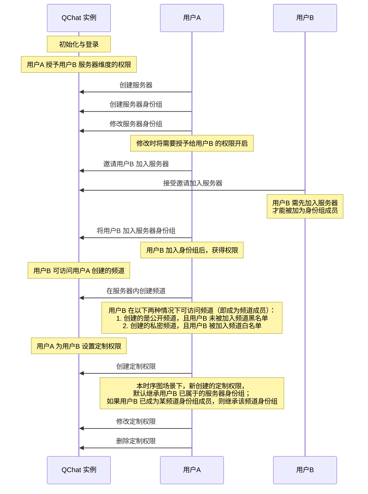

除了可以通过频道身份组对所有身份组成员在频道维度进行权限控制，也可以为单个频道成员专门定制权限，管控其在频道维度的操作。 


## 用户定制权限定义

频道成员的定制权限由<a href="https://doc.yunxin.163.com/docs/interface/messaging/iOS/doxygen/Latest/zh/db/d5f/interface_n_i_m_q_chat_member_role.html" target="_blank">`NIMQChatMemberRole`</a>接口定义。该接口的内置方法如下：


参数 | 类型 |说明
:---- | :-------------- | :---------
`roleId`  |  unsigned long long  |  定制权限 ID
`serverId` | unsigned long long  | 身份组所属服务器的 ID
`accid`|  unsigned long long  |  需要定制权限的用户的 IM 账号 ID
`channelId`| unsigned long long|   频道 ID
`nick` | NSString  | 需要定制权限的成员在服务器的昵称
`avatar` | NSString  | 需要定制权限的成员在服务器的头像 
`custom`| NSString  | 定制权限的自定义字段 
`auths`   |NSArray<<a href="https://doc.yunxin.163.com/docs/interface/messaging/iOS/doxygen/Latest/zh/d5/d01/interface_n_i_m_q_chat_permission_status_info.html" target="_blank">NIMQChatPermissionStatusInfo*</a>>|   `NIMQChatPermissionStatusInfo`类表示身份组权限信息，包含`type`和`status`两个参数:<ul><li>`type`:权限类型，在<a href="https://doc.yunxin.163.com/docs/interface/messaging/iOS/doxygen/Latest/zh/d2/ddd/_n_i_m_q_chat_defs_8h.html#aeee4335aecd193652bc2e7e05679ebb0" target="_blank">`NIMQChatPermissionType`</a>内定义，具体权限说明请参见<a href="https://doc.yunxin.163.com/messaging/guide/Dk5MTI4Mzc?platform=iOS#身份组权限类型" target="_blank">身份组权限类型</a></li><li>`status`:<a href="https://doc.yunxin.163.com/docs/interface/messaging/iOS/doxygen/Latest/zh/d2/ddd/_n_i_m_q_chat_defs_8h.html#a69f6804a6e4ebf1c55e19c7e35c8f995" target="_blank">`NIMQChatPermissionStatus`</a>内定义了权限的配置状态，包括<ul><li>`NIMQChatPermissionStatusDeny`:无权限</li><li>`NIMQChatPermissionStatusExtend`：继承</li><li>`NIMQChatPermissionStatusAllow`：有权限</li></ul></li></ul>
`type`| <a href="https://doc.yunxin.163.com/docs/interface/messaging/iOS/doxygen/Latest/zh/d2/ddd/_n_i_m_q_chat_defs_8h.html#a56ed499c1812d9496e52df7b8b5ebb7d" target="_blank">`NIMQChatServerMemberType`</a>| 需要定制权限的成员的类型，包括`NIMQChatServerMemberTypeCommon`（普通成员）和`NIMQChatServerMemberTypeOwner`（服务器所有者）
`joinTime`  | NSTimeInterval  | 需要定制权限的用户被邀请后，加入服务器的时间
`inviter` | NSString    | 邀请者的 IM 账号（`accid`）


## 前提条件


- 已注册[`onRecvSystemNotification:`](https://doc.yunxin.163.com/docs/interface/messaging/iOS/doxygen/Latest/zh/d4/d3f/protocol_n_i_m_q_chat_message_manager_delegate-p.html#aaf1d34a4b6373edc5fbc408f36b98853)监听圈组的系统通知。示例代码参见[圈组系统通知收发](https://doc.yunxin.163.com/messaging/guide/DAzNzk2NjY?platform=iOS)。

  具体**与用户定制权限相关**的系统通知类型，见本文末尾的[相关系统通知](#相关系统通知)。
  

- 已创建服务器并创建频道。

## 实现方法




### 创建定制权限

调用<a href="https://doc.yunxin.163.com/docs/interface/messaging/iOS/doxygen/Latest/zh/d5/d39/protocol_n_i_m_q_chat_role_manager-p.html#a841aafcc1cf3fb5913be8b70145cf4a5" target="_blank">`addMemberRole:completion:`</a> 方法为某个成员创建定制权限。

::: note notice 
调用该方法必须先拥有`NIMQChatPermissionTypeManageRole`和`NIMQChatPermissionTypeManageChannel`权限，且是该频道的成员。如果没有权限，调用该方法将返回 `403` 错误码。
:::
- API 原型

    ```
    - (void)addMemberRole:(NIMQChatAddMemberRoleParam *)param
                    completion:(nullable NIMQChatAddMemberRoleHandler)completion;
    ```

- 示例代码
    ```
    id<NIMQChatRoleManager> qchatRoleManager = [[NIMSDK sharedSDK] qchatRoleManager];
    NIMQChatAddMemberRoleParam *param = [[NIMQChatAddMemberRoleParam alloc] init];
    param.serverId = 123456;
    param.channelId = 121212;
    param.accid = @"yunxin1";
    [qchatRoleManager addMemberRole:param
            completion:^(NSError *__nullable error, NIMQChatMemberRole *__nullable result) {
        // your code
    }];

    ```


### 删除定制权限

调用<a href="https://doc.yunxin.163.com/docs/interface/messaging/iOS/doxygen/Latest/zh/d5/d39/protocol_n_i_m_q_chat_role_manager-p.html#afd66fd07a80e8222fe0aa562e201955b" target="_blank">`removeMemberRole:completion:`</a>方法可将某人的定制权限删除。


该方法的入参结构为<a href="https://doc.yunxin.163.com/docs/interface/messaging/iOS/doxygen/Latest/zh/d6/d45/interface_n_i_m_q_chat_remove_member_role_param.html" target="_blank">`NIMQChatRemoveMemberRoleParam`</a>，需要传入所属的服务器 ID、频道 ID、目标成员的 IM 账号（`accid`）。


::: note notice 
调用该方法必须先拥有`NIMQChatPermissionTypeManageRole`和`NIMQChatPermissionTypeManageChannel	`权限，且是该频道的成员。如果没有权限，调用该方法将返回 `403` 错误码。
:::

- API 原型
    ```
    - (void)removeMemberRole:(NIMQChatRemoveMemberRoleParam *)param
                    completion:(nullable NIMQChatRemoveMemberRoleHandler)completion;
    ```


- 示例代码
    ```
    id<NIMQChatRoleManager> qchatRoleManager = [[NIMSDK sharedSDK] qchatRoleManager];
    NIMQChatRemoveMemberRoleParam *param = [[NIMQChatRemoveMemberRoleParam alloc] init];
    param.serverId = 123456;
    param.channelId = 121212;
    param.accid = @"yunxin1";
    [qchatRoleManager removeMemberRole:param
                completion:^(NSError *__nullable error) {
        // your code
    }];

    ```


### 修改定制权限

调用<a href="https://doc.yunxin.163.com/docs/interface/messaging/iOS/doxygen/Latest/zh/d5/d39/protocol_n_i_m_q_chat_role_manager-p.html#aa3b921324fcfd5f2c74282b87d1985d0" target="_blank">`updateChannelRole:completion:`</a>可修改某成员的定制权限。 

该方法的入参结构为<a href="https://doc.yunxin.163.com/docs/interface/messaging/iOS/doxygen/Latest/zh/d2/d13/interface_n_i_m_q_chat_update_member_role_param.html" target="_blank">`NIMQChatUpdateMemberRoleParam`</a>，需要传入所属的服务器 ID、频道 ID、目标成员的 IM 账号（`accid`）和需更新的权限数组。


::: note notice 
- 调用该方法必须先拥有`NIMQChatPermissionTypeManageRole`权限。如果没有该权限，调用该方法将返回 `403` 错误码。
- 用户无法配置自己没有的权限。例如用户没有权限A，则无法修改权限A 的配置。
:::


- API 原型

    ```
    - (void)updateMemberRole:(NIMQChatUpdateMemberRoleParam *)param
                    completion:(nullable NIMQChatUpdateMemberRoleHandler)completion;
    ```

- 示例代码
    ```
    id<NIMQChatRoleManager> qchatRoleManager = [[NIMSDK sharedSDK] qchatRoleManager];
    NIMQChatUpdateMemberRoleParam *param = [[NIMQChatUpdateMemberRoleParam alloc] init];
    param.serverId = 123456;
    param.channelId = 121212;
    param.accid = @"yunxin1";
    NIMQChatPermissionStatusInfo *info = [[NIMQChatPermissionStatusInfo alloc] init];
    info.type = NIMQChatPermissionTypeRemindOther;
    info.status = NIMQChatPermissionStatusExtend;
    param.commands = @[info];
    [qchatRoleManager updateMemberRole:param
                completion:^(NSError *__nullable error, NIMQChatMemberRole *__nullable result) {
        // your code
    }];
    ```

## 相关参考

### 相关系统通知


圈组系统通知的类型在[`NIMQChatSystemNotificationType`](https://doc.yunxin.163.com/docs/interface/messaging/iOS/doxygen/Latest/zh/d2/ddd/_n_i_m_q_chat_defs_8h.html#a68eb284bba17219f9f003e57d5ae414b)枚举中定义，与用户定制权限相关的内置系统通知类型如下：

枚举值| 说明   
---- | --------------
`NIMQChatSystemNotificationTypeMemberRoleAuthUpdate` | 更新“用户定制权限”   |


::: note note 
该系统通知的接收条件，请参见服务端文档的[身份组权限相关事件通知](https://doc.yunxin.163.com/messaging/guide/TkxMzc1NDg?platform=server#身份组权限相关事件通知)。
:::


