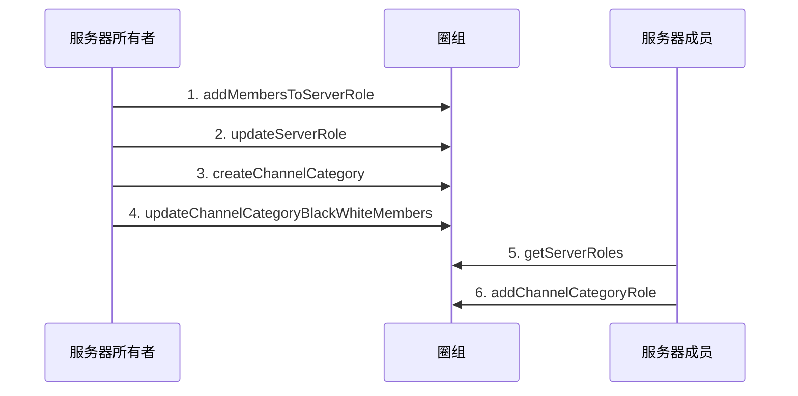

<!--keywords: 频道分组身份组, 频道分组身份组, 身份组 -->


本文以多用户交互的典型场景为例，介绍在频道分组维度对用户进行权限控制的实现方法和示例代码。


## 技术原理

网易云信即时通讯 NIM iOS SDK 的[`NIMQChatRoleManager Protocol`](https://doc.yunxin.163.com/docs/interface/messaging/iOS/doxygen/Latest/zh/d5/d39/protocol_n_i_m_q_chat_role_manager-p.html)提供管理频道分组身份组的相关方法（如[`addChannelCategoryRole`](https://doc.yunxin.163.com/docs/interface/messaging/iOS/doxygen/Latest/zh/d5/d39/protocol_n_i_m_q_chat_role_manager-p.html#a5488d0c1914ac4a090b9f4a884911024)），助您快速实现在频道分组维度对不同用户的权限控制。 
调用管理频道分组身份组的相关方法，需要管理角色的权限（[`NIMQChatPermissionType`](https://doc.yunxin.163.com/docs/interface/messaging/iOS/doxygen/Latest/zh/d2/ddd/_n_i_m_q_chat_defs_8h.html#aeee4335aecd193652bc2e7e05679ebb0)枚举下的`NINQChatPermissionTypeManageRole`）。

新创建的频道分组身份组的权限设置，默认继承自指定的服务器身份组（通过服务器身份组的 ID 指定）。如果需要在频道分组维度设置和服务器维度有区分的用户权限，需在创建频道分组身份组后调用[`updateChannelCategoryRole`](https://doc.yunxin.163.com/docs/interface/messaging/iOS/doxygen/Latest/zh/d5/d39/protocol_n_i_m_q_chat_role_manager-p.html#aa5c228755b6b39f5abb8f3a69ee1b89a)方法对权限做更改；或者调用[`addChannelCategoryMemberRole`](https://doc.yunxin.163.com/docs/interface/messaging/iOS/doxygen/Latest/zh/d5/d39/protocol_n_i_m_q_chat_role_manager-p.html#ab706cc9d80d1b9f7e0cfa45009569b17)方法创建成员在频道分组的定制权限，再调用[`updateChannelCategoryMemberRole`](https://doc.yunxin.163.com/docs/interface/messaging/iOS/doxygen/Latest/zh/d5/d39/protocol_n_i_m_q_chat_role_manager-p.html#a105aa80f83b29115f06c87f577c6b601)方法设置具体的权限。


## 实现方法

本节以服务器所有者和服务器成员的交互为例（服务器成员仅被授予管理角色权限的场景），介绍服务器成员创建频道分组身份组的实现流程。

::: note note :::
- 服务器所有者可以在创建服务器和频道分组后直接调用[`addChannelCategoryRole`](https://doc.yunxin.163.com/docs/interface/messaging/iOS/doxygen/Latest/zh/d5/d39/protocol_n_i_m_q_chat_role_manager-p.html#a5488d0c1914ac4a090b9f4a884911024)方法创建频道分组身份组。
- 创建后， 用户可更新、删除、查询频道分组身份组。
- 服务器成员**创建频道分组某人的定制权限**的实现，可参考本场景的流程。
:::

### **前提条件**


  

已创建服务器。


### **实现流程**

1. 服务器所有者调用[`addServerRoleMembers`](https://doc.yunxin.163.com/docs/interface/messaging/iOS/doxygen/Latest/zh/d5/d39/protocol_n_i_m_q_chat_role_manager-p.html#aa7643eb127517c92450da2d5dbc1800f)方法，将服务器成员加入身份组。
2. 服务器所有者调用[`updateServerRole`](https://doc.yunxin.163.com/docs/interface/messaging/iOS/doxygen/Latest/zh/d5/d39/protocol_n_i_m_q_chat_role_manager-p.html#a45583fc4bfd523b42dad6bfe5841422f)方法，授予该身份组管理角色的权限（`NINQChatPermissionTypeManageRole`）。

    **结果**：
    
    服务器成员将拥有管理角色的权限。
    
3. 服务器所有者调用[`createChannelCategory`](https://doc.yunxin.163.com/docs/interface/messaging/iOS/doxygen/Latest/zh/df/d6b/protocol_n_i_m_q_chat_channel_manager-p.html#ad8abd53b70dcfefb28f6332ebd2590ec)方法，创建频道分组。
4. 如果创建的是私密频道分组，服务器所有者需调用[`updateChannelCategoryBlackWhiteMembers`](https://doc.yunxin.163.com/docs/interface/messaging/iOS/doxygen/Latest/zh/df/d6b/protocol_n_i_m_q_chat_channel_manager-p.html#a73d461746fa3b7c5944fa9f87e80d887)方法，将该成员加入频道分组白名单。

    ::: note note :::
    如果创建的是公开频道分组，请跳过这一步。
    :::

5. 服务器成员调用[`getServerRoles`](https://doc.yunxin.163.com/docs/interface/messaging/iOS/doxygen/Latest/zh/d5/d39/protocol_n_i_m_q_chat_role_manager-p.html#a1ee05a072e326ad24c15e1c9b273d44e)方法获取频道分组所在的服务器的目标身份组 ID（`serverRoleId`）。

    ::: note notice :::
    如果服务器成员在服务器维度没有管理角色的权限，但在频道分组维度有该权限时，调用`getServerRoles`方法时传入频道分组 ID（`categoryId`）才能查询服务器的身份组列表，进而获取目标服务器身份组 ID。
    :::
    
6. 服务器成员调用[`addChannelCategoryRole`](https://doc.yunxin.163.com/docs/interface/messaging/iOS/doxygen/Latest/zh/d5/d39/protocol_n_i_m_q_chat_role_manager-p.html#a5488d0c1914ac4a090b9f4a884911024)方法，创建频道分组身份组。 

    <div style="width:100px">入参</div> | <div style="width:80px">类型</div> | 是否必传 | 说明
    ---- | -------------- | ---------
    `serverId` | unsinged long long | 是 | 频道分组所在的服务器的 ID
    `serverRoleId` |unsinged long long | 是 | 服务器身份组 ID。生成的频道分组身份组从该服务器身份组继承，以此 ID 作为频道身份组的`parentRoleId`
    `categoryId` | unsinged long long | 是 | 频道分组 ID

    ::: note important :::
    服务器成员可通过圈组的内置系统通知（`NIMQChatSystemNotificationTypeCreateChannelCategory`）获知`categoryId`。如服务器成员人数超过目前默认的阈值 2,000（可联系商务经理调整），成员需调用[`subscribeServer`](https://doc.yunxin.163.com/docs/interface/messaging/iOS/doxygen/Latest/zh/df/dac/protocol_n_i_m_q_chat_server_manager-p.html#addb73c1f377a48a2f6c224d149092804))方法订阅服务器才能接收到该系统通知。服务器成员人数在阈值内，则不需要订阅服务器也能接收到。
    :::


### **API 调用时序图**



### **示例代码**

```
//*********************  1.将服务器成员加入身份组  *********************//
//服务器id
unsigned long long serverId = 18999;
//身份组id
unsigned long long roleId = 211456;
//需要加入服务器的用户
NSString *accId = @"test1";
NIMQChatAddServerRoleMembersParam *addServerRoleMembersParam = [[NIMQChatAddServerRoleMembersParam alloc] init];
addServerRoleMembersParam.serverId = serverId;
addServerRoleMembersParam.roleId = roleId;
addServerRoleMembersParam.accountArray = @[accId];
[[NIMSDK sharedSDK].qchatRoleManager addServerRoleMembers:addServerRoleMembersParam completion:^(NSError * _Nullable error, NIMQChatAddServerRoleMembersResult * _Nullable result) {
    if (!error) {
        // do something when success
    }
}];
//*********************  2.授予该身份组管理频道权限  *********************//
NIMQChatUpdateServerRoleParam *updateServerRoleParam = [[NIMQChatUpdateServerRoleParam alloc] init];
updateServerRoleParam.roleId = roleId;
updateServerRoleParam.serverId = serverId;
NIMQChatPermissionStatusInfo *permission = [[NIMQChatPermissionStatusInfo alloc] init];
permission.type = NIMQChatPermissionTypeManageChannel;
permission.status = NIMQChatPermissionStatusAllow;
updateServerRoleParam.commands = @[permission];
[[NIMSDK sharedSDK].qchatRoleManager updateServerRole:updateServerRoleParam completion:^(NSError * _Nullable error, NIMQChatServerRole * _Nullable result) {
    if (!error) {
        // do something when success
    }
}];
//*********************  3.创建频道分组  *********************//
NIMQChatCreateChannelCategoryParam *createChannelCategoryParam = [[NIMQChatCreateChannelCategoryParam alloc] init];
createChannelCategoryParam.serverId = serverId;
createChannelCategoryParam.name = @"分组名";
createChannelCategoryParam.viewMode = NIMQChatChannelViewModePrivate;
[[NIMSDK sharedSDK].qchatChannelManager createChannelCategory:createChannelCategoryParam completion:^(NSError * _Nullable error, NIMQChatChannelCategory * _Nullable result) {
    if (!error) {
        // do something when success
    }
}];

//*********************  4.将成员加入频道分组白名单  *********************//
unsigned long long categoryId = 78900;
NIMQChatUpdateChannelCategoryBlackWhiteMembersParam *updateCategoryBWMembersParam = [[NIMQChatUpdateChannelCategoryBlackWhiteMembersParam alloc] init];
updateCategoryBWMembersParam.serverId = serverId;
updateCategoryBWMembersParam.categoryId = categoryId;
updateCategoryBWMembersParam.type = NIMQChatChannelMemberRoleTypeWhite;
updateCategoryBWMembersParam.opeType = NIMQChatChannelMemberRoleOpeTypeAdd;
[[NIMSDK sharedSDK].qchatChannelManager updateChannelCategoryBlackWhiteMembers:updateCategoryBWMembersParam completion:^(NSError * _Nullable error) {
    //code
}];

//*********************  5.查询服务器下身份组列表  *********************//
NIMQChatGetServerRolesParam *getServerRoleParam = [[NIMQChatGetServerRolesParam alloc] init];
getServerRoleParam.serverId = serverId;
getServerRoleParam.limit = 100;
getServerRoleParam.priority = 0;
getServerRoleParam.categoryId = categoryId;
[[NIMSDK sharedSDK].qchatRoleManager getServerRoles:getServerRoleParam completion:^(NSError * _Nullable error, NIMQChatGetServerRolesResult * _Nullable result) {
    //code
}];

//*********************  6.创建频道分组身份组  *********************//
NIMQChatAddChannelCategoryRoleParam *addCategoryRoleParam = [[NIMQChatAddChannelCategoryRoleParam alloc] init];
addCategoryRoleParam.serverId = serverId;
addCategoryRoleParam.parentRoleId = roleId;
addCategoryRoleParam.categoryId = categoryId;
[[NIMSDK sharedSDK].qchatRoleManager addChannelCategoryRole:addCategoryRoleParam completion:^(NSError * _Nullable error, NIMQChatChannelCategoryRole * _Nullable result) {
    //code
}];
```


  