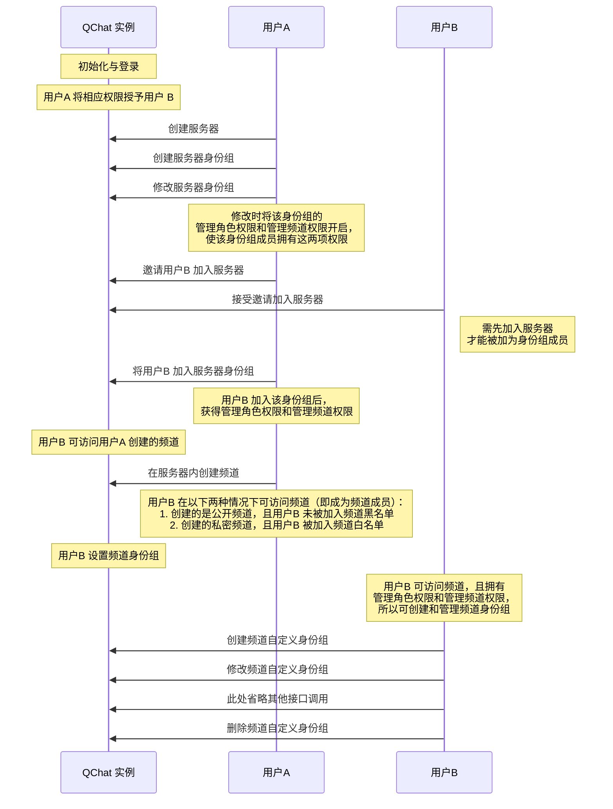
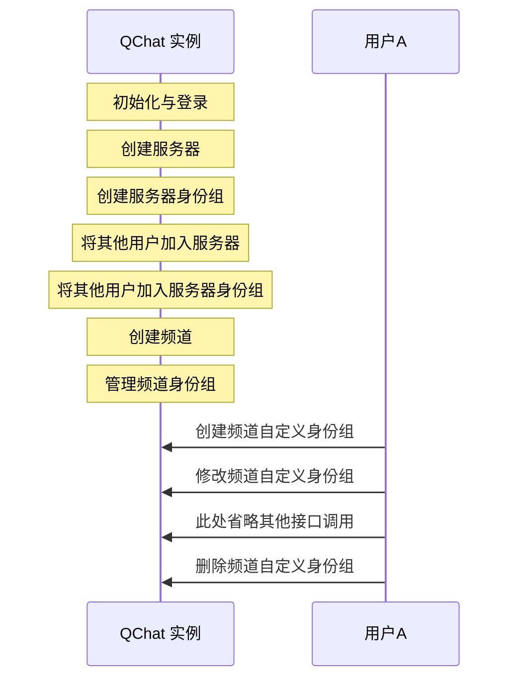

频道身份组用于对用户在频道维度进行权限控制。频道身份组分为两种，@everyone 身份组和自定义身份组。其中 @everyone 身份组在频道创建时默认自动创建，自定义身份组需要用户手动创建。频道的@everyone 身份组和自定义身份组成员均默认为频道所有成员。

::: note note
频道下 @everyone 身份组的属性和权限默认继承自服务器的 @everyone 身份组。
:::

## 频道身份组定义
SDK 内定义频道身份组的类为<a href="https://doc.yunxin.163.com/docs/interface/messaging/iOS/doxygen/Latest/zh/df/db7/interface_n_i_m_q_chat_channel_role.html" target="_blank">`NIMQChatChannelRole`</a>。该类的成员参数如下：


<details><summary>单击展开查看 NIMQChatChannelRole 的成员参数</summary>

方法 | 类型 |说明
:---- | :-------------- | :---------
`roleId`  |  unsigned long long  |  身份组 ID
`serverId` | unsigned long long  | 身份组所属服务器的 ID
`parentRoleId`|  unsigned long long  |  被继承服务器的身份组 ID
`channelId`| unsigned long long|   频道 ID
`name` | NSString  | 身份组名称
`icon` | NSString  | 身份组图标的 URL 
`ext`| NSString  | 身份组的扩展字段 
`auths`   |NSArray<<a href="https://doc.yunxin.163.com/docs/interface/messaging/iOS/doxygen/Latest/zh/d5/d01/interface_n_i_m_q_chat_permission_status_info.html" target="_blank">NIMQChatPermissionStatusInfo*</a>>|   `NIMQChatPermissionStatusInfo`类表示身份组权限信息，包含`type`和`status`两个参数:<ul><li>`type`:权限类型，在<a href="https://doc.yunxin.163.com/docs/interface/messaging/iOS/doxygen/Latest/zh/d2/ddd/_n_i_m_q_chat_defs_8h.html#aeee4335aecd193652bc2e7e05679ebb0" target="_blank">`NIMQChatPermissionType`</a>内定义，具体权限说明请参见<a href="https://doc.yunxin.163.com/messaging/guide/Dk5MTI4Mzc?platform=iOS#身份组权限类型" target="_blank">身份组权限类型</a></li><li>`status`:<a href="https://doc.yunxin.163.com/docs/interface/messaging/iOS/doxygen/Latest/zh/d2/ddd/_n_i_m_q_chat_defs_8h.html#a69f6804a6e4ebf1c55e19c7e35c8f995" target="_blank">`NIMQChatPermissionStatus`</a>内定义了权限的配置状态，包括<ul><li>`NIMQChatPermissionStatusDeny`:关闭，即表示身份组成员无该权限</li><li>`NIMQChatPermissionStatusExtend`：继承继承（针对频道自定义身份组来说，指继承自频道的 @everyone 身份组中对应的相同权限项的配置状态）</li><li>`NIMQChatPermissionStatusAllow`：开启，即表示身份组成员拥有该权限</li></ul></li></ul>
`type`|  <a href="https://doc.yunxin.163.com/docs/interface/messaging/iOS/doxygen/Latest/zh/d2/ddd/_n_i_m_q_chat_defs_8h.html#a5874b61a136ff33004c8c7cbb9776b5f" target="_blank">`NIMQChatRoleType`</a>    |返回身份组的类型，`NIMQChatRoleTypeEveryOne` 表示 @everyone 身份组，`NIMQChatRoleTypeCustom` 表示自定义身份组 
`createTime`  | NSTimeInterval  | 身份组的创建时间
`updateTime` | NSTimeInterval   | 身份组配置的更新时间

</details>

## 前提条件


- 已注册[`onRecvSystemNotification:`](https://doc.yunxin.163.com/docs/interface/messaging/iOS/doxygen/Latest/zh/d4/d3f/protocol_n_i_m_q_chat_message_manager_delegate-p.html#aaf1d34a4b6373edc5fbc408f36b98853)监听圈组的系统通知。示例代码参见[圈组系统通知收发](https://doc.yunxin.163.com/messaging/guide/DAzNzk2NjY?platform=iOS)。

  具体**与频道身份组相关**的系统通知类型，见本文末尾的[相关系统通知](#相关系统通知)。
  

- 已创建服务器并创建频道。


## 实现方法


以下两个时序图分别展示了服务器普通成员（用户B）和服务器创建者（用户A）进行频道身份组管理前需要实现的业务逻辑。普通成员需要拥有管理频道和管理角色的权限才能创建和管理频道身份组，而服务器创建者默认拥有全量权限，可以在频道内直接创建并管理频道身份组。


服务器普通成员管理频道身份组：



服务器创建者管理频道身份组：




### **创建频道自定义身份组**

默认情况下，频道直接使用服务器身份组来控制权限。如有需要，可调用<a href="https://doc.yunxin.163.com/docs/interface/messaging/iOS/doxygen/Latest/zh/d5/d39/protocol_n_i_m_q_chat_role_manager-p.html#aeb1f683355d7dd95a3166fd22810e7db" target="_blank">`addChannelRole:completion:`</a>方法新增一个频道身份组，新增的频道身份组的权限配置默认继承自服务器身份组（调用时必须通过`serverRoleId`指定新增的频道身份组继承自哪个服务器身份组）。


::: note notice 
调用该方法必须先拥有管理角色权限（`NIMQChatPermissionTypeManageRole`）和频道管理权限（`NIMQChatPermissionTypeManageChannel`），且必须是该频道的成员。如果没有权限，调用该方法将返回 `403` 错误码。
:::


新创建的频道身份组和被继承的服务器身份组有以下联系：

- 公开频道的身份组成员等于被继承的服务器身份组成员去掉频道黑名单成员和频道黑名单身份组成员；私密频道的身份组成员是同时存在于频道白名单和被继承的服务器身份组的公共成员，以及同时存在于频道白名单身份组和被继承的服务器身份组的公共成员。
- 刚创建时两者权限一样。频道身份组刚创建时所有权限配置都为`INHERIT`，因此实际权限和被继承的服务器身份组一样，之后可以调用`updateChannelRole`方法手动修改，使频道身份组和服务器身份组拥有不一样的权限。
- 频道身份组的`parentRoleId`等于被继承的服务器身份组的`roleId`。


- API 原型 

    ```
    - (void)addChannelRole:(NIMQChatAddChannelRoleParam *)param
                    completion:(nullable NIMQChatAddChannelRoleHandler)completion;
    ```

- 示例代码

    ```
    id<NIMQChatRoleManager> qchatRoleManager = [[NIMSDK sharedSDK] qchatRoleManager];
    NIMQChatAddChannelRoleParam *param = [[NIMQChatAddChannelRoleParam alloc] init];
    param.serverId = 123456;
    param.channelId = 121212;
    param.parentRoleId = 111;
    [qchatRoleManager addChannelRole:param
                completion:^(NSError *__nullable error, NIMQChatChannelRole *__nullable result) {
        // your code
    }];

    ```


### **修改频道自定义身份组**

调用<a href="https://doc.yunxin.163.com/docs/interface/messaging/iOS/doxygen/Latest/zh/d5/d39/protocol_n_i_m_q_chat_role_manager-p.html#aa3b921324fcfd5f2c74282b87d1985d0" target="_blank">`updateChannelRole:completion: `</a>方法可修改频道自定义身份组的权限配置。

该方法的入参结构为<a href="https://doc.yunxin.163.com/docs/interface/messaging/iOS/doxygen/Latest/zh/d1/d73/interface_n_i_m_q_chat_update_channel_role_param.html" target="_blank">`NIMQChatUpdateChannelRoleParam`</a>，需要传入频道身份组所属的服务器 ID、频道 ID、频道身份组 ID 和待更新的权限数组。


::: note notice 
- 调用该方法必须先拥有`NIMQChatPermissionTypeManageRole`权限和`NIMQChatPermissionTypeManageChannel`权限，且必须是该频道的成员。如果没有权限，调用该方法将返回 `403` 错误码。
- 用户无法配置自己没有的权限。例如用户没有权限A，则无法修改权限A 的配置。
- 用户无法将自己拥有的某个权限在全部所属身份组中都设置为关闭（`NIMQChatPermissionStatusDeny`）。例如用户有 10 个身份组且这 10 个身份组都开启权限A，那么用户最多可以将其中 9 个身份组的权限A 设置为`NIMQChatPermissionStatusDeny`。
:::

- API 原型

    ```
    - (void)updateChannelRole:(NIMQChatUpdateChannelRoleParam *)param
                    completion:(nullable NIMQChatUpdateChannelRoleHandler)completion;
    ```

- 示例代码
    ```
    id<NIMQChatRoleManager> qchatRoleManager = [[NIMSDK sharedSDK] qchatRoleManager];
    NIMQChatUpdateChannelRoleParam *param = [[NIMQChatUpdateChannelRoleParam alloc] init];
    param.serverId = 123456;
    param.channelId = 121212;
    param.roleId = 111;
    NIMQChatPermissionStatusInfo *info = [[NIMQChatPermissionStatusInfo alloc] init];
    info.type = NIMQChatPermissionTypeRemindOther;
    info.status = NIMQChatPermissionStatusExtend;
    param.commands = @[info];
    [qchatRoleManager updateChannelRole:param
                completion:^(NSError *__nullable error, NIMQChatChannelRole *__nullable result) {
        // your code
    }];
    ```

### **删除频道身份组**

调用 <a href="https://doc.yunxin.163.com/docs/interface/messaging/iOS/doxygen/Latest/zh/d5/d39/protocol_n_i_m_q_chat_role_manager-p.html#a1c3a0971f3c8fc4847239702255506ad" target="_blank">`removeChannelRole:completion:`</a>可删除频道身份组。

::: note notice 
调用该方法必须先拥有`NIMQChatPermissionTypeManageRole`权限和`NIMQChatPermissionTypeManageChannel`权限，且必须是该频道的成员。如果没有权限，调用该方法将返回 `403` 错误码。
:::
- API 原型
    ```
    - (void)removeChannelRole:(NIMQChatRemoveChannelRoleParam *)param
                    completion:(nullable NIMQChatRemoveChannelRoleHandler)completion;
    ```
其中<a href="https://doc.yunxin.163.com/docs/interface/messaging/iOS/doxygen/Latest/zh/d1/d78/interface_n_i_m_q_chat_remove_channel_role_param.html" target="_blank">`NIMQChatRemoveChannelRoleParam`</a>需要传入服务器 ID、频道 ID 和身份组 ID。


- 示例代码
    ```
    id<NIMQChatRoleManager> qchatRoleManager = [[NIMSDK sharedSDK] qchatRoleManager];
    NIMQChatRemoveChannelRoleParam *param = [[NIMQChatRemoveChannelRoleParam alloc] init];
    param.serverId = 123456; //服务器ID
    param.channelId = 121212; //频道ID
    param.roleId = 111; //身份组ID
    [qchatRoleManager removeChannelRole:param
                completion:^(NSError *__nullable error) {
        // your code
    }];
    ```


## 相关参考

### 相关系统通知


圈组系统通知的类型在[`NIMQChatSystemNotificationType`](https://doc.yunxin.163.com/docs/interface/messaging/iOS/doxygen/Latest/zh/d2/ddd/_n_i_m_q_chat_defs_8h.html#a68eb284bba17219f9f003e57d5ae414b)枚举中定义，与频道身份组相关的内置系统通知类型如下：

枚举值| 说明   
---- | --------------
`NIMQChatSystemNotificationTypeChannelRoleAuthUpdate` | 更新“频道身份组”权限   |


::: note note 
该系统通知的接收条件，请参见服务端文档的[身份组权限相关事件通知](https://doc.yunxin.163.com/messaging/guide/TkxMzc1NDg?platform=server#身份组权限相关事件通知)。
:::

