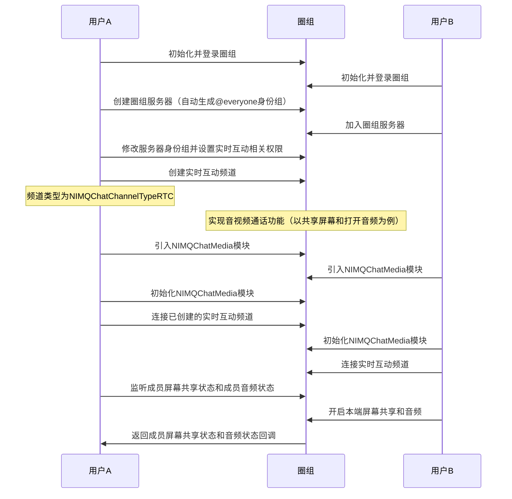

实时互动频道模块，是基于圈组，在文字基础上新增的，用于提供产品能力、丰富社区运营、提升用户活跃的，适用于百万用户量级、多场景、多能力的在线实时互动的多媒体插件。

网易云信 NIM SDK 通过插件的方式引入实时互动频道模块，通过接口的融合，帮助用户在圈组中实现在线实时互动，用户无需独立对接。


实时互动频道模块（`QChatMedia`）中主要包含以下三类接口，分别实现不同的功能。

- [`NIMQChatMediaKit`](https://doc.yunxin.163.com/messaging/references/iOS/doxygen/V9.3.0/zh/Classes/NIMQChatMediaKit.html) 接口提供实时互动频道模块的初始化等能力。
- [`NIMQChatMediaChannelManager`](https://doc.yunxin.163.com/messaging/references/iOS/doxygen/V9.3.0/zh/Protocols/NIMQChatMediaChannelManager.html) 接口提供实时互动模块的连接、更新以及实时互动频道内多样的音视频通话能力。
- [`NIMQChatMediaChannelDelegate`](https://doc.yunxin.163.com/messaging/references/iOS/doxygen/V9.3.0/zh/Protocols/NIMQChatMediaChannelDelegate.html) 接口提供实时互动频道相关事件的监听能力。


本文介绍如何在圈组中引入实时互动频道模块，并在实时互动频道中实现实时音视频通话功能。

## 技术原理


::: note note
图中的圈组服务器并非传统意义上的服务器，它是社群本身。所有的内容、兴趣、话题、关系都是以此为基础进行发展的。在圈组的场景下，任何行为的开始前都应该先创建一个圈组服务器。圈组详细信息，请参见[圈组介绍](https://doc.yunxin.163.com/messaging/guide/TMzMzgwOTU?platform=iOS)。
:::

### 实时互动频道与频道的关联逻辑

实时互动频道是频道的一种类型，通过参数 [`NIMQChatChannelType`](https://doc.yunxin.163.com/docs/interface/messaging/iOS/doxygen/Latest/zh/d2/ddd/_n_i_m_q_chat_defs_8h.html#a305177856fe8469a259c546c08170534) 来区分（`NIMQChatChannelTypeRTC` = 1）。

频道的管理需要在 [`NIMQChatChannelManager`](https://doc.yunxin.163.com/docs/interface/messaging/iOS/doxygen/Latest/zh/df/d6b/protocol_n_i_m_q_chat_channel_manager-p.html) 中进行，包括创建、删除实时互动频道，以及管理权限等，具体请参见[频道管理](https://doc.yunxin.163.com/messaging/guide/zgwMzk2ODk?platform=iOS)。

实时互动频道内的音视频相关功能需要在实时互动频道模块 (`QChatMedia`) 中实现。

::: note note
使用实时互动频道模块相关接口，需要拥有音视频权限（具体权限类型请参见[`NIMQChatPermissionType`](https://doc.yunxin.163.com/docs/interface/messaging/iOS/doxygen/Latest/zh/d2/ddd/_n_i_m_q_chat_defs_8h.html#aeee4335aecd193652bc2e7e05679ebb0)），可通过更新身份组来实现。
:::


### 实时互动频道可见机制

实时互动频道的可见机制与频道相同，分以下两种情况：

- 如果实时互动频道为公开频道，那么只要用户未被加入频道黑名单，实时互动频道就对其可见。
- 如果实时互动频道为私密频道，那么用户需被加入频道白名单，实时互动频道才对其可见。

::: note note
频道黑白名单相关操作，请参见[频道管理](https://doc.yunxin.163.com/messaging/guide/zgwMzk2ODk?platform=iOS)。
:::

## 实现方法

本节以实时互动频道创建者与实时互动频道成员之间的交互为例，介绍在圈组中实现音视频通话功能的流程。

  
### 前提条件

- 已[开通实时互动频道功能](https://doc.yunxin.163.com/messaging/guide/TM1OTU0MTM?platform=iOS)。实时互动频道需要在开通圈组功能的基础上额外开通后才能使用。
- 已初始化登录圈组，并创建或加入圈组服务器和身份组，具体请参见[圈组服务器管理](https://doc.yunxin.163.com/messaging/guide/zA0ODY0NzQ?platform=iOS)和[身份组](https://doc.yunxin.163.com/messaging/guide/Dk5MTI4Mzc?platform=iOS)。

### 时序图




这里主要介绍部分步骤，其余步骤请参考对应的文档。

### 实现流程

1.用户 A 通过调用 [`updateServerRole:`](https://doc.yunxin.163.com/docs/interface/messaging/iOS/doxygen/Latest/zh/d5/d39/protocol_n_i_m_q_chat_role_manager-p.html#a45583fc4bfd523b42dad6bfe5841422f) 方法修改服务器身份组并设置[实时互动相关权限（NIMQChatPermissionType）](https://doc.yunxin.163.com/docs/interface/messaging/iOS/doxygen/Latest/zh/d2/ddd/_n_i_m_q_chat_defs_8h.html#aeee4335aecd193652bc2e7e05679ebb0)。示例代码如下：

```
// 连接权限
NIMQChatPermissionStatusInfo *connectPermission = [[NIMQChatPermissionStatusInfo alloc] init];
connectPermission.type = NIMQChatPermissionTypeRTCChannelConnect;
connectPermission.status = NIMQChatPermissionStatusAllow;

// 开启麦克风权限
NIMQChatPermissionStatusInfo *microPhonePermission = [[NIMQChatPermissionStatusInfo alloc] init];
microPhonePermission.type = NIMQChatPermissionTypeRTCChannelOpenMicrophone;
microPhonePermission.status = NIMQChatPermissionStatusAllow;

// 开启摄像头权限
NIMQChatPermissionStatusInfo *cameraPermission = [[NIMQChatPermissionStatusInfo alloc] init];
cameraPermission.type = NIMQChatPermissionTypeRTCChannelOpenCamera;
cameraPermission.status = NIMQChatPermissionStatusAllow;

NIMQChatUpdateServerRoleParam *param = [[NIMQChatUpdateServerRoleParam alloc] init];
param.serverId = 56435;
param.roleId = 765436;
param.commands = @[connectPermission, microPhonePermission, cameraPermission];

//修改权限
[[NIMSDK sharedSDK].qchatRoleManager updateServerRole:param completion:^(NSError * _Nullable error, NIMQChatServerRole * _Nullable result) {
    //修改完成后的code            
}];

```
::: note notice
修改服务器身份组权限需要拥有管理身份组的权限（`NIMQChatPermissionTypeManageRole`）。具体请参见[身份组](https://doc.yunxin.163.com/messaging/guide/Dk5MTI4Mzc?platform=iOS)。
:::

2. 用户 A 调用 [`createChannel:`](https://doc.yunxin.163.com/docs/interface/messaging/iOS/doxygen/Latest/zh/df/d6b/protocol_n_i_m_q_chat_channel_manager-p.html#ab496ffeebbeb568bcff924918026075d) 方法创建实时互动频道。示例代码如下：

```objc
id<NIMQChatChannelManager> qchatChannelManager = [[NIMSDK sharedSDK] qchatChannelManager];
NIMQChatCreateChannelParam * param = [[NIMQChatCreateChannelParam alloc] init];
param.serverId = 123456;
param.name = @"云信Channel";
param.type = NIMQChatChannelTypeRTC;
//反垃圾业务id
param.antispamBusinessId = @"{\"picbid\": \"804265342b7425324f53425c343454\", \"txtbid\": \"804265342b7425324f53425c343454\"}";
[qchatChannelManager createChannel:param
    completion:^(NSError *__nullable error, NIMQChatChannel *__nullable result) {
    // your code
}];
```
::: note notice
- 创建实时互动频道需要拥有管理频道的权限（`NIMQChatPermissionTypeManageChannel`）。具体请参见[身份组](https://doc.yunxin.163.com/messaging/guide/Dk5MTI4Mzc?platform=iOS)。
- 实时互动频道的类型为 `NIMQChatChannelTypeRTC`。
- 创建的实时互动频道需要对用户 B 可见，后续用户 B 才能进行连接。具体请参见[实时互动频道可见机制](#实时互动频道可见机制)。
:::

3. 引入实时互动频道功能插件（`NIMQChatMediaKit`）。示例代码如下：

```
pod 'NIMQChatMediaKit'
```

4. 调用 [`initWithCompletion:`](https://doc.yunxin.163.com/messaging/references/iOS/doxygen/V9.3.0/zh/Classes/NIMQChatMediaKit.html#//api/name/initWithCompletion:) 方法初始化实时互动频道模块，添加相关代理监听方法。示例代如下：

```
[[NIMQChatMediaKit shared] initWithCompletion:^(NSError * _Nullable error) {
       //初始化完成后的code
}];
[[NIMQChatMediaKit shared].channelManager addMediaChannelListener:self];
```

5. 调用 [`connectChannel:ofServer:completion:`](https://doc.yunxin.163.com/messaging/references/iOS/doxygen/V9.3.0/zh/Protocols/NIMQChatMediaChannelManager.html#//api/name/connectChannel:ofServer:completion:)  方法连接已创建的实时互动频道。示例代码如下：

```
[[NIMQChatMediaKit shared].channelManager connectChannel:4235654 ofServer:5325432 completion:^(NSError * _Nullable error) {
        //进入实时互动频道后的code
}];
```

6. 在实时互动频道中实现具体的音视频功能（以共享屏幕和打开音频为例）。
    
    a. 注册成员共享屏幕状态（[`onMemberScreenShareStateChangedWithMember:isSharing:operateBy:`](https://doc.yunxin.163.com/messaging/references/iOS/doxygen/V9.3.0/zh/Protocols/NIMQChatMediaChannelDelegate.html#//api/name/onMemberScreenShareStateChangedWithMember:isSharing:operateBy:)）和成员音频状态（[`onMemberAudioMuteChangedWithMember:mute:operateBy:`](https://doc.yunxin.163.com/messaging/references/iOS/doxygen/V9.3.0/zh/Protocols/NIMQChatMediaChannelDelegate.html#//api/name/onMemberAudioMuteChangedWithMember:mute:operateBy:) ）回调方法监听事件。
    
    b. 调用 [`startScreenShareWithCompletion:`](https://doc.yunxin.163.com/messaging/references/iOS/doxygen/V9.3.0/zh/Protocols/NIMQChatMediaChannelManager.html#//api/name/startScreenShareWithCompletion:) 和  [`unmuteAudioWithAccId:completion:`](https://doc.yunxin.163.com/messaging/references/iOS/doxygen/V9.3.0/zh/Protocols/NIMQChatMediaChannelManager.html#//api/name/unmuteAudioWithAccId:completion:) 方法开启本端屏幕共享并打开成员音频。
    
    c. 触发回调，服务器返回成员共享屏幕状态和成员音频状态信息。


```
// 成员共享屏幕状态回调
- (void)onMemberScreenShareStateChangedWithMember:(NSString *)memberAccId isSharing:(BOOL)isSharing operateBy:(NSString *)operateByAccId
{
    
}
// 成员音频状态回调
- (void)onMemberAudioMuteChangedWithMember:(NSString *)memberAccId mute:(BOOL)mute operateBy:(NSString *)operateByAccId
{
    
}

****

// 开启本端屏幕共享
[[NIMQChatMediaKit shared].channelManager startScreenShareWithCompletion:^(NSError * _Nullable error) {
    dispatch_async(dispatch_get_main_queue(),^{
        if (!error) {
            // 打开屏幕共享成功
        } else {
            // 打开屏幕共享失败
        }
    });
}];
// 打开成员音频
[[NIMQChatMediaKit shared].channelManager unmuteAudioWithAccId:@"zhangsan" completion:^(NSError * _Nullable error) {
    dispatch_async(dispatch_get_main_queue(),^{
        //更新UI
    });
}];
```

7. 调用 [`disconnectCompletion:`](https://doc.yunxin.163.com/messaging/references/iOS/doxygen/V9.3.0/zh/Protocols/NIMQChatMediaChannelManager.html#//api/name/disconnectCompletion:) 方法与实时互动频道断开连接。示例代码如下：

```
[[NIMQChatMediaKit shared].channelManager disconnectCompletion:^(NSError * _Nullable error) {
        dispatch_async(dispatch_get_main_queue(),^{
            if (!error) {
                // 退出房间成功
            } 
        });
    }];
```

##  实时互动频道功能列表

以上流程中只针对共享屏幕和打开音频进行了具体说明，实时互动频道还支持以下功能，可参考上述示例实现用户所需的其他音视频功能。

 <div style="width:80px">功能</div> | <div style="width:120px">描述</div>
:---- | :-------------- 
切换摄像头|[`switchCamera`](https://doc.yunxin.163.com/messaging/references/iOS/doxygen/V9.3.0/zh/Protocols/NIMQChatMediaChannelManager.html#//api/name/switchCamera)
打开音频|[`unmuteAllAudioWithCompletion:`](https://doc.yunxin.163.com/messaging/references/iOS/doxygen/V9.3.0/zh/Protocols/NIMQChatMediaChannelManager.html#//api/name/unmuteAllAudioWithCompletion:)（所有成员）；[`unmuteMyAudio:`](https://doc.yunxin.163.com/messaging/references/iOS/doxygen/V9.3.0/zh/Protocols/NIMQChatMediaChannelManager.html#//api/name/unmuteMyAudio:)（自己）；[`unmuteAudioWithAccId:`](https://doc.yunxin.163.com/messaging/references/iOS/doxygen/V9.3.0/zh/Protocols/NIMQChatMediaChannelManager.html#//api/name/unmuteAudioWithAccId:completion:)（指定成员）
打开视频|[`unmuteAllVideoWithCompletion:`](https://doc.yunxin.163.com/messaging/references/iOS/doxygen/V9.3.0/zh/Protocols/NIMQChatMediaChannelManager.html#//api/name/unmuteAllVideoWithCompletion:)（所有成员）；[`unmuteMyVideo:`](https://doc.yunxin.163.com/messaging/references/iOS/doxygen/V9.3.0/zh/Protocols/NIMQChatMediaChannelManager.html#//api/name/unmuteMyVideo:)（自己）； [`unmuteVideoWithAccId:completion:`](https://doc.yunxin.163.com/messaging/references/iOS/doxygen/V9.3.0/zh/Protocols/NIMQChatMediaChannelManager.html#//api/name/unmuteVideoWithAccId:completion:)（指定成员）
共享屏幕|[`startScreenShareWithCompletion:`](https://doc.yunxin.163.com/messaging/references/iOS/doxygen/V9.3.0/zh/Protocols/NIMQChatMediaChannelManager.html#//api/name/startScreenShareWithCompletion:)
订阅远端视频流/辅流视频|[`subscribeRemoteVideoStreamWithAccId`](https://doc.yunxin.163.com/messaging/references/iOS/doxygen/V9.3.0/zh/Protocols/NIMQChatMediaChannelManager.html#//api/name/subscribeRemoteVideoStreamWithAccId:streamType:)；[`subscribeRemoteVideoSubStreamWithAccId:`](https://doc.yunxin.163.com/messaging/references/iOS/doxygen/V9.3.0/zh/Protocols/NIMQChatMediaChannelManager.html#//api/name/subscribeRemoteVideoSubStreamWithAccId:)
设置用户画布|[`setupLocalVideoCanvas:`](https://doc.yunxin.163.com/messaging/references/iOS/doxygen/V9.3.0/zh/Protocols/NIMQChatMediaChannelManager.html#//api/name/setupLocalVideoCanvas:)(本端画布)；[`setupRemoteVideoCanvas:`](https://doc.yunxin.163.com/messaging/references/iOS/doxygen/V9.3.0/zh/Protocols/NIMQChatMediaChannelManager.html#//api/name/setupRemoteVideoCanvas:accId:)（远端画布）；[`setupRemoteSubStreamVideoCanvas:`](https://doc.yunxin.163.com/messaging/references/iOS/doxygen/V9.3.0/zh/Protocols/NIMQChatMediaChannelManager.html#//api/name/setupRemoteSubStreamVideoCanvas:accId:)（远端辅流画布）
打开扬声器|[`setSpeakerphoneOn:`](https://doc.yunxin.163.com/messaging/references/iOS/doxygen/V9.3.0/zh/Protocols/NIMQChatMediaChannelManager.html#//api/name/setSpeakerphoneOn:)
启动说话者音量提示|[`enableAudioVolumeIndicationWithEnable:`](https://doc.yunxin.163.com/messaging/references/iOS/doxygen/V9.3.0/zh/Protocols/NIMQChatMediaChannelManager.html#//api/name/enableAudioVolumeIndicationWithEnable:interval:)


##  API 参考

以下为本文涉及的实时互动频道相关 API。

<div style="width:80px">API</div> | <div style="width:120px">说明</div>
:---- | :-------------- 
[`updateServerRole:`](https://doc.yunxin.163.com/docs/interface/messaging/iOS/doxygen/Latest/zh/d5/d39/protocol_n_i_m_q_chat_role_manager-p.html#a45583fc4bfd523b42dad6bfe5841422f) |修改服务器身份组
[`createChannel:`](https://doc.yunxin.163.com/docs/interface/messaging/iOS/doxygen/Latest/zh/df/d6b/protocol_n_i_m_q_chat_channel_manager-p.html#ab496ffeebbeb568bcff924918026075d) |创建实时互动频道
[`initWithCompletion:`](https://doc.yunxin.163.com/messaging/references/iOS/doxygen/V9.3.0/zh/Classes/NIMQChatMediaKit.html#//api/name/initWithCompletion:)|  初始化实时互动频道模块
[`connectChannel:ofServer:completion:`](https://doc.yunxin.163.com/messaging/references/iOS/doxygen/V9.3.0/zh/Protocols/NIMQChatMediaChannelManager.html#//api/name/connectChannel:ofServer:completion:)  |连接实时互动频道
[`disconnectCompletion:`](https://doc.yunxin.163.com/messaging/references/iOS/doxygen/V9.3.0/zh/Protocols/NIMQChatMediaChannelManager.html#//api/name/disconnectCompletion:)| 取消连接实时互动频道
[`addMediaChannelListener:`](https://doc.yunxin.163.com/messaging/references/iOS/doxygen/V9.3.0/zh/Protocols/NIMQChatMediaChannelManager.html#//api/name/addMediaChannelListener:) |添加实时互动频道事件监听
[`removeMediaChannelListener:`](https://doc.yunxin.163.com/messaging/references/iOS/doxygen/V9.3.0/zh/Protocols/NIMQChatMediaChannelManager.html#//api/name/removeMediaChannelListener:)  |移除实时互动频道监听
[`unmuteAudioWithAccId:completion:`](https://doc.yunxin.163.com/messaging/references/iOS/doxygen/V9.3.0/zh/Protocols/NIMQChatMediaChannelManager.html#//api/name/unmuteAudioWithAccId:completion:)|打开成员音频
[`muteVideoWithAccId:completion:`](https://doc.yunxin.163.com/messaging/references/iOS/doxygen/V9.3.0/zh/Protocols/NIMQChatMediaChannelManager.html#//api/name/muteVideoWithAccId:completion:) |关闭成员音频
[`startScreenShareWithCompletion:`](https://doc.yunxin.163.com/messaging/references/iOS/doxygen/V9.3.0/zh/Protocols/NIMQChatMediaChannelManager.html#//api/name/startScreenShareWithCompletion:)|开启本端屏幕共享
[`stopScreenShareWithCompletion:`](https://doc.yunxin.163.com/messaging/references/iOS/doxygen/V9.3.0/zh/Protocols/NIMQChatMediaChannelManager.html#//api/name/stopScreenShareWithCompletion:)|关闭本端屏幕共享
[`onMemberScreenShareStateChangedWithMember:isSharing:operateBy:`](https://doc.yunxin.163.com/messaging/references/iOS/doxygen/V9.3.0/zh/Protocols/NIMQChatMediaChannelDelegate.html#//api/name/onMemberScreenShareStateChangedWithMember:isSharing:operateBy:)|成员屏幕共享状态回调
[`onMemberAudioMuteChangedWithMember:mute:operateBy:`](https://doc.yunxin.163.com/messaging/references/iOS/doxygen/V9.3.0/zh/Protocols/NIMQChatMediaChannelDelegate.html#//api/name/onMemberAudioMuteChangedWithMember:mute:operateBy:)|成员音频状态回调

更多实时互动频道相关接口如下：
- [`NIMQChatMediaKit`](https://doc.yunxin.163.com/messaging/references/iOS/doxygen/V9.3.0/zh/Classes/NIMQChatMediaKit.html) 接口提供实时互动频道模块的初始化等能力。
- [`NIMQChatMediaChannelManager`](https://doc.yunxin.163.com/messaging/references/iOS/doxygen/V9.3.0/zh/Protocols/NIMQChatMediaChannelManager.html) 接口提供实时互动模块的连接、更新以及实时互动频道内多样的音视频通话能力。
- [`NIMQChatMediaChannelDelegate`](https://doc.yunxin.163.com/messaging/references/iOS/doxygen/V9.3.0/zh/Protocols/NIMQChatMediaChannelDelegate.html) 接口提供实时互动频道相关事件的监听能力。


## 常见问题

调用[`connectChannel:`](https://doc.yunxin.163.com/messaging/references/iOS/doxygen/V9.3.0/zh/Protocols/NIMQChatMediaChannelManager.html#//api/name/connectChannel:ofServer:completion:)  方法连接已创建的实时互动频道时报错，提示需要 token。

问题原因：连接的频道不是实时互动频道，即频道类型不是 `NIMQChatChannelTypeRTC`，请重新连接类型为 `NIMQChatChannelTypeRTC` 的频道。