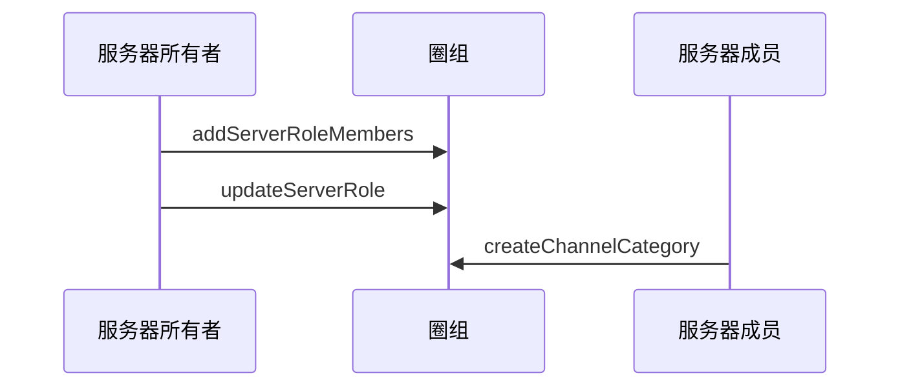

<!--keywords: 频道分组, 创建频道分组, 修改频道分组信息，查询频道分组 -->

NIM SDK 的[`NIMQChatChannelCategory`](https://doc.yunxin.163.com/docs/interface/messaging/iOS/doxygen/Latest/zh/d4/d8d/interface_n_i_m_q_chat_channel_category.html)结构体定义了频道分组。同时，SDK 的[`NIMQChatChannelManager`](https://doc.yunxin.163.com/docs/interface/messaging/iOS/doxygen/Latest/zh/df/d6b/protocol_n_i_m_q_chat_channel_manager-p.html)协议提供管理频道分组的相关方法，助您快速实现对频道的分类管理。


## 功能介绍
管理频道分组的相关方法，基本都需要满足如下两个前提条件才能调用。各方法的具体调用前提，请参见本文的 [API参考](#API参考)。

- 频道分组对用户可见，具体机制见下文的**频道分组可见机制**。
- 拥有管理频道的权限（[`NIMQChatPermissionType`](https://doc.yunxin.163.com/docs/interface/messaging/iOS/doxygen/Latest/zh/d2/ddd/_n_i_m_q_chat_defs_8h.html#aeee4335aecd193652bc2e7e05679ebb0)枚举中的`NIMQChatPermissionTypeManageChannel`）。


### **频道分组可见机制**

- 频道分组对**服务器成员**的可见机制与频道的类似，分如下两种情况：

    - 如果频道分组为公开频道分组，那么只要用户未被加入频道分组黑名单，频道分组就对其可见。
    - 如果频道分组为私密频道分组，那么用户需被加入频道分组白名单，频道分组才对其可见。

    ::: note note :::
    频道分组黑白名单相关说明，请参见[频道分组黑白名单](https://doc.yunxin.163.com/messaging/guide/TQ1MzMwNDA?platform=iOS)。
    :::


- 频道分组是否对**游客**可见，取决于频道分组内是否有频道对游客可见。如果频道分组内有频道对游客可见，则该频道分组对游客也可见。频道是否对游客可见由`visitorMode`决定，可在创建频道和修改频道时设置，具体见[频道管理](https://doc.yunxin.163.com/messaging/guide/zYxNzM0Nzg?platform=iOS)。

    ::: note notice 
    如果频道的`visitorMode`为跟随模式，且同步模式（`syncMode`）为“与频道分组同步”，则当该频道所属的频道分组的查看模式（`viewMode`）变更后，该频道对游客的可见性也将变更。例如，在这种情况下，频道分组的查看模式由公开变为私密，则此时该频道对游客从“可见”变为“不可见”。
    :::

### **频道分组与频道的关联逻辑**

频道管理相关方法（如[`createChannel`](https://doc.yunxin.163.com/docs/interface/messaging/iOS/doxygen/Latest/zh/df/d6b/protocol_n_i_m_q_chat_channel_manager-p.html#ab496ffeebbeb568bcff924918026075d)）的入参包含`categoryId`和`syncMode`。在调用`createChannel`时传入`categoryId`可将频道加入某个频道分组；通过设置`syncMode`，可实现频道数据与频道分组数据的同步。具体同步的数据包括查看模式（私密或公开）、黑白名单和身份组权限。


<div style="width:80px">参数</div> | <div style="width:80px">类型</div> |<div style="width:120px">说明 </div>
:---- | :-------------- |:--------------
`categoryId` | unsinged long long | 频道需加入或所在的频道分组 ID。设置为 `0` 表示频道没有频道分组。设置为频道分组 ID 表示归属某个频道分组  
`syncMode` |   [`NIMQChatChannelSyncMode`](https://doc.yunxin.163.com/docs/interface/messaging/iOS/doxygen/Latest/zh/d2/ddd/_n_i_m_q_chat_defs_8h.html#a484de2cc6ea31546aef9ec24df3da52b)    |   频道同步模式。传`1`同步，传`0`不同步，不传默认不同步。如果频道查看模式、黑白名单、身份组权限等被修改，自动改为不同步              

::: note notice :::
归属于单个频道分组的频道数量上限为 50。
:::


### **频道分组与服务器的关联逻辑**

[`NIMQChatServer`](https://doc.yunxin.163.com/docs/interface/messaging/iOS/doxygen/Latest/zh/dc/d25/interface_n_i_m_q_chat_server.html)类定义了服务器，其中包含`categoryNumber`参数，该参数表示服务器内频道分组的数量。
::: note notice :::
服务器内频道分组数量上限为 100。
:::


## 实现方法

本节以服务器所有者（即创建者）和服务器成员的交互为例，介绍服务器成员**创建频道分组**的实现流程。

::: note note :::
- 服务器所有者拥有全局权限，可以在创建服务器后直接调用[`createChannelCategory`](https://doc.yunxin.163.com/docs/interface/messaging/iOS/doxygen/Latest/zh/df/d6b/protocol_n_i_m_q_chat_channel_manager-p.html#ad8abd53b70dcfefb28f6332ebd2590ec) 方法创建频道分组。
- 用户创建频道分组后， 可对频道分组做更新、删除、修改和查询等操作，相关可调用的方法请参见本文的[API参考](https://doc.yunxin.163.com/messaging/guide/zY5Mzg5MTA?platform=iOS#API参考)。
:::

### **前提条件**


- 已注册[`onRecvSystemNotification:`](https://doc.yunxin.163.com/docs/interface/messaging/iOS/doxygen/Latest/zh/d4/d3f/protocol_n_i_m_q_chat_message_manager_delegate-p.html#aaf1d34a4b6373edc5fbc408f36b98853)监听圈组的系统通知。示例代码参见[圈组系统通知收发](https://doc.yunxin.163.com/messaging/guide/DAzNzk2NjY?platform=iOS)。

  具体**与频道分组管理相关**的系统通知类型，见本文末尾的[相关系统通知](#相关系统通知)。
  

- 已<a href="https://doc.yunxin.163.com/messaging/guide/zA0ODY0NzQ?platform=iOS#创建服务器" target="_blank">创建服务器</a>。


### **实现流程**

1. 服务器所有者调用[`addServerRoleMembers`](https://doc.yunxin.163.com/docs/interface/messaging/iOS/doxygen/Latest/zh/d5/d39/protocol_n_i_m_q_chat_role_manager-p.html#aa7643eb127517c92450da2d5dbc1800f)方法将服务器成员加入身份组。
2. 服务器所有者调用[`updateServerRole`](https://doc.yunxin.163.com/docs/interface/messaging/iOS/doxygen/Latest/zh/d5/d39/protocol_n_i_m_q_chat_role_manager-p.html#a45583fc4bfd523b42dad6bfe5841422f)方法授予该身份组管理频道的权限。
3. 服务器成员调用[`createChannelCategory`](https://doc.yunxin.163.com/docs/interface/messaging/iOS/doxygen/Latest/zh/df/d6b/protocol_n_i_m_q_chat_channel_manager-p.html#ad8abd53b70dcfefb28f6332ebd2590ec)方法创建频道分组。

### **API 调用时序图**



### **示例代码**

```
//*********************  1.将服务器成员加入身份组  *********************//
//服务器id
unsigned long long serverId = 18999;
//身份组id
unsigned long long roleId = 211456;
//需要加入服务器的用户
NSString *accId = @"test1";
NIMQChatAddServerRoleMembersParam *addServerRoleMembersParam = [[NIMQChatAddServerRoleMembersParam alloc] init];
addServerRoleMembersParam.serverId = serverId;
addServerRoleMembersParam.roleId = roleId;
addServerRoleMembersParam.accountArray = @[accId];
[[NIMSDK sharedSDK].qchatRoleManager addServerRoleMembers:addServerRoleMembersParam completion:^(NSError * _Nullable error, NIMQChatAddServerRoleMembersResult * _Nullable result) {
    if (!error) {
        // do something when success
    }
}];
//*********************  2.授予该身份组管理频道权限  *********************//
NIMQChatUpdateServerRoleParam *updateServerRoleParam = [[NIMQChatUpdateServerRoleParam alloc] init];
updateServerRoleParam.roleId = roleId;
updateServerRoleParam.serverId = serverId;
NIMQChatPermissionStatusInfo *permission = [[NIMQChatPermissionStatusInfo alloc] init];
permission.type = NIMQChatPermissionTypeManageChannel;
permission.status = NIMQChatPermissionStatusAllow;
updateServerRoleParam.commands = @[permission];
[[NIMSDK sharedSDK].qchatRoleManager updateServerRole:updateServerRoleParam completion:^(NSError * _Nullable error, NIMQChatServerRole * _Nullable result) {
    if (!error) {
        // do something when success
    }
}];
//*********************  3.创建频道分组  *********************//
NIMQChatCreateChannelCategoryParam *createChannelCategoryParam = [[NIMQChatCreateChannelCategoryParam alloc] init];
createChannelCategoryParam.serverId = serverId;
createChannelCategoryParam.name = @"分组名";
[[NIMSDK sharedSDK].qchatChannelManager createChannelCategory:createChannelCategoryParam completion:^(NSError * _Nullable error, NIMQChatChannelCategory * _Nullable result) {
    if (!error) {
        // do something when success
    }
}];
```


## 相关参考


### **相关系统通知**

频道分组相关事件的系统通知为 SDK 内置系统通知，在[`NIMQChatSystemNotificationType`](https://doc.yunxin.163.com/docs/interface/messaging/iOS/doxygen/Latest/zh/d2/ddd/_n_i_m_q_chat_defs_8h.html#a68eb284bba17219f9f003e57d5ae414b)枚举内定义。具体类型及相关的触发和接收条件见下表。

<div style="width:100px">系统通知类型</div> | <div style="width:120px">触发条件</div> | <div style="width:400px">接收条件</div> 
:---- | :-------------- | :--------- |:--------
`NIMQChatSystemNotificationTypeCreateChannelCategory` | 频道分组成功创建时  | <div><ul><li>服务器创建者和所有者：在线</li><li>其他成员：服务器成员数量低于 2,000 人阈值时只需要在线。如大于 2,000，需在线且订阅服务器</li></ul> </div>
`NIMQChatSystemNotificationTypeDeleteChannelCategory` |  频道分组被删除时   | <div><ul><li>删除者和服务器所有者：在线</li><li>其他成员：服务器成员数量低于 2,000 人阈值时只需要在线。如大于 2,000，需在线且订阅服务器</li></ul> </div>
`NIMQChatSystemNotificationTypeUpdateChannelCategory`| 频道分组信息被修改时 | <div><ul><li>修改者和服务器所有者：在线</li><li>其他成员：服务器成员数量低于 2,000 人阈值时只需要在线。如大于 2,000，需在线且订阅服务器</li></ul> </div>
`NIMQChatSystemNotificationTypeUpdateChannelCategoryBlackWhiteRole`|  频道分组黑白名单身份组被修改时  |   <div><ul><li>修改者、服务器所有者和身份组成员（身份组成员限制 100 人）：在线</li><li>其他成员：服务器成员数量低于 2,000 人阈值时只需要在线。如大于 2,000，需在线且订阅服务器</li></ul> </div>
`NIMQChatSystemNotificationTypeUpdateChannelCategoryBlackWhiteMember`| 频道分组黑白名单成员被修改时 |   <div><ul><li>修改者、服务器所有者和被加入/移出黑白名单的用户：在线</li><li>其他成员：服务器成员数量低于 2,000 人阈值时只需要在线。如大于 2,000，需在线且订阅服务器</li></ul> </div>

::: note note :::
2,000 人阈值可联系商务经理调整。
::: 


  


### **相关推送配置**

- 与频道分组相关的推送配置方法：[`updatePushNotificationProfile:channelCategory`](https://doc.yunxin.163.com/docs/interface/messaging/iOS/doxygen/Latest/zh/dd/d4f/protocol_n_i_m_q_chat_apns_manager-p.html#abc12695a5c3875c46c46ea80ba909ff4)、[`getUserPushNotificationConfigByChannelCategories`](https://doc.yunxin.163.com/docs/interface/messaging/iOS/doxygen/Latest/zh/dd/d4f/protocol_n_i_m_q_chat_apns_manager-p.html#ab18f4608715da672ec8c130bc8a4e4fd)

- 具体的推送机制请参见[圈组APNs推送](https://doc.yunxin.163.com/messaging/guide/zQ0OTI2NjA?platform=iOS)


### API参考

<div style="width:80px">API</div> | <div style="width:120px">调用前提 </div>| <div style="width:120px">说明</div>
:---- | :-------------- |:--------
[`createChannelCategory`](https://doc.yunxin.163.com/docs/interface/messaging/iOS/doxygen/Latest/zh/df/d6b/protocol_n_i_m_q_chat_channel_manager-p.html#ad8abd53b70dcfefb28f6332ebd2590ec) |  用户拥有管理频道的权限        |   创建频道分组
[`deleteChannelCategory`](https://doc.yunxin.163.com/docs/interface/messaging/iOS/doxygen/Latest/zh/df/d6b/protocol_n_i_m_q_chat_channel_manager-p.html#a15fd89de57850a54f60189425364071c)            |    频道分组对用户可见，且用户拥有管理频道的权限      | 删除频道分组
[`updateChannelCategory`](https://doc.yunxin.163.com/docs/interface/messaging/iOS/doxygen/Latest/zh/df/d6b/protocol_n_i_m_q_chat_channel_manager-p.html#ae6609e50943b3fe1243ee1a0133024c0)            |    频道分组对用户可见，且用户拥有管理频道的权限      | 修改频道分组信息
[`getChannelCategories`](https://doc.yunxin.163.com/docs/interface/messaging/iOS/doxygen/Latest/zh/df/d6b/protocol_n_i_m_q_chat_channel_manager-p.html#a0ad77fe55bcb4b8fa72552015c9db71c)            |    无     | 查询频道分组
[`getCategoriesInServerByPage`](https://doc.yunxin.163.com/docs/interface/messaging/iOS/doxygen/Latest/zh/df/d6b/protocol_n_i_m_q_chat_channel_manager-p.html#ad32fdbd3ba65f6e80089de111d1107a7)    | 频道分组对用户可见，且用户拥有管理频道的权限  | 分页查询服务器下的频道分组列表
[`getChannelsInCategoryByPage`](https://doc.yunxin.163.com/docs/interface/messaging/iOS/doxygen/Latest/zh/df/d6b/protocol_n_i_m_q_chat_channel_manager-p.html#a7c1970852e939442576f01e18f9cfd43)  |    频道分组对用户可见，且用户拥有管理频道的权限      |  分页查询频道分组下频道列表