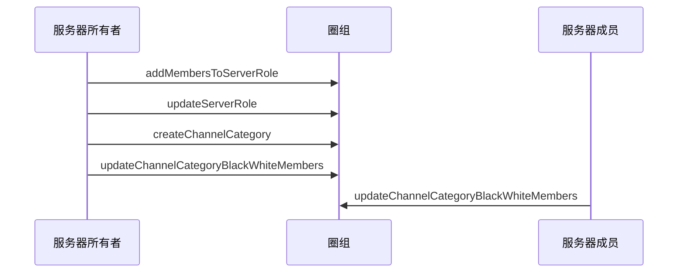

<!--keywords: 频道分组黑白名单, 黑白名单, 频道分组 -->


NIM SDK 的[`NIMQChatChannelManager`](https://doc.yunxin.163.com/docs/interface/messaging/iOS/doxygen/Latest/zh/df/d6b/protocol_n_i_m_q_chat_channel_manager-p.html)提供管理频道分组黑白名单（包括名单成员和名单身份组）的方法。


## 功能介绍

### **频道分组可见机制**

频道分组黑白名单与频道分组类型（公开/私密）共同判定频道分组是否对服务器成员可见。

- 公开频道分组：如果服务器成员被加入公开频道分组的黑名单或黑名单身份组，那么该频道分组对该成员不可见，反之可见。
- 私密频道分组：如果服务器成员被加入私密频道分组的白名单或白名单身份组，那么该频道分组对该成员可见，反之不可见。

### **权限要求**

调用管理频道黑白名单的相关方法，需要管理黑白名单的权限（即[`NIMQChatPermissionType`](hhttps://doc.yunxin.163.com/docs/interface/messaging/iOS/doxygen/Latest/zh/d2/ddd/_n_i_m_q_chat_defs_8h.html#aeee4335aecd193652bc2e7e05679ebb0)枚举下的`NIMQChatPermissionTypeManageBlackWhiteList`）

## 实现方法

本节以服务器所有者和服务器成员的交互为例，介绍服务器成员更新频道分组黑白名单的实现流程。

::: note note :::
- 更新频道分组黑白名单身份组的实现流程，与更新黑白名单的实现流程类似，本文不做详细介绍。
- 服务器所有者拥有全量权限，可直接调用[`updateChannelCategoryBlackWhiteMembers`](https://doc.yunxin.163.com/docs/interface/messaging/iOS/doxygen/Latest/zh/df/d6b/protocol_n_i_m_q_chat_channel_manager-p.html#a73d461746fa3b7c5944fa9f87e80d887)和[`updateChannelCategoryBlackWhiteRole`](https://doc.yunxin.163.com/docs/interface/messaging/iOS/doxygen/Latest/zh/df/d6b/protocol_n_i_m_q_chat_channel_manager-p.html#a89579aedc856cc3352bc6c472cb2bea5)方法分别更新频道分组黑白名单和黑白名单身份组。
- 用户更新频道分组黑白名单身份组/成员后，可查询黑白名单身份组/成员。
:::

### **前提条件**
- 已注册[`onRecvSystemNotification:`](https://doc.yunxin.163.com/docs/interface/messaging/iOS/doxygen/Latest/zh/d4/d3f/protocol_n_i_m_q_chat_message_manager_delegate-p.html#aaf1d34a4b6373edc5fbc408f36b98853)监听圈组的系统通知。示例代码参见[圈组系统通知收发](https://doc.yunxin.163.com/messaging/guide/DAzNzk2NjY?platform=iOS)。

  具体**与频道分组黑白名单相关**的系统通知类型，见本文末尾的[相关系统通知](#相关系统通知)。
  

- 已[创建频道分组](https://doc.yunxin.163.com/messaging/guide/zY5Mzg5MTA?platform=iOS)。

### **实现流程**

1. 服务器所有者调用[`addServerRoleMembers`](https://doc.yunxin.163.com/docs/interface/messaging/iOS/doxygen/Latest/zh/d5/d39/protocol_n_i_m_q_chat_role_manager-p.html#aa7643eb127517c92450da2d5dbc1800f)方法，将服务器成员加入身份组。
2. 服务器所有者调用[`updateServerRole`](https://doc.yunxin.163.com/docs/interface/messaging/iOS/doxygen/Latest/zh/d5/d39/protocol_n_i_m_q_chat_role_manager-p.html#a45583fc4bfd523b42dad6bfe5841422f)方法，授予该身份组管理黑白名单的权限。

    **结果**：
    
    服务器成员将拥有管理黑白名单的权限。
3. 服务器所有者调用[`createChannelCategory`](https://doc.yunxin.163.com/docs/interface/messaging/iOS/doxygen/Latest/zh/df/d6b/protocol_n_i_m_q_chat_channel_manager-p.html#ad8abd53b70dcfefb28f6332ebd2590ec)创建频道分组。
4. 如果创建的是私密频道分组，服务器所有者需调用[`updateChannelCategoryBlackWhiteMembers`](https://doc.yunxin.163.com/docs/interface/messaging/iOS/doxygen/Latest/zh/df/d6b/protocol_n_i_m_q_chat_channel_manager-p.html#a73d461746fa3b7c5944fa9f87e80d887)将成员加入频道分组白名单。
5. 服务器成员调用`updateChannelCategoryBlackWhiteMembers`更新频道分组的黑白名单成员。

### **API 调用时序图**



### **示例代码**

```
//*********************  1.将服务器成员加入身份组  *********************//
//服务器id
unsigned long long serverId = 18999;
//身份组id
unsigned long long roleId = 211456;
//需要加入服务器的用户
NSString *accId = @"test1";
NIMQChatAddServerRoleMembersParam *addServerRoleMembersParam = [[NIMQChatAddServerRoleMembersParam alloc] init];
addServerRoleMembersParam.serverId = serverId;
addServerRoleMembersParam.roleId = roleId;
addServerRoleMembersParam.accountArray = @[accId];
[[NIMSDK sharedSDK].qchatRoleManager addServerRoleMembers:addServerRoleMembersParam completion:^(NSError * _Nullable error, NIMQChatAddServerRoleMembersResult * _Nullable result) {
    if (!error) {
        // do something when success
    }
}];
//*********************  2.授予该身份组管理频道权限  *********************//
NIMQChatUpdateServerRoleParam *updateServerRoleParam = [[NIMQChatUpdateServerRoleParam alloc] init];
updateServerRoleParam.roleId = roleId;
updateServerRoleParam.serverId = serverId;
NIMQChatPermissionStatusInfo *permission1 = [[NIMQChatPermissionStatusInfo alloc] init];
permission1.type = NIMQChatPermissionTypeManageBlackWhiteList;
permission1.status = NIMQChatPermissionStatusAllow;
updateServerRoleParam.commands = @[permission1];
[[NIMSDK sharedSDK].qchatRoleManager updateServerRole:updateServerRoleParam completion:^(NSError * _Nullable error, NIMQChatServerRole * _Nullable result) {
    if (!error) {
        // do something when success
    }
}];
//*********************  3.创建频道分组  *********************//
NIMQChatCreateChannelCategoryParam *createChannelCategoryParam = [[NIMQChatCreateChannelCategoryParam alloc] init];
createChannelCategoryParam.serverId = serverId;
createChannelCategoryParam.name = @"分组名";
createChannelCategoryParam.viewMode = NIMQChatChannelViewModePrivate;
[[NIMSDK sharedSDK].qchatChannelManager createChannelCategory:createChannelCategoryParam completion:^(NSError * _Nullable error, NIMQChatChannelCategory * _Nullable result) {
    if (!error) {
        // do something when success
    }
}];

//*********************  4.将成员加入频道分组白名单  *********************//
unsigned long long categoryId = 78900;
NIMQChatUpdateChannelCategoryBlackWhiteMembersParam *updateCategoryBWMembersParam = [[NIMQChatUpdateChannelCategoryBlackWhiteMembersParam alloc] init];
updateCategoryBWMembersParam.serverId = serverId;
updateCategoryBWMembersParam.categoryId = categoryId;
updateCategoryBWMembersParam.type = NIMQChatChannelMemberRoleTypeWhite;
updateCategoryBWMembersParam.opeType = NIMQChatChannelMemberRoleOpeTypeAdd;
[[NIMSDK sharedSDK].qchatChannelManager updateChannelCategoryBlackWhiteMembers:updateCategoryBWMembersParam completion:^(NSError * _Nullable error) {
    //code
}];
```
## 相关参考


### 相关系统通知

频道分组黑白名单相关事件的系统通知为 SDK 内置系统通知，在[`NIMQChatSystemNotificationType`](https://doc.yunxin.163.com/docs/interface/messaging/iOS/doxygen/Latest/zh/d2/ddd/_n_i_m_q_chat_defs_8h.html#a68eb284bba17219f9f003e57d5ae414b)枚举内定义。具体类型及相关的触发和接收条件见下表。

<div style="width:100px">系统通知类型</div> | <div style="width:120px">触发条件</div> | <div style="width:400px">接收条件</div> 
:---- | :-------------- | :--------- |:--------
`NIMQChatSystemNotificationTypeUpdateChannelCategoryBlackWhiteRole`|  频道分组黑白名单身份组被修改时  |   <div><ul><li>修改者、服务器所有者和身份组成员（身份组成员限制 100 人）：在线</li><li>其他成员：服务器成员数量低于 2,000 人阈值时只需要在线。如大于 2,000，需在线且订阅服务器</li></ul> </div>
`NIMQChatSystemNotificationTypeUpdateChannelCategoryBlackWhiteMember`| 频道分组黑白名单成员被修改时 |   <div><ul><li>修改者、服务器所有者和被加入/移出黑白名单的用户：在线</li><li>其他成员：服务器成员数量低于 2,000 人阈值时只需要在线。如大于 2,000，需在线且订阅服务器</li></ul> </div>

::: note note :::
2,000 人阈值可联系商务经理调整。
::: 


