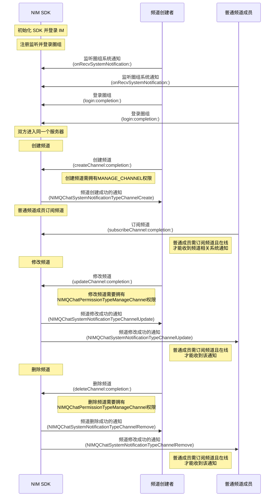

NIM SDK 的<a href="https://doc.yunxin.163.com/docs/interface/messaging/iOS/doxygen/Latest/zh/df/d6b/protocol_n_i_m_q_chat_channel_manager-p.html" target="_blank">`NIMQChatChannelManager`</a>类提供管理频道的方法，支持创建、修改、查询和删除频道。 

 

## 前提条件

- 已注册[`onRecvSystemNotification:`](https://doc.yunxin.163.com/docs/interface/messaging/iOS/doxygen/Latest/zh/d4/d3f/protocol_n_i_m_q_chat_message_manager_delegate-p.html#aaf1d34a4b6373edc5fbc408f36b98853)监听圈组的系统通知。示例代码参见[圈组系统通知收发](https://doc.yunxin.163.com/messaging/guide/DAzNzk2NjY?platform=iOS)。

  具体**与频道管理相关**的系统通知类型，见本文末尾的[相关系统通知](#相关系统通知)。
  

- 已<a href="https://doc.yunxin.163.com/messaging/guide/zA0ODY0NzQ?platform=iOS#创建服务器" target="_blank">创建服务器</a>。

- 已配置“管理频道的权限”，拥有“管理频道的权限”（`NIMQChatPermissionTypeManageChannel`）才能创建、修改和删除频道。权限通过身份组进行配置和管理，具体请参见<a href="https://doc.yunxin.163.com/messaging/guide/Dk5MTI4Mzc?platform=iOS" target="_blank">身份组概述</a>及其他身份组相关文档。


## 使用限制

单个服务器的频道数量上限默认为 100 个。 

若需要扩展上限，可在控制台配置圈组子功能项（**单 server 可创建的 channel 数**），具体请参考[开通和配置圈组功能](https://doc.yunxin.163.com/messaging/guide/TM1OTU0MTM?platform=iOS)。

## 实现方法


### 创建频道

调用<a href="https://doc.yunxin.163.com/docs/interface/messaging/iOS/doxygen/Latest/zh/df/d6b/protocol_n_i_m_q_chat_channel_manager-p.html#ab496ffeebbeb568bcff924918026075d" target="_blank">`createChannel:completion:`</a>方法在某个服务器下创建频道。 调用时需要传入服务器 ID （`serverId`）、频道名称（`name`）和频道类型（`type`）。


该方法的入参结构为[`QChatCreateChannelParam`](https://doc.yunxin.163.com/docs/interface/messaging/iOS/doxygen/Latest/zh/d5/da4/interface_n_i_m_q_chat_create_channel_param.html)，其重要参数说明如下：


<div style="width:90px">类型</div> | <div style="width:70px">参数</div> | 说明
---- | -------------- | ---------
unsigned long long 	  | `type` | 频道类型（`NIMQChatChannelType`）：类型：0-消息频道，1-[实时互动频道](https://doc.yunxin.163.com/messaging/guide/DYzMDM1MjM?platform=iOS)，100-自定义频道</ul>
`NIMQChatChannelViewMode`  | `viewMode` | 频道的查看模式，包括：<ul><li>`NIMQChatChannelViewModePrivate `：私密模式，该模式下，频道只对该频道白名单中的用户可见</li><li>`NIMQChatChannelViewModePublic`：公开模式，该模式下，频道对未被加入该频道的黑名单的用户均可见</li><p>频道黑白名单相关说明，请参见[频道黑白名单](https://doc.yunxin.163.com/messaging/guide/zMwMzg5ODE?platform=iOS)</p></ul><note type=notice>如果将同步模式`syncMode`设置为同步，那么无法单独设置频道的查看模式（该情况下设置了查看模式将会报 414 错误）。同步模式与频道分组相关，详情请参见[频道分组与频道的关联逻辑](https://doc.yunxin.163.com/messaging/guide/zY5Mzg5MTA?platform=iOS#频道分组与频道的关联逻辑)。</note>
unsigned long long | `categoryId` | 通过传入频道分组的 ID 为频道指定其所属的分组，频道分组详情请参见[频道分组](https://doc.yunxin.163.com/messaging/guide/zY5Mzg5MTA?platform=iOS) 
`NIMQChatChannelSyncMode` | `sycnMode` | 频道的同步模式:<ul><li>`NIMQChatChannelSyncModeNotSync`：不同步频道分组的配置</li><li>`NIMQChatChannelSyncModeSync`：同步频道分组的配置，具体同步的数据包括查看模式（私密或公开）、黑白名单和身份组权限</li></ul><note type=notice>只有将同步模式设置为不同步，才能单独设置频道的查看模式 `viewMode`。</note>
`NIMQChatVisitorMode` | `visitorMode` | 频道是否对[游客](https://doc.yunxin.163.com/messaging/guide/jMyMTQ2OTU?platform=iOS)可见：<ul><li>`NIMQChatVisitorModeNone = -1`：不传</li><li>`NIMQChatVisitorModeVisible = 0`：可见</li><li>`NIMQChatVisitorModeInvisible = 1`：不可见</li><li>`NIMQChatVisitorModeFollow = 2`：跟随模式（默认），即如果该频道的查看模式（`viewMode`）被设置为“公开”则该频道对游客可见，如果被设置为“私密”则对游客不可见</li></ul><note type=notice>如果频道的 `visitorMode` 为跟随模式，且同步模式（`syncMode`）为“与频道分组同步”，则当该频道所属的频道分组的查看模式（`viewMode`）变更后，该频道对游客的可见性也将变更。例如，在这种情况下，频道分组的查看模式由公开变为私密，则此时该频道对游客从“可见”变为“不可见”。</note>
NSString * 	 | `antispamBusinessId` | 设置频道资料内容的内容审核（反垃圾）配置，更多相关说明请参见[圈组内容审核](https://doc.yunxin.163.com/messaging/guide/zMxMTQxMDc?platform=iOS)
  

示例代码如下：

```
id<NIMQChatChannelManager> qchatChannelManager = [[NIMSDK sharedSDK] qchatChannelManager];
NIMQChatCreateChannelParam * param = [[NIMQChatCreateChannelParam alloc] init];
param.serverId = 123456;
param.name = @"云信Channel";
param.type = NIMQChatChannelTypeMsg;
//反垃圾业务id
param.antispamBusinessId = @"{\"picbid\": \"804265342b7425324f53425c343454\", \"txtbid\": \"804265342b7425324f53425c343454\"}";
[qchatChannelManager createChannel:param
    completion:^(NSError *__nullable error, NIMQChatChannel *__nullable result) {
    // your code
}];
```

### 修改频道

调用<a href="https://doc.yunxin.163.com/docs/interface/messaging/iOS/doxygen/Latest/zh/df/d6b/protocol_n_i_m_q_chat_channel_manager-p.html#aeb8aece70850d5f574d892cbc3be6d12" target="_blank">`updateChannel:completion:`</a>方法修改某个频道的信息，如频道名称、查看模式（公开或私密）、是否对游客可见、频道主题和自定义扩展字段等。调用时需要传入待修改的频道的 ID（`channelId`）。


调用该方法时，您可设置频道资料的内容审核（反垃圾）配置（`antispamBusinessId`），内容审核详情请参见[圈组内容审核]()。


示例代码如下：


```
id<NIMQChatChannelManager> qchatChannelManager = [[NIMSDK sharedSDK] qchatChannelManager];
NIMQChatUpdateChannelParam * param = [[NIMQChatUpdateChannelParam alloc] init];
param.channelId = 121212;
param.name = @"更新后的频道名称";
//反垃圾业务id
param.antispamBusinessId = @"{\"picbid\": \"804265342b7584903253244\", \"txtbid\": \"804265342b7534265432523\"}";
[qchatChannelManager updateChannel:param
    completion:^(NSError *__nullable error, NIMQChatChannel *__nullable result) {
    // your code
}];
```


### 删除频道

调用<a href="https://doc.yunxin.163.com/docs/interface/messaging/iOS/doxygen/Latest/zh/df/d6b/protocol_n_i_m_q_chat_channel_manager-p.html#ac8f7f0d609c69da9e81747aa0b371d0d" target="_blank">`deleteChannel:completion:`</a>方法可将某个频道删除。调用时需传入待删除频道的 ID（`channelId`）。


示例代码如下：

```
id<NIMQChatChannelManager> qchatChannelManager = [[NIMSDK sharedSDK] qchatChannelManager];
NIMQChatDeleteChannelParam * param = [[NIMQChatDeleteChannelParam alloc] init];
param.channelId = 121212;
[qchatChannelManager deleteChannel:param
    completion:^(NSError *error) {
    // your code
}];
```


### 频道查询


#### 分页查询频道列表

用户进入服务器后，如果想要获取当前服务器已有（且对该用户可见）的频道，可调用<a href="https://doc.yunxin.163.com/docs/interface/messaging/iOS/doxygen/Latest/zh/df/d6b/protocol_n_i_m_q_chat_channel_manager-p.html#a906f0987d0cd8c3a240cb998599aff6d" target="_blank">`getChannelsByPage:completion:`</a>方法分页查询频道列表。 

示例代码如下：

```
id<NIMQChatChannelManager> qchatChannelManager = [[NIMSDK sharedSDK] qchatChannelManager];
NIMQChatGetChannelsByPageParam * param = [[NIMQChatGetChannelsByPageParam alloc] init];
param.serverId = 123456;
// 传0拉取最新的Channel
param.timeTag = 0;
param.limit = 20;
[qchatChannelManager getChannelsByPage:param
    completion:^(NSError *__nullable error, NIMQChatGetChannelsByPageResult *__nullable result) {
    // your code
}];
```


#### 根据频道 ID 查询频道列表

用户进入服务器后，如果想要检索当前服务器的频道，可调用<a href="https://doc.yunxin.163.com/docs/interface/messaging/iOS/doxygen/Latest/zh/df/d6b/protocol_n_i_m_q_chat_channel_manager-p.html#acb7cef7e9a89ef9870e18ac3a6f896b1" target="_blank">`getChannels:completion:`</a>方法根据频道的 ID 进行检索。

示例代码如下：

```
id<NIMQChatChannelManager> qchatChannelManager = [[NIMSDK sharedSDK] qchatChannelManager];
NIMQChatGetChannelsParam * param = [[NIMQChatGetChannelsParam alloc] init];
param.channelIdArray = @[@(121212), @(131313), @(141414)];
[qchatChannelManager getChannels:param
    completion:^(NSError *__nullable error, NIMQChatGetChannelsResult *__nullable result) {
    // your code
}];
```

#### 分页查询未在频道分组下的频道

用户进入服务器后，如果想要检索当前服务器中不在频道分组下的频道，可调用 `getUncategorizedChannelsByPage` 方法进行查询。

可以指定根据自定义权重顺序返回，也可以全量返回。（该接口支持分页查询。）

示例代码如下：

```objc
id<NIMQChatChannelManager> qchatChannelManager = [[NIMSDK sharedSDK] qchatChannelManager];
NIMQChatGetUncategorizedChannelsByPageParam * param = [[NIMQChatGetUncategorizedChannelsByPageParam alloc] init];
param.serverId = 123456;
// 第一页不填cursor
// param.cursor = @"1234567890.123";
param.limit = 20;
[qchatChannelManager getUncategorizedChannelsByPage:param
    completion:^(NSError *__nullable error, NIMQChatGetUncategorizedChannelsByPageResult *__nullable result) {
    // your code
}];
```


#### 分页查询频道成员列表


用户进入频道后，如果想要检索当前频道的成员有哪些（换而言之，当前频道对哪些用户可见），可调用<a href="https://doc.yunxin.163.com/docs/interface/messaging/iOS/doxygen/Latest/zh/df/d6b/protocol_n_i_m_q_chat_channel_manager-p.html#abc4b04b939ab5e62159c2c03daf598b9" target="_blank">`getChannelMembersByPage:completion:`</a>方法可分页查询频道成员列表。 

::: note notice
如果需要查询当前时间，`timeTag`请务必传 0。
:::

<br>


示例代码如下：

```
id<NIMQChatChannelManager> qchatChannelManager = [[NIMSDK sharedSDK] qchatChannelManager];
NIMQChatGetChannelMembersByPageParam * param = [[NIMQChatGetChannelMembersByPageParam alloc] init];
param.serverId = 123456;
param.channelId = 121212;
param.timeTag = 0;
param.limit = 20;
[qchatChannelManager getChannelMembersByPage:param
    completion:^(NSError *__nullable error, NIMQChatGetChannelMembersByPageResult *__nullable result) {
    // your code
}];
```


#### 查询频道未读信息


用户进入服务器后，如果想获取频道的未读信息（包括未读数和未读状态），可调用<a href="https://doc.yunxin.163.com/docs/interface/messaging/iOS/doxygen/Latest/zh/df/d6b/protocol_n_i_m_q_chat_channel_manager-p.html#ae19e759cfb8e38c531120c308dca892b" target="_blank">`getChannelUnreadInfos:completion:`</a>方法进行查询。


::: note note
该方法单次最多查询频道数量为 100。
:::

<br>

示例代码如下：


```
id<NIMQChatChannelManager> qchatChannelManager = [[NIMSDK sharedSDK] qchatChannelManager];
NIMQChatGetChannelUnreadInfosParam * param = [[NIMQChatGetChannelUnreadInfosParam alloc] init];
param.targets = @[@(121212), @(131313), @(141414)];
[qchatChannelManager getChannelUnreadInfos:param
    completion:^(NSError *__nullable error, NIMQChatGetChannelUnreadInfosResult *__nullable result) {
    // your code
}];
```


## 相关参考


### 相关系统通知


圈组系统通知的类型在[`NIMQChatSystemNotificationType`](https://doc.yunxin.163.com/docs/interface/messaging/iOS/doxygen/Latest/zh/d2/ddd/_n_i_m_q_chat_defs_8h.html#a68eb284bba17219f9f003e57d5ae414b)枚举中定义，与频道管理相关的内置系统通知类型如下：

枚举值| 说明
---- | --------------
`NIMQChatSystemNotificationTypeChannelCreate` | 创建频道
`NIMQChatSystemNotificationTypeChannelRemove`  | 删除频道
`NIMQChatSystemNotificationTypeChannelUpdate`| 修改频道信息

::: note note 
更多圈组系统通知相关说明，请参见[圈组系统通知相关](https://doc.yunxin.163.com/messaging/guide/DMwMjIzNTY?platform=iOS)。
:::


### API 调用时序


下图可能因为网络问题显示异常，如显示异常，一般刷新当前页面即可正常显示。





上图中：

- “订阅”相关说明，参见[圈组订阅机制](https://doc.yunxin.163.com/messaging/guide/zAxNjQzMDA?platform=iOS)。
- “权限”相关说明，参见[身份组相关](https://doc.yunxin.163.com/messaging/guide/Dk5MTI4Mzc?platform=iOS)。