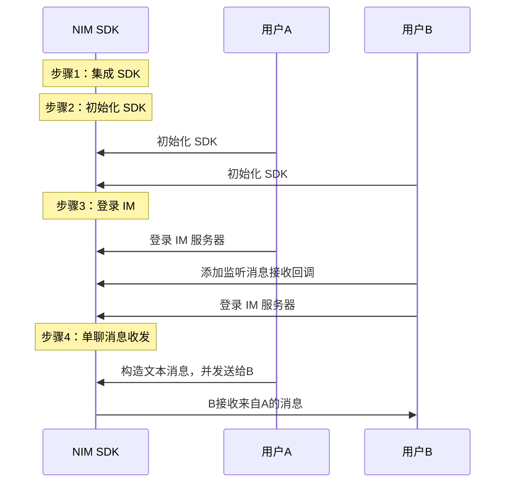

<!-- keywords: 即时通讯,IM,基本功能,消息收发,实现 -->

网易云信 IM 即时通讯服务提供一整套即时通讯基础能力，助您快速实现多样化的即时通讯场景。

本文主要介绍通过集成 NetEase IM SDK（NIM SDK）并调用 API，快速实现单聊消息收发功能。

::: note note
- 群聊消息收发需要先进入群组，后续流程与单聊消息收发相同。
- 超大群、聊天室和圈组的消息收发，需单独配置。具体实现流程请分别参见[超大群](https://doc.yunxin.163.com/messaging/guide/TEzMTgwNTg?platform=iOS#%E8%B6%85%E5%A4%A7%E7%BE%A4%E6%A6%82%E8%BF%B0)、[聊天室消息收发](https://doc.yunxin.163.com/messaging/guide/jQ0MjQ0NDI?platform=iOS#%E8%81%8A%E5%A4%A9%E5%AE%A4%E6%B6%88%E6%81%AF%E6%94%B6%E5%8F%91)和[圈组消息管理](https://doc.yunxin.163.com/messaging/guide/zM0OTk2NDM?platform=iOS)。
:::

## 使用前准备

- 已在云信控制台[创建应用](https://doc.yunxin.163.com/console/docs/TIzMDE4NTA?platform=console)，获取 App Key。
- 已[注册云信 IM 账号](https://doc.yunxin.163.com/messaging/guide/TE2Nzg1MDg?platform=iOS#4-注册-im-账号)，获取 accid 和 token。
- 开发环境满足 iOS 8.0 及以上版本。


## 实现流程

### 流程概览

实现单聊消息收发的流程，可分为下图所示的 4 大步骤。



### **步骤 0：新建项目（可选）**

<details><summary>此步骤以新建新项目为例，若集成到已有项目，可忽略此步骤</summary>
1. 启动 Xcode，在左上角选择<strong>File > New > Project</strong>。<br/>2. 在出现的工作表中，选择 <strong>iOS</strong> 平台，并在 <strong>Application</strong> 下选择 <strong>App</strong>。<br/>3. 配置新建项目，完成后，单击 <strong>Next</strong>。<br/>必须填写 <strong>Product Name</strong> 和 <strong>Organization Identifier</strong>。<br/>4. 选择项目存储路径，单击 <strong>Create</strong> 创建项目。<br/>

</details>

### **步骤 1：集成 SDK**

本文主要介绍在 CocoaPods 中添加远程依赖项的集成方式。手动集成方式请参见 <a href="https://doc.yunxin.163.com/messaging/guide/TI1NTAzNTk?platform=iOS#%E9%9B%86%E6%88%90" target="_blank">SDK 集成</a>。


1. 在 [SDK 下载页面](http://netease.im/im-sdk-demo)查看 SDK 的最新版本，并查询本地仓库中对应的版本是否为最新版本。

    若不是最新版本，建议先更新本地仓库，以确保可以集成最新的 SDK 版本。

```
    pod search NIMSDK_LITE   //本地仓库中查询 NIMSDK_LITE 信息
    pod repo update          //更新本地仓库
```

2. 在项目根目录下的 `Podfile` 文件中写入以下内容。
```
    pod 'NIMSDK_LITE' 
```
3. 执行以下命令安装 SDK。

```
    pod install
```


### **步骤 2：初始化 SDK**

将 SDK 集成到客户端后，需要先完成 SDK 的初始化才能使用其他功能。

1. 在项目文件中引入头文件 `NIMSDK.h`。
  ```
  #import <NIMSDK/NIMSDK.h>
  ```
2. 调用 [`registerWithOption:`](https://doc.yunxin.163.com/docs/interface/messaging/iOS/doxygen/Latest/zh/de/de3/interface_n_i_m_s_d_k.html#af48773fab3390f4e2f665740bd51560a) 方法初始化 SDK。
```objc
- (BOOL)application:(UIApplication *)application didFinishLaunchingWithOptions:(NSDictionary *)launchOptions {
    ...
    //推荐在程序启动的时候初始化 NIMSDK    
    NSString *appKey        = @"your app key";//云信分配的 appKey
    NIMSDKOption *option    = [NIMSDKOption optionWithAppKey:appKey];
    option.apnsCername      = @"your APNs cer name";//APNs 推送证书名
    option.pkCername        = @"your pushkit cer name";//PushKit  推送证书名
    [[NIMSDK sharedSDK] registerWithOption:option];
    ...
}
```
以上提供了一个简化的初始化示例，更多初始化信息请参见<a href="https://doc.yunxin.163.com/messaging/guide/TI1NTAzNTk?platform=iOS#%E5%88%9D%E5%A7%8B%E5%8C%96" target="_blank">初始化 SDK</a>。


### **步骤 3：登录 IM 服务端**

客户端用户在使用云信即时通讯功能前需要先登录云信 IM 服务器。请使用已注册的<a href="https://doc.yunxin.163.com/messaging/guide/TIyNTE3MjA?platform=iOS" target="_blank">云信账号</a>进行登录。

调用`NIMLoginManager`的<a href="https://doc.yunxin.163.com/docs/interface/messaging/iOS/doxygen/Latest/zh/d9/d16/protocol_n_i_m_login_manager-p.html#af19374f0237b69dcb61b04499dcf1454" target="_blank">`login`</a>方法进行登录。示例代码如下：

```
    NSString *account = @"your account";
    NSString *token   = @"your token";
    [[[NIMSDK sharedSDK] loginManager] login:account
                                    token:token
                                completion:^(NSError *error) {}];
```


NIM SDK 支持自动重连机制。用户也可以注册监听来实时关注 IM 的登录状态，具体请参见<a href="https://doc.yunxin.163.com/messaging/guide/TU3MTM2ODM?platform=iOS" target="_blank">登录</a>章节。


### **步骤 4：单聊消息收发**

本节以用户 A 和用户 B 的消息交互为例，介绍快速实现单聊消息收发的流程。更多消息类型的收发，请参见[消息发送](https://doc.yunxin.163.com/messaging/guide/zg1NjkwNjg?platform=iOS)。

1. 用户 B 调用 [`addDelegate:`](https://doc.yunxin.163.com/docs/interface/messaging/iOS/doxygen/Latest/zh/d2/d6e/protocol_n_i_m_chat_manager-p.html#ac4a9f352dcb9abfe7982da65b57ef14c) 方法添加委托，注册 [`onRecvMessages:`](https://doc.yunxin.163.com/docs/interface/messaging/iOS/doxygen/Latest/zh/de/da7/protocol_n_i_m_chat_manager_delegate-p.html#ad7e5965ba2af93a24e6814a004866965) 回调函数，监听消息接收。示例代码如下：

  ```
  // 在某处添加代理对象
  [NIMSDK sharedSDK].chatManager addDelegate:self];
  //...
  - (void)onRecvMessages:(NSArray<NIMMessage *> *)messages
  {
    //收到消息
  }
  ```

2. 用户 A 构建文本消息并调用 [`sendMessage:toSession:error:`](https://doc.yunxin.163.com/docs/interface/messaging/iOS/doxygen/Latest/zh/d2/d6e/protocol_n_i_m_chat_manager-p.html#a48df7e71bca12b638c62b90f3bbd8169)方法将消息发送给 B。示例代码如下：
 
  ```js
  // 这里主要以发送文本消息为例 
  NIMSession *session = [NIMSession session:@"user" type:NIMSessionTypeP2P];// 构造出具体会话：P2P单聊，对方账号为user
  NIMMessage *message = [[NIMMessage alloc] init];// 构造出具体消息
  message.text        = @"hello";
  NSError *error = nil;// 错误反馈对象
  [[NIMSDK sharedSDK].chatManager sendMessage:message toSession:session error:&error];// 发送消息
  ```

  目前 NIM SDK 支持多种消息类型，包括文本消息、图片消息、语音消息、视频消息、文件消息、地理位置消息、提示消息、通知消息以及自定义消息。具体请参见[消息发送](https://doc.yunxin.163.com/messaging/guide/zg1NjkwNjg?platform=iOS)。

3. `onRecvMessages:` 触发回调，用户 B 收到文本消息。


## 后续步骤

为保障通信安全，如果您在调试环境中的使用的是云信控制台生成的测试用 IM 账号 和 `token`，请确保在后续的正式生产环境中，将其替换为通过 <a href="https://doc.yunxin.163.com/TM5MzM5Njk/docs/DQ3Nzk1MTY?platform=server" target="_blank">IM 服务端 API</a> 生成的正式 IM 账号（`accid`）和 `token`。
