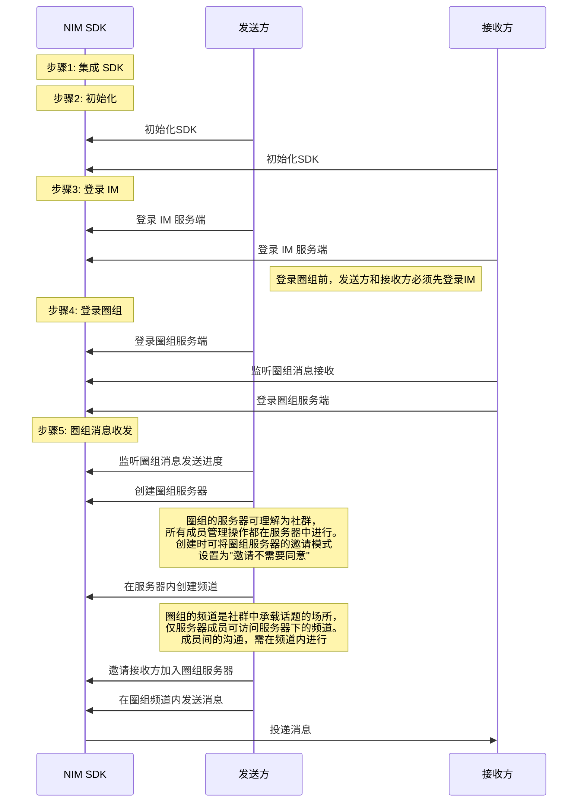

圈组是网易云信 IM 即时通讯服务的全新能力，可用来帮助您快速构建“类Discord即时通讯社群”。本文介绍如何通过较少的代码集成 NetEase IM SDK （以下简称 NIM SDK）并调用 API，在您的应用中实现圈组消息收发。


## 前提条件

- 已在云信控制台 [创建应用](https://doc.yunxin.163.com/console/concept/TIzMDE4NTA?platform=console)，获取 App Key。
- 已 [注册云信 IM 账号](https://doc.yunxin.163.com/messaging2/guide/jU0Mzg0MTU?platform=client#第二步注册-im-账号)，获取 accid 和 token。
- 已 [开通和配置圈组功能](https://doc.yunxin.163.com/messaging/guide/TM1OTU0MTM?platform=iOS)。


##  实现流程

### **流程概览**

实现圈组消息收发的流程，可分为下图所示的 5 大步骤。




::: note notice 
**圈组服务端**与**圈组服务器**是两个不同概念，前者指云信服务端提供圈组功能的部分，后者为圈组的特殊概念，对应 Discord 的 Server, 为社群本身。
:::


### **步骤 0：新建项目**

<details><summary>此步骤以新建新项目为例，若集成到已有项目，可忽略此步骤</summary>
<ol>
<li> 启动 Xcode，在左上角选择<strong>File > New > Project</strong>。</li><li>在出现的工作表中，选择 <strong>iOS</strong> 平台，并在 <strong>Application</strong> 下选择 <strong>App</strong>。</li><li>配置新建项目，完成后，单击 <strong>Next</strong>。<p>必须填写 <strong>Product Name</strong> 和 <strong>Organization Identifier</strong>。</p></li><li>选择项目存储路径，单击 <strong>Create</strong> 创建项目。<br/></li>
</ol>
</details>

### **步骤1: 集成 NIM SDK**

本节仅介绍更为快速的 CocoaPods 集成方式。如需查看手动集成的具体说明，请参见 [手动集成](https://doc.yunxin.163.com/messaging/guide/TI1NTAzNTk?platform=iOS#手动集成)。

集成前，请先前往 [SDK 下载页面](http://netease.im/im-sdk-demo) 查看当前最新版本，并查询本地仓库中对应的版本是否为最新版本。若不是最新版本，建议先更新本地仓库，以确保可以集成最新的SDK版本。

```
pod search NIMSDK_LITE   //本地仓库中查询NIMSDK_LITE信息
pod repo update          //更新本地仓库
```

`CocoaPods`集成资源关键词详解：

关键词 | 所含资源
:--|:-
NIMSDK_LITE | IM 即时通讯，默认引入网易对象存储（NetEase Object Storage，NOS）文件存储能力
NIMSDK_LITE/FCS | IM 即时通讯，默认引入 S3 文件存储能力
NIMSDK/QChat|IM 即时通讯的圈组能力<note type=notice>自 V9.17.0 起，实现圈组能力插件化。因此对于升级使用圈组的用户，除了需要引入 NIMSDK，还需要单独引入 NIMSDK/QChat。对于未使用圈组的用户，忽略该变动。
NIMKit| NIMSDK_LITE+NIM_iOS_UIKit+[特定版本](https://github.com/netease-im/NIM_iOS_UIKit/blob/master/NIMKit.podspec)的第三方依赖库
NIMKit/Lite_Free | NIMSDK_LITE+NIM_iOS_UIKit+不限制版本的第三方依赖库

如需要即时通讯功能（NOS）和圈组能力，且不需 `NIM_iOS_UIKit` 组件，可在 `Podfile` 中写入：

```
pod 'NIMSDK_LITE' 
pod 'NIMSDK/QChat'
```

然后执行安装命令：

```
pod install
```

### **步骤2: 初始化 NIM SDK**

将 SDK 集成到客户端后，需要先完成 SDK 的初始化才能使用其他功能。

1. 在项目文件中引入头文件 `NIMSDK.h`。

    ```
    import <NIMSDK/NIMSDK.h>
    ```

2. 调用<a href="https://doc.yunxin.163.com/docs/interface/messaging/iOS/doxygen/Latest/zh/de/de3/interface_n_i_m_s_d_k.html#af48773fab3390f4e2f665740bd51560a" target="_blank">`registerWithOption:`</a>方法初始化 SDK。

    ```objc
    - (BOOL)application:(UIApplication *)application didFinishLaunchingWithOptions:(NSDictionary *)launchOptions {
        ...
        //推荐在程序启动的时候初始化 NIMSDK    
        NSString *appKey        = @"your app key"; //云信分配的 appKey
        NIMSDKOption *option    = [NIMSDKOption optionWithAppKey:appKey]; 
        option.apnsCername      = @"your APNs cer name"; // APNs 推送证书名,如不需要推送功能,可不传
        option.pkCername        = @"your pushkit cer name"; //PushKit 推送证书名,如不需要推送功能,可不传
        [[NIMSDK sharedSDK] registerWithOption:option];
        ...
    }
    ```

以上提供了一个简化的初始化示例，更多初始化信息请参见<a href="https://doc.yunxin.163.com/messaging/guide/TI1NTAzNTk?platform=iOS#%E5%88%9D%E5%A7%8B%E5%8C%96" target="_blank">初始化 SDK</a>。


### **步骤3: 登录云信 IM 服务端**

客户端用户在使用云信即时通讯功能前需要先登录云信 IM 服务器。请使用已注册的<a href="https://doc.yunxin.163.com/messaging/guide/TIyNTE3MjA?platform=iOS" target="_blank">云信账号</a>进行登录。

调用`NIMLoginManager`的<a href="https://doc.yunxin.163.com/docs/interface/messaging/iOS/doxygen/Latest/zh/d9/d16/protocol_n_i_m_login_manager-p.html#af19374f0237b69dcb61b04499dcf1454" target="_blank">`login`</a>方法进行登录。示例代码如下：

```
    NSString *account = @"your account";
    NSString *token   = @"your token";
    [[[NIMSDK sharedSDK] loginManager] login:account
                                    token:token
                                completion:^(NSError *error) {}];
```


NIM SDK 支持自动重连机制。用户也可以注册监听来实时关注 IM 的登录状态，具体请参见<a href="https://doc.yunxin.163.com/messaging/guide/TU3MTM2ODM?platform=iOS" target="_blank">登录</a>章节。

 


### **步骤4: 登录云信圈组服务端**


1. 发送方和接收方注册`NIMQChatManagerDelegate`的<a href="https://doc.yunxin.163.com/docs/interface/messaging/iOS/doxygen/Latest/zh/d5/da1/protocol_n_i_m_q_chat_manager_delegate-p.html#a7480524859e8edaa8e400be93023b598" target="_blank">`qchatOnlineStatus`</a>回调，监听圈组登录状态。


2. 接收方注册`NIMQChatMessageManagerDelegate`的<a href="https://doc.yunxin.163.com/docs/interface/messaging/iOS/doxygen/Latest/zh/d4/d3f/protocol_n_i_m_q_chat_message_manager_delegate-p.html#ae9cd05fec4d2efebc7605f1d2f919fc3" target="_blank">`onRecvMessages:`</a>方法监听圈组消息接收。


    示例代码如下：
    
    ```
    //收到消息
    - (void)onRecvMessages:(NSArray<NIMMessage *> *)messages {
        //处理展示等操作
    }
    ```


3. 发送方和接收方调用`NIMQChatManager`的<a href="https://doc.yunxin.163.com/docs/interface/messaging/iOS/doxygen/Latest/zh/de/d81/protocol_n_i_m_q_chat_manager-p.html#a5c9c00ab43862d95e8cc545fbd726844" target="_blank">`login`</a>方法开始登录圈组服务端。


    示例代码如下：
    
    ```
    NIMQChatLoginParam *param = [[NIMQChatLoginParam alloc] init];
    [[[NIMSDK sharedSDK] qchatManager] login:param completion:^(NSError *error, NIMQChatLoginResult *result) {
        // your code
    }];
    ```
3. 登录开始后，`NIMQChatManagerDelegate`的`qchatOnlineStatus`触发回调，根据实际登录情况返回登录状态。如最终返回`NIMQChatLoginStepSyncOK`（数据同步完成），则代表登录流程完成。

    ::: note note
    圈组登录状态及其变化流程与 IM 的相同，具体请参见本文文末的[登录状态参考](https://doc.yunxin.163.com/messaging/guide/TczMjQyMTA?platform=iOS#登录状态参考)。 
    ::: 


### **步骤5: 实现圈组消息收发**

本节以介绍在不考虑用户权限控制（可通过<a href="https://doc.yunxin.163.com/messaging/guide/Dk5MTI4Mzc?platform=iOS" target="_blank">身份组</a>控制）的情况下，使用 SDK API 快速实现圈组消息收发的流程。 


1. 发送方注册`NIMQChatMessageManagerDelegate`的<a href="https://doc.yunxin.163.com/docs/interface/messaging/iOS/doxygen/Latest/zh/d4/d3f/protocol_n_i_m_q_chat_message_manager_delegate-p.html#a8478a23a4aa02f66fca957223b14ef96" target="_blank">`sendMessage:progress:</a>方法监听圈组消息发送进度。

    示例代码如下：

    ```
    //发送进度
    -(void)sendMessage:(NIMMessage *)message progress:(float)progress
    {
    }
    ```


2. 发送方调用<a href="https://doc.yunxin.163.com/docs/interface/messaging/iOS/doxygen/Latest/zh/df/dac/protocol_n_i_m_q_chat_server_manager-p.html#a328f438ee785c36d6be0e292ab33b8b7" target="_blank">`createServer:completion:`</a>方法创建圈组服务器。为了更加快速地实现消息收发，创建时可将<a href="https://doc.yunxin.163.com/docs/interface/messaging/iOS/doxygen/Latest/zh/d9/dc7/interface_n_i_m_q_chat_create_server_param.html#a642dc1e05c9c410798aa5f53eef75139" target="_blank">`inviteMode`</a>设置为`NIMQChatServerInviteModeAutoEnter`（发送邀请后，不需要被邀请方同意，被邀请方立即加入服务器）。


    ::: note notice 
    创建成功后，需记录服务器的 ID（`serverId`），后续步骤将需要传入`serverId`。
    :::

    <br>


    示例代码如下：

    ```
    NIMQChatCreateServerParam *param = [[NIMQChatCreateServerParam alloc] init];
    param.name = @"YourApp";
    param.inviteMode = NIMQChatServerInviteModeAutoEnter;
    id <NIMQChatServerManager> qchatServerManager = [[NIMSDK sharedSDK] qchatServerManager];
    [qchatServerManager createServer:param
                        completion:^(NSError *error, NIMQChatCreateServerResult *result) {
        // your code
    }];
    ```
3. 发送方调用<a href="https://doc.yunxin.163.com/docs/interface/messaging/iOS/doxygen/Latest/zh/df/d6b/protocol_n_i_m_q_chat_channel_manager-p.html#ab496ffeebbeb568bcff924918026075d" target="_blank">`createChannel:completion:`</a>方法，调用时传入上一步中创建的服务器的`serverId`，且将`viewMode`和`type`分别设置为`NIMQChatChannelViewModePublic`（公开频道）和`NIMQChatChannelTypeMsg`（消息频道），从而在服务器中创建一个消息类型的公开频道。 


    ::: note notice 
    创建成功后，需记录频道的 ID（`channelId`），后续步骤将需要传入`channelId`。
    :::
    
    <br>


    示例代码如下：

    ```
    id<NIMQChatChannelManager> qchatChannelManager = [[NIMSDK sharedSDK] qchatChannelManager];
    NIMQChatCreateChannelParam * param = [[NIMQChatCreateChannelParam alloc] init];
    param.serverId = 123456;
    param.name = @"YourChannel";
    param.type = NIMQChatChannelTypeMsg;
    param.viewMode = NIMQChatChannelViewModePublic;
    [qchatChannelManager createChannel:param
        completion:^(NSError *__nullable error, NIMQChatChannel *__nullable result) {
        // your code
    }];
    ```

5. 发送方调用<a href="https://doc.yunxin.163.com/docs/interface/messaging/iOS/doxygen/Latest/zh/df/dac/protocol_n_i_m_q_chat_server_manager-p.html#a83f7643421a00e1f722d7a1adb39796c" target="_blank">`inviteServerMembers:completion:`</a>方法，邀请接收方 加入服务器。


    示例代码如下：

    ```
    NIMQChatInviteServerMembersParam *param = [[NIMQChatInviteServerMembersParam alloc] init];
    param.serverId = 123456;
    param.accids = @[@"yunxin1", @"yunxin2", @"yunxin3"];
    id <NIMQChatServerManager> qchatServerManager = [[NIMSDK sharedSDK] qchatServerManager];
    [qchatServerManager inviteServerMembers:param
                                completion:^(NSError *error) {
        // your code
    }];
    ```


6. 发送方调用<a href="https://doc.yunxin.163.com/docs/interface/messaging/iOS/doxygen/Latest/zh/d2/db1/protocol_n_i_m_q_chat_message_manager-p.html#a15fb23ede995f9695a134a6d38895a02" target="_blank">`sendMessage:toSession:completion:`</a>方法，调用时传入服务器与频道的ID，从而在频道中发送一条消息。


    示例代码如下：

    ```
    id<NIMQChatMessageManager> qchatMessageManager = [[NIMSDK sharedSDK] qchatMessageManager];
    NIMQChatMessage *message = [[NIMQChatMessage alloc] init];
    NIMSession * session = [NIMSession sessionForQChat:121212 qchatServerId:123456];
    message.text = @"文本消息的内容";
    [qchatMessageManager sendMessage:message
        toSession:session
        completion:^(NSError *__nullable error) {
        // your code
    }];
    ```


7. `NIMQChatMessageManagerDelegate`的`onRecvMessages:`触发回调，接收方收到消息。

## 后续步骤


为保障通信安全，如果您在调试环境中的使用的是云信控制台生成的测试用 IM 账号 和 `token`，请确保在后续的正式生产环境中，将其替换为通过 <a href="https://doc.yunxin.163.com/TM5MzM5Njk/docs/DQ3Nzk1MTY?platform=server" target="_blank">IM 服务端 API</a> 生成的正式 IM 账号（`accid`）和 `token`。


## 登录状态参考

圈组的登录状态变化流程参见下图。图中，深蓝色元素代表登录状态，浅绿色元素代表手动登录。

::: note note
下图仅以圈组登录状态的变化流程为例，IM 登录状态变化逻辑与圈组的一致，但不支持自动登录。
:::


IM 和圈组的登录状态分别由[`NIMLoginStep`](https://doc.yunxin.163.com/docs/interface/messaging/iOS/doxygen/Latest/zh/d7/d86/_n_i_m_login_manager_protocol_8h.html#aae8619d9c57628883f9617b419fe7837)和[`NIMQChatLoginStep`](https://doc.yunxin.163.com/docs/interface/messaging/iOS/doxygen/Latest/zh/d2/ddd/_n_i_m_q_chat_defs_8h.html#ad4dcebeb97a16bd201ce1bdace3c4cf3)枚举定义，各枚举项说明如下：


| IM 登录状态 | 圈组登录状态    | 说明 |
|:------- |:------- | :------- |
|`NIMLoginStepLinking,` | `NIMQChatLoginStepLinking,`  | 连接服务端|
|`NIMLoginStepLinkOK,` |`NIMQChatLoginStepLinkOK,` | 连接服务端成功
|`NIMLoginStepLinkFailed,` |`NIMQChatLoginStepLinkFailed,`| 连接服务端失败 
|`NIMLoginStepLoginOK,` |`NIMQChatLoginStepLoginOK,`| 登录成功
|`NIMLoginStepLoginingFailed,`  | `NIMQChatLoginStepLoginFailed,`|登录失败
|`NIMLoginStepSyncing,` |`NIMQChatLoginStepSyncing,` | 开始同步数据|
|`NIMLoginStepSyncOK,`| `NIMQChatLoginStepSyncOK,` | 同步数据完成  |
|`NIMLoginStepLoseConnection,`|`NIMQChatLoginStepLoseConnection,` | 与服务端的长连接断开|
|`NIMLoginStepNetChanged,`| `NIMQChatLoginStepNetChanged,` | 网络切换，并不是登录状态的一种, 您可通过这个状态按需进行 UI 展现|


