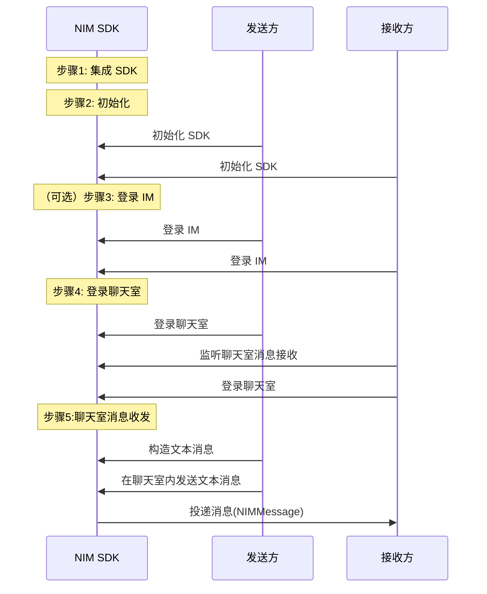

<!--keywords: 聊天室,快速开始,消息收发,SDK集成,初始化,登录 -->


聊天室是网易云信 IM 即时通讯服务中一种比群组更加开放、更加自由的组织形态，可帮助您实现真正意义上的大型聊天室，参与人数无上限，又可满足消息到达的实时性要求，主要应用于娱乐直播、教育直播等场景。

本文介绍如何通过较少的代码集成 NetEase IM SDK（以下简称 NIM SDK）并调用相关 API，在您的应用中实现聊天室消息收发。


## 使用前准备

- 已在云信控制台[创建应用](https://doc.yunxin.163.com/console/docs/TIzMDE4NTA?platform=console)，获取 App Key。
- 已[注册云信 IM 账号](https://doc.yunxin.163.com/messaging/guide/TE2Nzg1MDg?platform=iOS#4-注册-im-账号)，获取 accid 和 token。
- 已[开通和配置聊天室功能](https://doc.yunxin.163.com/messaging/guide/Dg2Mzc0Mzc?platform=iOS)。
- 已调用服务端接口[创建聊天室](https://doc.yunxin.163.com/messaging/guide/jA0MzQxOTI?platform=server)。
- 开发环境满足 iOS 8.0 及以上版本。


## 实现流程

### **流程概览**

实现聊天室消息收发的流程，可分为下图所示的 5 大步骤。

::: note note
NIM SDK 提供两种方式登录聊天室：
- 非独立模式：先[登录 IM](https://doc.yunxin.163.com/messaging/guide/TU3MTM2ODM?platform=iOS)，再登录聊天室的方式，适用于同时需要 IM 和聊天室功能的业务场景。
- 独立模式：不依赖 IM 的连接，直接登录聊天室的方式，适用于只需要聊天室功能的业务场景。

:::





### **步骤 0：新建项目（可选）**

<details><summary>此步骤以新建新项目为例，若集成到已有项目，可忽略此步骤</summary>
1. 启动 Xcode，在左上角选择<strong>File > New > Project</strong>。<br/>2. 在出现的工作表中，选择 <strong>iOS</strong> 平台，并在 <strong>Application</strong> 下选择 <strong>App</strong>。<br/>3. 配置新建项目，完成后，单击 <strong>Next</strong>。<br/>必须填写 <strong>Product Name</strong> 和 <strong>Organization Identifier</strong>。<br/>4. 选择项目存储路径，单击 <strong>Create</strong> 创建项目。<br/>

</details>


### **步骤 1：集成 SDK**

本文主要介绍在 CocoaPods 中添加远程依赖项的集成方式。手动集成方式请参见 <a href="https://doc.yunxin.163.com/TM5MzM5Njk/docs/TI1NTAzNTk?platform=iOS#手动集成" target="_blank">SDK 集成</a>。


1. 在 [SDK 下载页面](http://netease.im/im-sdk-demo)查看 SDK 的最新版本，并查询本地仓库中对应的版本是否为最新版本。

    若不是最新版本，建议先更新本地仓库，以确保可以集成最新的 SDK 版本。

```
    pod search NIMSDK_LITE   //本地仓库中查询 NIMSDK_LITE 信息
    pod repo update          //更新本地仓库
```

2. 在项目根目录下的 `Podfile` 文件中写入以下内容。
```
    pod 'NIMSDK_LITE' 
```
3. 执行以下命令安装 SDK。

```
    pod install
```


### **步骤 2：初始化 SDK**

将 SDK 集成到客户端后，需要先完成 SDK 的初始化才能使用其他功能。

1. 在项目文件中引入头文件 `NIMSDK.h`。
  ```
  #import <NIMSDK/NIMSDK.h>
  ```
2. 调用 [`registerWithOption:`](https://doc.yunxin.163.com/docs/interface/messaging/iOS/doxygen/Latest/zh/de/de3/interface_n_i_m_s_d_k.html#af48773fab3390f4e2f665740bd51560a) 方法初始化 SDK。

    ```objc
    - (BOOL)application:(UIApplication *)application didFinishLaunchingWithOptions:(NSDictionary *)launchOptions {
        ...
        //推荐在程序启动的时候初始化 NIMSDK    
        NSString *appKey        = @"your app key";//云信分配的 appKey
        NIMSDKOption *option    = [NIMSDKOption optionWithAppKey:appKey];
        option.apnsCername      = @"your APNs cer name";//APNs 推送证书名
        option.pkCername        = @"your pushkit cer name";//PushKit  推送证书名
        [[NIMSDK sharedSDK] registerWithOption:option];
        ...
    }
    ```
以上提供了一个简化的初始化示例，更多初始化信息请参见<a href="https://doc.yunxin.163.com/messaging/guide/TE0MDc5MTI?platform=iOS" target="_blank">初始化 SDK</a>。


### **（可选）步骤 3：登录云信 IM**

若您选择**非独立模式**登录聊天室，那么在登录聊天室之前需要先登录 IM。若您采用**独立模式**，则跳过改步骤。

请使用已注册的<a href="https://doc.yunxin.163.com/messaging/guide/TE2Nzg1MDg?platform=iOS#4-注册-im-账号" target="_blank">云信账号</a>进行登录。

调用 `NIMLoginManager` 的<a href="https://doc.yunxin.163.com/docs/interface/messaging/iOS/doxygen/Latest/zh/de/d81/protocol_n_i_m_q_chat_manager-p.html#a5c9c00ab43862d95e8cc545fbd726844" target="_blank">`login`</a>方法进行登录。示例代码如下：

```
    NSString *account = @"your account";
    NSString *token   = @"your token";
    [[[NIMSDK sharedSDK] loginManager] login:account
                                    token:token
                                completion:^(NSError *error) {}];
```


NIM SDK 支持自动重连机制。用户也可以注册监听来实时关注 IM 的登录状态，具体请参见<a href="https://doc.yunxin.163.com/TM5MzM5Njk/docs/TU3MTM2ODM?platform=iOS#步骤2注册相关监听" target="_blank">登录</a>章节。


### **步骤 4：登录聊天室**

若您选择**非独立模式**登录聊天室，那么登录 IM 后，直接调用 [`enterChatroom:completion:`](https://doc.yunxin.163.com/docs/interface/messaging/iOS/doxygen/Latest/zh/d9/de7/protocol_n_i_m_chatroom_manager-p.html#a5a01d1ce57be83aca891bbfb9d2d98b8) 方法即可登录聊天室。

```
NIMChatroomEnterRequest *request = [[NIMChatroomEnterRequest alloc] init];
request.roomId = roomId;//聊天室ID
request.roomNickname = @"MyChatroomNickName";// 我的聊天室昵称
request.roomAvatar = url;// 头像的链接
request.retryCount = 3;//重试次数
request.roomExt = @"{\"key\": \"value\"}";
[[[NIMSDK sharedSDK] chatroomManager] enterChatroom:request
                                     completion:^(NSError *error,NIMChatroom *chatroom,NIMChatroomMember *me) {
                                         // Your Code
                                     }];
```

若您选择**独立模式**登录聊天室。独立模式由于不依赖 IM 连接，SDK 无法自动获取聊天室服务器的地址，需要客户端向开发者应用服务器请求该地址，而应用服务器需要向网易云信服务器请求，然后将请求结果原路返回给客户端。因此 SDK 需要提前注册获取聊天室地址的回调方法（[`registerRequestChatroomAddressesHandler`](https://doc.yunxin.163.com/docs/interface/messaging/iOS/doxygen/Latest/zh/d8/db2/interface_n_i_m_chatroom_independent_mode.html#af20488b2293d6fa2c9b9b1fe90e6986f)），然后再调用 [`enterChatroom:completion:`](https://doc.yunxin.163.com/docs/interface/messaging/iOS/doxygen/Latest/zh/d9/de7/protocol_n_i_m_chatroom_manager-p.html#a5a01d1ce57be83aca891bbfb9d2d98b8) 方法即可登录聊天室。

```
NIMChatroomIndependentMode *mode = [[NIMChatroomIndependentMode alloc] init];
mode.username = @"username";
mode.anonName = @"anonName";
mode.token = [password toMD5String];    // set password.
mode.chatroomAppKey = @"your chatroom app key";

[NIMChatroomIndependentMode registerRequestChatroomAddressesHandler:^(NSString * _Nonnull roomId, NIMRequestChatroomAddressesCallback  _Nonnull callback) {
        [YourHTTPService request:roomId completion:^(NSError *error,NSArray *addresses)
        {
            //无论请求是否成功，都需要进行回调
            if(callback)
            {
                callback(error,addresses);
            }
        }];
    }];

NIMChatroomEnterRequest *request = [[NIMChatroomEnterRequest alloc] init];
request.roomId = "your roomId";
request.mode = mode;
request.roomNickname = @"your roomNickname";
request.roomAvatar = @"your roomAvatar";
request.retryCount = 3;
request.loginAuthType = NIMChatroomLoginAuthTypeDefault;
request.roomExt = @"ext";
[[[NIMSDK sharedSDK] chatroomManager] enterChatroom:request
                                 completion:^(NSError *error,NIMChatroom *chatroom,NIMChatroomMember *me) {
                                     // Your Code
                                 }];
```


### **步骤5: 聊天室消息收发**


NIM SDK 支持多种消息类型，包括文本消息、图片消息、语音消息、视频消息、文件消息、地理位置消息、提示消息、通知消息以及自定义消息。

本节以发送方与接收方的文本消息交互为例，介绍快速实现聊天室消息收发的流程。其他消息类型的收发，请参见[消息收发](https://doc.yunxin.163.com/messaging/guide/Tg2NDQ5Mjc?platform=iOS#实现消息收发)。


1. 接收方调用 `NIMChatManagerDelegate`的[`onRecvMessages:`](https://doc.yunxin.163.com/docs/interface/messaging/iOS/doxygen/Latest/zh/de/da7/protocol_n_i_m_chat_manager_delegate-p.html#ad7e5965ba2af93a24e6814a004866965) 方法监听聊天室消息接收。

    示例代码如下：
    ```
    - (void)onRecvMessages:(NSArray<NIMMessage *> *)messages
    {
    //收到消息
    }
    ```


2. 发送方调用 [`sendMessage:toSession:error:`](https://doc.yunxin.163.com/docs/interface/messaging/iOS/doxygen/Latest/zh/d2/d6e/protocol_n_i_m_chat_manager-p.html#a48df7e71bca12b638c62b90f3bbd8169)方法在聊天室中发送一条文本消息。

    :::note note 
    聊天室消息收发接口与 IM 的消息收发接口统一，在发送消息时指定会话类型（NIMSessionTypeChatroom）为聊天室即可。会话 id（sessionId）即为聊天室 id（roomId）。
    :::

    示例代码如下：
 
    ```js
    // 这里主要以发送文本消息为例 
    NIMSession *session = [NIMSession session:@"roomId" type:NIMSessionTypeChatroom];// 构造出具体会话：Chatroom 聊天室，会话 id 为 roomId
    NIMMessage *message = [[NIMMessage alloc] init];// 构造出具体消息
    message.text        = @"hello";
    NSError *error = nil;// 错误反馈对象
    [[NIMSDK sharedSDK].chatManager sendMessage:message toSession:session error:&error];// 发送消息
    ```

    


3. `onRecvMessages:` 触发回调，接收方通过该回调收到聊天室消息。


## 后续步骤


为保障通信安全，如果您在调试环境中的使用的是云信控制台生成的测试用 IM 账号 和 `token`，请确保在后续的正式生产环境中，将其替换为通过 <a href="https://doc.yunxin.163.com/TM5MzM5Njk/docs/DQ3Nzk1MTY?platform=server" target="_blank">IM 服务端 API</a> 生成的正式 IM 账号（`accid`）和 `token`。


## 相关文档

- [聊天室管理](https://doc.yunxin.163.com/messaging/guide/jQ0MjQ0NDI?platform=iOS)

<!--

- [登录/登出聊天室](https://doc.yunxin.163.com/messaging/guide/DkyOTM2Mjc?platform=iOS)
- [聊天室消息相关](https://doc.yunxin.163.com/messaging/guide/zAzNzk3MTg?platform=iOS)
- [聊天室管理](https://doc.yunxin.163.com/messaging/guide/jk3MDE2MDk?platform=iOS)
- [聊天室成员管理](https://doc.yunxin.163.com/messaging/guide/DQ0NjMyMDAc?platform=iOS)

-->


