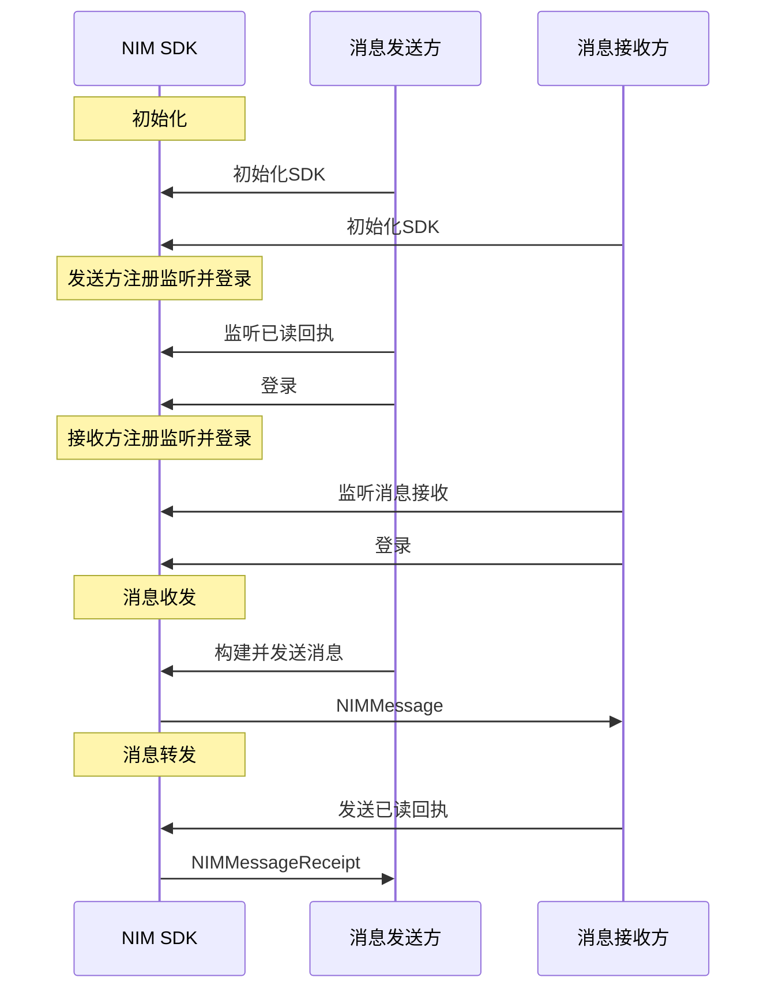
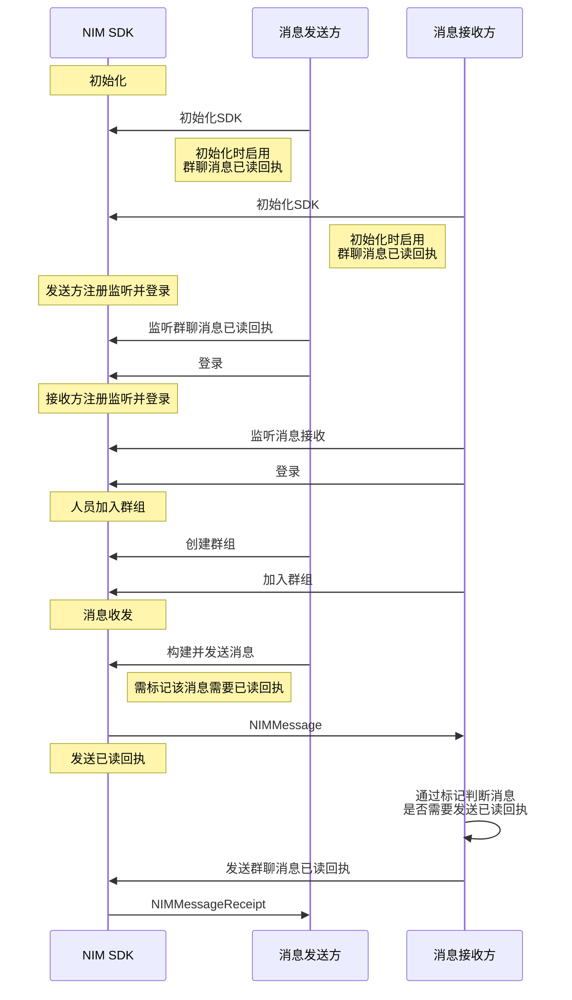

<!--keywords: 已读、已读回执、消息已读回执 -->


当发送方需要知道接收方是否已经阅读了自己发送的消息时，需要使用已读回执的功能。

网易云信 NIM iOS SDK 的[`NIMChatManagerDelegate`](https://doc.yunxin.163.com/docs/interface/messaging/iOS/doxygen/Latest/zh/de/da7/protocol_n_i_m_chat_manager_delegate-p.html)协议和[`NIMChatManager`](https://doc.yunxin.163.com/docs/interface/messaging/iOS/doxygen/Latest/zh/d2/d6e/protocol_n_i_m_chat_manager-p.html)协议，分别提供监听单聊/群聊消息已读回执和发送单聊消息已读回执的方法。调用发送已读回执的方法时，传入的消息即为需要显示为已读的消息。

## <span id="单聊消息已读回执">单聊消息已读回执</span>




### **前提条件**


- 已完成 [SDK 初始化](https://doc.yunxin.163.com/messaging/guide/TE0MDc5MTI?platform=iOS)。

- 消息接收方已注册<a href="https://doc.yunxin.163.com/docs/interface/messaging/iOS/doxygen/Latest/zh/de/da7/protocol_n_i_m_chat_manager_delegate-p.html#ad7e5965ba2af93a24e6814a004866965" target="_blank">`onRecvMessages:`</a>回调函数，监听消息接收。


### **实现流程**


1. 消息发送方调用 <a href="https://doc.yunxin.163.com/docs/interface/messaging/iOS/doxygen/Latest/zh/d2/d6e/protocol_n_i_m_chat_manager-p.html#ac4a9f352dcb9abfe7982da65b57ef14c" target="_blank">`addDelegate:`</a> 方法添加委托，注册[`onRecvMessageReceipts:`](https://doc.yunxin.163.com/docs/interface/messaging/iOS/doxygen/Latest/zh/de/da7/protocol_n_i_m_chat_manager_delegate-p.html#a02c65aa2dc81cf4a593f4a03ad938a43)消息已读回执回调函数，监听已读回执。
    

    示例代码如下：
    ```
    - (void)onRecvMessageReceipts:(NSArray<NIMMessageReceipt *> *)receipts
    {
        //your code 

    }

    ```

2. 消息接收方在收到消息并阅读后，调用 <a href="https://doc.yunxin.163.com/docs/interface/messaging/iOS/doxygen/Latest/zh/d2/d6e/protocol_n_i_m_chat_manager-p.html#a9b320d36c9d7956e434a436088505376" target="_blank">`sendMessageReceipt:completion:`</a>方法发送已读回执，调用时传入接收到的消息。

    ::: note note 
    - 如在会话界面中调用该方法并传入当前会话的最后一条消息，即表示这之前的消息本方都已读。
    - 在单聊场景中，不判断消息是否需要已读回执，即默认都需要已读回执。但是当该消息转发至群聊，群聊场景下需要判断是否需要已读回执，会读取单聊消息对象的 `teamReceiptEnabled` 字段，YES 才发送群聊已读回执。因此在单聊场景下也建议用户按需设置该参数。
    :::

    参数               | 类型             | 说明       |          
    ----------------------|--------------------|----------------------|
    `receipt`  | <a href="https://doc.yunxin.163.com/docs/interface/messaging/iOS/doxygen/Latest/zh/db/d90/interface_n_i_m_message_receipt.html" target="_blank">`NIMMessageReceipt`</a>  | 消息回执，具体参数见左侧链接。其中`timestamp`即为需要发送已读回执的消息的时间戳|
    `completion`    | `NIMSendMessageReceiptBlock`     | 完成回调|
    
    示例代码如下：
        
    ```
    NIMMessageReceipt *receipt = [[NIMMessageReceipt alloc] initWithMessage:message];
    // 发送回执
    [[[NIMSDK sharedSDK] chatManager] sendMessageReceipt:receipt
                                            completion:nil]; 
    ```

3. SDK 触发回调函数，将已读回执（`NIMMessageReceipt`）发送给消息发送方。

4. 消息发送方通过`NIMMessage`中的<a href="https://doc.yunxin.163.com/docs/interface/messaging/iOS/doxygen/Latest/zh/d6/df3/interface_n_i_m_message.html#a23a82bc11ccc647d1733696603fcb0f0" target="_blank">`isRemoteRead`</a>来判断对方是否已读该消息。


## 群聊消息已读回执 

本节以发送方与接收方的消息交互为例，介绍群聊消息已读回执的实现流程。





### **前提条件**

- 已创建相应数量的[云信 IM 账号](https://doc.yunxin.163.com/messaging/guide/DQ3Nzk1MTY?platformId=60353)。

- 已在控制台开通群聊消息已读回执功能，具体请参见[配置群组功能](https://doc.yunxin.163.com/messaging/guide/jk5MDcwMDI?platform=iOS#配置群组功能)。

- 消息接收方已注册<a href="https://doc.yunxin.163.com/docs/interface/messaging/iOS/doxygen/Latest/zh/de/da7/protocol_n_i_m_chat_manager_delegate-p.html#ad7e5965ba2af93a24e6814a004866965" target="_blank">`onRecvMessages:`</a>回调函数，监听消息接收。

- 已创建群组且消息接收方已加入群组。 

### **使用限制**

::: note important
使用群聊消息已读回执功能，需将群成员控制在 200 人以内。
:::

### **实现流程**

1. 发送方和接收方在<a href="https://doc.yunxin.163.com/messaging/guide/TI1NTAzNTk?platform=iOS" target="_blank">初始化 SDK</a>时，将<a href="https://doc.yunxin.163.com/docs/interface/messaging/iOS/doxygen/Latest/zh/d6/d13/interface_n_i_m_s_d_k_config.html" target="_blank">`NIMSDKConfig`</a>的`teamReceiptEnabled`设置为`true`，启用群聊消息已读回执功能。

2. 发送方在登录 IM 前，调用 <a href="https://doc.yunxin.163.com/docs/interface/messaging/iOS/doxygen/Latest/zh/d2/d6e/protocol_n_i_m_chat_manager-p.html#ac4a9f352dcb9abfe7982da65b57ef14c" target="_blank">`addDelegate:`</a> 方法添加委托，注册<a href="https://doc.yunxin.163.com/docs/interface/messaging/iOS/doxygen/Latest/zh/de/da7/protocol_n_i_m_chat_manager_delegate-p.html#a02c65aa2dc81cf4a593f4a03ad938a43" target="_blank">`onRecvMessageReceipts:`</a>回调函数，监听群聊消息的已读回执。 


    - 参数说明

        参数               | 类型             | 说明                 
        ----------------------|--------------------|----------------------
        `receipts`  | `NSArray<NIMMessageReceipt*> *`  | 群聊消息已读回执数组，具体参数见<a href="https://doc.yunxin.163.com/docs/interface/messaging/iOS/doxygen/Latest/zh/db/d90/interface_n_i_m_message_receipt.html" target="_blank">`NIMMessageReceipt`</a>

    - 示例代码

        ```
        - (void)onRecvMessageReceipts:(NSArray<NIMMessageReceipt *> *)receipts
        {
            //your code 
        }
        ```

3. 发送方调用`sendMessage:toSession:error:`或`sendMessage:toSession:completion:`方法发送群聊消息时，需将<a href="https://doc.yunxin.163.com/docs/interface/messaging/iOS/doxygen/Latest/zh/dc/dda/interface_n_i_m_message_setting.html" target="_blank">`NIMMessageSetting`</a>的`teamReceiptEnabled`设置为开启（标记该消息需要已读回执）。

    示例代码如下：

    ```
    NIMMessage *message = [[NIMMessage alloc] init];
    message.text = [NSString stringWithFormat:@"Test messasge %@", @(i)];
    message.apnsPayload = @{
        @"apns-collapse-id": message.messageId,
    };
    // 设置示例
    NIMMessageSetting *setting = [[NIMMessageSetting alloc] init];
    setting.scene = NIMNOSSceneTypeMessage;
    setting.teamReceiptEnabled = YES;
    message.setting = setting;
    ```


4. 接收方接收到消息后，通过消息配置（`NIMMessageSetting`）的`teamReceiptEnabled`的开启状态，判断该消息是否需要发送已读回执。

5. 如需要发送已读回执，接收方可调用`NIMMessage`中的<a href="https://doc.yunxin.163.com/docs/interface/messaging/iOS/doxygen/Latest/zh/d6/df3/interface_n_i_m_message.html#a67ba9b7cf1c470440a5e8ab642a03b82" target="_blank">`isTeamReceiptSended`</a>方法判断是否已发送过该消息的已读回执。

6. 接收方调用<a href="https://doc.yunxin.163.com/docs/interface/messaging/iOS/doxygen/Latest/zh/d2/d6e/protocol_n_i_m_chat_manager-p.html#ae1635a9642adbc5a0486d8d57c4f8abb" target="_blank">`sendTeamMessageReceipts:completion:`</a>方法发送已读回执。
    - 参数说明
        参数               | 类型             | 说明               
        ----------------------|--------------------|--------------------
        `receipt`  | <a href="https://doc.yunxin.163.com/docs/interface/messaging/iOS/doxygen/Latest/zh/db/d90/interface_n_i_m_message_receipt.html" target="_blank">`NIMMessageReceipt`</a>  | 消息回执，具体参数见左侧链接。其中`messageId`即为需要发送已读回执的消息的 ID   
        `completion`    | `NIMSendTeamMessageReceiptsBlock`     | 完成回调


    - 示例代码


        ```
        NSMutableArray *receipts = [NSMutableArray array];
        for (NIMMessage *item in messages)
        {
            NIMMessage *message = nil;
            if ([item isKindOfClass:[NIMMessage class]])
            {
                message = item;
            }
            if (message)
            {
                if (!message.isOutgoingMsg && message.setting.teamReceiptEnabled)
                {
                    NIMMessageReceipt *receipt = [[NIMMessageReceipt alloc] initWithMessage:message];
                    [receipts addObject:receipt];
                }
            }
        }
        if([receipts count])
        {
            [[[NIMSDK sharedSDK] chatManager] sendTeamMessageReceipts:receipts
                                                            completion:nil];
        }
        ```

7. SDK 触发回调函数，将已读回执发送至消息发送方。


## 群聊已读回执后续操作


消息发送方获取到群聊消息已读回执后，可调用如下方法刷新消息的未读数、查询已读/未读账号列表或查询单条消息的已读/未读数。


::: note note
您还可通过`NIMMessage`的`teamReceiptInfo`来获取当前消息的群已读回执信息。
:::


### **手动刷新已读回执信息**

调用<a href="https://doc.yunxin.163.com/docs/interface/messaging/iOS/doxygen/Latest/zh/d2/d6e/protocol_n_i_m_chat_manager-p.html#a89fddd03150a1c2a4d3cfebfebea11aa" target="_blank">`refreshTeamMessageReceipts:`</a>方法，可批量刷新群聊消息集合的已读和未读数。消息已读变化后，会通过`NIMChatManager`的代理的 `onRecvMessageReceipts:`回调给上层，刷新的消息必须为群组消息。


- API 原型

    ```objc
    @protocol NIMChatManager <NSObject>
    - (void)refreshTeamMessageReceipts:(NSArray<NIMMessage *> *)messages;

    @end
    ```

- 参数说明

    参数   |类型   |说明   
    ---   |---| ---|
    `message`   | NSArray<NIMMessage *> * |  要更新的消息集合  


- 示例代码

    ```
    - (NSDictionary *)checkTeamReceipts:(NSArray<NIMMessageReceipt *> *)receipts
    {
        NSMutableSet *filtedMessaegeIds = nil;
        if (receipts.count)
        {
            //说明只要局部更新
            filtedMessaegeIds = [[NSMutableSet alloc] init];
            for (NIMMessageReceipt *receipt in receipts)
            {
                [filtedMessaegeIds addObject:receipt.messageId];
            }
        }
        NSMutableDictionary *dict = [NSMutableDictionary dictionary];
        BOOL hasConfig = self.sessionConfig && [self.sessionConfig respondsToSelector:@selector(shouldHandleReceiptForMessage:)];
        NSMutableArray *queryMessages = [NSMutableArray array];
        for (NSInteger i = [[self.dataSource items] count] - 1; i >= 0; i--)
        {
            id item = [[self.dataSource items] objectAtIndex:i];
            if ([item isKindOfClass:[NIMMessageModel class]])
            {
                // NIMMessageModel 为自定义的NIMMessage 包装类
                NIMMessageModel *model = (NIMMessageModel *)item;
                NIMMessage *message = [model message];
                if (filtedMessaegeIds && ![filtedMessaegeIds containsObject:message.messageId])
                {
                    //本次刷新不包含此消息，略过
                    continue;
                }
                if (!receipts)
                {
                    //说明是全部刷新，这个时候消息的回执数可能是过期的，查刷一下
                    [queryMessages addObject:message];
                }

                if (message.isOutgoingMsg)
                {
                    if (message.setting.teamReceiptEnabled &&
                        hasConfig &&
                        [self.sessionConfig shouldHandleReceiptForMessage:message])
                    {
                        model.shouldShowReadLabel = YES;
                        dict[@(i)] = model;
                    }
                }
            }
        }
        if ([queryMessages count])
        {
            [[NIMSDK sharedSDK].chatManager refreshTeamMessageReceipts:queryMessages];
        }


        
        return dict;
    }

    ```


### **查询所有成员的已读回执详情**

您可查询服务端或者本地数据库的已读回执详情（已读和未读的账号列表）。

#### **查询服务端数据**

调用<a href="https://doc.yunxin.163.com/docs/interface/messaging/iOS/doxygen/Latest/zh/d2/d6e/protocol_n_i_m_chat_manager-p.html#aeb9f293adf69da1e008423a54fc7f2e1" target="_blank">`queryMessageReceiptDetail:completion:`</a>方法可查询某条指定群聊消息在该群组所有成员中的已读和未读账号列表。

::: note notice
查询结果不会随消息的已读人数变化而变化。如需获取最新的详情，必须再次调用此方法。
:::

- API 原型
    ```objc
    - (void)queryMessageReceiptDetail:(NIMMessage *)message
                        completion:(NIMQueryReceiptDetailBlock)completion;
    ```
- 示例代码

    ```
    __weak typeof(self) weakSelf = self;
    [SVProgressHUD show];
    [[NIMSDK sharedSDK].chatManager queryMessageReceiptDetail:self.message completion:^(NSError * _Nullable error, NIMTeamMessageReceiptDetail * _Nullable detail) {
        [SVProgressHUD dismiss];
        if (error != nil) {
            [weakSelf.view makeToast:@"请求失败请重试".ntes_localized duration:2.0 position:CSToastPositionCenter];
            detail = [[NIMSDK sharedSDK].chatManager localMessageReceiptDetail:self.message];
            NSLog(@"localMessageReceiptDetail，read：%@, unread：%@", detail.readUserIds, detail.unreadUserIds);
        }
    }];
    ```

#### **查询本地数据**


调用<a href="https://doc.yunxin.163.com/docs/interface/messaging/iOS/doxygen/Latest/zh/d2/d6e/protocol_n_i_m_chat_manager-p.html#ac426aea8e1b9f2dac305ac8b81ea085a" target="_blank">`localMessageReceiptDetail:`</a>方法，可从本地数据库查询某条群聊消息在该群组所有成员中的已读和未读账号列表。 

::: note notice
从本地数据库查询的已读未读账号列表通常比离线前的数据更陈旧。如需获取准确数据，请调用`queryMessageReceiptDetail:completion:`方法查询已读未读账号列表。
:::

- API 原型

    ```objc
    - (nullable NIMTeamMessageReceiptDetail *)localMessageReceiptDetail:(NIMMessage *)message;
    ```

- 示例代码

    ```
    __weak typeof(self) weakSelf = self;
    [SVProgressHUD show];
    [[NIMSDK sharedSDK].chatManager queryMessageReceiptDetail:self.message completion:^(NSError * _Nullable error, NIMTeamMessageReceiptDetail * _Nullable detail) {
        [SVProgressHUD dismiss];
        if (error != nil) {
            [weakSelf.view makeToast:@"请求失败请重试".ntes_localized duration:2.0 position:CSToastPositionCenter];
            detail = [[NIMSDK sharedSDK].chatManager localMessageReceiptDetail:self.message];
            NSLog(@"localMessageReceiptDetail，read：%@, unread：%@", detail.readUserIds, detail.unreadUserIds);
        }
    }];
    ```


### **查询部分成员的已读回执详情**

您可从服务端或者本地数据库查询该群组部分成员的已读回执详情（已读和未读的账号列表）。 

#### **查询服务端数据**

调用<a href="https://doc.yunxin.163.com/docs/interface/messaging/iOS/doxygen/Latest/zh/d2/d6e/protocol_n_i_m_chat_manager-p.html#a8922676089ac66dbab2432db12f88156" target="_blank">`queryMessageReceiptDetail:accountSet:completion:`</a>方法，可指定群组中的部分成员，查询他们对于某条群聊消息的已读和未读详情。调用成功将返回这些成员的已读和未读账号列表。

- API 原型
    ```
    - (void)queryMessageReceiptDetail:(NIMMessage *)message
                        accountSet:(NSSet *)accountSet
                        completion:(NIMQueryReceiptDetailBlock)completion;
    ```
- 参数说明

    参数   |类型   |说明   
    ---   |---| ---
    `message`   | `NIMMessage` |  待查询的群聊消息 
    `accountSet` | NSSet | 指定的用户的账号（`accid`）组成的 NSSet
    `completion` | `NIMQueryReceiptDetailBlock` | 查询群聊消息回执详情回调 


- 示例代码

    ```
    NSSet *set=[NSSet setWithObjects:@"jack",@"yang",nil];
    __weak typeof(self) weakSelf = self;
    [SVProgressHUD show];
    [[NIMSDK sharedSDK].chatManager queryMessageReceiptDetail:self.message accountSet:set completion:^(NSError * _Nullable error, NIMTeamMessageReceiptDetail * _Nullable detail) {
        [SVProgressHUD dismiss];
        if (error != nil) {
            [weakSelf.view makeToast:@"请求失败请重试".ntes_localized duration:2.0 position:CSToastPositionCenter];
            detail = [[NIMSDK sharedSDK].chatManager localMessageReceiptDetail:self.message];
            NSLog(@"localMessageReceiptDetail，read：%@, unread：%@", detail.readUserIds, detail.unreadUserIds);
        }
    }];
    ```

#### **查询本地数据**

调用<a href="https://doc.yunxin.163.com/docs/interface/messaging/iOS/doxygen/Latest/zh/d2/d6e/protocol_n_i_m_chat_manager-p.html#a95992edcc70cda42103b91dc9a568e30" target="_blank">`localMessageReceiptDetail:accountSet:`</a>方法，可指定该群组的部分成员，从本地数据库查询他们对于某条群聊消息的已读和未读详情。调用成功将返回这些成员的已读和未读账号列表。

::: note notice
从本地数据库查询的已读未读账号列表通常比离线前的数据更陈旧。如需获取准确数据，请调用`queryMessageReceiptDetail:accountSet:completion:`方法查询部分成员的已读未读账号列表。
:::

- API 原型

    ```objc
    - (nullable NIMTeamMessageReceiptDetail *)localMessageReceiptDetail:(NIMMessage *)message
                                                        accountSet:(NSSet *)accountSet;
    ```
- 参数说明


    参数       | 类型       | 说明                        
    ---------- | ---------- | --------------------------- 
    `message`    | NIMMessage | 要查询的消息                
    `accountSet` | NSSet      | 指定的用户的账号（`accid`）组成的 NSSet 

- 示例代码


    ```
    NSSet *set=[NSSet setWithObjects:@"jack",@"yang",nil];
    __weak typeof(self) weakSelf = self;
    [SVProgressHUD show];
    [[NIMSDK sharedSDK].chatManager queryMessageReceiptDetail:self.message accountSet:set completion:^(NSError * _Nullable error, NIMTeamMessageReceiptDetail * _Nullable detail) {
        [SVProgressHUD dismiss];
        if (error != nil) {
            [weakSelf.view makeToast:@"请求失败请重试".ntes_localized duration:2.0 position:CSToastPositionCenter];
            detail = [[NIMSDK sharedSDK].chatManager localMessageReceiptDetail:self.message];
            NSLog(@"localMessageReceiptDetail，read：%@, unread：%@", detail.readUserIds, detail.unreadUserIds);
        }
    }];
    ```

