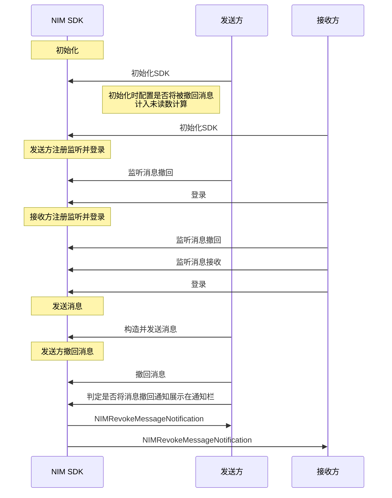

<!--keywords: 消息撤回、撤回、撤回通知、消息撤回通知 -->


网易云信 NIM iOS SDK 的[`NIMChatManagerDelegate`](https://doc.yunxin.163.com/docs/interface/messaging/iOS/doxygen/Latest/zh/de/da7/protocol_n_i_m_chat_manager_delegate-p.html)协议和[`NIMChatManager`](https://doc.yunxin.163.com/docs/interface/messaging/iOS/doxygen/Latest/zh/d2/d6e/protocol_n_i_m_chat_manager-p.html)协议，分别提供监听消息撤回和撤回消息的方法。


- SDK 支持多种消息撤回类型，如单聊单向撤回和群聊双向撤回，可通过[`NIMRevokeMessageNotificationType`](https://doc.yunxin.163.com/docs/interface/messaging/iOS/doxygen/Latest/zh/d4/d8e/_n_i_m_revoke_message_notification_8h.html#a1d6b29ce71e4d5fe43bad595af37a55a)设置。
- SDK 支持多种消息撤回通知类型，如在线通知、离线通知和漫游通知，可通过`NIMRevokeMessageNotification`对象的`offline`属性判断是否为离线通知，`roaming`属性判断是否为漫游通知。

## 功能介绍


撤回类型 | 说明
---- | --------------
双向撤回 | 可双向撤回一定时间内（默认 2 分钟，可在云信控制台配置）的单聊消息与群聊消息。撤回之后，消息接收者和发送者都将收到一条消息撤回通知，并删除对应的离线消息、漫游消息和历史消息。
单向撤回 | 可以在一定时间内（默认 2 分钟，可在云信控制台配置）单向撤回单聊消息和群消息。撤回之后，消息接收者会收到一条单向撤回的通知，并删除对应的离线消息、漫游消息和历史消息；撤回之后，消息发送者无感知，可以正常使用漫游消息和历史消息。


::: note notice
- 初始化 SDK 时，配置`[NIMSDKConfig sharedConfig].shouldConsiderRevokedMessageUnreadCount = YES`实现消息撤回后重新计算未读数。
- 单聊和群聊消息的撤回功能存在些许区别：
    - 单聊：用户只能撤回自己发送的消息。
    - 群聊：普通群成员只能撤回自己发送的消息。客户端 SDK 支持管理员撤回其他群成员的消息(服务端 API 不支持)。
:::

## 前提条件

已完成 <a href="https://doc.yunxin.163.com/messaging/guide/TE0MDc5MTI?platform=iOS" target="_blank">SDK 初始化</a>。

## 实现流程

不同类型消息撤回的流程相似，本节以用户A（消息发送方）与 用户B（消息接收方）的单聊消息交互为例，介绍**单聊消息双向撤回**的实现流程。

::: note note
下文仅对图中标为部分的流程进行详细说明，其他 API 调用流程请参考相应的文档。
:::




**流程具体说明**：

1. 发送方在初始化 SDK 时，通过<a href="https://doc.yunxin.163.com/docs/interface/messaging/iOS/doxygen/Latest/zh/d6/d13/interface_n_i_m_s_d_k_config.html#acf029e32b2c03188966653dc8de8aeb3" target="_blank">`NIMSDKConfig#shouldConsiderRevokedMessageUnreadCount`</a>配置被撤回的消息是否计入未读数计算。

    ::: note note
    - 该参数默认值为 NO。设置成 YES 的情况下，如果被撤回的消息本地还未读，那么当消息发生撤回时，对应会话的未读计数将减 1 以保持最近会话未读数的一致性。
    - 默认为 NO 的原因是，客户端常常需要在撤回成功后在会话内写入一条“您已撤回一条消息”的提示消息用于提醒显示。使用 NO 作为默认值直接写入一条已读提示消息，可避免未读计数发生两次变化，最终导致界面重复刷新。如果客户场景不需要写入提示消息，可以设置为 YES，以保持未读计数的一致性。
    :::

2. 发送方和接收方在登录 IM 前，调用 <a href="https://doc.yunxin.163.com/docs/interface/messaging/iOS/doxygen/Latest/zh/d2/d6e/protocol_n_i_m_chat_manager-p.html#ac4a9f352dcb9abfe7982da65b57ef14c" target="_blank">`addDelegate:`</a> 方法添加委托，注册<a href="https://doc.yunxin.163.com/docs/interface/messaging/iOS/doxygen/Latest/zh/de/da7/protocol_n_i_m_chat_manager_delegate-p.html#a4d659a4f5698ada7418221a652d300d7" target="_blank">`onRecvRevokeMessageNotification:`</a>回调函数，监听消息撤回。


    示例代码如下：

    ```
    - (void)onRecvRevokeMessageNotification:(NIMRevokeMessageNotification *)notification
    {
        //your code    
    }
    ```


3. 发送方在发送消息后，按需调用以下三种中的任意一种方法撤回消息。


    撤回消息的方法 | 说明
    ---- | -------------- 
    <a href="https://doc.yunxin.163.com/docs/interface/messaging/iOS/doxygen/Latest/zh/d2/d6e/protocol_n_i_m_chat_manager-p.html#a03dadf583bd71c550ed99c4037c31f06" target="_blank">`revokeMessage:completion:`</a> | 撤回消息，撤回不会触发推送消息
    <a href="https://doc.yunxin.163.com/docs/interface/messaging/iOS/doxygen/Latest/zh/d2/d6e/protocol_n_i_m_chat_manager-p.html#ad48eab5333195b29c0eea6856ea220db" target="_blank">`revokeMessage:apnsContent:apnsPayload:shouldBeCounted:completion:`</a> |  撤回消息，并触发推送。同时可配置推送文案与附加信息`apnsPayload`，以及消息撤回系统通知是否计入未读数
    <a href="https://doc.yunxin.163.com/docs/interface/messaging/iOS/doxygen/Latest/zh/d2/d6e/protocol_n_i_m_chat_manager-p.html#a52fd8155c790832ebf302c51c2c543ac" target="_blank">`revokeMessage:option:completion:`</a> | 撤回消息，消息撤回系统通知计入未读数。可通过<a href="https://doc.yunxin.163.com/docs/interface/messaging/iOS/doxygen/Latest/zh/df/d7b/interface_n_i_m_revoke_message_option.html" target="_blank">`NIMRevokeMessageOption`</a>设置撤回选项，其中包括撤回的附言和撤回扩展字段等

    在撤回消息成功后， SDK 会先将消息撤回通知（<a href="https://doc.yunxin.163.com/docs/interface/messaging/iOS/doxygen/Latest/zh/d1/d6d/interface_n_i_m_revoke_message_notification.html" target="_blank">`NIMRevokeMessageNotification`</a>）回调给上层应用，再自动将本地的这条消息删除。如果需要在撤回后在会话内显示一条“您撤回了一条消息”的提示，您可以自行构造一条提示消息并调用插入本地消息的方法，具体请参见<a href="" target="_blank">提示消息收发</a>。

    ::: note notice
    - 以下情况消息撤回会失败：
        * 消息并没有被 IM 服务端成功投递到对端。
        * 消息超过撤回时限。
        * 消息对象不是从本地数据库获取的。
    :::

    示例代码如下：
    
    ```
    //获取到了发送成功后的message，就可以撤回
    [[NIMSDK sharedSDK].chatManager revokeMessage:message
                                        apnsContent:@"TEST"
                                        apnsPayload:nil
                                    shouldBeCounted:YES
                                        completion:^(NSError * _Nullable error)
    {
        //your code
    }];
    ```

4. （可选）如果被撤消息已经通过 APNs 推送到客户端，可以通过设置`apnsPayload`来实现将原通知栏文案替换为`apnsContent`的效果。具体参见<a href="https://doc.yunxin.163.com/messaging/guide/zM4MDQzOTk?platform=iOS#覆盖通知栏内容" target="_blank">通知栏内容覆盖</a>。


  


