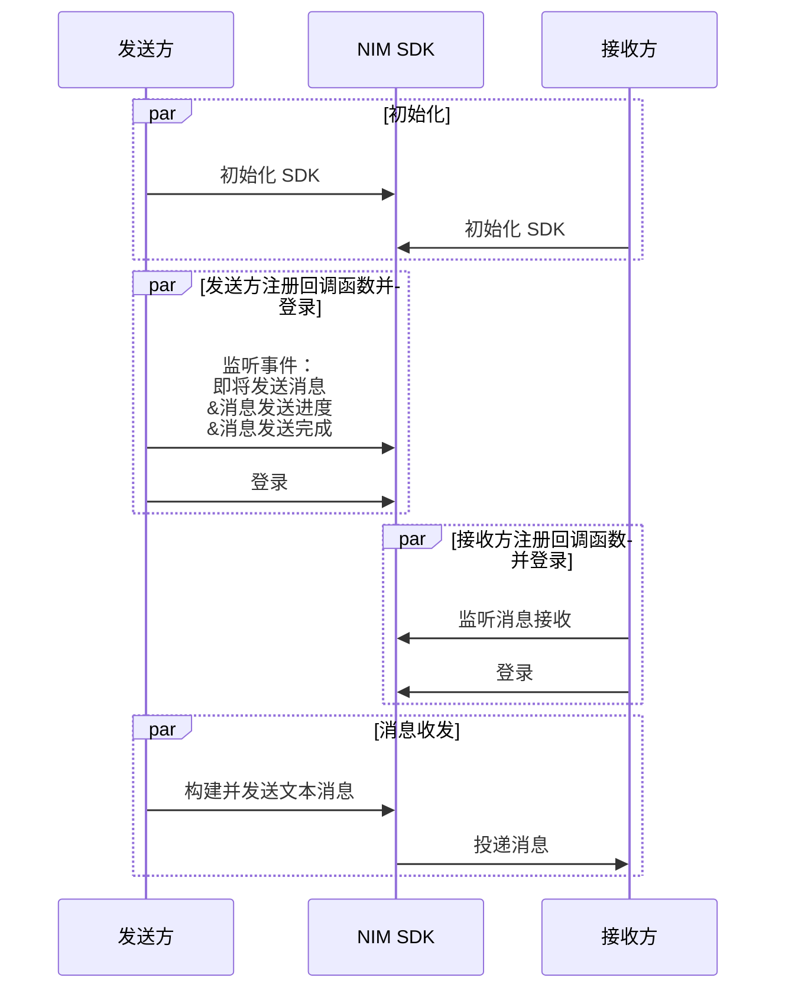
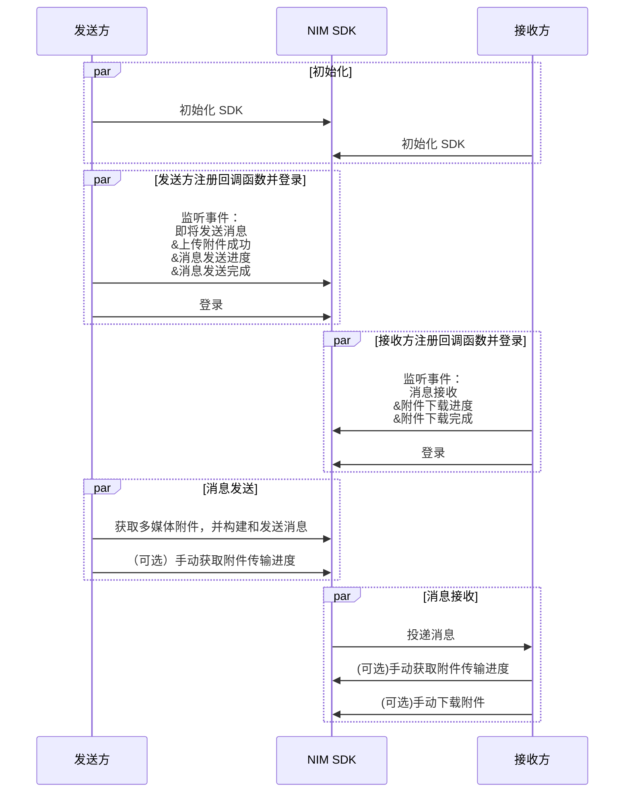

<!--keywords: 消息收发, 消息, 发送消息, 接收消息, 文本消息，图片消息，音频消息，视频消息，多媒体消息，广播消息，提示消息，自定义消息 -->

网易云信即时通讯（NetEase IM）iOS SDK（以下简称 **NIM SDK**）支持收发多种消息类型，助您快速实现多样化的消息业务场景。

本文介绍通过网易云信 NIM SDK 实现消息收发的技术原理、前提条件以及具体的实现流程。

::: note note
超大群、聊天室和圈组的消息收发，需 **单独配置**。具体实现流程请分别参考 <a href="https://doc.yunxin.163.com/messaging/guide/TEzMTgwNTg?platform=iOS" target="_blank">超大群</a>、<a href="https://doc.yunxin.163.com/messaging/guide/jQ0MjQ0NDI?platform=iOS#%E8%81%8A%E5%A4%A9%E5%AE%A4%E6%B6%88%E6%81%AF%E6%94%B6%E5%8F%91" target="_blank">聊天室消息收发</a> 和 <a href="https://doc.yunxin.163.com/messaging/guide/TYyOTAzMTQ?platform=iOS" target="_blank">圈组消息收发</a>。
:::

## 技术原理

应用集成 NIM SDK 并完成 SDK 初始化后，消息收发流程如下图所示（**本地提示消息** 和 **通知消息** 除外）。


上图中的流程可归纳为如下三步：

1. 账号集成与登录。
    1. 开发者将应用的用户账号（`accid`）传入网易云信 IM 服务器。
    2. 网易云信 IM 服务器返回 Token 给应用服务器。
    3. 应用客户端登录应用服务器。
    4. 应用服务器将 Token 返回给应用客户端。
    5. 用户带 Token 登录网易云信 IM 服务器。
6. 用户 A 发送一条消息到网易云信 IM 服务器。
7. 网易云信 IM 服务器投递消息至其他用户，分为如下两种情况：
    - 如为单聊消息，IM 服务器将其投递至用户 B。
    - 如为群聊消息，IM 服务器将其投递至群内其他每一位用户。

    ::: note notice
    上图仅以静态 Token 登录为例展示消息收发流程。网易云信 IM 还支持动态 Token 登录鉴权和第三方回调登录鉴权，相关详情请参考 <a href="https://doc.yunxin.163.com/messaging/guide/zE2NzA3Mjc?platformId=60353" target="_blank">登录鉴权</a>。
    :::

## 前提条件

在实现消息收发之前，请确保您已经完成了以下设置：

- 完成 <a href="https://doc.yunxin.163.com/messaging/guide/TE0MDc5MTI?platform=iOS" target="_blank">SDK 初始化</a>。
- 如需发送群聊消息，完成 <a href="https://doc.yunxin.163.com/messaging/guide/DE2MjM2MTE?platformId=60002#创建群组" target="_blank">创建群组</a>。
- 了解各消息类型的 <a href="https://doc.yunxin.163.com/messaging/guide/zI1NzA1OTg?platform=iOS?platform=iOS" target="_blank">使用限制</a>。

## API 使用限制

::: note important
发送消息（`sendMessage`）的方法调用存在频控，一分钟内默认最多可调用 300 次。
:::

## 实现消息收发

NIM SDK 提供 <a href="https://doc.yunxin.163.com/docs/interface/messaging/iOS/doxygen/Latest/zh/de/da7/protocol_n_i_m_chat_manager_delegate-p.html" target="_blank">`NIMChatManagerDelegate`</a> 协议和 <a href="https://doc.yunxin.163.com/docs/interface/messaging/iOS/doxygen/Latest/zh/d2/d6e/protocol_n_i_m_chat_manager-p.html" target="_blank">`NIMChatManager`</a> 协议，支持构建、监听和收发多种类型的消息。SDK 中定义消息的结构为 <a href="https://doc.yunxin.163.com/docs/interface/messaging/iOS/doxygen/Latest/zh/d6/df3/interface_n_i_m_message.html" target="_blank">`NIMMessage`</a>（不支持继承扩展），不同消息类型以 <a href="https://doc.yunxin.163.com/docs/interface/messaging/iOS/doxygen/Latest/zh/d6/df3/interface_n_i_m_message.html#a337e57ecd8f90a376e21c8253af2628d" target="_blank">`messageType`</a> 作区分。

### 公共参数说明

发送不同类型消息的方法均为 <a href="https://doc.yunxin.163.com/docs/interface/messaging/iOS/doxygen/Latest/zh/d2/d6e/protocol_n_i_m_chat_manager-p.html#a48df7e71bca12b638c62b90f3bbd8169" target="_blank">`sendMessage:toSession:error:`</a> 方法或 <a href="https://doc.yunxin.163.com/docs/interface/messaging/iOS/doxygen/Latest/zh/d2/d6e/protocol_n_i_m_chat_manager-p.html#a88b87af2e32adf7f65832fc3fbfe5591" target="_blank">`sendMessage:toSession:completion:`</a> 异步方法。

这两个方法的参数说明如下：

<div style="width:100px">参数</div> | <div style="width:80px">类型</div> | 说明
--- | --- | ---
`message` | `NIMMessage` | 需要发送的消息，开发者构造出 message 后，需要选择构造对应的 messageObject 注入 (文本消息直接填入 text 即可，无须消息附件注入)，即可传入此接口进行发送
`session` | <a href="https://doc.yunxin.163.com/docs/interface/messaging/iOS/doxygen/Latest/zh/d3/de1/interface_n_i_m_session.html" target="_blank">`NIMSession`</a> | 需要发送到的会话。通过 <a href="https://doc.yunxin.163.com/docs/interface/messaging/iOS/doxygen/Latest/zh/d3/de1/interface_n_i_m_session.html#a66fca63f8cb9e0be47a4631c39d65732" target="_blank">`sessionType`</a> 参数，可设置发送的文本消息为 **单聊** 消息或 **群聊** 消息。如设置为群聊消息，请确保已创建相应的群组。
`error` | NSError * | 您需要自己构造出一个 NSError 对象，并将对象引用传入。如果在准备发送消息阶段发生错误，这个对象会被填充相应的信息。通常为参数检查错误或者登录状态错误，可参考错误码说明定位具体的出错类型
`completion` | void(^)(NSError *error) | 发送完成后的回调，这里的回调完成只表示当前这个函数调用完成，需要后续的回调才能判断消息是否已经发送至服务器

::: note note :::
可通过消息配置选项 `NIMMessageSetting` 设置该消息是否存入云端、写入漫游、计入未读数等。具体配置示例请参考 <a href="https://doc.yunxin.163.com/messaging/guide/DQ0MTY0MTM?platform=iOS" target="_blank">消息配置选项</a>。
:::

### **收发文本消息**



以下信息仅对上图中标为部分的流程进行详细说明，其他流程请参考相关文档。

1. 发送方在登录前，调用 <a href="https://doc.yunxin.163.com/docs/interface/messaging/iOS/doxygen/Latest/zh/d2/d6e/protocol_n_i_m_chat_manager-p.html#ac4a9f352dcb9abfe7982da65b57ef14c" target="_blank">`addDelegate:`</a> 方法添加委托（具体回调函数如下），完成对消息发送相关事件的监听。
    - 注册 <a href="https://doc.yunxin.163.com/docs/interface/messaging/iOS/doxygen/Latest/zh/de/da7/protocol_n_i_m_chat_manager_delegate-p.html#acd6d6d5b200c13afef2779ff59189f6b" target="_blank">`willSendMessage`</a> 回调函数，监听 **消息即将发送** 事件。

    - 注册 <a href="https://doc.yunxin.163.com/docs/interface/messaging/iOS/doxygen/Latest/zh/de/da7/protocol_n_i_m_chat_manager_delegate-p.html#a058f4dc69b63c08f776591a681c7b37c" target="_blank">`sendMessage:progress:`</a> 回调函数，监听消息发送进度。

    - 注册 <a href="https://doc.yunxin.163.com/docs/interface/messaging/iOS/doxygen/Latest/zh/de/da7/protocol_n_i_m_chat_manager_delegate-p.html#ad65c6bf33fc6fca06268a526782cd362" target="_blank">`sendMessage:didCompleteWithError:`</a> 回调函数，监听 **消息发送完成** 事件。

    示例代码如下：

    ```Objective-C
    // 在某处添加代理对象
    [NIMSDK sharedSDK].chatManager addDelegate:self];
    //...

    //回调方法监听，此处为消息即将发送事件
    -(void)willSendMessage:(NIMMessage *)message
    {
        //your code
    }

    //发送进度回调
    -(void)sendMessage:(NIMMessage *)message progress:(float)progress
    {
        //your code
    }

    //消息发送完成回调
    //发送结果
    - (void)sendMessage:(NIMMessage *)message didCompleteWithError:(NSError *)error
    {
        //your code
    }
    ```

2. 接收方在登录前，调用 <a href="https://doc.yunxin.163.com/docs/interface/messaging/iOS/doxygen/Latest/zh/d2/d6e/protocol_n_i_m_chat_manager-p.html#ac4a9f352dcb9abfe7982da65b57ef14c" target="_blank">`addDelegate:`</a> 方法添加委托，注册 <a href="https://doc.yunxin.163.com/docs/interface/messaging/iOS/doxygen/Latest/zh/de/da7/protocol_n_i_m_chat_manager_delegate-p.html#ad7e5965ba2af93a24e6814a004866965" target="_blank">`onRecvMessages:`</a> 回调函数，监听消息接收。

    示例代码如下:

    ```Objective-C
    //收到消息
    - (void)onRecvMessages:(NSArray *)messages
    {
        //your code
    }
    ```

3. 发送方构建一条文本消息，并调用 <a href="https://doc.yunxin.163.com/docs/interface/messaging/iOS/doxygen/Latest/zh/d2/d6e/protocol_n_i_m_chat_manager-p.html#a48df7e71bca12b638c62b90f3bbd8169" target="_blank">`sendMessage:toSession:error:`</a> 或针对大文件的 <a href="https://doc.yunxin.163.com/docs/interface/messaging/iOS/doxygen/Latest/zh/d2/d6e/protocol_n_i_m_chat_manager-p.html#a88b87af2e32adf7f65832fc3fbfe5591" target="_blank">`sendMessage:toSession:completion:`</a> 异步方法发送该消息。

    以发送一条文本消息 hello 至好友 ID 为 `user` 的业务场景为例，示例代码如下：

    ```Objective-C
    // 构造出具体会话：P2P 单聊，对方账号为 user
    NIMSession *session = [NIMSession session:@"user" type:NIMSessionTypeP2P];
    // 构造出具体消息
    NIMMessage *message = [[NIMMessage alloc] init];
    message.text        = @"hello";
    // 错误反馈对象
    NSError *error = nil;
    // 发送消息
    [[NIMSDK sharedSDK].chatManager sendMessage:message toSession:session error:&error];
    ```

4. `onRecvMessage:` 回调函数触发，投递文本消息至接收方。

### **收发多媒体消息**



多媒体消息包括图片消息、语音消息、视频消息和文件消息。

以下信息仅对上图中标为部分的流程进行详细说明，其他流程请参考相关文档。

1. 发送方在登录前，调用 <a href="https://doc.yunxin.163.com/docs/interface/messaging/iOS/doxygen/Latest/zh/d2/d6e/protocol_n_i_m_chat_manager-p.html#ac4a9f352dcb9abfe7982da65b57ef14c" target="_blank">`addDelegate:`</a> 方法添加委托，完成对消息发送相关事件的监听。
    - 注册 <a href="https://doc.yunxin.163.com/docs/interface/messaging/iOS/doxygen/Latest/zh/de/da7/protocol_n_i_m_chat_manager_delegate-p.html#acd6d6d5b200c13afef2779ff59189f6b" target="_blank">`willSendMessage`</a> 回调函数，监听 **消息即将发送** 事件。示例代码见上文的 **文本消息收发**。

    - 注册 <a href="https://doc.yunxin.163.com/docs/interface/messaging/iOS/doxygen/Latest/zh/de/da7/protocol_n_i_m_chat_manager_delegate-p.html#a058f4dc69b63c08f776591a681c7b37c" target="_blank">`sendMessage:progress:`</a> 回调函数，监听消息发送进度。示例代码见上文的 **文本消息收发**。

    - 注册 <a href="https://doc.yunxin.163.com/docs/interface/messaging/iOS/doxygen/Latest/zh/de/da7/protocol_n_i_m_chat_manager_delegate-p.html#ad65c6bf33fc6fca06268a526782cd362" target="_blank">`sendMessage:didCompleteWithError:`</a> 回调函数，监听 **消息发送完成** 事件。示例代码见上文的 **文本消息收发**。

    - 注册 <a href="https://doc.yunxin.163.com/docs/interface/messaging/iOS/doxygen/Latest/zh/de/da7/protocol_n_i_m_chat_manager_delegate-p.html#a600b66edf8ddf9c11dccab43de5a1120" target="_blank">`uploadAttachmentSuccess:forMessage:`</a> 回调函数，监听**多媒体资源上传完成**事件。示例代码如下：
    ```Objective-C
    //附件上传完成
    - (void)uploadAttachmentSuccess:(NSString *)urlString
                        forMessage:(NIMQChatMessage *)message
    {
    //your code
    }
    ```

2. 接收方在登录前，调用 `addDelegate:` 方法添加委托，注册如下回调函数。

    - <a href="https://doc.yunxin.163.com/docs/interface/messaging/iOS/doxygen/Latest/zh/de/da7/protocol_n_i_m_chat_manager_delegate-p.html#ad7e5965ba2af93a24e6814a004866965" target="_blank">`onRecvMessages:`</a> 回调函数，用于监听消息接收。
    - <a href="https://doc.yunxin.163.com/docs/interface/messaging/iOS/doxygen/Latest/zh/de/da7/protocol_n_i_m_chat_manager_delegate-p.html#ad73cad2a9ce6c685f1c83c30506fce4f" target="_blank">`fetchMessageAttachment:progress:`</a> 回调函数，用于监听附件下载进度。
    - <a href="https://doc.yunxin.163.com/docs/interface/messaging/iOS/doxygen/Latest/zh/de/da7/protocol_n_i_m_chat_manager_delegate-p.html#a3a1b968be8eadf434560977b1846dfd7" target="_blank">`fetchMessageAttachment:didCompleteWithError:`</a> 回调函数，用于监听 **消息附件下载完成** 事件。

3. 发送方通过初始化附件实例获取多媒体附件，并构建消息对象，注入附件，最后调用 <a href="https://doc.yunxin.163.com/docs/interface/messaging/iOS/doxygen/Latest/zh/d2/d6e/protocol_n_i_m_chat_manager-p.html#a48df7e71bca12b638c62b90f3bbd8169" target="_blank">`sendMessage:toSession:error:`</a> 或针对大文件的 <a href="https://doc.yunxin.163.com/docs/interface/messaging/iOS/doxygen/Latest/zh/d2/d6e/protocol_n_i_m_chat_manager-p.html#a88b87af2e32adf7f65832fc3fbfe5591" target="_blank">`sendMessage:toSession:completion:`</a> 异步方法发送该消息。

    可在初始化附件实例时预设其 <a href="https://doc.yunxin.163.com/messaging/guide/zg4NzcwOTE?platform=iOS" target="_blank">NOS 资源存储场景</a>，指定其在网易对象存储（Netease Object Storage, NOS）服务上的存活时长。

    多媒体附件 | 说明
    ---- | ----
    <a href="https://doc.yunxin.163.com/docs/interface/messaging/iOS/doxygen/Latest/zh/de/d55/interface_n_i_m_image_object.html" target="_blank">`NIMImageObject`</a> | 图片实例对象，左侧链接内包含图片实例的参数说明与图片实例初始化说明
    <a href="https://doc.yunxin.163.com/docs/interface/messaging/iOS/doxygen/Latest/zh/d0/d2d/interface_n_i_m_audio_object.html" target="_blank">`NIMAudioObject`</a> | 语音实例对象，左侧链接内包含语音实例的参数说明与语音实例初始化说明 <note type=note>NIM SDK 提供了高清语音的录制与播放的功能，用于处理语音消息的语音附件。相关详情请参考 <a href="https://doc.yunxin.163.com/messaging/guide/jczMTk1NTE?platform=iOS" target="_blank">语音消息处理</a>。</note>
    <a href="https://doc.yunxin.163.com/docs/interface/messaging/iOS/doxygen/Latest/zh/d4/dc3/interface_n_i_m_video_object.html" target="_blank">`NIMVideoObject`</a> | 视频实例对象，左侧链接内包含视频实例的参数说明与视频实例初始化说明
    <a href="https://doc.yunxin.163.com/docs/interface/messaging/iOS/doxygen/Latest/zh/d0/de8/interface_n_i_m_file_object.html" target="_blank">`NIMFileObject`</a> | 文件实例对象，左侧链接内包含文件实例的参数说明与文件实例初始化说明

    - 发送图片消息的示例代码

    :::::: div linked-codes
    ::: code 图片(以 UIImage 初始化)
    ```Objective-C
    // 构造出具体会话
    NIMSession *session = [NIMSession session:@"user" type:NIMSessionTypeP2P];
    // 获得图片附件对象
    NIMImageObject *object = [[NIMImageObject alloc] initWithImage:image];
    // 构造出具体消息并注入附件
    NIMMessage *message = [[NIMMessage alloc] init];
    message.messageObject = object;
    // 错误反馈对象
    NSError *error = nil;
    // 发送消息
    [[NIMSDK sharedSDK].chatManager sendMessage:message toSession:session error:&error];
    ```
    :::

    ::: code 图片(以图片路径初始化)
    ```Objective-C
    // 构造出具体会话
    NIMSession *session = [NIMSession session:@"user" type:NIMSessionTypeP2P];
    // 获得图片附件对象
    NIMImageObject *object = [[NIMImageObject alloc] initWithFilepath:path];
    // 构造出具体消息并注入附件
    NIMMessage *message = [[NIMMessage alloc] init];
    message.messageObject = object;
    // 错误反馈对象
    NSError *error = nil;
    // 发送消息
    [[NIMSDK sharedSDK].chatManager sendMessage:message toSession:session error:&error];

    ```
    :::

    ::: code 图片(以图片数据初始化)
    ```Objective-C
    // 构造出具体会话
    NIMSession *session = [NIMSession session:@"user" type:NIMSessionTypeP2P];
    // 获得图片附件对象
    NIMImageObject *object = [[NIMImageObject alloc] initWithData:data extension:@"png"];
    // 构造出具体消息并注入附件
    NIMMessage *message = [[NIMMessage alloc] init];
    message.messageObject = object;
    // 错误反馈对象
    NSError *error = nil;
    // 发送消息
    [[NIMSDK sharedSDK].chatManager sendMessage:message toSession:session error:&error];
    ```
    :::
    ::::::

    - 发送语音消息示例代码

    :::::: div linked-codes
    ::: code 语音(以语音路径初始化)
    ```Objective-C
    // 构造出具体会话
    NIMSession *session = [NIMSession session:@"user" type:NIMSessionTypeP2P];
    // 获得语音附件对象
    NIMAudioObject *object = [[NIMAudioObject alloc] initWithSourcePath:path];
    // 构造出具体消息并注入附件
    NIMMessage *message = [[NIMMessage alloc] init];
    message.messageObject = object;
    // 错误反馈对象
    NSError *error = nil;
    // 发送消息
    [[NIMSDK sharedSDK].chatManager sendMessage:message toSession:session error:&error];
    ```
    :::
    ::: code 语音(语音数据初始化)
    ```Objective-C
    // 构造出具体会话
    NIMSession *session = [NIMSession session:@"user" type:NIMSessionTypeP2P];
    // 获得语音附件对象
    NIMAudioObject *audioObject = [[NIMAudioObject alloc] initWithData:data extension:@"aac"];
    // 构造出具体消息并注入附件
    NIMMessage *message = [[NIMMessage alloc] init];
    message.messageObject = object;
    // 错误反馈对象
    NSError *error = nil;
    // 发送消息
    [[NIMSDK sharedSDK].chatManager sendMessage:message toSession:session error:&error];
    ```
    :::
    ::::::

    - 发送视频消息示例代码

    :::::: div linked-codes
    ::: code 视频(以视频路径初始化)
    ```Objective-C
    // 构造出具体会话
    NIMSession *session = [NIMSession session:@"user" type:NIMSessionTypeP2P];
    // 获得视频附件对象
    NIMVideoObject *object = [[NIMVideoObject alloc] initWithSourcePath:path];
    // 构造出具体消息并注入附件
    NIMMessage *message = [[NIMMessage alloc] init];
    message.messageObject = object;
    // 错误反馈对象
    NSError *error = nil;
    // 发送消息
    [[NIMSDK sharedSDK].chatManager sendMessage:message toSession:session error:&error];
    ```

    :::

    ::: code 视频(以视频数据初始化)
    ```Objective-C
    // 构造出具体会话
    NIMSession *session = [NIMSession session:@"user" type:NIMSessionTypeP2P];
    // 获得视频附件对象
    NIMVideoObject *object = [[NIMVideoObject alloc] initWithData:data extension:@"mp4"];
    // 构造出具体消息并注入附件
    NIMMessage *message = [[NIMMessage alloc] init];
    message.messageObject = object;
    // 错误反馈对象
    NSError *error = nil;
    // 发送消息
    [[NIMSDK sharedSDK].chatManager sendMessage:message toSession:session error:&error];
    ```
    :::

    ::::::

    - 发送文件消息示例代码
    :::::: div linked-codes
    ::: code 文件(以文件路径初始化)
    ```Objective-C
    // 构造出具体会话
    NIMSession *session = [NIMSession session:@"user" type:NIMSessionTypeP2P];
    // 获得文件附件对象
    NIMFileObject *object = [[NIMFileObject alloc] initWithSourcePath:path];
    // 构造出具体消息并注入附件
    NIMMessage *message = [[NIMMessage alloc] init];
    message.messageObject = object;
    // 错误反馈对象
    NSError *error = nil;
    // 发送消息
    [[NIMSDK sharedSDK].chatManager sendMessage:message toSession:session error:&error];
    ```
    :::

    ::: code 文件(以文件数据初始化)
    ```Objective-C
    // 构造出具体会话
    NIMSession *session = [NIMSession session:@"user" type:NIMSessionTypeP2P];
    // 获得视频附件对象
    NIMFileObject *audioObject = [[NIMFileObject alloc] initWithData:data extension:@"data"];
    // 构造出具体消息并注入附件
    NIMMessage *message = [[NIMMessage alloc] init];
    message.messageObject = object;
    // 错误反馈对象
    NSError *error = nil;
    // 发送消息
    [[NIMSDK sharedSDK].chatManager sendMessage:message toSession:session error:&error];
    ```
    :::
    ::::::

4. （可选）发送方在发送消息后，可进行如下操作。
    - 调用 <a href="https://doc.yunxin.163.com/docs/interface/messaging/iOS/doxygen/Latest/zh/d2/d6e/protocol_n_i_m_chat_manager-p.html#a6192b3d5446cbe8a91cc975b892e1a34" target="_blank">`messageInTransport:`</a> 方法，判断附件是否正在传输。
    - 调用 <a href="https://doc.yunxin.163.com/docs/interface/messaging/iOS/doxygen/Latest/zh/d2/d6e/protocol_n_i_m_chat_manager-p.html#a81cfaddca8f718e89dcd3b7e4ee99bb9" target="_blank">`messageTransportProgress:`</a> 方法，获取附件传输进度。

    示例代码如下：

    ```Objective-C
    //判断是否在传输
    BOOL isInTransport = [[NIMSDK sharedSDK].chatManager messageInTransport: msg];
    ...

    //获取进度
    float progress = [[NIMSDK sharedSDK].chatManager messageTransportProgress:msg];
    ```

5. `onRecvMessage:` 函数触发，接收方收到文本消息。

6. （可选）接收方接收消息后，可进行如下操作。

    - 调用 <a href="https://doc.yunxin.163.com/docs/interface/messaging/iOS/doxygen/Latest/zh/d2/d6e/protocol_n_i_m_chat_manager-p.html#a6192b3d5446cbe8a91cc975b892e1a34" target="_blank">`messageInTransport:`</a> 方法，判断附件是否正在传输。
    - 调用 <a href="https://doc.yunxin.163.com/docs/interface/messaging/iOS/doxygen/Latest/zh/d2/d6e/protocol_n_i_m_chat_manager-p.html#a81cfaddca8f718e89dcd3b7e4ee99bb9" target="_blank">`messageTransportProgress:`</a> 方法，获取附件传输进度。

7. （可选）图片消息的缩略图、语音消息的语音文件和视频消息的视频封面，默认由 SDK 自动下载。如果自动下载失败（本地没有这些文件），那么接收方可调用 <a href="https://doc.yunxin.163.com/docs/interface/messaging/iOS/doxygen/Latest/zh/d2/d6e/protocol_n_i_m_chat_manager-p.html#a998647681f2588fd1b1651eafdda6442" target="_blank">`fetchMessageAttachment:error:`</a> 方法获取。

    示例代码如下：

    ```Objective-C
    //下载附件
    NSError *error;
    [[NIMSDK sharedSDK].chatManager fetchMessageAttachment:msg error:&error];
    ```

### **收发位置消息**

地理位置消息收发流程与文本消息收发流程基本一致，区别在于需要构建的消息对象不同（位置消息对象为 <a href="https://doc.yunxin.163.com/docs/interface/messaging/iOS/doxygen/Latest/zh/db/d85/interface_n_i_m_location_object.html" target="_blank">`NIMLocationObject`</a>）。提供了初始化位置实例的 <a href="https://doc.yunxin.163.com/docs/interface/messaging/iOS/doxygen/Latest/zh/db/d85/interface_n_i_m_location_object.html#afc1d58a96992a99810f3d4e051af7cad" target="_blank">`initWithLatitude:longitude:title:`</a> 方法。本节仅简要展示调用示例，具体实现流程请参考上文的 **收发文本消息**。

以下示例代码的业务场景为：发送一条位置消息至 IM 账号为 `user` 的好友， 位置的经纬度为（30.27415,120.15515），地点名为 `address`。

```Objective-C
// 构造出具体会话
NIMSession *session = [NIMSession session:@"user" type:NIMSessionTypeP2P];
// 获得位置附件对象
NIMLocationObject *object = [[NIMLocationObject alloc] initWithLatitude:120.15515 longitude:30.27415 title:@"address"];
// 构造出具体消息并注入附件
NIMMessage *message = [[NIMMessage alloc] init];
message.messageObject = object;
// 错误反馈对象
NSError *error = nil;
// 发送消息
[[NIMSDK sharedSDK].chatManager sendMessage:message toSession:session error:&error];
```

### **收发提示消息**

提示消息主要用于会话内的通知提醒，消息使用场景例如：进入会话时出现的欢迎消息，或是会话过程中命中敏感词后的提示消息等场景。也可以用自定义消息实现，但相对复杂。

提示消息附件内部没有额外的信息字段，提示内容建议放入 `NIMMessage` 中的 `text` 字段，额外信息可以存储在 `NIMMessage` 的 `remoteExt` 和 `localExt` 字段中。

附件原型:

```Objective-C
@interface NIMTipObject : NSObject<NIMMessageObject>
@end
```

以下示例代码的业务场景为：发送一条提示消息至网易云信 IM 账号为 `user` 的好友 , 文案内容为 `welcome`。

```Objective-C
// 构造出具体会话
NIMSession *session = [NIMSession session:@"user" type:NIMSessionTypeP2P];
// 获得文件附件对象
NIMTipObject *object = [[NIMTipObject alloc] init];
// 构造出具体消息并注入附件
NIMMessage *message = [[NIMMessage alloc] init];
message.messageObject = object;
message.text = @"welcome";
// 错误反馈对象
NSError *error = nil;
// 发送消息
[[NIMSDK sharedSDK].chatManager sendMessage:message toSession:session error:&error];
```

### **接收通知消息**

针对一些特定场景的事件，网易云信服务器预置了一些通知消息，在事件发生时下发到 SDK。通知消息也是一种特定消息，开发者需解析消息中附带的信息，来获取通知内容。如最常见的通知消息——群通知事件，如有新成员进群，则群内已有成员将收到此通知消息。

- 通知消息属于会话内的一种消息，其对应的数据结构为 <a href="https://doc.yunxin.163.com/docs/interface/messaging/iOS/doxygen/Latest/zh/d6/df3/interface_n_i_m_message.html" target="_blank">`NIMMessage`</a>，消息类型为 `NIMMessageTypeNotification`。通知消息目前用于在群和聊天室的事件通知。

- 通知消息需要进行解析，具体请参考 [验证入群邀请](https://doc.yunxin.163.com/messaging/guide/jM3Mzk1NzE?platform=iOS#%E9%AA%8C%E8%AF%81%E5%85%A5%E7%BE%A4%E9%82%80%E8%AF%B7)。

- 可对通知消息进行过滤，具体请参考 [通知消息过滤](https://doc.yunxin.163.com/messaging/guide/DIxODE4MTk?platform=iOS)。

### **收发自定义消息**

除了上述内置消息类型以外，NIM SDK 还支持收发自定义消息类型。具体实现流程介绍，请参考 <a href="https://doc.yunxin.163.com/messaging/guide/jIzMDI3MjA?platform=iOS" target="_blank">自定义消息收发</a>。

### **收发流式消息**

1. 调用 [`NIMChatManager.addDelegate`](https://doc.yunxin.163.com/docs/interface/messaging/iOS/doxygen/Latest/zh/d2/d6e/protocol_n_i_m_chat_manager-p.html#ac4a9f352dcb9abfe7982da65b57ef14c) 监听消息接收回调（`onRecvMessages`）和消息更新回调（`onReceiveMessagesModified`）。

2. **发送方** 调用服务端 API [发送流式消息](https://doc.yunxin.163.com/messaging2/server-apis/TgyMTY2NzE?platform=server)。

    ::: note note
    根据调用返回的状态，处理输出的流式消息。
    :::

3. **接收方** 处理流式消息。

    - 通过 `onRecvMessages` 回调收到占位消息。
    - 通过 `onReceiveMessagesModified` 回调持续收到分片消息，直到消息接收完毕。

## 常见问题

### 发送消息后怎么获取消息内容

实现 `NIMChatManagerDelegate` 的 `sendMessage:didCompleteWithError:` 方法来接收发送消息完成回调，其中回调 `NIMMessage` 对象。可以通过 `isOutgoingMsg` 属性判断是否是发送出去的消息，通过 `session` 属性获取聊天对象的 accid/群组 ID/聊天室 ID，通过 `text` 属性获取消息文本（仅适用于文本消息和提示消息），通过 `messageObject` 属性获取消息附件内容，通过 `deliveryState` 属性获取发送消息的投递状态，通过 `timestamp` 属性获取消息发送时间。

`deliveryState` 默认是发送失败的状态，但仅作参考。准确实时的消息状态，建议客户根据消息发送完成的回调来重新从本地数据库取消息记录用来展示。或者根据消息发送的生命周期（将要发送，发送完成等回调），在消息的扩展字段定义消息的发送状态，用来 UI 展示。

### 如何判断消息已发送成功

调用消息发送接口 `sendMessage:toSession:error:` 时，判断 `error == nil` 表示方法调用成功。实现 `NIMChatManagerDelegate` 的 `–sendMessage:didCompleteWithError:` 方法，判断 `error == nil` 表示消息已经发送至服务器。

### 如何设置消息的扩展字段

单聊或群聊消息具有服务端扩展字段和客户端扩展字段。服务端扩展字段只能在消息发送前设置，会同步到其他端。客户端扩展字段在消息发送前后设置均可，不会同步到其他端。

::: note notice
扩展字段，请使用 JSON 格式封装，并传入非格式化的 JSON 字符串，最大长度 1024 字节。
:::

具体方法如下：

:::::: div linked-codes
::: code 更新客户端扩展字段

1. 对于单聊或群聊消息，构造 `NIMMessage` 对象时，通过 `localExt` 方法设置客户端扩展字段。

2. 调用 <a href="https://doc.yunxin.163.com/docs/interface/messaging/iOS/doxygen/Latest/zh/d5/d94/protocol_n_i_m_conversation_manager-p.html#accef3d610c102acd8a2cdee489d18b15" target="_blank">`updateMessage:forSession:completion`</a> 方法更新消息的本地扩展字段。

    ::: note notice
    设置消息的客户端扩展字段后，必须调用 `updateMessage:forSession:completion` 方法，否则无法生效。
    :::

:::

::: code 更新服务端扩展字段

对于单聊或群聊消息，构造 `IMMessage` 对象时，通过 `setRemoteExtension` 方法设置消息的服务端扩展字段，

:::
::::::

## API 参考

| <div style="width:150px">API</div> | <div style="width:120px">说明 </div> |
| ---- | ---- |
| <a href="https://doc.yunxin.163.com/docs/interface/messaging/iOS/doxygen/Latest/zh/d2/d6e/protocol_n_i_m_chat_manager-p.html#ac4a9f352dcb9abfe7982da65b57ef14c" target="_blank">`addDelegate:`</a> | 添加委托，可通过参数 `delegate` 配置需要委托的回调函数 |
| <a href="https://doc.yunxin.163.com/docs/interface/messaging/iOS/doxygen/Latest/zh/d2/d6e/protocol_n_i_m_chat_manager-p.html#a67607d399187161425296778e78b7b7d" target="_blank">`removeDelegate:`</a> | 移除委托，可通过参数 `delegate` 配置需要移除委托的回调函数 |
| <a href="https://doc.yunxin.163.com/docs/interface/messaging/iOS/doxygen/Latest/zh/de/da7/protocol_n_i_m_chat_manager_delegate-p.html#acd6d6d5b200c13afef2779ff59189f6b" target="_blank">`willSendMessage`</a> | 即将发送消息回调
| <a href="https://doc.yunxin.163.com/docs/interface/messaging/iOS/doxygen/Latest/zh/de/da7/protocol_n_i_m_chat_manager_delegate-p.html#a600b66edf8ddf9c11dccab43de5a1120" target="_blank">`uploadAttachmentSuccess:forMessage:`</a> | 上传资源文件成功回调 |
| <a href="https://doc.yunxin.163.com/docs/interface/messaging/iOS/doxygen/Latest/zh/de/da7/protocol_n_i_m_chat_manager_delegate-p.html#a058f4dc69b63c08f776591a681c7b37c" target="_blank">`sendMessage:progress:`</a> | 发送消息进度回调 |
| <a href="https://doc.yunxin.163.com/docs/interface/messaging/iOS/doxygen/Latest/zh/de/da7/protocol_n_i_m_chat_manager_delegate-p.html#ad65c6bf33fc6fca06268a526782cd362" target="_blank">`sendMessage:didCompleteWithError:`</a> | 发送消息完成回调 |
| <a href="https://doc.yunxin.163.com/docs/interface/messaging/iOS/doxygen/Latest/zh/de/da7/protocol_n_i_m_chat_manager_delegate-p.html#ad7e5965ba2af93a24e6814a004866965" target="_blank">`onRecvMessages:`</a> | 收到消息回调 |
| <a href="https://doc.yunxin.163.com/docs/interface/messaging/iOS/doxygen/Latest/zh/de/da7/protocol_n_i_m_chat_manager_delegate-p.html#ad73cad2a9ce6c685f1c83c30506fce4f" target="_blank">`fetchMessageAttachment:progress:`</a> | 收到消息附件进度回调 |
| <a href="https://doc.yunxin.163.com/docs/interface/messaging/iOS/doxygen/Latest/zh/de/da7/protocol_n_i_m_chat_manager_delegate-p.html#a3a1b968be8eadf434560977b1846dfd7" target="_blank">`fetchMessageAttachment:didCompleteWithError:`</a> | 收到消息附件完成回调 |
| <a href="https://doc.yunxin.163.com/docs/interface/messaging/iOS/doxygen/Latest/zh/d2/d6e/protocol_n_i_m_chat_manager-p.html#a48df7e71bca12b638c62b90f3bbd8169" target="_blank">`sendMessage:toSession:error:`</a> | 发送消息
| <a href="https://doc.yunxin.163.com/docs/interface/messaging/iOS/doxygen/Latest/zh/d2/d6e/protocol_n_i_m_chat_manager-p.html#a88b87af2e32adf7f65832fc3fbfe5591" target="_blank">`sendMessage:toSession:completion:`</a> | 异步发送消息 |
| <a href="https://doc.yunxin.163.com/docs/interface/messaging/iOS/doxygen/Latest/zh/d2/d6e/protocol_n_i_m_chat_manager-p.html#a0e958f0b41ecec979df02b6a9fcb78d4" target="_blank">`cancelSendingMessage:`</a> | 取消发送消息 |

::: note note
更多相关 SDK API，请参考 <a href="https://doc.yunxin.163.com/docs/interface/messaging/iOS/doxygen/Latest/zh/de/da7/protocol_n_i_m_chat_manager_delegate-p.html" target="_blank">`NIMChatManagerDelegate`</a> 协议和 <a href="https://doc.yunxin.163.com/docs/interface/messaging/iOS/doxygen/Latest/zh/d2/d6e/protocol_n_i_m_chat_manager-p.html" target="_blank">`NIMChatManager`</a> 协议。
:::