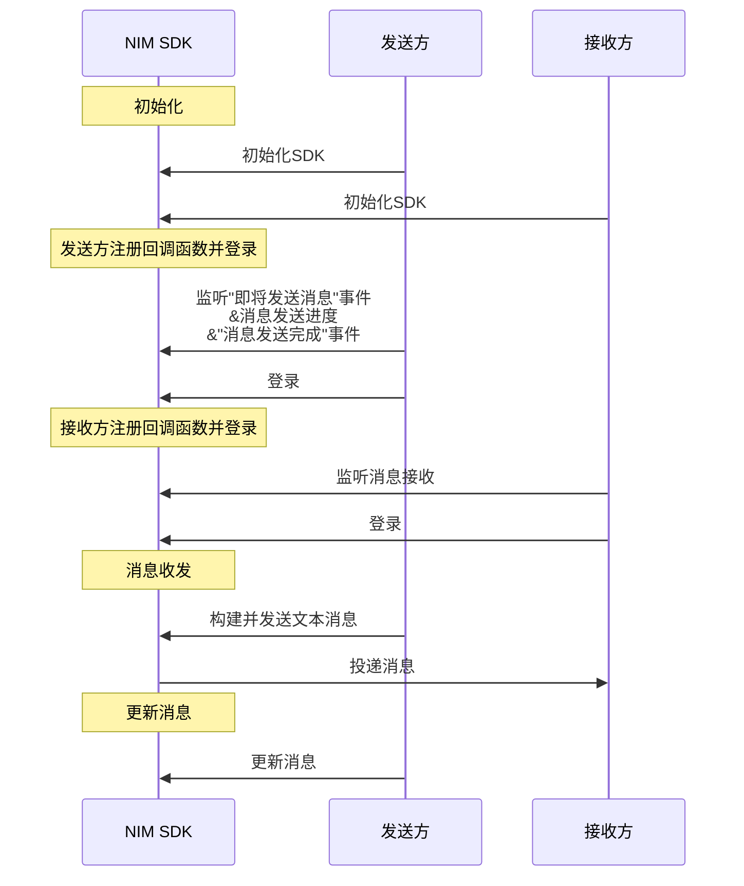

网易云信 NIM iOS SDK 支持更新消息。为了保证存储消息的完整性，只支持更新消息的本地扩展字段 `LocalExt` 和自定义消息的附件对象 `NIMCustomObject`。

::: note notice
请不要对通知消息进行更新。
:::


## 前提条件

已调用 <a href="https://doc.yunxin.163.com/docs/interface/messaging/iOS/doxygen/Latest/zh/d2/d6e/protocol_n_i_m_chat_manager-p.html#ac4a9f352dcb9abfe7982da65b57ef14c" target="_blank">`addDelegate:`</a> 方法添加委托，注册“消息发送完成回调”函数（<a href="https://doc.yunxin.163.com/docs/interface/messaging/iOS/doxygen/Latest/zh/de/da7/protocol_n_i_m_chat_manager_delegate-p.html#ad65c6bf33fc6fca06268a526782cd362" taregt="_blank">`sendMessage:didCompleteWithError:`</a> ），且已通过该回调函数判断消息已发送完成。

## 实现方法



  

调用<a href="https://doc.yunxin.163.com/docs/interface/messaging/iOS/doxygen/Latest/zh/d5/d94/protocol_n_i_m_conversation_manager-p.html#accef3d610c102acd8a2cdee489d18b15" target="_blank">`updateMessage:forSession:completion:`</a>方法更新消息的本地扩展字段 `LocalExt` 和自定义消息的附件对象 `NIMCustomObject`。

::: note note 
该方法为异步写入，您无需在应用上层单独开线程，直接在当前线程调用即可。
:::

- API 原型

    ```objc
    @protocol NIMConversationManager <NSObject>
    - (void)updateMessage:(NIMMessage *)message
            forSession:(NIMSession *)session
            completion:(nullable NIMUpdateMessageBlock)completion;
    @end
    ```

    参数说明：

    参数   |类型   |说明   
    ---   |---| ---
    `message`   |`NIMMessage`    |  需要被更新的消息，支持的更新属性见上文    
    `session`   |`NIMSession`    |  消息所在的会话 
    `completion`   |`NIMUpdateMessageBlock`    |  完成后的回调 


- 示例代码

    ```
    //消息打上拉黑拒收标记，方便 UI 显示
    message.localExt = @{NTESMessageRefusedTag:@(true)};
    [[NIMSDK sharedSDK].conversationManager updateMessage:message forSession:message.session completion:nil];
    ```

