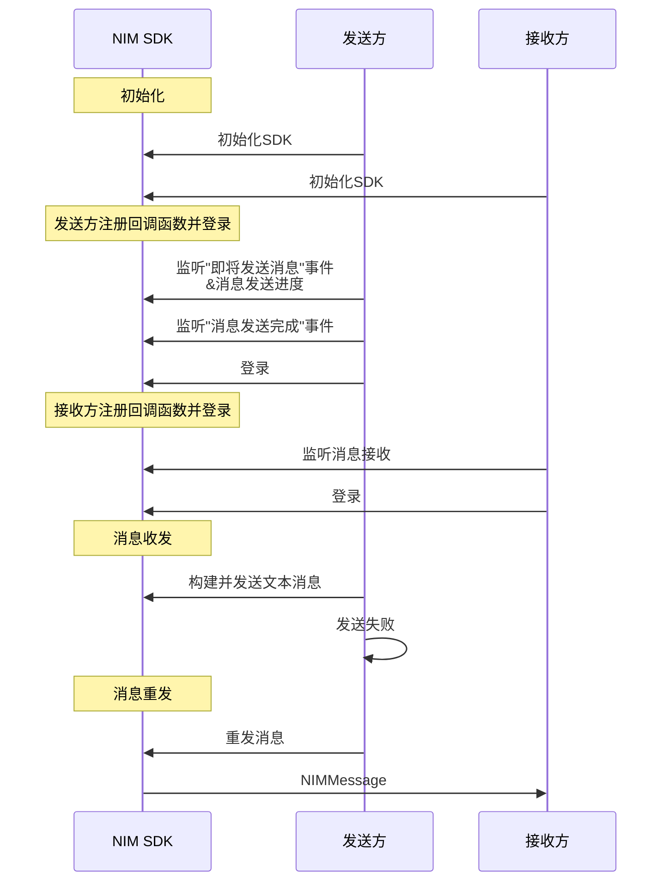
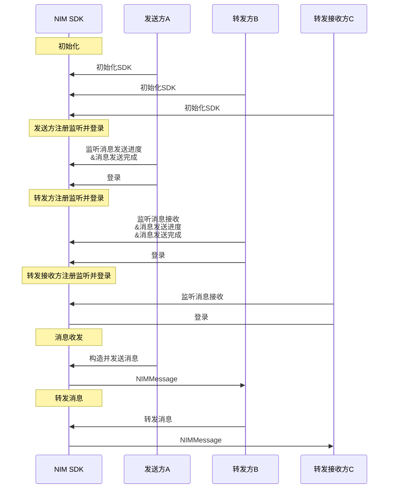

<!--keywords: 消息重发,重发消息,重发,转发,转发消息,转发合并消息,转发多条消息,合并转发, -->

网易云信 NIM iOS SDK 的[`NIMChatManagerDelegate`](https://doc.yunxin.163.com/docs/interface/messaging/iOS/doxygen/Latest/zh/de/da7/protocol_n_i_m_chat_manager_delegate-p.html)协议和[`NIMChatManager`](https://doc.yunxin.163.com/docs/interface/messaging/iOS/doxygen/Latest/zh/d2/d6e/protocol_n_i_m_chat_manager-p.html)协议，分别提供监听消息转发/重发的方法和转发/重发消息的方法。


## 前提条件

已完成 [SDK 初始化](https://doc.yunxin.163.com/messaging/guide/TE0MDc5MTI?platform=iOS)。


## API使用限制 

::: note important :::
发送消息的接口（包括重发和转发）调用存在频控，一分钟内默认最多可调用 300 次。
:::

## <span id="消息重发">重发消息</span>

如因网络问题等原因导致消息发送失败时，可以调用重发消息的 API 重新发送。


### **API调用时序**


### **实现流程**


1. 调用<a href="https://doc.yunxin.163.com/docs/interface/messaging/iOS/doxygen/Latest/zh/d2/d6e/protocol_n_i_m_chat_manager-p.html#ac4a9f352dcb9abfe7982da65b57ef14c" target="_blank">`addDelegate`</a>方法添加委托，注册<a href="https://doc.yunxin.163.com/docs/interface/messaging/iOS/doxygen/Latest/zh/de/da7/protocol_n_i_m_chat_manager_delegate-p.html#ad65c6bf33fc6fca06268a526782cd362" target="_blank">`sendMessage:didCompleteWithError:`</a>回调函数，监听“发送消息完成”事件。

2. 消息发送失败之后，调用<a href="https://doc.yunxin.163.com/docs/interface/messaging/iOS/doxygen/Latest/zh/d2/d6e/protocol_n_i_m_chat_manager-p.html#ad7cced74208726dbc56fb42dcb0393a4" target="_blank">`resendMessage:error:`</a>方法，重发消息。

    ::: note notice
    该方法本身包含的回调只表示当前这个函数调用完成，需要后续的发送消息完成回调（`sendMessage:didCompleteWithError:`）才能判断消息是否已经发送至 IM 服务端。
    :::

    示例代码如下：

    ```
    //message为在发送回调中发送失败的message
    [[[NIMSDK sharedSDK] chatManager] resendMessage:message
                                                    error:nil];
    ```

### 重发消息相关

V9.10.0 新增重发拉黑状态消息相关开关，默认不开启。开启后使用优化的发送逻辑。如有需要，请联系商务经理或技术支持进行开启。优化后的重发拉黑消息逻辑如下：

- 若重发拉黑状态消息时，用户还处于黑名单中，此时会产生一条新消息，发送端会收到 7101 错误码，接收端则无法接收到该消息。
    :::note notice
    处于拉黑状态时，无论重发多少次消息，产生的新消息都是同一条，即同一个 msgid。
    :::
- 若重发拉黑状态消息时，用户已不在黑名单中，此时产生一条新消息，发送端会收到 200 状态码，接收端正常接收到该消息。


## <span id="消息转发">转发消息</span>

网易云信 NIM iOS SDK 支持转发通知消息以外所有其他消息类型。可将消息转发至目标会话，包括单聊会话和群聊会话（仅限高级群，不含超大群）。

### **API调用时序**
::: note note 
- 转发不同类型消息的实现方法类似，本节仅以转发一条文本消息为例进行介绍。
- 下文仅对图中标为部分的流程进行详细说明，其他 API 调用流程请参考相应的文档。
:::




### **实现流程**


1. 转发接收方C 注册<a href="https://doc.yunxin.163.com/docs/interface/messaging/iOS/doxygen/Latest/zh/de/da7/protocol_n_i_m_chat_manager_delegate-p.html#ad7e5965ba2af93a24e6814a004866965" target="_blank">`onRecvMessages:`</a>回调函数，监听消息接收。

2. 转发方B 接收到发送方A 发送的消息，采用如下任意一种方式转发消息至 C。


    方式 | 说明
    ---- | -------------- 
    直接转发 | 调用<a href="https://doc.yunxin.163.com/docs/interface/messaging/iOS/doxygen/Latest/zh/d2/d6e/protocol_n_i_m_chat_manager-p.html#ab756e6d5a5d54d9d74f07e3b08ceaebc" target="_blank">`forwardMessage:toSession:error:`</a>方法直接转发消息。
    先构建消息再转发（推荐） |<ol><li>调用<a href="https://doc.yunxin.163.com/docs/interface/messaging/iOS/doxygen/Latest/zh/d2/d6e/protocol_n_i_m_chat_manager-p.html#a5d0c14ffef33a61cf6f41bfc3b2fd39f" target="_blank">`makeForwardMessageFromMessage:error:`</a>方法，构造一条待转发的消息。</li><li>调用<a href="https://doc.yunxin.163.com/docs/interface/messaging/iOS/doxygen/Latest/zh/d2/d6e/protocol_n_i_m_chat_manager-p.html#a8d9da2d171023c675ffc84b7520aff8e" target="_blank">`sendForwardMessage:toSession:error:`</a>方法将构建的待转发消息发送至转发接收方。</li></ol> <note type=note>相较于直接转发消息，先构建再转发的方式，可以得到转发消息的进度回调和是否转发成功回调。</note>

    - 参数说明

    参数               | 类型             | 说明                 
    ----------------------|--------------------|----------------------
    `message`  | `NIMMessage`  | 需要转发的消息
    `session`    | `NIMSession`     | 需要转发到的会话
    `error`    | NSError     | 出错原因

    - 示例代码
    
    :::::: div custom-tabs
    ::: tab 先构建消息再转发（推荐）

    ```
    NSError *error = nil;
    NIMMessage *nMsg = [[NIMSDK sharedSDK].chatManager makeForwardMessageFromMessage:message error:&error];
    [[NIMSDK sharedSDK].chatManager sendForwardMessage:nMsg toSession:session error:&error];
    ```
    :::
    ::: tab 直接转发

    ```
    // message 发送成功的message
    [[NIMSDK sharedSDK].chatManager forwardMessage:message toSession:session error:&error];
    ```
    :::


    ::::::: 


3. SDK 触发`onRecvMessages:`回调函数，用户C 通过该回调接收转发消息。


