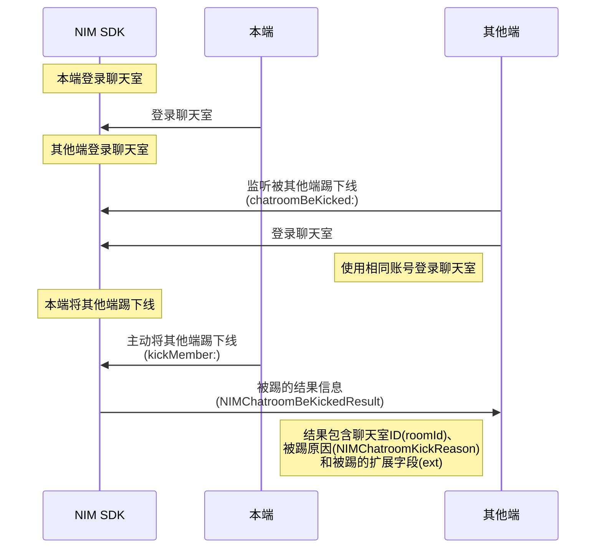

您可通过两种方式实现 IM 的多端登录与互踢。


## 方式1：通过云信控制台配置


当前 NIM SDK 支持通过云信控制台配置四种不同的 IM 多端登录策略：

- 只允许一端登录，Windows、Web、Android、iOS 彼此互踢。
- 桌面端 PC 与 Web 互踢，移动端 Android 和 iOS 互踢，且桌面端与移动端可同时登录
- 各端均可以同时登录在线（最多 10 个设备同时在线）
- 自定义多端登录配置

通过该方式的配置，可实现自动管控 IM 的多端登录。具体如何配置，请参见[多端登录与互踢策略](https://doc.yunxin.163.com/messaging/guide/TE2MzM0OTQ?platform=iOS)。


## 方式2：主动将其他端踢下线


### API 调用时序




### 踢方操作


#### <span id="多端登录监听">步骤1：监听多端登录</span>


注册[`onMultiLoginClientsChangedWithType:`](https://doc.yunxin.163.com/docs/interface/messaging/iOS/doxygen/Latest/zh/d5/dc6/protocol_n_i_m_login_manager_delegate-p.html#a83f001bb0a5c477a72178f1c0b2585df)回调，监听多端登录事件。 当用户在某个客户端登录时，其他已经在线的客户端会触发该回调。

####  <span id="多端登录监听">步骤2：查询同时在线的设备信息</span>

收到`onMultiLoginClientsChangedWithType:`回调后，调用[`currentLoginClients`](https://doc.yunxin.163.com/docs/interface/messaging/iOS/doxygen/Latest/zh/d9/d16/protocol_n_i_m_login_manager-p.html#a055c3df878ee55c5e492f43444e2f8f3)方法查询当前登录的其他设备列表，包含客户端类型、操作系统以及登录时间等信息。


#### <span id="互踢">步骤3：将其他端踢下线</span>

调用[`kickOtherClient:completion:`](https://doc.yunxin.163.com/docs/interface/messaging/iOS/doxygen/Latest/zh/d9/d16/protocol_n_i_m_login_manager-p.html#adc1ca83617c1ace26541488881d90541)方法将其他同时登录的设备端踢下线。 

```
NSArray *clients = [[[NIMSDK sharedSDK] loginManager] currentLoginClients];
if (clients.count <= 0)
{
    // 没有可踢出的对象
    return;
}
// 选一个端踢出
NIMLoginClient *client = clients[0];
[[[NIMSDK sharedSDK] loginManager] kickOtherClient:client completion:^(NSError * __nullable error)
{
    // your code
}];
```


### 被踢方操作

被踢的设备端，可在登录 IM 前，注册[`onKickout:`](https://doc.yunxin.163.com/docs/interface/messaging/iOS/doxygen/Latest/zh/d5/dc6/protocol_n_i_m_login_manager_delegate-p.html#acd2ae586b5e4f0a9cec487727c164a63)回调，监听被踢事件。被踢事件信息包含被踢原因（[`NIMKickReason`](https://doc.yunxin.163.com/docs/interface/messaging/iOS/doxygen/Latest/zh/d7/d86/_n_i_m_login_manager_protocol_8h.html#ae0e67282f0bc2c5994675214aaf61bf9)）和将其踢下线的设备端的客户端类型（[`NIMLoginClientType`](https://doc.yunxin.163.com/docs/interface/messaging/iOS/doxygen/Latest/zh/d0/dcf/_n_i_m_login_client_8h.html#a62fc7bed27b7fc66d42feaab6b14b988)）。


收到被踢回调后，建议进行注销并切换到登录界面。


